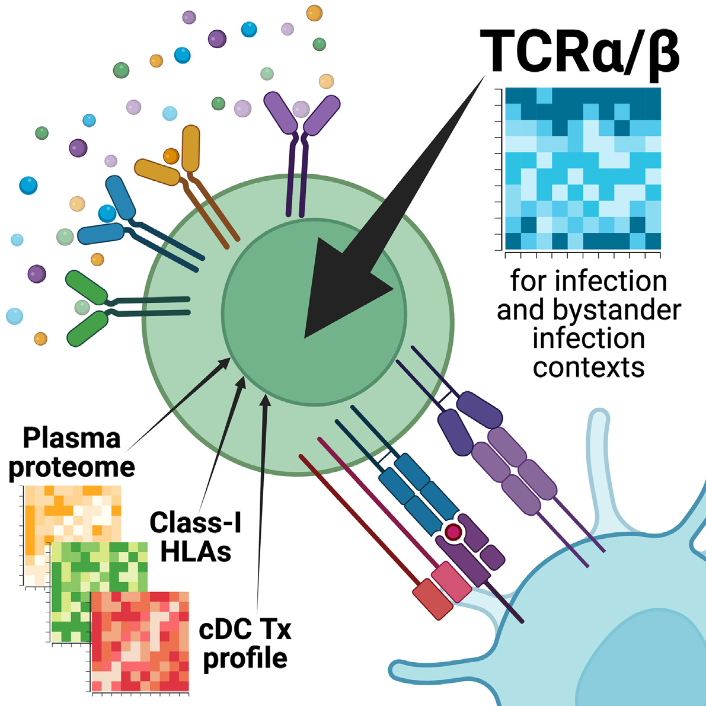
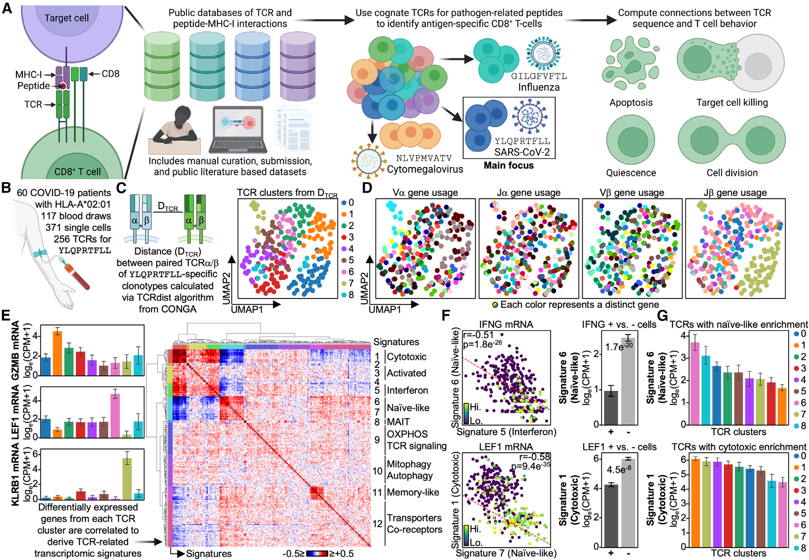
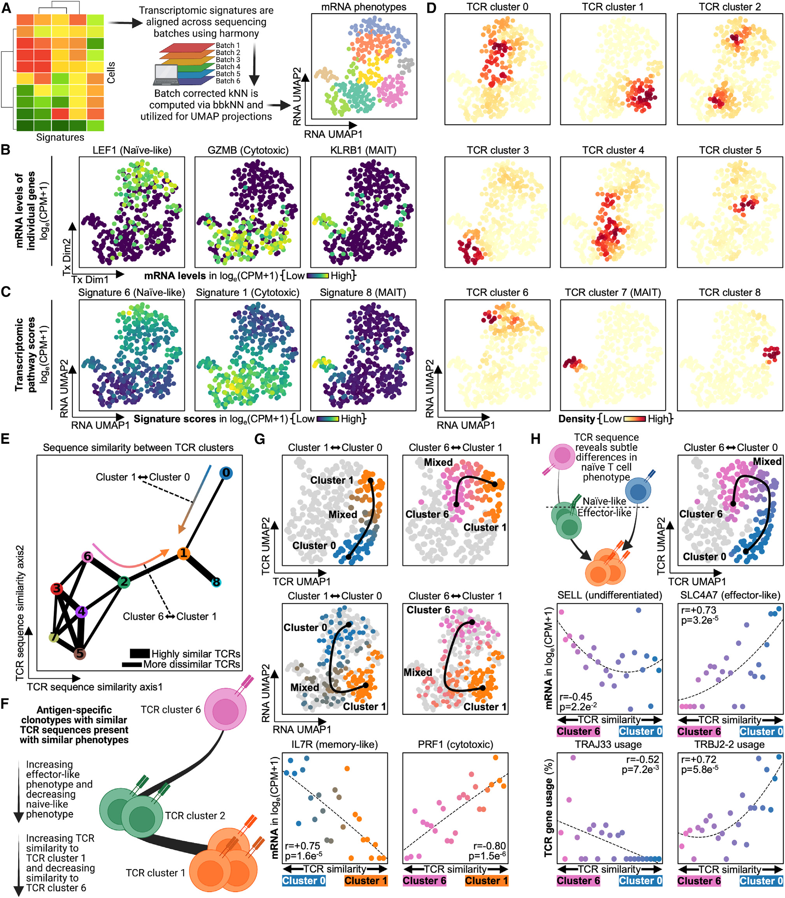
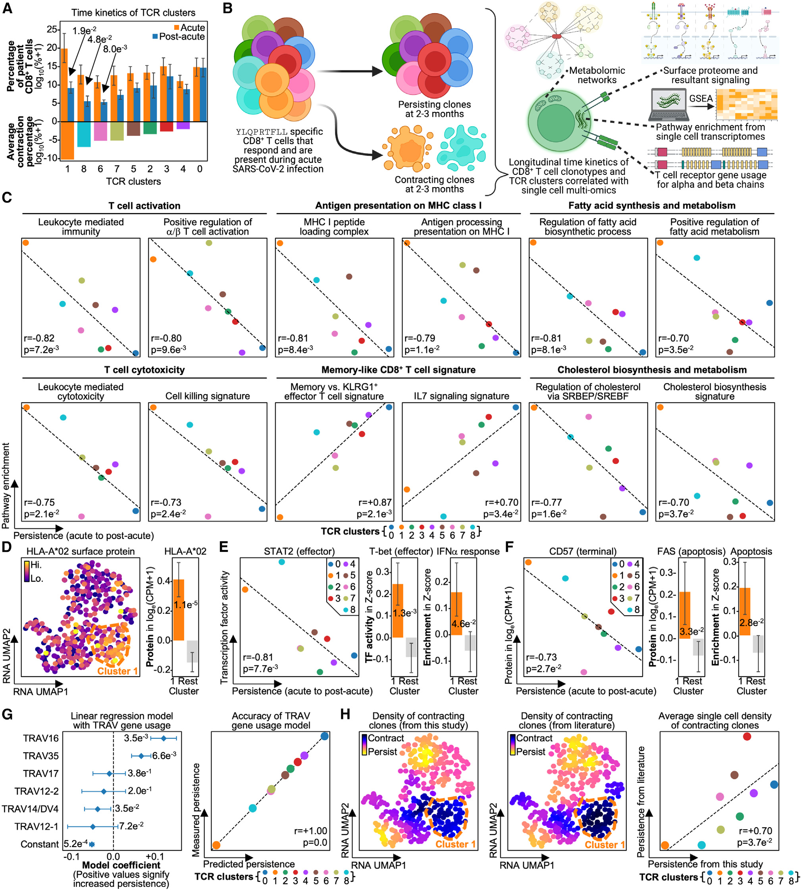
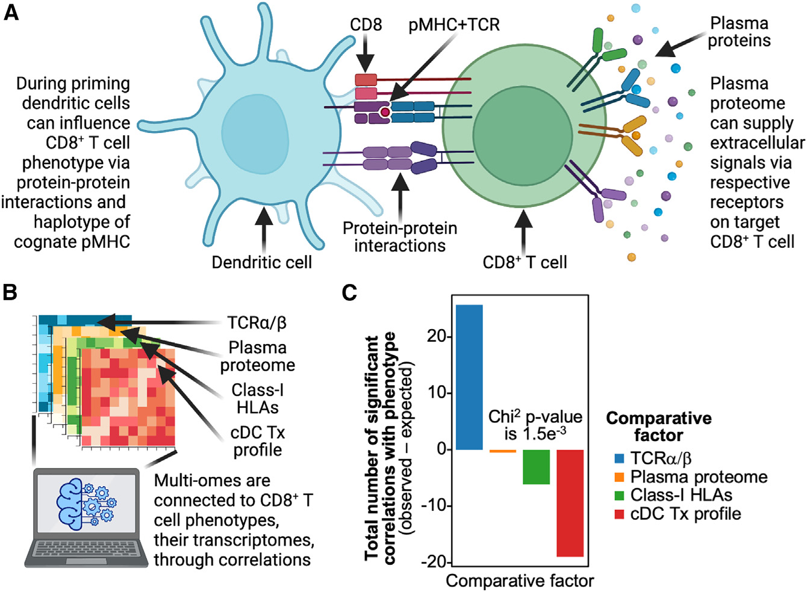
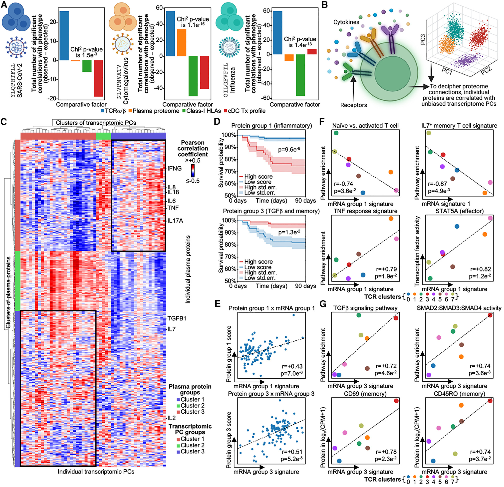

# TCR sequences are the dominant factor contributing to the phenotype of CD8+ T cells with specificities against immunogenic viral antigens

## TCR 序列是针对免疫原性病毒抗原的 CD8+ T 细胞表型的主导因素

> 中英对照全文精读。原文：Chen et al., *Cell Reports* 2023;42(11):113279.
> DOI: [10.1016/j.celrep.2023.113279](https://doi.org/10.1016/j.celrep.2023.113279)

---

## 页面/章节索引

| 页码      | 章节                                      |
| ------- | --------------------------------------- |
| p.1     | Title, Highlights, Summary              |
| p.2     | Introduction                            |
| p.3     | Results: 多组学分析策略 / 同一抗原的 CD8+ T 细胞表型多样性 |
| p.4     | Fig. 1 — 同一抗原的 CD8+ T 细胞在表型和 TCR 上具有多样性 |
| p.5–6   | Results: TCR 序列相似性与表型相似性相关              |
| p.6     | Fig. 2 — 表型相似性由 TCR 序列相似性决定             |
| p.7–8   | Results: 抗原特异性 CD8+ T 细胞持久性受 TCR 序列影响   |
| p.9     | Fig. 3 — 持久性与 TCR 基因使用相关                |
| p.10–11 | Results: TCR 序列比环境信号更重要                 |
| p.11–12 | Fig. 4 / Results: 旁路活化 T 细胞的表型仍由 TCR 主导 |
| p.13–14 | Fig. 5 / 炎症因子在旁路活化中的作用                  |
| p.15–16 | Discussion / 局限性                        |
| p.17–19 | STAR Methods                            |

---

**Source:** p.1 (Title & Highlights)

**Original:**

**T cell receptor sequences are the dominant factor contributing to the phenotype of CD8+ T cells with specificities against immunogenic viral antigens**

**Highlights:**
- TCR sequence similarity correlates with CD8+ T cell phenotype similarity
- Antigen-specific CD8+ T cell behavior and persistence associates with TCR sequence
- TCR sequences have a greater impact than environmental signals on phenotype
- Even bystander T cell phenotype is most affected by TCR sequence, not environment

**中文:**

**TCR 序列是针对免疫原性病毒抗原的 CD8+ T 细胞表型的主导因素**

**要点：**
- TCR 序列相似性与 CD8+ T 细胞表型相似性相关
- 抗原特异性 CD8+ T 细胞的行为和持久性与 TCR 序列相关
- TCR 序列对表型的影响大于环境信号
- 即使是旁路活化 T 细胞的表型也主要受 TCR 序列而非环境影响

---

**Source:** p.1 (In Brief / Graphical Abstract)

**Original:**

Chen et al. demonstrate that for immunogenic viral antigens, in both active infection and bystander activation contexts, TCR sequences are quantitatively the most important factor for antigen-specific CD8+ T cell phenotype and out-compete environmental signals such as plasma cytokines in terms of phenotypic impact.

**中文:**

Chen 等人证明，对于免疫原性病毒抗原，无论在主动感染还是旁路活化的情境下，TCR 序列在定量上都是抗原特异性 CD8+ T 细胞表型最重要的因素，并且在表型影响方面超过了血浆细胞因子等环境信号。

**Placed near:** p.1 S002

**🔬 图解导读**

**整体逻辑：** 本文实验设计流程 — 从 COVID-19 患者纵向队列出发，针对三种病毒（SARS-CoV-2、CMV、Influenza）的免疫原性抗原，通过单细胞多组学 + TCR 测序定量比较 TCR 序列与血浆蛋白、HLA、DC 等环境信号对 CD8+ T 细胞表型和持久性的影响权重。

**核心结论：** 无论主动免疫应答还是旁路活化场景，TCR 序列都是 CD8+ T 细胞表型的主导因素。

---

**Source:** p.1 (Summary)

**Original:**

Antigen-specific CD8+ T cells mediate pathogen clearance. T cell phenotype is influenced by T cell receptor (TCR) sequences and environmental signals. Quantitative comparisons of these factors in human disease, while challenging to obtain, can provide foundational insights into basic T cell biology. Here, we investigate the phenotype kinetics of 679 CD8+ T cell clonotypes, each with specificity against one of three immunogenic viral antigens. Data were collected from a longitudinal study of 68 COVID-19 patients with antigens from severe acute respiratory syndrome coronavirus 2 (SARS-CoV-2), cytomegalovirus (CMV), and influenza. Each antigen is associated with a different type of immune activation during COVID-19. We find TCR sequence to be by far the most important factor in shaping T cell phenotype and persistence for populations specific to any of these antigens. Our work demonstrates the important relationship between TCR sequence and T cell phenotype and persistence and helps explain why T cell phenotype often appears to be determined early in an infection.

**中文:**

抗原特异性 CD8+ T 细胞介导病原体清除。T 细胞表型受 T 细胞受体（TCR）序列和环境信号的影响。在人类疾病中对这些因素进行定量比较虽然具有挑战性，但可以为 T 细胞生物学提供基础性见解。本研究调查了 679 个 CD8+ T 细胞克隆型的表型动力学，每个克隆型针对三种免疫原性病毒抗原之一。数据来自对 68 名 COVID-19 患者的纵向研究，抗原分别来自严重急性呼吸综合征冠状病毒 2（SARS-CoV-2）、巨细胞病毒（CMV）和流感病毒。每种抗原在 COVID-19 期间与不同类型的免疫激活相关。我们发现，对于针对任何这些抗原的 T 细胞群体，TCR 序列是塑造 T 细胞表型和持久性的最重要因素。我们的工作证明了 TCR 序列与 T 细胞表型和持久性之间的重要关系，并有助于解释为什么 T 细胞表型通常在感染早期就已决定。

---

**Source:** p.2 (Introduction, ¶1)

**Original:**

CD8+ T cells are one of the central classes of immune agents responsible for the clearance of pathogen-infected cells. Each T cell has a receptor (TCR) that largely dictates its specificity to peptide antigen-major histocompatibility complexes (pMHCs) and is known to influence phenotype. T cell phenotype may also be influenced by environmental factors, such as T cell-priming dendritic cells through co-receptor interactions or plasma proteins through cytokine signaling. Additionally, the HLA haplotype, which specifies the antigen-presenting MHCs, can also influence T cell phenotype through protein-protein interactions. While it is known that these factors can shape phenotype, their relative importance can be challenging to resolve, especially within the context of human disease.

**中文:**

CD8+ T 细胞是负责清除病原体感染细胞的核心免疫细胞之一。每个 T 细胞都有一个受体（TCR），它主要决定了对肽抗原-主要组织相容性复合体（pMHC）的特异性，并且已知会影响表型。T 细胞表型还可能受环境因素影响，例如通过共受体相互作用的 T 细胞 priming 树突状细胞，或通过细胞因子信号传导的血浆蛋白。此外，HLA 单倍型（决定抗原呈递 MHC）也可以通过蛋白质-蛋白质相互作用影响 T 细胞表型。虽然已知这些因素可以塑造表型，但它们的相对重要性很难解析，尤其是在人类疾病背景下。

**Source:** p.2 (Introduction, ¶2)

**Original:**

Previous efforts to resolve this question have often employed model systems such as cell lines or mice and have typically focused on only one of the T cell-influencing factors. This not only prevents an analysis of the relative importance of these factors but also loses the context of human disease biology. Further, these past works have often not included antigen specificity of the T cells. Given that an immunogenic pMHC may promote the expansion of many different T cell clonotypes within a single patient or across patients, knowledge of antigen specificity may permit a direct measure of how variations in T cell a/b genes and other factors influence T cell phenotype.

**中文:**

以往解决这个问题的尝试通常使用细胞系或小鼠等模型系统，并且通常只关注影响 T 细胞的单一因素。这不仅无法分析这些因素的相对重要性，也脱离了人类疾病生物学的背景。此外，这些过去的工作通常没有考虑 T 细胞的抗原特异性。考虑到一个免疫原性 pMHC 可能在单个患者或跨患者中促进许多不同 T 细胞克隆型的扩增，了解抗原特异性可以直接测量 T 细胞 α/β 基因变异和其他因素如何影响 T 细胞表型。

**Source:** p.2 (Introduction, ¶3)

**Original:**

We interrogate the role of multiple factors, including TCRa/b genes, protein-protein interactions, and plasma proteome, that have been reported to influence the T cell clonotype-T cell phenotype relationship by studying 68 HLA-A*02:01 COVID-19 patients with full clinical and immune phenotyping. Within this cohort, we investigated clonotypes that were activated by an immunogenic severe acute respiratory syndrome coronavirus 2 (SARS-CoV-2) antigen, bystander-activated clonotypes specific to an immunogenic cytomegalovirus (CMV) antigen, and nonactivated clonotypes specific to an immunogenic influenza antigen. In all cases, we found that the antigen-recognizing TCR sequences are the most influential factors in determining T cell phenotype. For the bystander-activated T cells, other factors play significant, albeit lesser, roles. Our work demonstrates that for immunogenic viral antigens, it is TCR sequences, not environmental signals, that primarily influence the phenotype and persistence of antigen-specific CD8+ T cell clonotypes both during and after infection.

**中文:**

我们通过研究 68 名具有完整临床和免疫表型信息的 HLA-A*02:01 COVID-19 患者，探究了多种据报道影响 T 细胞克隆型-表型关系的因素，包括 TCRα/β 基因、蛋白质-蛋白质相互作用和血浆蛋白质组。在该队列中，我们研究了由**免疫原性 SARS-CoV-2 抗原激活的克隆型、旁路活化的 CMV 特异性克隆型以及未活化的流感特异性克隆型**。在所有情况下，我们发现识别抗原的 TCR 序列是决定 T 细胞表型的最具影响力的因素。对于旁路活化的 T 细胞，其他因素虽然也起作用，但程度较小。我们的工作证明，对于免疫原性病毒抗原，主要是 TCR 序列（而非环境信号）在感染期间和感染后影响抗原特异性 CD8+ T 细胞克隆型的表型和持久性。

---

**Source:** p.3 (Results — Study Design)

**Original:**

**Multi-omics analyses of antigen-specific CD8+ T cells for multiple epitopes in a longitudinal patient cohort**

We analyzed antigen-specific CD8+ T cells from a longitudinal cohort of COVID-19 patients with varying acute disease severities as quantified through the WHO ordinal scale (Table S1.1). To measure patient responses across time, blood samples were taken at diagnosis (T1), several days after infection (T2), and during convalescence 2–3 months post-initial infection (T3). Antigen-specific CD8+ T cells were identified by using GLIPH2 to match TCRs from our dataset with pMHC-TCR pairs from public databases and literature (Figure 1A; Table S1.2; see STAR Methods). Starting from an initial patient cohort size of 209, we focused on 68 patients expressing the common HLA-A*02:01 allele because immunogenic antigens presented by this allele have been well characterized for multiple pathogens.

We investigated CD8+ T cells exhibiting specificity to antigens derived from three viruses — SARS-CoV-2, CMV, and influenza. Each antigen has been reported as immunodominant for their respective virus. The first antigen, YLQPRTFLL (SARS2-YLQ), is derived from the spike protein of SARS-CoV-2, and T cells specific to this antigen are activated via antigen stimulation. The second antigen, NLVPMVATV (CMV-NLV), is derived from the pp65 protein of CMV. CMV-specific CD8+ T cells have been shown to be bystander activated (i.e., activated through soluble factor signaling rather than antigen stimulation) during COVID-19. The third antigen, GILGFVFTL (Flu-GIL), is from the M1 protein of influenza (Flu); CD8+ T cells specific to this antigen do not undergo reactivation during SARS-CoV-2 infection.

**中文:**

**纵向患者队列中针对多个表位的抗原特异性 CD8+ T 细胞多组学分析**

我们分析了来自 COVID-19 患者纵向队列的抗原特异性 CD8+ T 细胞，这些患者的疾病严重程度通过 WHO 序数量表进行量化。为了测量患者随时间的反应，在诊断时（T1）、感染后数天（T2）以及初次感染后 2-3 个月的恢复期（T3）采集血样。我们使用 GLIPH2 将来自数据集的 TCR 与公共数据库和文献中的 pMHC-TCR 配对进行匹配，从而鉴定抗原特异性 CD8+ T 细胞。从最初的 209 名患者队列开始，我们聚焦于 68 名表达常见 HLA-A*02:01 等位基因的患者，因为该等位基因呈递的免疫原性抗原已在多种病原体中得到充分表征。

我们研究了针对三种病毒（SARS-CoV-2、CMV 和流感）来源抗原的 CD8+ T 细胞。每种抗原都被报道为其相应病毒的免疫优势抗原。第一种抗原 YLQPRTFLL（SARS2-YLQ）来源于 SARS-CoV-2 的刺突蛋白，针对该抗原的 T 细胞通过抗原刺激被激活。第二种抗原 NLVPMVATV（CMV-NLV）来源于 CMV 的 pp65 蛋白。已有研究表明，CMV 特异性 CD8+ T 细胞在 COVID-19 期间被旁路活化（即通过可溶性因子信号而非抗原刺激激活）。第三种抗原 GILGFVFTL（Flu-GIL）来源于流感病毒的 M1 蛋白；针对该抗原的 CD8+ T 细胞在 SARS-CoV-2 感染期间不会发生再活化。

---

**Source:** p.3–4 (Results — CD8+ T cells against the same antigen are diverse)

**Original:**

**CD8+ T cells against the same antigen are diverse in phenotype and TCR**

We identified a total of 371 SARS2-YLQ-specific CD8+ T cells that consisted of 256 clonotypes from 117 longitudinal blood draws and 60 COVID-19 patients (Figure 1B). To compare antigen-specific TCR sequences with one another, we created a distance matrix using the well-accepted TCRdist algorithm to compare clonotypes by both TCR gene usage and amino acid sequence information from TCR a and b chains. We utilized this distance matrix to cluster clonotypes by TCR sequence similarity and created a two-dimensional projection of clonotypes via UMAP where similar TCR sequences are closer together (Figure 1C). Although these clonotypes target the same antigen, they form distinct clusters that are unique in TCR a- and b-chain gene usage, sequence, and GLIPH motifs (Figures 1D and S1A–S1C).

We interrogated for differences in phenotype between the TCR-derived clusters by performing differential gene expression analysis. For example, TCR cluster 1 was enriched for cytotoxic-associated GZMB expression, while cluster 6 had higher levels of the naive-associated LEF1+. This analysis further confirmed that cluster 7 was composed of MAIT cells through the unique upregulation of the MAIT-related transcript KLRB1 (CD161).

To enhance our understanding of the transcriptomic functions that separate these clusters, we correlated the top differentially expressed genes with one other to identify co-expressed gene modules (Figure 1E). We did, in fact, observe clearly resolved cytotoxic, interferon, naive-like, and memory-like transcriptomic modules. As would be expected, the naive-like signature was anti-correlated with both interferon and cytotoxic signatures (Figure 1F). This verification added confidence to our use of these signatures to characterize the TCR-derived clusters. Further, the TCR-derived clusters exhibited statistically significant associations with these phenotypic signatures. The major axis of variation across the 12 TCR clusters was a naive-to-cytotoxic axis that highlighted TCR cluster 1 as the most cytotoxic and TCR clusters 0, 6, and 8 as the most undifferentiated.

**中文:**

**针对同一抗原的 CD8+ T 细胞在表型和 TCR 上具有多样性**

我们共鉴定了 371 个 SARS2-YLQ 特异性 CD8+ T 细胞，包含来自 117 次纵向采血和 60 名 COVID-19 患者的 256 个克隆型（图 1B）。为了比较抗原特异性 TCR 序列，我们使用公认的 TCRdist 算法创建了距离矩阵，通过 TCR 基因使用以及 TCR α 和 β 链的氨基酸序列信息来比较克隆型。我们利用该距离矩阵按 TCR 序列相似性对克隆型进行聚类，并通过 UMAP 创建了克隆型的二维投影，其中相似的 TCR 序列更接近（图 1C）。尽管这些克隆型靶向同一抗原，但它们形成了不同的聚类，在 TCR α 和 β 链的基因使用、序列和 GLIPH 基序上各具特色（图 1D 和 S1A–S1C）。

我们通过差异基因表达分析探究了 TCR 衍生聚类之间的表型差异。例如，TCR 聚类 1 富含细胞毒性相关的 GZMB 表达，而聚类 6 的 naive 相关 LEF1+ 水平更高。该分析还通过 MAIT 相关转录本 KLRB1（CD161）的独特上调，确认聚类 7 由 MAIT 细胞组成。

为了加深对区分这些聚类的转录组功能的理解，我们将顶部差异表达基因相互关联，以鉴定共表达的基因模块（图 1E）。我们确实观察到了清晰可辨的细胞毒性、干扰素、naive-like 和 memory-like 转录组模块。正如预期，naive-like 特征与干扰素和细胞毒性特征呈负相关（图 1F）。这一验证增加了我们使用这些特征表征 TCR 衍生聚类的信心。此外，TCR 衍生聚类与这些表型特征显示出统计学显著关联。12 个 TCR 聚类间的主要变异轴是一个 naive-to-cytotoxic 轴，其中 TCR 聚类 1 是最具细胞毒性的，而 TCR 聚类 0、6 和 8 是最未分化的。

### Fig. 1. CD8+ T cells against the same antigen are diverse in phenotype and TCR

**Placed near:** p.3–4 S008
**Source:** p.4

**Original caption:** (A) Public databases of pMHC-TCR interactions with CD8+ T cells are compiled to identify TCRs specific for YLQPRTFLL (SARS-CoV-2), NLVPMVATV (CMV), and GILGFVFTL (influenza) for HLA-A*02:01 donors. (B–D) TCR clustering identifies 12 distinct clusters within YLQ-specific cells. (E) Differential gene expression across clusters reveals functional modules. (F) Naive-like signature anti-correlates with interferon and cytotoxic signatures.

**中文图注：** (A) 整合公共 pMHC-TCR 相互作用数据库，识别 HLA-A*02:01 供体中针对 YLQPRTFLL (SARS-CoV-2)、NLVPMVATV (CMV) 和 GILGFVFTL (流感) 的特异性 TCR。(B–D) TCR 聚类在 YLQ 特异性细胞中鉴定出 12 个不同聚类。(E) 跨聚类的差异基因表达揭示功能模块。(F) Naive-like 特征与干扰素和细胞毒性特征呈负相关。

---

**🔬 图表解读**

| 面板 | 内容 | 关键发现 |
|------|------|----------|
| A | 公共数据库 pMHC-TCR 配对 → 鉴定三种抗原特异性 TCR | 建立从 TCR 序列反向映射抗原特异性的流程 |
| B–D | TCR UMAP + 基因使用 + GLIPH 基序 → 12 个 TCR 聚类 | **同一抗原（YLQ）的 CD8+ T 细胞具有高度异质性 TCR  repertoire** |
| E | 跨聚类差异基因表达分析 | 发现 **4 个共表达模块**：Cytotoxic (GZMB)、IFN、Naive-like (LEF1)、Memory-like (IL7R) |
| F | Naive-like vs Cytotoxic/IFN 特征相关性 | Naive-like 与 cytotoxic/IFN 呈 **负相关**，验证模块划分的合理性 |

**📊 统计注释：** 371 个 YLQ 特异性 CD8+ T 细胞，256 个克隆型，来自 60 名患者 117 次纵向采血。TCRdist 算法计算 TCR 距离矩阵。

**🎯 核心结论：** 即使针对同一抗原，CD8+ T 细胞在 TCR 序列和表型上存在**广泛多样性**，且 TCR 聚类天然对应不同的功能状态（naive → cytotoxic 轴）。对应 S008。

**💡 与课题的关联：** TCRdist 聚类 + 差异基因表达分析是 TCRCellNet 项目可复用的核心方法学框架。

---

**Source:** p.5–6 (Results — TCR sequence similarity correlates with phenotypic similarity)

**Original:**

**TCR sequence similarity correlates with phenotypic similarity for CD8+ T cell clonotypes against the same antigen**

We next asked, for T cells specific to SARS2-YLQ, whether cells with similar (but not identical) TCR gene sequences were also of similar phenotypes. In other words, did larger TCRa/b gene differences correlate with larger phenotypic differences? To investigate this, we first created a two-dimensional projection of antigen-specific CD8+ T cell transcriptomes (an RNA UMAP) to visualize the phenotypic differences between different clonotypes (Figure 2A). For example, TCR cluster 1 largely occupies the cytotoxic region of the RNA UMAP, while TCR clusters 0 and 6 largely occupy the naive region (Figures 2B–2D). Interestingly, we also observed that clusters close together on the TCR UMAP were also close together on the RNA UMAP (Figure S3C). As UMAP will cluster similar cells together, this suggests that T cell clonotypes that are closely related by TCRa/b sequence similarity are also related by phenotype similarity.

In order to quantitatively compare TCR sequence with phenotype, we quantified TCRa/b sequence similarity between clusters (Figure 2E). This metric confirmed that clusters similar in phenotype were also similar in TCR sequence. For example, TCR clusters 1 and 8, which are neighbors on the RNA UMAP, are also very similar in TCR sequence. On the other hand, TCR clusters 6 and 1, which represent more undifferentiated and more cytotoxic phenotypes, respectively, have quite different TCR sequences.

**中文:**

**针对同一抗原的 CD8+ T 细胞克隆型的 TCR 序列相似性与表型相似性相关**

我们接下来探究，对于 SARS2-YLQ 特异性 T 细胞，具有相似（但不相同）TCR 基因序列的细胞是否也具有相似的表型。换句话说，**TCRα/β 基因差异越大是否对应着表型差异越大**？为了研究这一点，我们首先创建了抗原特异性 CD8+ T 细胞转录组的二维投影（RNA UMAP），以可视化不同克隆型之间的表型差异（图 2A）。例如，TCR 聚类 1 主要占据 RNA UMAP 的细胞毒性区域，而 TCR 聚类 0 和 6 主要占据 naive 区域（图 2B–2D）。有趣的是，我们还观察到在 TCR UMAP 上彼此靠近的聚类在 RNA UMAP 上也彼此靠近（图 S3C）。由于 UMAP 会将相似的细胞聚类在一起，这表明 TCRα/β 序列相似性密切相关的 T 细胞克隆型在表型上也具有相似性。

> 📖 **阅读注释：RNA UMAP 功能区域的判断依据**
>
> 原文中"细胞毒性区域"和"naive 区域"的标注来自两层的证据链：
>
> **① 差异基因表达分析定义功能模块（Fig 1E, p.3–4 S008）**
>
> 论文先对 12 个 TCR 聚类做差异基因表达分析，发现 4 个共表达模块：
> - **Cytotoxic**：`GZMB`（颗粒酶 B）、`GNLY`、`PRF1` — 细胞毒性效应分子的金标准
> - **Naive-like**：`LEF1`、`TCF7`、`SELL`（CD62L）— naive/stem-like T 细胞标志
> - Interferon：`IFI44L`、`IFITM1`
> - Memory-like：`IL7R`
>
> 已知 TCR 聚类 1 高表达 **GZMB**（cytotoxic），聚类 6 高表达 **LEF1**（naive），且 12 个聚类的主变异轴为 **naive-to-cytotoxic 轴**（原文：*"The major axis of variation across the 12 TCR clusters was a naive-to-cytotoxic axis"*）。
>
> **② RNA UMAP 投影 + marker 基因叠加验证（Fig 2A–D, p.5–6 S009）**
>
> 接着用同样的细胞的转录组数据（非 TCR）做 RNA UMAP，按 `GZMB` / `LEF1` 等 marker 基因表达量着色 → 高表达区域自动聚类。将 TCR 聚类标签叠加后确认：
> - **TCR 聚类 1** 落在 **GZMB 高表达区域** → "cytotoxic region"
> - **TCR 聚类 0、6** 落在 **LEF1 高表达区域** → "naive region"
>
> 因此，这两个区域不是作者主观划分的，而是由 **已知功能的 marker 基因在 RNA UMAP 上的表达分布** 客观定义的。

为了定量比较 TCR 序列与表型，我们量化了聚类间的 TCRα/β 序列相似性（图 2E）。该指标证实，表型相似的聚类在 TCR 序列上也相似。例如，TCR 聚类 1 和 8（在 RNA UMAP 上是邻居）在 TCR 序列上也高度相似。另一方面，TCR 聚类 6 和 1（分别代表更未分化和更具细胞毒性的表型）的 TCR 序列差异很大。

> 💡 **概念澄清："RNA UMAP 上的邻居" 是什么意思？**
>
> 这里的"邻居"**不是**指 RNA UMAP 有独立的新聚类，而是指：TCR 聚类 1 和 8 的那些细胞，当投影到 RNA UMAP（转录组空间）时，它们在图上彼此靠得很近。
>
> 关系链是：**Figure 1 的 TCR 聚类标签 → 投影到 Figure 2 的 RNA UMAP → 落在邻近位置 → 说它们"在 RNA UMAP 上是邻居"**。
>
> 换句话说，**簇的编号始终是 TCR 聚类（0–11），RNA UMAP 只是换了把尺子来度量这些细胞，发现相同/相似 TCR 的细胞在转录组空间里也坐在一起。**

### Fig. 2. Phenotypic similarity between CD8+ T cell clonotypes is governed by TCR sequence similarity

**Placed near:** p.5–6 S009
**Source:** p.5–6

**Original caption:** (A–C) RNA UMAP of YLQ-specific CD8+ T cells colored by mRNA expression and TCR clusters. (D) TCR clusters occupy discrete regions of the transcriptomic landscape. (E) TCR sequence similarity network connecting clusters. (F–H) Quantitative TCR sequence similarity metrics correlate with phenotypic differences, both between effector and naive clusters and between subtly different naive-like clusters.

**中文图注：** (A–C) YLQ 特异性 CD8+ T 细胞的 RNA UMAP，按 mRNA 表达和 TCR 聚类着色。(D) TCR 聚类占据转录组景观中的离散区域。(E) 连接聚类的 TCR 序列相似性网络。(F–H) 定量 TCR 序列相似性指标与表型差异相关，涵盖效应/naive 聚类间以及 naive-like 聚类间的细微差异。

---
**🔬 图表解读**

| 面板 | 内容 | 关键发现 |
|------|------|----------|
| A | RNA UMAP 按 mRNA 表达（如 GZMB）着色 | 定义功能区域：cytotoxic / naive / memory |
| B–C | RNA UMAP 按 mRNA 表达 + TCR 聚类双着色 | **TCR 聚类在转录组空间里自然分离** |
| D | **同一张 RNA UMAP，但点的颜色换成 TCR 聚类编号** | TCR 聚类在 RNA UMAP 上占据**不重叠的区域** → TCR 与表型共变异 |
| E | TCR 序列相似性网络 | TCR 相似的聚类在 RNA UMAP 上也是邻居 |
| F–H | 定量 TCR 相似性 vs 表型差异的相关性 | 无论是 effector vs naive，还是 **naive-like 之间的细微差异**，都与 TCR 序列差异显著相关 |

> 💡 **关于 D 图的说明：** D 图的坐标轴来自**转录组数据**（RNA UMAP 降维），但每个点的**颜色/标签来自 TCR 聚类**（Figure 1 的 TCRdist 结果）。也就是说：先用转录组数据给细胞画好地图，再拿 TCR 的分类标签去给地图上色。如果 TCR 不同的细胞在这张转录组地图上自然分成不同的区域，就说明 TCR 序列与转录组表型存在关联。这是一种**跨模态交叉验证**——两个独立的测量维度（TCR 序列 vs 转录组）相互印证。

**📊 统计注释：** RNA UMAP 完全基于单细胞转录组数据生成（不依赖 TCR 信息），避免循环论证。TCRdist 定量计算 TCRα/β 序列相似性。

**🎯 核心结论：** **TCR 序列相似性与 CD8+ T 细胞表型相似性定量相关** — 这是全文最核心的定量证据链之一。对应 S009。

---

**Source:** p.7–8 (Results — Persistence)

**Original:**

**Antigen-specific CD8+ T cell persistence is influenced by TCR sequence similarity**

Differences in antigen-specific CD8+ T cell phenotype have been well associated with differences in persistence after infection. Thus, we hypothesized that TCR sequence difference metrics might resolve differences in T cell persistence. Here, we define persistence as those clonotypes that persist at convalescence, 2–3 months after initial infection. To investigate this, we first compared the prevalence of each TCR cluster in patient blood from acute disease to convalescence. Indeed, the TCR clusters exhibited clear differences in the amount of contraction (Figure 3A). While all clusters displayed some level of contraction, as expected of antigen-specific cells following viral clearance, TCR cluster 1 presented with the greatest level of contraction, followed by TCR cluster 8.

We further tested this connection between TCR sequence and persistence by correlating TCR gene usage with persistence. In fact, TCR gene usage and persistence were strongly correlated, especially for Va genes (Table S3.5). This was underscored by the highly accurate ability of Va gene usage to predict the persistence of each TCR-derived cluster in a linear regression model (Figure 3G). Interestingly, Va genes that conferred increased contraction, such as TRAV12-1 and TRAV12-2, were more similar in sequence than those that conferred persistence, such as TRAV16 and TRAV35. This underscores the correlation between TCR sequence similarity and persistence, as TCR genes with similar CDR3 sequences confer similar impacts on clonotype persistence.

**中文:**

**抗原特异性 CD8+ T 细胞持久性受 TCR 序列相似性影响**

抗原特异性 CD8+ T 细胞表型的差异与感染后持久性的差异密切相关。因此，我们假设 TCR 序列差异指标可能解析 T 细胞持久性的差异。本文将持久性定义为在恢复期（初次感染后 2-3 个月）仍持续存在的克隆型。为了研究这一点，我们首先比较了每个 TCR 聚类在患者血液中从急性期到恢复期的 prevalence。确实，TCR 聚类表现出明显的收缩程度差异（图 3A）。虽然所有聚类都表现出一定程度的收缩（这是抗原特异性细胞在病毒清除后的预期行为），但 TCR 聚类 1 的收缩程度最大，其次是 TCR 聚类 8。

我们进一步通过将 TCR 基因使用与持久性相关联来检验 TCR 序列与持久性之间的联系。事实上，TCR 基因使用与持久性高度相关，尤其是 Vα 基因（表 S3.5）。Vα 基因使用在线性回归模型中高度准确地预测了每个 TCR 衍生聚类的持久性（图 3G），这进一步强调了这一发现。有趣的是，赋予更强收缩能力的 Vα 基因（如 TRAV12-1 和 TRAV12-2）在序列上比赋予持久性的 Vα 基因（如 TRAV16 和 TRAV35）更相似。这强调了 TCR 序列相似性与持久性之间的相关性，因为具有相似 CDR3 序列的 TCR 基因对克隆型持久性产生相似的影响。

### Fig. 3. Persistence of CD8+ T cell clonotypes is correlated with TCR gene usage

**Placed near:** p.7–8 S010
**Source:** p.9

**Original caption:** (A) TCR cluster 1 shows greatest contraction from acute to convalescent timepoints. (B–C) Contraction correlates with SLEC signatures (activation, cytotoxicity, metabolic pathways). (D–F) TCR cluster 1 shows hallmarks of type I IFN signaling, terminal differentiation (CD57), and apoptotic pathways. (G) TRAV gene usage predicts persistence in a linear regression model. (H) Contracting clonotypes from independent cohorts share TCR sequences with those identified in this study.

**中文图注：** (A) TCR 聚类 1 从急性期到恢复期的收缩最大。(B–C) 收缩与 SLEC 特征（活化、细胞毒性、代谢通路）相关。(D–F) TCR 聚类 1 显示 I 型 IFN 信号、终末分化（CD57）和凋亡通路的标志。(G) TRAV 基因使用在线性回归模型中预测持久性。(H) 来自独立队列的收缩克隆型与本研究中鉴定的克隆型共享 TCR 序列。

---

**🔬 图表解读**

| 面板 | 内容 | 关键发现 |
|------|------|----------|
| A | TCR 聚类在急性期→恢复期的收缩幅度 | **聚类 1 收缩最大**，聚类 8 次之，聚类 0/6 最持久 |
| B–C | 收缩幅度与 SLEC 特征的相关性 | 高收缩聚类富集 **活化、细胞毒性、代谢通路**（SLEC 特征） |
| D–F | 聚类 1 的分子特征 | 显示 **I 型 IFN 信号**、**CD57 终末分化标志**、**凋亡通路** → 短寿命效应细胞(.) |
| G | TRAV 基因使用预测持久性的线性回归 | 某些 Vα 基因（如 TRAV12-1/12-2）→ **高收缩**；其他（如 TRAV16/35）→ **高持久** |
| H | 独立 COVID-19 队列验证 | 外部队列中高收缩克隆型的 TCR 序列与本研究的 **收缩性聚类共享** |

**📊 统计注释：** 持久性定义为初次感染后 2-3 个月恢复期仍存在。线性回归模型使用 TRAV 基因预测持久性。独立队列验证增强了结论的泛化性。

**🎯 核心结论：** **TCR 基因使用（尤其是 Vα 基因）预设了 CD8+ T 细胞在感染后的持久性命运** — 收缩性 vs 持久性在 TCR 水平已被编程。对应 S010。

**💡 与课题的关联：** SLEC vs MPEC 分化轨迹的 TCR 预定论 — 可以直接类比到 TCRCellNet 项目中的 T 细胞分化命运预测问题。

---

**Source:** p.10–11 (Results — TCR more important than environment)

**Original:**

**TCR sequences are more important than environmental signals in influencing the phenotype of antigen-specific clonotypes**

The strong associations between TCR sequences and T cell phenotype led us to question if TCR sequences were more influential than the environmental factors purported to affect T cell phenotype (Figure 4A). To investigate this, we compared the relative influence of TCR sequences on T cell phenotype with the environmental factors of plasma proteins, patient HLA-haplotype-specific protein-protein interactions, and conventional dendritic cell phenotypes.

For this comparison, we quantified each factor into latent dimensions and correlated these dimensions with antigen-specific CD8+ T cell phenotypes (Figure 4B). If these factors all influenced T cell phenotype equally, we would observe significant correlations splitting equally among the factors. Notably, we observed the opposite: TCR sequences had a much larger number of significant correlations with phenotype than any of the environmental factors (Figure 4C).

To further validate our finding, we looked to a previously reported set of CD8+ T cell clonotypes experimentally validated to be specific for the immunogenic SARS-CoV-2 antigen RLITGRLQSL (RLIT). When we clustered RLIT-specific clonotypes by their TCR gene usage and sequence, we observed two distinct TCR clusters that directly corresponded to two distinct cytokine secretion patterns. Thus, we experimentally demonstrate that TCR sequence alone can indeed stratify and affect CD8+ T cell effector activity.

**中文:**

**TCR 序列在影响抗原特异性克隆型表型方面比环境信号更重要**

TCR 序列与 T 细胞表型之间的强关联使我们质疑 TCR 序列是否比被认为影响 T 细胞表型的环境因素更具影响力（图 4A）。为了研究这一点，我们比较了 TCR 序列与血浆蛋白、患者 HLA 单倍型特异性蛋白质-蛋白质相互作用以及常规树突状细胞表型等环境因素对 T 细胞表型的相对影响。

为了进行比较，我们将每个因素量化为潜在维度，并将这些维度与抗原特异性 CD8+ T 细胞表型相关联（图 4B）。如果这些因素都同等影响 T 细胞表型，我们会观察到显著相关性平均分布在各个因素之间。值得注意的是，我们观察到相反的结果：TCR 序列与表型的显著相关数量远超任何环境因素（图 4C）。

为了进一步验证我们的发现，我们分析了一组先前报道的经实验验证为免疫原性 SARS-CoV-2 抗原 RLITGRLQSL（RLIT）特异性的 CD8+ T 细胞克隆型。当我们按 TCR 基因使用和序列对 RLIT 特异性克隆型进行聚类时，我们观察到两个不同的 TCR 聚类，它们直接对应于两种不同的细胞因子分泌模式。因此，我们通过实验证明，仅凭 TCR 序列就能确实对 CD8+ T 细胞效应活性进行分层和影响。

### Fig. 4. CD8+ T cell phenotypes are primarily governed by TCRa/b sequences over other -omics

**Placed near:** p.10–11 S011
**Source:** p.11

**Original caption:** (A) CD8+ T cells are influenced by plasma proteins, dendritic cells, and HLA haplotypes in addition to TCR sequences. (B) Each -omic is correlated with transcriptomic phenotypes. (C) TCR sequences show significantly more correlations with phenotype than any environmental factor.

**中文图注：** (A) CD8+ T 细胞除 TCR 序列外还受血浆蛋白、树突状细胞和 HLA 单倍型影响。(B) 每种组学与转录组表型相关联。(C) TCR 序列与表型的相关性数量显著超过任何环境因素。

---

**🔬 图表解读**

| 面板 | 内容 | 关键发现 |
|------|------|----------|
| A | 影响 CD8+ T 细胞表型的多因素示意 | TCR 序列、血浆蛋白（454 种）、HLA 单倍型、树突状细胞 |
| B | 各因素量化为潜在维度 → 与转录组表型相关 | TCR、血浆蛋白组、HLA-PPI、DC 表型分别与 CD8+ T 细胞转录组做相关性分析 |
| C | **关键结果**：显著相关数量对比 | **TCR 序列的相关数量远超任何环境因素**（血浆蛋白、HLA、DC 均远低于 TCR） |

**📊 统计注释：** 血浆蛋白组涵盖 454 种蛋白。每种因素被分解为潜在维度（latent dimensions），逐维度与抗原特异性 CD8+ T 细胞表型计算相关性。如果所有因素同等重要，显著相关应均匀分布。

**🎯 核心结论：** 这是全文的**中心论点的直接定量证据**——TCR 序列比任何已知环境因素都更强烈地影响 CD8+ T 细胞表型。对应 S011。

---

**Source:** p.12–14 (Results — Bystander T cells)

**Original:**

**Bystander T cell phenotype is still primarily influenced by TCR sequences**

Our analysis of COVID-19 patients provided the unique opportunity to compare antigen-responding clonotypes with bystander T cells. During SARS-CoV-2 infection, CMV-specific cells are reported to be bystander activated, as they present with effector phenotypes despite a lack of CMV viremia, and Flu-specific cells are described as having no reactivation, as they present with memory-like phenotypes. To resolve this, we correlated TCR sequences and environmental factors with the measured T cell phenotypes for both bystander-activated CMV-NLV-specific T cells and non-reactivated, Flu-GIL-specific T cells. Strikingly, TCR sequences were more significantly associated with phenotype than any environmental factor for both sets of bystanders (Figure 5A). This further accentuates the importance of TCR sequence on phenotype even in the context of bystander activation and suggests that the strong influence of TCR sequence on phenotype may be a more universal phenomenon.

**中文:**

**旁路活化 T 细胞的表型仍主要受 TCR 序列影响**

我们对 COVID-19 患者的分析提供了比较抗原应答克隆型与旁路活化 T 细胞的独特机会。在 SARS-CoV-2 感染期间，CMV 特异性细胞被报道为旁路活化——它们呈现效应表型，但缺乏 CMV 病毒血症；而流感特异性细胞被描述为无再活化——它们呈现记忆样表型。为了解决这个问题，我们将 TCR 序列和环境因素与旁路活化的 CMV-NLV 特异性 T 细胞和未再活化的 Flu-GIL 特异性 T 细胞的表型相关联。引人注目的是，对于这两组旁路活化细胞，TCR 序列与表型的关联性都显著高于任何环境因素（图 5A）。这进一步强调了即使在旁路活化的背景下，TCR 序列对表型的重要性，并表明 TCR 序列对表型的强烈影响可能是一种更普遍的现象。

### Fig. 5. CMV-specific CD8+ T cells show considerable proteomic influence on their phenotype

**Placed near:** p.12–14 S012
**Source:** p.13

**Original caption:** (A) TCR sequences remain dominant for CMV-NLV (bystander) and Flu-GIL (non-reactivated) cells. (B–C) Plasma protein correlations identify inflammatory (IL-6, IL-18, TNF) and anti-inflammatory (TGF-β, IL-2, IL-7) groups correlating with distinct phenotypes. (D) Inflammatory cytokine group associates with worse survival. (E–G) Inflammatory proteins correlate with effector phenotypes; TGF-β group correlates with memory-like phenotypes.

**中文图注：** (A) TCR 序列对 CMV-NLV（旁路活化）和 Flu-GIL（未再活化）细胞仍然是主导因素。(B–C) 血浆蛋白相关性鉴定出炎症性（IL-6, IL-18, TNF）和抗炎性（TGF-β, IL-2, IL-7）蛋白群，与不同表型相关。(D) 炎症性细胞因子群与较差生存率相关。(E–G) 炎症蛋白与效应表型相关；TGF-β 群与记忆样表型相关。

---

**🔬 图表解读**

| 面板 | 内容 | 关键发现 |
|------|------|----------|
| A | **关键结果**：旁路活化场景下各因素对表型的贡献 | 即使无抗原刺激，**TCR 序列仍是 CMV-NLV 和 Flu-GIL 细胞表型的主导因素** |
| B–C | 血浆蛋白组与表型的相关性分析 | 鉴定出两组蛋白群：**炎症组**（IL-6, IL-18, TNF）和 **抗炎/稳态组**（TGF-β, IL-2, IL-7） |
| D | 炎症蛋白群与临床预后 | 炎症组高表达与 **较差生存率** 相关 |
| E–G | 蛋白群 vs 表型特征的对应 | 炎症蛋白 → **effector 表型**；TGF-β 群 → **memory-like 表型** |

**📊 统计注释：** 旁路活化场景下，环境因素（特别是血浆炎症蛋白）的影响力相比抗原激活场景有所上升，但仍远低于 TCR 序列的贡献度。

**🎯 核心结论：** （1）**TCR 主导表型的规律在旁路活化场景下依然成立**，说明这是 T 细胞生物学的普适特征。（2）环境因素（血浆蛋白）在旁路活化中贡献度上升，提示炎症微环境可**调制**而非**决定** T 细胞表型。对应 S012。

---

**Source:** p.15–16 (Discussion)

**Original:**

**DISCUSSION**

The factors underpinning antigen-specific CD8+ T cell phenotype and persistence have been long sought after due to their fundamental relevance for understanding immunity against infections and cancers and as metrics for guiding T cell-related therapy and vaccine design. Previous works have established that TCR sequence, cytokines, and co-stimulatory proteins are factors central to T cell phenotype and persistence. However, these efforts have only qualitatively examined these phenotype-influencing factors in isolation from each other, typically within murine models or cell lines, and are often uncontrolled for cognate antigen or MHC.

Here, we explored quantitative comparisons of CD8+ T cell phenotype-influencing factors in a large HLA-haplotype-matched patient cohort in a specific disease setting. We comprehensively investigated the factors that predetermine the phenotype and persistence for both antigen-dependent activation as well as in bystander-activated and non-reactivated CD8+ T cells from a longitudinal cohort of 68 COVID-19 patients reflecting the full range of infection severities. Each cell was deeply phenotyped through paired clinical measures, plasma multi-omics (454 proteins), HLA haplotype, and simultaneous measurement of TCR sequences and multi-omics single-cell phenotyping (covering 679 antigen-specific clonotypes gathered from 171,696 single CD8+ T cells). For four immunogenic antigens representing three different viruses, we reveal that TCR sequences are, by far, the most important factor influencing both phenotype and long-term persistence of antigen-specific and bystander-activated and non-reactivated CD8+ T cells during and after SARS-CoV-2 infection.

We also find that the persistence of SARS-CoV-2-specific cells months after infection is predetermined by TCR gene usage, indicating that TCR sequence determines the long-term future fate of antigen-specific T cells. This suggests, given a specific antigen, that it is TCR sequence that primarily influences which antigen-specific cells go on to form long-lived memory several months after infection. One possibility is that the nature of T cell activation is controlled through allosteric signaling effects, which are, in turn, mediated by TCR gene usage.

**中文:**

**讨论**

抗原特异性 CD8+ T 细胞表型和持久性的决定因素长期以来备受关注，因为它们对于理解抗感染和抗癌症免疫具有基础性意义，并且是指导 T 细胞相关治疗和疫苗设计的指标。先前的研究已经确定 TCR 序列、细胞因子和共刺激蛋白是 T 细胞表型和持久性的核心因素。然而，这些工作通常仅在鼠模型或细胞系中孤立地定性检验这些因素，并且通常未控制同源抗原或 MHC。

在本研究中，我们在特定疾病背景下的大型 HLA 单倍型匹配患者队列中，对 CD8+ T 细胞表型影响因素进行了定量比较。我们全面研究了预先决定表型和持久性的因素——包括抗原依赖性活化以及旁路活化和未再活化的 CD8+ T 细胞——来自 68 名涵盖全范围感染严重程度的 COVID-19 患者纵向队列。每个细胞通过配对临床测量、血浆多组学（454 种蛋白）、HLA 单倍型以及 TCR 序列和多组学单细胞表型的同时测量（覆盖来自 171,696 个单个 CD8+ T 细胞的 679 个抗原特异性克隆型）进行了深度表型分析。对于代表三种不同病毒的四种免疫原性抗原，我们揭示 TCR 序列是迄今为止影响 SARS-CoV-2 感染期间和感染后抗原特异性、旁路活化和未再活化 CD8+ T 细胞表型和长期持久性的最重要因素。

我们还发现，感染后数月的 SARS-CoV-2 特异性细胞的持久性由 TCR 基因使用预先决定，表明 TCR 序列决定了抗原特异性 T 细胞的长期命运。这表明，在给定特定抗原的情况下，主要是 TCR 序列影响哪些抗原特异性细胞在感染后数月形成长期记忆。一种可能性是 T 细胞活化的性质通过变构信号效应控制，而变构信号效应又由 TCR 基因使用介导。

**Source:** p.16 (Discussion — Original antigenic sin)

**Original:**

The results presented here are reminiscent of a prevalent theory in literature called "original antigenic sin." In the context of T cells, this theory suggests that a T cell's initial encounter with antigen determines its phenotype for the duration. This theory has been demonstrated in multiple contexts such as dengue fever. Our study suggests that, given a specific antigen-MHC, TCR sequences dominantly influence the phenotype of antigen-specific cells. Thus, "original antigenic sin" appears to actually predate the antigen encounter, at least for the specific immunogenic antigens explored here.

**中文:**

本文的结果让人联想到文献中一个著名的理论——"原始抗原痕迹"（original antigenic sin）。在 T 细胞的背景下，该理论认为 T 细胞与抗原的初次相遇决定了其整个生命周期的表型。这一理论已在登革热等多个背景下得到证明。我们的研究表明，在给定特定抗原-MHC 的情况下，TCR 序列主导性地影响抗原特异性细胞的表型。因此，"原始抗原痕迹"实际上似乎在抗原遭遇之前就已经确定了，至少对于本文探索的特定免疫原性抗原是如此。

**Source:** p.16 (Limitations)

**Original:**

**Limitations of the study**

This study only examines CD8+ T cells specific for one of four immunogenic viral antigens presented by a single HLA allele. While this HLA allele and these antigens are common in humans, it does serve as a limitation and suggests that true generalization of these findings will require the generation and analysis of datasets similarly deep to ours for T cell responses to different antigens on diverse HLA alleles. In addition, we do note that while our cohort demonstrates substantial variation in the different -omics, such as plasma proteome and cDC transcriptome, there are features of each space that are distinct between infection states. Further, although we resolve similarly strong overall T cell clonotype-T cell phenotype relationships for all four antigen specificities explored here, the details of those relationships are highly antigen dependent. It will likely take a substantially larger dataset of well-characterized T cell clonotypes with specificities to large numbers of diverse antigens presented by multiple HLA alleles to extract more general rules.

**中文:**

**研究局限性**

本研究仅检验了由单一 HLA 等位基因呈递的四种免疫原性病毒抗原之一的 CD8+ T 细胞特异性。虽然该 HLA 等位基因和这些抗原在人类中常见，但这确实是一个局限性，表明要真正推广这些发现，需要在不同 HLA 等位基因上针对不同抗原的 T 细胞反应生成和分析与本研究类似深度的数据集。此外，我们注意到尽管我们的队列在血浆蛋白质组和 cDC 转录组等不同组学中显示出实质性变异，但每个空间的某些特征在感染状态间是不同的。此外，虽然我们对本文探索的所有四种抗原特异性都解析出了类似强的 T 细胞克隆型-T 细胞表型关系，但这些关系的细节高度依赖于抗原。要提取更通用的规则，可能需要一个更大规模的数据集，包含对由多种 HLA 等位基因呈递的大量不同抗原具有特异性的、充分表征的 T 细胞克隆型。

---

## 术语表 / Terminology

| 英文 | 中文 | 说明 |
|------|------|------|
| TCR clonotype | TCR 克隆型 | 共享相同 TCR 序列的 T 细胞群体 |
| Antigen-specific | 抗原特异性 | 识别特定抗原的 |
| Bystander activation | 旁路活化 | 非抗原特异性活化（通过细胞因子信号） |
| SLEC | 短寿命效应细胞 | Short-lived effector cell |
| MPEC | 记忆前体效应细胞 | Memory-precursor effector cell |
| GLIPH2 | — | TCR 聚类算法 (Grouping of Lymphocyte Interactions by Paratope Hotspots v2) |
| TCRdist | — | TCR 序列距离度量算法 |
| pMHC | 肽-MHC 复合体 | Peptide-MHC complex |
| UMAP | — | 降维可视化算法 |
| CITE-seq | — | 通过测序对转录组和表位进行细胞索引 |
| GSVA | — | 基因集变异分析 |
| MAIT cell | MAIT 细胞 | 黏膜相关恒定 T 细胞 |
| Convalescence | 恢复期 | 感染后 2-3 个月的随访时间点 |
| Contraction | 收缩 | 抗原清除后 T 细胞数量的减少 |
| Naive-like | 类 naive | 未分化/记忆前体状态的 T 细胞 |
| Original antigenic sin | 原始抗原痕迹 | 初次抗原遭遇决定后续免疫应答的理论 |

---

## 阅读提示 / Critical Reading Notes

1. **核心贡献**：本文首次在人类队列中**定量比较**了 TCR 序列与环境因素（血浆蛋白、HLA、树突状细胞）对 CD8+ T 细胞表型的相对贡献，证明 TCR 序列是**主导因素**。

2. **实验设计优势**：利用 COVID-19 纵向队列中三种病毒抗原（SARS-CoV-2/CMV/流感）的不同活化模式（主动应答/旁路活化/未活化），天然形成了控制环境变量的对照。

3. **验证策略**：通过独立文献数据集（Shomuradova 2020 的 IFNg⁺ 克隆型、Minervina 2021 的收缩克隆型）以及 RLIT 抗原的体外实验验证了主要结论。

4. **局限性**：仅针对 HLA-A*02:01 和 4 种免疫原性病毒抗原。TCR-表型关系的细节高度抗原依赖性，需要更多 HLA 等位基因和抗原的数据才能推广。

5. **与 TCRCellNet 课题的关联**：本文直接证明 TCR 序列→T 细胞表型/持久性的因果关系，为从 TCR 序列预测 T 细胞行为提供了关键证据。这是 TCRCellNet 课题的核心理论基础之一。

---

*精读完成。如有任何部分的深入问题，请指出具体段落 ID 进行讨论。*
