# Mapping the functional landscape of T cell receptor repertoire by single T cell transcriptomics
# 利用单细胞转录组学绘制T细胞受体库的功能图谱

**期刊:** Nature Methods | **发表:** 2021-01-06 | **PMC:** PMC7799492

---

## 目录 | Index

1. [[#摘要 | Abstract]]
2. [[#引言 | INTRODUCTION]]
3. [[#结果 | RESULTS]]
   - 3.1 [[#注释TCR库的功能相关性 | Annotating the functional relevance of the TCR repertoire]]
   - 3.2 [[#收敛性TCR重排形成靶向效率梯度 | Convergent TCR recombinations form a gradient of targeting efficiency]]
   - 3.3 [[#免疫检查点抑制剂治疗后T细胞的TCR依赖性二分 | TCR-dependent dichotomization of T cells post-immune checkpoint inhibitor treatment]]
   - 3.4 [[#TCR对T细胞表型的约束在肿瘤环境中减弱 | TCR-dependent constraint on T cell phenotype is weakened in tumor contexts]]
4. [[#讨论 | DISCUSSION]]
5. [[#在线方法 | ONLINE METHODS]]
   - 5.1 [[#嵌入TCR序列 | Embedding TCR sequences]]
   - 5.2 [[#tessa模型简述 | A brief description of the tessa model]]
   - 5.3 [[#与GLIPH的基准分析 | Benchmarking analysis with GLIPH]]
   - 5.4 [[#统计分析 | Statistical analyses]]
6. [[#数据可用性 | Data availability]]

---

## 摘要 | Abstract

**Source:** p.1 Abstract

**Original:**
Many experimental and bioinformatics approaches have been developed to characterize the human T cell receptor (TCR) repertoire. However, the unknown functional relevance of TCR profiling significantly hinders unbiased interpretation of the biology of T cells. To address this inadequacy, we developed tessa, a tool to integrate TCRs with gene expression of T cells, in order to estimate the effect that TCRs confer upon the phenotypes of T cells. Tessa leveraged techniques combining single cell RNA-sequencing with TCR-sequencing. We validated tessa and showed its superiority over existing approaches that investigate only the TCR sequences. With tessa, we demonstrated that TCR similarity constrains the phenotypes of T cells to be similar, and dictates a gradient in antigen targeting efficiency of T cell clonotypes with convergent TCRs. We showed this constraint could predict a functional dichotomization of T cells post-immunotherapy treatment, and is weakened in tumor contexts.

**中文:**
目前已开发出多种实验和生物信息学方法来表征人类T细胞受体（TCR）库。然而，TCR谱系分析的功能相关性尚不明确，这极大地阻碍了对T细胞生物学的无偏解读。为解决这一问题，我们开发了tessa——一种整合TCR与T细胞基因表达的工具，用于估计TCR对T细胞表型的影响。Tessa利用了将单细胞RNA测序与TCR测序相结合的技术。我们验证了tessa，并证明其优于仅研究TCR序列的现有方法。通过tesa，我们证明了TCR相似性约束T细胞的表型趋于相似，并决定了具有收敛性TCR的T细胞克隆型的抗原靶向效率梯度。我们展示了这种约束可以预测免疫治疗后的T细胞功能二分，并且在肿瘤环境中这种约束被削弱。

**Keywords:** T cell function, TCR, transcriptomics, integration, scRNA-Seq

---

## 引言 | INTRODUCTION

**Source:** p.1 S002

**Original:**
T cells are defined by their T cell receptor (TCR) sequences, which help T cells achieve highly specific TCR-dependent antigen recognition[^1][^2]. The antigen recognition triggers downstream signaling of T cells, which is a crucial biological process in normal and dysregulated conditions, such as cancers[^3] and autoimmune diseases[^4]. As a result, profiling the TCR repertoire has been the core interest of many studies. Tools have been developed to enable reconstruction of TCR sequences from RNA-Seq or whole exome-Seq data (TraCer[^5], TRUST[^6] and VDJ Puzzle[^7]), to cluster TCRs into groups by similarity, with each group likely targeting the same antigens (GLIPH[^8]) or to measure similarities between TCRs (TCRdist[^9]).

**中文:**
T细胞由其T细胞受体（TCR）序列定义，这些序列帮助T细胞实现高度特异的TCR依赖性抗原识别[^1][^2]。抗原识别触发T细胞的下游信号传导，这是正常和失调状态（如癌症[^3]和自身免疫性疾病[^4]）中的重要生物学过程。因此，TCR库的谱系分析一直是许多研究的核心兴趣所在。目前已开发出多种工具，能够从RNA-Seq或全外显子组测序数据中重建TCR序列（TraCer[^5]、TRUST[^6]和VDJ Puzzle[^7]），通过相似性将TCR聚类成组（每组可能靶向相同的抗原，GLIPH[^8]），或测量TCR之间的相似性（TCRdist[^9]）。

**Original:**
However, a fundamental limitation of these approaches is that all conclusions are drawn based on solely interrogating the TCR sequences, which oversimplifies how T cells execute their functions in the context of their microenvironment. Tubo *et al*[^10] and Buchholz *et al*[^11] showed that the intrinsic TCR-mediated signals and extrinsic cues both impact the functions of T cells. Therefore, an integrative investigation of the TCRs and their transcriptomics is in critical need, and will facilitate unbiased interpretation of the functional relevance of the TCR repertoire.

**中文:**
然而，这些方法的一个根本局限性在于所有结论都仅基于对TCR序列的解读，这过度简化了T细胞在其微环境背景下执行功能的方式。Tubo等人[^10]和Buchholz等人[^11]表明，TCR介导的内在信号和外在信号都会影响T细胞的功能。因此，迫切需要整合性地研究TCR及其转录组学，这将有助于无偏地解读TCR库的功能相关性。

**Original:**
Given the high dimensional nature of TCR and transcriptomic data, it is imperative to develop statistical models that can simultaneously digest these two types of data. Several recent single cell RNA sequencing (scRNA-Seq) technologies have enabled the creation of such statistical models, e.g. SMART-Seq2[^12] and MATQ-Seq[^13] which are full-length scRNA-Seq protocols enabling reconstruction of the TCR. The 10x Genomics Chromium Platform and the SMARTer TCR profiling kit directly amplify the TCRs, while capturing the expression of the other genes at the same time. Furthermore, the pMHC feature barcoding techniques from 10x Genomics can measure the antigen binding affinities of T cells, adding another layer of information. Similarly, ECCITE-Seq[^14] allows the capture of transcriptomes, TCR sequences, and cell surface protein expression for each T cell in one setting.

**中文:**
鉴于TCR和转录组数据的高维特性，迫切需要开发能够同时处理这两类数据的统计模型。近期一些单细胞RNA测序（scRNA-Seq）技术已使得创建此类统计模型成为可能，例如SMART-Seq2[^12]和MATQ-Seq[^13]——这些全长scRNA-Seq方案能够重建TCR序列。10x Genomics Chromium平台和SMARTer TCR谱分析试剂盒可直接扩增TCR，同时捕获其他基因的表达情况。此外，10x Genomics的pMHC特征条形码技术可以测量T细胞的抗原结合亲和力，增加了另一层信息。类似地，ECCITE-Seq[^14]可以在一个实验中同时捕获每个T细胞的转录组、TCR序列和细胞表面蛋白表达。

**Original:**
We developed a Bayesian model named tessa (TCR functional landscape estimation supervised with scRNA-Seq analysis) to jointly model TCRs with T cell transcriptomics at single cell resolution. We applied tessa on 100,288 T cells on 19 single T cell sequencing datasets ([Supplementary Table 1](#SD2)) and showed that tessa enables mapping the functional landscape of the TCR repertoire and propels a comprehensive characterization of TCR sequences in the context of T cell functionality.

**中文:**
我们开发了一个名为tessa（TCR functional landscape estimation supervised with scRNA-Seq analysis，利用scRNA-Seq分析监督的TCR功能图谱估计）的贝叶斯模型，以单细胞分辨率联合建模TCR与T细胞转录组学。我们将tessa应用于100,288个T细胞（来自19个单细胞T细胞测序数据集，[补充表1](#SD2)），并证明tessa能够绘制TCR库的功能图谱，推动在T细胞功能背景下对TCR序列的全面表征。

---

## 结果 | RESULTS

**Source:** p.2 S006

### 注释TCR库的功能相关性 | Annotating the functional relevance of the TCR repertoire

**Original:**
First we created a numeric embedding of TCRs, where each numeric vector represented a TCR CDR3β sequence ([Fig. 1a](#F001), [Extended Data Fig. 1a](#F005)). In short, we encoded each amino acid of the TCR CDR3β sequences by five numbers representing the Atchley factors[^15], and then fed the "Atchley matrices" to a stacked auto-encoder[^16] ([Extended Data Fig. 1a](#F005)). Atchley factors have been shown to be suitable for embedding immune cell receptor sequences[^17][^18]. In the end, the TCR sequences are represented by a 30-dimension numerical vector, which is the smallest bottleneck layer in the middle of the auto-encoder. We showed that the "Atchley matrix" versions of the TCR sequences reconstructed from the embeddings are very similar to the "Atchley matrices" of the input TCRs ([Extended Data Fig. 1bc](#F005)), validating our embedding methodology ([Online Methods](#S008)).

**中文:**
首先，我们创建了TCR的数值嵌入，每个数值向量代表一个TCR CDR3β序列（[图1a](#F001)，[扩展数据图1a](#F005)）。简而言之，我们用代表Atchley因子[^15]的五个数字对TCR CDR3β序列的每个氨基酸进行编码，然后将"Atchley矩阵"输入到堆叠自编码器[^16]中（[扩展数据图1a](#F005)）。Atchley因子已被证明适用于免疫细胞受体序列的嵌入[^17][^18]。最终，TCR序列由一个30维数值向量表示，这是自编码器中间最小的瓶颈层。我们表明，从嵌入重建的TCR序列的"Atchley矩阵"版本与输入TCR的"Atchley矩阵"非常相似（[扩展数据图1bc](#F005)），验证了我们的嵌入方法（[在线方法](#S008)）。

---

### 图1 | Fig. 1. The tessa algorithm.

**Placed near:** p.2 S006
**Source:** p.2 (between S006 and S007)

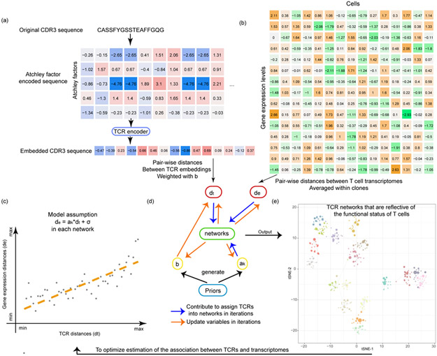

**Original caption:** The tessa algorithm. (a) A flowchart shows how the TCR sequences are encoded into numeric vectors that are amenable for mathematical operations. (b) A heatmap indicating the scRNA-Seq expression matrix, which was used to calculate the expression distances, and serves as another input into the tessa model. (c) The core rationale of tessa: to combine the information from TCR and RNA expression. (d) The two key processes of the tessa model to combine the information iteratively: updating variables to maximize the association in (c) and updating TCR network assignments according to the updated variables. (e) A t-SNE plot intuitively shows tessa-identified networks of TCRs, which has incorporated expression information, and can help achieve more refined estimation of the association in (c) within each network.

**中文图注:** Tessa算法。(a) 流程图显示TCR序列如何被编码为适合数学运算的数值向量。(b) 表示scRNA-Seq表达矩阵的热图，用于计算表达距离，并作为tessa模型的另一输入。(c) Tessa的核心原理：整合来自TCR和RNA表达的信息。(d) Tessa模型迭代整合信息的两个关键过程：更新变量以最大化(c)中的关联，以及根据更新后的变量更新TCR网络分配。(e) t-SNE图直观显示tessa识别的TCR网络，这些网络已整合表达信息，有助于在每个网络内实现(c)中关联的更精细估计。

---

**Original:**
Next we investigated the correlation between TCR repertoire embeddings ([Fig. 1a](#F001)) and gene expression ([Fig. 1b](#F001)) in 19 single T cell sequencing datasets ([Supplementary Table 1](#SD2))[^8][^9][^18][^19]. For each dataset, we choose to investigate the correlation between the pairwise Euclidean distances between TCRs and those of the expression of T cells, which were averaged within TCR clones. Interestingly, for the majority of the datasets we studied, we observed a positive correlation between TCR distances and expression distances. Typical examples are shown in [Extended Data Fig. 2](#F006), and the average correlation is 0.438 across all datasets. This indicates that T cells sharing similar TCRs are also phenotypically regulated in a similar manner. This also matches the findings by P Dash *et al*[^9] and J Glanville *et al*[^8] that T cells of similar TCR sequences often target the same antigen, although these prior works, mostly based on examining the TCR sequences alone, do not directly confirm or further investigate the functional relevance of their findings.

**中文:**
接下来，我们研究了19个单T细胞测序数据集（[补充表1](#SD2)）[^8][^9][^18][^19]中TCR库嵌入（[图1a](#F001)）与基因表达（[图1b](#F001)）之间的相关性。对于每个数据集，我们选择研究TCR间的成对欧几里得距离与T细胞表达距离（在TCR克隆内取平均）之间的相关性。有趣的是，在我们研究的大多数数据集中，我们观察到TCR距离与表达距离之间存在正相关。典型例子见[扩展数据图2](#F006)，所有数据集的平均相关系数为0.438。这表明，共享相似TCR的T细胞在表型上也以相似方式受到调控。这也与P Dash等人[^9]和J Glanville等人[^8]的发现一致，即具有相似TCR序列的T细胞通常靶向相同的抗原，尽管这些先前的工作大多仅基于检查TCR序列，并未直接确认或进一步研究其发现的功能相关性。

**Original:**
To fill in this void, we introduce tessa ([Supplementary Note 1](#SD1)) to empirically map the functional relevance of the TCR repertoire. Our core rationale ([Fig. 1c](#F001)) is to take the expression profiles of the T cells and their TCR embeddings as input, and maximize the association between them through a parametric model, to capture the part of the functional variation of T cells accounted for by TCRs. In tessa, each digit of the 30-digit TCR embedding is adjusted by a weight to maximize the correlation between the expression of T cells and the TCR embeddings ([Fig. 1d](#F001)). Simultaneously, similar TCRs defined by the weighted embeddings are grouped into TCR networks reflective of antigen specificity ([Fig. 1e](#F001)). These two steps are alternated until tessa achieves convergence. In each alteration, we adjust weights of the embedding according to the TCR-expression correlations calculated from only the T cell clones within the same networks.

**中文:**
为填补这一空白，我们引入了tessa（[补充注1](#SD1)）来凭经验绘制TCR库的功能相关性。我们的核心原理（[图1c](#F001)）是将T细胞的表达谱及其TCR嵌入作为输入，通过参数化模型最大化它们之间的关联，以捕获由TCR解释的那部分T细胞功能变异。在tessa中，30位TCR嵌入的每一位都由一个权重调整，以最大化T细胞表达与TCR嵌入之间的相关性（[图1d](#F001)）。同时，由加权嵌入定义的相似TCR被分组为反映抗原特异性的TCR网络（[图1e](#F001)）。这两个步骤交替进行，直到tessa达到收敛。在每次交替中，我们根据仅来自同一网络内T细胞克隆的TCR-表达相关性来调整嵌入的权重。

**Original:**
We applied tessa on the single cell sequencing datasets that we collected, and discovered that the adjusted weights of the TCR embeddings independently determined from each dataset are similar to each other ([Extended Data Fig. 3](#F007)). The adjusted weights can be regarded as a characterization of the latent space where TCRs and expressions are best aligned. The pairwise Pearson Correlation Coefficients of the weight vectors from all datasets ranged from 0.783 to 0.993. This suggests that tessa likely infused relevant phenotypic information, gleaned from single T cell gene expression, into interpretation of the TCR sequences, rather than irrelevant random noises.

**中文:**
我们将tessa应用于收集的单细胞测序数据集，发现从每个数据集独立确定的TCR嵌入调整权重彼此相似（[扩展数据图3](#F007)）。调整后的权重可以被视为TCR与表达最佳对齐的潜在空间的表征。所有数据集权重向量的成对皮尔逊相关系数范围为0.783至0.993。这表明tessa很可能将从单个T细胞基因表达中收集到的相关表型信息注入到TCR序列的解读中，而不是注入无关的随机噪声。

---

### 收敛性TCR重排形成靶向效率梯度 | Convergent TCR recombinations form a gradient of targeting efficiency

**Source:** p.2-3 S010

**Original:**
We first questioned whether the TCR networks detected by tessa indeed reflect antigen specificity. We investigated four 10x Genomics single T cell sequencing datasets, in which the expression of genes, TCR sequences, and the antigen binding specificity in the context of 44 pMHCs were profiled simultaneously for each T cell. We applied tessa on these datasets, and calculated the 'purity' of the constructed networks. This purity was calculated by counting the number of TCRs of the largest subset of TCR clonotypes that target the same antigen (the 'putative antigen', [Fig. 2a](#F002)) in each network. [Fig. 2b](#F002) shows that in each of the 4 datasets, the purity ranges between 87.64%−100%. We also applied GLIPH and observed an average purity of 61.65% ([Extended Data Fig. 4](#F008)) at about the same clustering rate. Furthermore, we analyzed two other TCR datasets[^8][^9] with known epitope-binding specificity. As these two were not scRNA-seq datasets and could not be analyzed by tessa directly, we performed hierarchical clustering of the TCRs in each dataset based on the scaled TCR embeddings inferred from the scRNA-Seq datasets by tessa (the average scaling in [Extended Data Fig. 3](#F007)). We found that the TCR network purities achieved 99.52% and 98.55% for each dataset ([Extended Data Fig. 5](#F009)), with a cutoff to split the hierarchical clustering that results in clustering rates comparable to those of tessa on the scRNA-Seq datasets. GLIPH achieved purities of 85.51% and 99.51% at about the same clustering rate ([Extended Data Fig. 4](#F008)).

**中文:**
我们首先质疑tessa检测到的TCR网络是否确实反映抗原特异性。我们研究了四个10x Genomics单T细胞测序数据集，其中每个T细胞的基因表达、TCR序列以及在44种pMHC背景下的抗原结合特异性被同时分析。我们将tessa应用于这些数据集，并计算构建网络的"纯度"。该纯度通过计数每个网络中靶向相同抗原（"推定抗原"，[图2a](#F002)）的最大TCR克隆型子集中的TCR数量来计算。[图2b](#F002)显示，在4个数据集中，纯度范围在87.64%-100%之间。我们还应用了GLIPH，并在大致相同的聚类率下观察到平均纯度为61.65%（[扩展数据图4](#F008)）。此外，我们分析了另外两个具有已知表位结合特异性的TCR数据集[^8][^9]。由于这两个不是scRNA-seq数据集，无法直接通过tessa分析，我们基于tessa从scRNA-Seq数据集推断的缩放TCR嵌入（[扩展数据图3](#F007)中的平均缩放），对每个数据集中的TCR进行了层次聚类。我们发现，每个数据集的TCR网络纯度分别达到99.52%和98.55%（[扩展数据图5](#F009)），层次聚类的分割阈值设定使聚类率与tessa在scRNA-Seq数据集上的聚类率相当。GLIPH在相同聚类率下实现了85.51%和99.51%的纯度（[扩展数据图4](#F008)）。

---

### 图2 | Fig. 2. TCR networks demonstrate a gradient of targeting efficiency.

**Placed near:** p.3 S010
**Source:** p.3 (between S010 and S011)

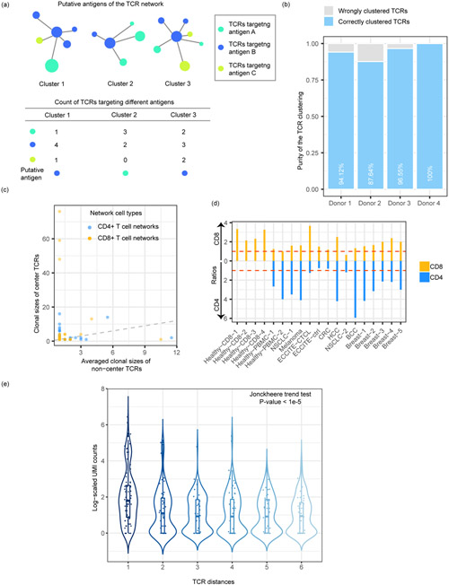

**Original caption:** TCR networks demonstrate a gradient of targeting efficiency. (a) The calculation of TCR network purity. (b) Clustering purities in the four 10X Healthy-CD8 datasets. Unexpanded clones with only one T cell and networks with only one clone were excluded. The numbers of unique TCRs were 119, 364, 87 and 62, respectively. (c) One typical example (Breast-5) to show the clonal sizes of center TCRs and the median clonal sizes of non-centered TCRs for each network. The dashed line represents the X=Y line. 79 CD8+ and 150 CD4 TCR networks with at least three clones were included. (d) Ratios representing central clones' expansion levels of the CD8/CD4 clones in each dataset. (e) The decreasing gradient of antigen binding strength for TCRs, along with increasing dissimilarity to the center TCRs. The TCR clonotypes from each dataset were divided into six groups of equal size (N=198). Unexpanded clones with only one T cell and networks with only one clone were excluded.

**中文图注:** TCR网络显示靶向效率梯度。(a) TCR网络纯度的计算。(b) 四个10X Healthy-CD8数据集中的聚类纯度。排除仅有一个T细胞的未扩增克隆和仅有一个克隆的网络。唯一TCR数量分别为119、364、87和62。(c) 一个典型例子（Breast-5），显示每个网络中中心TCR的克隆大小和非中心TCR的中位克隆大小。虚线代表X=Y线。包含至少三个克隆的79个CD8+和150个CD4 TCR网络。(d) 代表每个数据集中CD8/CD4克隆的中心克隆扩增水平的比率。(e) 随着与中心TCR的差异增大，TCR的抗原结合强度呈递减梯度。每个数据集的TCR克隆型被分为六组等大小的组（N=198）。排除仅有一个T细胞的未扩增克隆和仅有一个克隆的网络。

---

**Original:**
Next, we asked whether tessa networks help to differentiate the antigen binding efficiency among different TCRs that target the same antigen. The different TCR clonotypes from the same TCR networks are generated from multiple VDJ recombinations. We hypothesize that the TCR clonotype that is closest to the "average" of all the clonotypes, within the same networks, should have better antigen targeting efficiency, which is a phenomenon sometimes referred to as "the wisdom of the crowds"[^28][^29]. To confirm this hypothesis, we divided the TCRs in the same networks into center T cells (the TCR that is closest to the average of all TCRs in each network) and non-center T cells. For each TCR network, we calculated the median of the clonal sizes of the non-center clones and compared the medians with the clone sizes of the center clones ([Fig. 2c](#F002), representative example). For each of our datasets, we counted the numbers of TCR networks with a larger/smaller center clonal size than the corresponding non-center median, and the former was divided by the latter to obtain a ratio to represent the central clone's expansion level. We found that, in 17 out of 19 datasets, more T cell networks demonstrate the phenotype that the center T cell clones are more expanded ([Fig. 2d](#F002)). This conforms to the theory of convergent VDJ recombinations, where TCRs in the same TCR networks are similar and the TCRs of the center T cells have better avidity towards the target antigens than the other non-center T cells, and thus are more strongly activated and more proliferative.

**中文:**
接下来，我们探究tessa网络是否有助于区分靶向相同抗原的不同TCR之间的抗原结合效率。来自同一TCR网络的不同TCR克隆型由多次VDJ重排产生。我们假设，在同一网络内，最接近所有克隆型"平均"的TCR克隆型应该具有更好的抗原靶向效率——这种现象有时被称为"群体的智慧"[^28][^29]。为验证这一假设，我们将同一网络中的TCR分为中心T细胞（最接近每个网络中所有TCR平均值的TCR）和非中心T细胞。对于每个TCR网络，我们计算非中心克隆的克隆大小的中位数，并将中位数与中心克隆的克隆大小进行比较（[图2c](#F002)，代表性例子）。对于每个数据集，我们统计了中心克隆大小大于/小于相应非中心中位数的TCR网络数量，用前者除以后者得到代表中心克隆扩增水平的比率。我们发现，在19个数据集中有17个，更多T细胞网络表现出中心T细胞克隆扩增更多的表型（[图2d](#F002)）。这与收敛性VDJ重排理论一致，即同一TCR网络中的TCR相似，中心T细胞的TCR比其他非中心T细胞对靶抗原具有更好的亲和力，因此被更强烈地激活并更具增殖能力。

**Original:**
We further confirmed this hypothesis *via* directly examining the antigen binding strength of the TCRs, by analyzing the antigen binding data captured by pMHC feature barcodes for each T cell. The feature barcode technology of 10X is a method for adding extra channels of information to cells by running scRNA-seq in parallel with other assays. Binding strength of each T cell was measured by the Unique Molecular Identifier (UMI) barcode count for the pMHC targeted by the majority of the TCRs in the same networks. Medians of the UMI counts of different T cells sharing the same TCR were taken. For each TCR network identified by tessa, we divided its different TCR clonotypes into six groups of equal size depending on their dissimilarity from the TCRs of the center T cells ([Fig. 2e](#F002)). We observed a decreasing gradient of binding strengths along with increasing dissimilarity of TCRs from the center TCRs. In other words, the TCRs that are more similar to the center TCR are most efficient in antigen binding, while the other more divergent TCRs have less binding affinity.

**中文:**
我们通过直接检查TCR的抗原结合强度进一步证实了这一假设——分析由pMHC特征条形码捕获的每个T细胞的抗原结合数据。10X的特征条形码技术是通过并行运行scRNA-seq与其他检测来为细胞添加额外信息通道的方法。每个T细胞的结合强度通过同一网络中大多数TCR靶向的pMHC的唯一分子标识符（UMI）条形码计数来衡量。取共享相同TCR的不同T细胞的UMI计数中位数。对于tessa识别的每个TCR网络，我们根据其与中心T细胞TCR的差异程度，将其不同的TCR克隆型分为六组等大小的组（[图2e](#F002)）。我们观察到，随着TCR与中心TCR的差异增大，结合强度呈递减梯度。换句话说，与中心TCR越相似的TCR，其抗原结合效率越高，而其他更多样的TCR结合亲和力较低。

---

### 免疫检查点抑制剂治疗后T细胞的TCR依赖性二分 | TCR-dependent dichotomization of T cells post-immune checkpoint inhibitor treatment

**Source:** p.3 S013

**Original:**
We investigated whether tessa could reveal insights into the human T cell machinery under therapeutic interventions. We examined the tumor infiltrating T cells of 11 basal cell carcinoma (BCC) patients (6 responders and 5 non-responders)[^27]. Yost *et al* demonstrated that the T cell clones in tumors before anti-PD-1 therapy had limited proliferation capacity, while the expanded T cell clones in response to the immunotherapy were derived mostly from newly-infiltrated T cells. However, in their work, TCRs are mainly used as a marker of clonal expansion.

**中文:**
我们研究了tessa是否能够揭示治疗干预下人类T细胞机制的洞见。我们检查了11名基底细胞癌（BCC）患者（6名应答者和5名无应答者）[^27]的肿瘤浸润T细胞。Yost等人证明，抗PD-1治疗前肿瘤中的T细胞克隆增殖能力有限，而对免疫治疗产生应答的扩增T细胞克隆主要来源于新浸润的T细胞。然而，在他们的工作中，TCR主要被用作克隆扩增的标志物。

**Original:**
To analyze these data with tessa, we defined the TCR clonotypes of all T cells in the post-treatment library as 'post-treatment' clonotypes. All other T cell clonotypes were defined as 'pre-treatment'. Then through majority voting based on clonotype-level labels, we defined pre-/post-treatment tessa networks ([Materials and Methods](#S008)). We performed t-SNE analyses of the T cells, and assigned a pre/post-treatment clonotype ([Fig. 3a](#F003)) and a pre/post-treatment network ([Fig. 3b](#F003)) label to each T cell. We observed that the T cells from the responders formed three distinct clusters, with one cluster mostly comprised of post-treatment clones (post-2), the second cluster comprised of both pre- and post-treatment clones (pre-1 and post-1 respectively), and the third cluster consisted mostly of pre-treatment clones (pre-2) ([Fig. 3a](#F003)). Interestingly, labeling the T cells with their network identities showed that most T cells that belong to the post-1 clones and infiltrated the pre-1/post-1 cluster actually belong to pre-treatment networks ([Fig. 3b](#F003)). By examining the most similar TCR clones ('neighbours') based on Euclidean distances of TCR embeddings, we found that, in responders, other than to post-1 clones themselves, post-1 clones are next most similar to the pre-1 clones explaining their presence in the pre-treatment networks ([Fig. 3c](#F003)). We applied the same analysis on post-2 clones from responders ([Fig. 3d](#F003)), and showed that pre-1 clones are not their closest "neighbors". Therefore, our analysis offers a much more detailed view than Yost *et al* that the post-treatment T cells in responders actually consist of two distinct populations due to their differential TCR profiles.

**中文:**
为用tessa分析这些数据，我们将治疗后文库中所有T细胞的TCR克隆型定义为"治疗后"克隆型。所有其他T细胞克隆型被定义为"治疗前"。然后通过基于克隆型水平标签的多数投票，我们定义了治疗前/治疗后tessa网络（[材料和方法](#S008)）。我们对T细胞进行t-SNE分析，并为每个T细胞分配治疗前/治疗后克隆型（[图3a](#F003)）和治疗前/治疗后网络（[图3b](#F003)）标签。我们观察到，来自应答者的T细胞形成了三个不同的簇，一个簇主要由治疗后克隆组成（post-2），第二个簇由治疗前和治疗后克隆共同组成（分别为pre-1和post-1），第三个簇主要由治疗前克隆组成（pre-2）（[图3a](#F003)）。有趣的是，用网络身份标记T细胞显示，属于post-1克隆并浸润到pre-1/post-1簇的大多数T细胞实际上属于治疗前网络（[图3b](#F003)）。通过基于TCR嵌入的欧几里得距离检查最相似的TCR克隆（"邻居"），我们发现在应答者中，除了post-1克隆本身，post-1克隆与pre-1克隆最为相似，这解释了它们在治疗前网络中的存在（[图3c](#F003)）。我们对应答者的post-2克隆进行了相同的分析（[图3d](#F003)），并显示pre-1克隆并不是它们最接近的"邻居"。因此，我们的分析提供了比Yost等人更详细的视角：应答者中的治疗后T细胞实际上由两个不同的群体组成，这是由于它们不同的TCR谱所致。

---

### 图3 | Fig. 3. TCR similarity determines fate of T cells post-immunotherapy treatment.

**Placed near:** p.3-4 S014-S016
**Source:** p.4 (between S014 and S016)

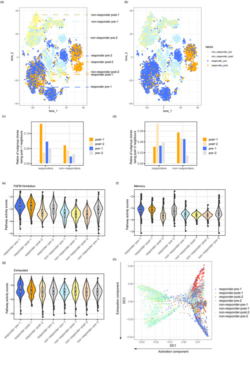

**Original caption:** TCR similarity determines fate of T cells post-immunotherapy treatment. (a,b) T-SNE plots of the post-treatment and pre-treatment cells from all the BCC patients (dataset BCC, Supplementary Table 1). The colors represent either clonal level labels (a) or network level labels (b). TCR networks were built separately for cells from each patient. The post-1, post-2, pre-1 and pre-2 subgroups were described in the result section. (c,d) The ratios of clones of the neighbors of post-1 (c) and post-2 (d) in each subgroup. (e-g) Pathway activity scores including TGFB1/inhibition gene pathway (e), memory gene pathway (f), and exhausted gene pathway (g) of the different cell subgroups. (h) Diffusion map analysis showing the cell subgroup distribution along the activation diffusion component and the exhaustion diffusion component. The numbers of T cells in the eight subgroups analyzed in Fig. 3 were: responders: N(post-1)=389, N(post-2)=841, N(pre-1)=1321, N(pre-2)=787; non-responders: N(post-1)=550, N(post-2)=757, N(pre-1)=892, N(pre-2)=670.

**中文图注:** TCR相似性决定免疫治疗后T细胞的命运。(a,b) 所有BCC患者治疗前和治疗后细胞的t-SNE图（数据集BCC，补充表1）。颜色代表克隆水平标签(a)或网络水平标签(b)。为每位患者的细胞分别构建TCR网络。post-1、post-2、pre-1和pre-2亚组在结果部分描述。(c,d) 各亚组中post-1(c)和post-2(d)的邻居克隆比率。(e-g) 不同细胞亚组的通路活性评分，包括TGFB1/抑制基因通路(e)、记忆基因通路(f)和耗竭基因通路(g)。(h) 扩散图分析显示细胞亚组沿激活扩散组分和耗竭扩散组分的分布。图3分析的八个亚组中T细胞数量：应答者：N(post-1)=389，N(post-2)=841，N(pre-1)=1321，N(pre-2)=787；无应答者：N(post-1)=550，N(post-2)=757，N(pre-1)=892，N(pre-2)=670。

---

**Original:**
We examined the genes that are differentially expressed in responder post-1 cells compared with post-2 cells. We identified *TGFB1* as the top differentially expressed gene that is related to immune pathways, which was shown to be a strong inhibitor of CD8+ T cell functions and also a marker of exhaustion[^30]. We identified a *TGFB1*/inhibition signature by including genes that are highly correlated with the expression of *TGFB1*. In responders, this inhibition pathway is highly expressed in pre-1 and post-1 cells, compared with post-2 cells ([Fig. 3e](#F003)). Furthermore, we examined pathway activities (naive, memory, activated, and exhausted) derived from the pathway signature genes defined by Yost *et al*[^27]. In alignment with our observation above, post-1 and pre-1 T cells in responders had similar memory and exhaustion pathway activity levels, which are higher than post-2 T cells ([Fig. 3f](#F003), [g](#F003)). Post-1, post-2, pre-1, and pre-2 T cells from the responders had similar levels of naive and activated pathway activities ([Extended Data Fig. 6](#F010)).

**中文:**
我们检查了应答者中post-1细胞与post-2细胞之间差异表达的基因。我们发现*TGFB1*是差异表达最显著且与免疫通路相关的基因，该基因已被证明是CD8+ T细胞功能的强效抑制剂，也是耗竭标志物[^30]。我们通过纳入与*TGFB1*表达高度相关的基因，确定了一个*TGFB1*/抑制特征。在应答者中，与post-2细胞相比，该抑制通路在pre-1和post-1细胞中高表达（[图3e](#F003)）。此外，我们检查了由Yost等人[^27]定义的通路特征基因衍生的通路活性（幼稚、记忆、激活和耗竭）。与我们上述观察一致，应答者中的post-1和pre-1 T细胞具有相似的记忆和耗竭通路活性水平，均高于post-2 T细胞（[图3f](#F003), [g](#F003)）。来自应答者的post-1、post-2、pre-1和pre-2 T细胞的幼稚和激活通路活性水平相似（[扩展数据图6](#F010)）。

**Original:**
Furthermore, we employed diffusion map analysis ([Fig. 3h](#F003)) and ordered cells in pseudotime ([Extended Data Fig. 7](#F011)). The first diffusion component (DC1) was highly correlated with the activation status and it separated post-1 and post-2 cells of non-responders from the other T cells. The third diffusion component (DC3) represented the exhaustion levels and we observed that pre-1 and post-1 cells were separated from post-2 cells of the responders, which is consistent with our pathway analyses.

**中文:**
此外，我们采用了扩散图分析（[图3h](#F003)）并按伪时间排序细胞（[扩展数据图7](#F011)）。第一扩散组分（DC1）与激活状态高度相关，它将无应答者的post-1和post-2细胞与其他T细胞分开。第三扩散组分（DC3）代表耗竭水平，我们观察到pre-1和post-1细胞与应答者的post-2细胞分开，这与我们的通路分析一致。

**Original:**
Overall, tessa discovered that the TCRs of post-immunotherapy treatment T cells determined that only some of them are truly "new" to the tumor microenvironment, and these T cells are probably the real functional effectors. In comparison to responders, this dichotomization of post-treatment T cells is not observed in non-responders ([Fig. 3](#F003)), which could underlie the lack of response in these patients.

**中文:**
总体而言，tessa发现免疫治疗后T细胞的TCR决定了其中只有部分对肿瘤微环境是真正"新"的，而这些T细胞可能是真正的功能性效应细胞。与应答者相比，无应答者中未观察到治疗后T细胞的这种二分（[图3](#F003)），这可能是这些患者缺乏应答的基础。

---

### TCR对T细胞表型的约束在肿瘤环境中减弱 | TCR-dependent constraint on T cell phenotype is weakened in tumor contexts

**Source:** p.4 S018

**Original:**
Tessa enables a comprehensive comparison of the functional implication of the TCR repertoire on the T cells in different contexts. We first examined two datasets[^14], where T cells from a healthy donor and a patient with Cutaneous T-cell lymphoma (CTCL) were processed by ECCITE-Seq. In the t-SNE plots of the CD8+ T cells of both datasets, we highlighted the top ten TCR clonotypes with the largest clonal sizes ([Fig. 4a](#F004), [b](#F004)). Interestingly, different T cells in the same clones from the healthy donor are clustered rather closely by clone identity, while T cell clones from the CTCL patient are distributed much more diffusely. This observation hints that, compared with the T cells from the healthy control, those from the CTCL patient are more homogeneous functionally regardless of clonotypes.

**中文:**
Tessa能够全面比较不同背景下TCR库对T细胞的功能影响。我们首先检查了两个数据集[^14]，其中来自健康供体和皮肤T细胞淋巴瘤（CTCL）患者的T细胞通过ECCITE-Seq处理。在两个数据集的CD8+ T细胞的t-SNE图中，我们突出显示了克隆大小最大的前十位TCR克隆型（[图4a](#F004)，[b](#F004)）。有趣的是，来自健康供体的同一克隆中的不同T细胞按克隆身份紧密聚集，而来自CTCL患者的T细胞克隆分布则更加弥散。这一观察提示，与健康对照的T细胞相比，来自CTCL患者的T细胞在功能上更趋于同质化，不论其克隆型如何。

---

### 图4 | Fig. 4. CD8+ T cells are functionally constrained by TCRs differently in healthy donors and tumor patients.

**Placed near:** p.4-5 S018-S020
**Source:** p.5 (between S018 and S019)

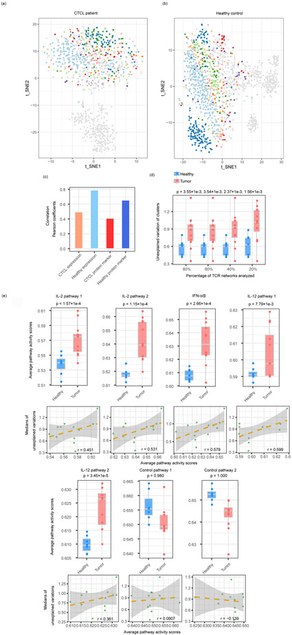

**Original caption:** CD8+ T cells are functionally constrained by TCRs differently in healthy donors and tumor patients. (a,b) t-SNE plots of the T cells from a CTCL patient (a) and a healthy donor (b). Cells in each of the top 10 largest clones were labeled in non-grey colors, and the other cells were labeled in grey. The total numbers of cells were 1,103 for (a) and 1,462 for (b). (c) Correlation between the TCR distances and the RNA/protein expression distances of CTCL and healthy donor T cells datasets. (d) The boxplots show the unexplained variance of TCR networks from the twelve tumor samples of different cancer types and the seven healthy samples combined (Supplementary Table 1). X-axis indicates the percentages of TCR networks analyzed with cutoffs. The P values were generated from one-sided Student's T-tests. (e) Differences between the pathway activities calculated from the different cancer and healthy datasets, as in (d) (upper panel) and the correlation between average pathway activity scores and medians of unexplained gene expression variances by TCR in all tumor datasets (lower panel). The P values were generated from one-sided Student's T-tests. The shaded areas denote the 95% confidence intervals for linear regressions.

**中文图注:** CD8+ T细胞在健康供体和肿瘤患者中受到TCR不同的功能约束。(a,b) 来自CTCL患者(a)和健康供体(b)的T细胞的t-SNE图。前十大最大克隆中的细胞以非灰色标记，其他细胞以灰色标记。细胞总数分别为(a) 1,103个和(b) 1,462个。(c) CTCL和健康供体T细胞数据集中TCR距离与RNA/蛋白表达距离之间的相关性。(d) 箱线图显示来自12个不同癌症类型的肿瘤样本和7个健康样本合并的TCR网络的未解释方差（补充表1）。X轴表示使用不同阈值分析的TCR网络的百分比。P值来自单侧Student's t检验。(e) 不同癌症和健康数据集计算的通路活性差异，如(d)所示（上方面板），以及所有肿瘤数据集中平均通路活性评分与TCR未解释基因表达方差中位数之间的相关性（下方面板）。P值来自单侧Student's t检验。阴影区域表示线性回归的95%置信区间。

---

**Original:**
We applied tessa to study this phenomenon more quantitatively. Based on the tessa-weighted TCR embeddings, we calculated the pairwise TCR distances and the pairwise expressional distances of TCR clonotypes as we did in [Extended Data Fig. 2](#F006). We found that, although T cell clones with more similar TCRs are more likely to share similar expressional profiles, the correlation between TCR and gene expression for the CTCL patient was much smaller compared with that in the healthy donor ([Fig. 4c](#F004)). Taken together, in CTCL, the T cell clonotypes are less constrained by their TCRs and demonstrate a more homogenized pattern.

**中文:**
我们应用tessa更定量地研究这一现象。基于tessa加权的TCR嵌入，我们计算了TCR克隆型的成对TCR距离和成对表达距离（如我们在[扩展数据图2](#F006)中所做）。我们发现，尽管TCR更相似的T细胞克隆更可能共享相似的表达谱，但CTCL患者的TCR与基因表达之间的相关性远小于健康供体（[图4c](#F004)）。综合来看，在CTCL中，T细胞克隆型受其TCR的约束较少，并表现出更趋同的模式。

**Original:**
We further investigated the whole panel of CD8+ T cells from the 19 single T cell RNA-sequencing datasets (seven healthy PBMC samples and twelve tumor samples of different cancer types). For each dataset, we calculated the 'unexplained variations', which are the part of variations left after deducting the TCR-constrained variations from the total gene expression variations ([Extended Data Fig. 8](#F012)). Interestingly, we found that the unexplained variations by TCRs are much larger for the tumor datasets than the normal datasets ([Fig. 4d](#F004), Student's T-test P-values from 0.0036 to 0.0016). To test the robustness of this observation, we set a series of cutoffs on the tessa network sizes (minimum number of TCR clonotypes in each network), and chose to only consider the larger networks in each subset. We observed the same phenomenon regardless of cutoffs ([Fig. 4d](#F004)). These results confirmed that, across a panel of tumor types/datasets, the functions of T cells were less constrained by TCRs in tumor patients when compared with healthy donors.

**中文:**
我们进一步研究了来自19个单细胞T细胞RNA测序数据集（7个健康PBMC样本和12个不同癌症类型的肿瘤样本）的全部CD8+ T细胞。对于每个数据集，我们计算了"未解释变异"，即从总基因表达变异中扣除TCR约束变异后剩余的部分（[扩展数据图8](#F012)）。有趣的是，我们发现肿瘤数据集中TCR未解释的变异远大于正常数据集（[图4d](#F004)，Student's t检验P值从0.0036到0.0016）。为验证这一观察的稳健性，我们对tessa网络大小设置了一系列阈值（每个网络中TCR克隆型的最小数量），并选择仅在每个子集中考虑较大的网络。无论阈值如何，我们都观察到相同的现象（[图4d](#F004)）。这些结果证实，在一系列肿瘤类型/数据集中，与健康供体相比，肿瘤患者的T细胞功能受TCR的约束较小。

**Original:**
Other than TCR binding, another factor that regulates T cell function is the cytokines secreted by a variety of immune cells, especially in the tumor microenvironment[^31]. Typical cytokines that influence CD8+ T cells include IL-2, IL-12, and IFN-α/β[^32], and we examined the activity of their downstream signaling pathways in the T cells ([Online Methods](#S008)). Activity scores for each pathway were calculated for each T cell and averaged in each dataset. As expected, these pathways' activities in the T cells of the tumor datasets were overall higher than those of the healthy datasets ([Fig. 4e](#F004), upper panel). According to our hypothesis, we anticipate that the stronger these pathways' activities are, the more the T cells are regulated by these pathways, and less by the TCRs proportionally. Indeed, we observed that the upregulation of these cytokine downstream pathways is positively correlated with the high TCR-independent expression variations, across the tumor T cell cohorts of different cancer types ([Fig. 4e](#F004), lower panel).

**中文:**
除TCR结合外，调节T细胞功能的另一因素是多种免疫细胞分泌的细胞因子，尤其是在肿瘤微环境中[^31]。影响CD8+ T细胞的典型细胞因子包括IL-2、IL-12和IFN-α/β[^32]，我们检查了它们在T细胞中的下游信号通路活性（[在线方法](#S008)）。每个通路的活性评分对每个T细胞进行计算并在每个数据集中取平均值。正如预期，肿瘤数据集T细胞中这些通路的活性整体上高于健康数据集（[图4e](#F004)，上方面板）。根据我们的假设，我们预期这些通路活性越强，T细胞受这些通路调控越多，而受TCR调控的比例越少。确实，我们观察到，在不同癌症类型的肿瘤T细胞队列中，这些细胞因子下游通路的上调与高TCR非依赖性表达变异正相关（[图4e](#F004)，下方面板）。

---

## 讨论 | DISCUSSION

**Source:** p.5 S022

**Original:**
In this work, we developed the tessa model to quantitatively interpret the functional relevance of T cell repertoire. The function of T cells is determined by the overall contribution from a number of factors, such as TCR-antigen interaction, the environmental cytokine/chemokine, *etc*. After antigen exposure, the naive T cells become activated, which is followed by exhaustion and formation of memory T cells[^35][^36]. Using tessa as a tool, we showed that TCR similarity/dissimilarity determines a significant portion of the functional variation of T cells. Our results are in alignment with Tubo *et al*[^10], who revealed that each naive T cell has a tendency to produce certain types of effector cells, in part due to the nature of its unique TCR. They are also in alignment with Buchholz *et al*[^11], who similarly revealed that complex biological systems tend to balance the stochastic processes (intrinsic and extrinsic cues) and a robust outcome with a shared theme, when distinct variations of individual T cells with the same TCR are averaged out. Counter-intuitively, in tumors, the proportion of the functional variance controlled by TCRs is lower than that of the healthy donors. This could be a result of the high levels of cytokines and chemokines secreted into the tumor microenvironment[^32], which possibly influence all T cells simultaneously, and thus have tuned different clones of T cells to follow a similar distribution transcriptomically.

**中文:**
在本工作中，我们开发了tessa模型来定量解释T细胞库的功能相关性。T细胞的功能由多个因素的整体贡献决定，如TCR-抗原相互作用、环境中的细胞因子/趋化因子等。在抗原暴露后，初始T细胞被激活，随后发生耗竭并形成记忆T细胞[^35][^36]。以tessa为工具，我们展示了TCR相似性/差异决定了T细胞功能变异的重要部分。我们的结果与Tubo等人[^10]一致，他们揭示了每个初始T细胞都有产生特定类型效应细胞的倾向，部分原因是其独特TCR的性质。这些结果也与Buchholz等人[^11]一致，他们同样揭示，当具有相同TCR的单个T细胞的独特变异被平均化时，复杂生物系统倾向于平衡随机过程（内在和外在信号）和具有共同主题的稳健结果。与直觉相反的是，在肿瘤中，由TCR控制的功能变异比例低于健康供体。这可能是由于大量细胞因子和趋化因子分泌到肿瘤微环境中的结果[^32]，它们可能同时影响所有T细胞，从而使不同的T细胞克隆在转录组水平上趋向于相似的分布。

**Original:**
Tessa revealed insights into the behavior of the TCR repertoire that could have impactful translational value. Kalergis *et al*[^37] and Course *et al*[^38] demonstrated that when the binding affinity of the TCRs toward target antigens is too high, it hinders, rather than promotes, the activity and efficiency of T cells. Our approach of examining expression together with the TCRs of T cells could provide a more fine-grained resolution to the identification of the most promising TCRs for immunotherapies such as TCR transgenic T cells.

**中文:**
Tessa揭示了对TCR库行为的洞见，具有重要的转化价值。Kalergis等人[^37]和Course等人[^38]证明，当TCR对靶抗原的结合亲和力过高时，反而会抑制而非促进T细胞的活性和效率。我们的方法将T细胞的表达与TCR同时检查，可为识别最有潜力的TCR（用于TCR转基因T细胞等免疫疗法）提供更精细的分辨率。

**Original:**
Our observations do not indicate that all T cells of the same TCR clonotype will have the same expressional profile. Instead, the different T cells of the same TCR clone can be either naive, memory, activated or exhausted, which is the part of functional variation of T cells that cannot be explained by TCRs. In the future, it could be of interest to further develop tessa to jointly model the TCR repertoire together with these other factors, such as cytokine/chemokine exposure, for a more comprehensive characterization of the functions of T cells in various contexts. Another future direction would be to incorporate the CDR3α sequences and V/J genes into the modeling process, whereas our work currently only considers the CDR3β chains.

**中文:**
我们的观察并不表明同一TCR克隆型的所有T细胞都具有相同的表达谱。相反，同一TCR克隆的不同T细胞可以是幼稚、记忆、激活或耗竭状态——这是T细胞功能变异中不能由TCR解释的部分。未来，进一步开发tessa以联合建模TCR库与其他因素（如细胞因子/趋化因子暴露）将具有研究价值，以便更全面地表征不同环境中T细胞的功能。另一个未来方向是将CDR3α序列和V/J基因纳入建模过程，而我们目前的工作仅考虑了CDR3β链。

**Original:**
In conclusion, we developed tessa, which bridges the gap between the field of TCR repertoire analysis and the field of single cell sequencing. Tessa enabled an insightful interpretation of the TCRs with empirical evidence, and can answer a variety of research questions regarding T cell biology that could not be asked before.

**中文:**
总之，我们开发了tessa，它弥合了TCR库分析领域和单细胞测序领域之间的鸿沟。Tessa利用经验证据实现了对TCR的深入解读，并可以回答关于T细胞生物学的各种以前无法提出的研究问题。

---

## 在线方法 | ONLINE METHODS

### 嵌入TCR序列 | Embedding TCR sequences

**Source:** p.5-6 S026

**Original:**
First, we encoded the amino acids in TCR peptide sequences with the "Atchley factor"[^15] to give each TCR sequence an initial numerical representation. Atchley *et al* compressed a set of over 500 amino acid properties by dimensionality reduction to simplify the 500 attributes into 5 combined features in the latent space that faithfully represent the features of amino acids. The five Atchley factors correspond loosely to polarity, secondary structure, molecular volume, codon diversity, and electrostatic charge.

**中文:**
首先，我们使用"Atchley因子"[^15]对TCR肽序列中的氨基酸进行编码，为每个TCR序列赋予初始数值表示。Atchley等人通过降维方法压缩了500多个氨基酸属性集，将500个属性简化为潜在空间中的5个组合特征，这些特征忠实地代表了氨基酸的特性。五个Atchley因子大致对应于极性、二级结构、分子体积、密码子多样性和静电荷。

**Original:**
The resulting embedded 'Atchley matrix' has each row representing one digit of the 'Atchley factor' and each column representing one amino acid in the TCR sequence. The Atchley factor matrices are large and they are also in matrix-format, where the neighboring relationship between residues contain critical information regarding the feature of the TCRs. Thus, an algorithm will need to be used to digest the Atchley factor matrices to generate a much smaller numeric vector that has captured the critical information contained in the TCR 'Atchley matrices' to simplify the following steps. Stacked auto-encoders can naturally perform this task. We added zero padding to the columns to fix the shape of the matrices to 5×80. Then a stacked auto-encoder, which is capable of reconstructing the input data and capturing their inherent structural features in an unsupervised manner, was applied to the encoded TCR "Atchley matrices" ([Extended Data Fig. 1a](#F005)). The input and the output of the auto-encoder are exactly the same, the "Atchley matrices". The extracted structural features are captured in the smallest fully connected layer in the middle (the bottleneck layer). In our case, the bottleneck layer outputs are a 30-neuron numeric vector embedding of the original CDR3s. The training dataset consisted of 286,477 TCRs derived from bulk RNA sequencing data and 35,374 single-cell TCR sequences, and the total number of unique TCR sequences for training was 243,747 ([Supplementary Table 1](#SD2)).

**中文:**
由此嵌入生成的"Atchley矩阵"每一行代表"Atchley因子"的一位数字，每一列代表TCR序列中的一个氨基酸。Atchley因子矩阵很大，且为矩阵格式，其中残基间的邻近关系包含关于TCR特征的关键信息。因此，需要一种算法来处理Atchley因子矩阵，生成一个小得多的数值向量，该向量已捕获TCR"Atchley矩阵"中的关键信息，以简化后续步骤。堆叠自编码器可以自然地执行此任务。我们对列进行了零填充，将矩阵的形状固定为5×80。然后将一个能够以无监督方式重建输入数据并捕获其固有结构特征的堆叠自编码器应用于编码后的TCR"Atchley矩阵"（[扩展数据图1a](#F005)）。自编码器的输入和输出完全相同，即"Atchley矩阵"。提取的结构特征被捕获在中间的（瓶颈层）最小的全连接层中。在我们的情况下，瓶颈层输出是原始CDR3的30神经元数值向量嵌入。训练数据集包含来自批量RNA测序数据的286,477个TCR和35,374个单细胞TCR序列，用于训练的唯一TCR序列总数为243,747个（[补充表1](#SD2)）。

**Original:**
Here we chose an 80 (x5) embedding of the CDR3β sequences for two reasons: (1) We leave room here for potentially adding the CDR3α chains in the future. CDR1 or 2 may also be added. This could be convenient for us as the structure of the auto-encoder does not need to be changed or just needs to be changed minimally, even when the other CDRs are added. In the current study, not all sequenced T cells in these scRNA-seq datasets will have matched CDR3α and 3β sequences. If we limit ourselves to CDR3αβ matched cells, we will have a modestly reduced sample size in our analyses, which is one reason why we focused on CDR3β only so far. (2) In our datasets, the longest CDR3β has 50 amino acids. If we create an embedding that is shorter, say 30(x5), it means some (though a small number) CDR3βs will need to be truncated, which is not ideal.

**中文:**
这里我们选择CDR3β序列的80（x5）嵌入有两个原因：（1）我们为未来可能添加CDR3α链留出空间。CDR1或2也可能被添加。这很方便，因为即使添加其他CDR，自编码器的结构也无需更改或只需最小更改。在目前的研究中，并非这些scRNA-seq数据集中所有测序的T细胞都有匹配的CDR3α和3β序列。如果我们将自己限制在CDR3αβ匹配的细胞上，我们的分析样本量将适度减少，这是目前我们仅关注CDR3β的原因之一。（2）在我们的数据集中，最长的CDR3β有50个氨基酸。如果我们创建更短的嵌入，比如30(x5)，这意味着一些（尽管数量很少）CDR3β需要被截断，这并不理想。

**Original:**
Alternatively, we can encode amino acids by one-hot encoding. But this way of encoding has lost the biological context, and cannot reflect the fact that some amino acids are more similar to each other than others. One might also consider more sophisticated techniques such as word2vec[^39]. However, such models will need to be trained on a set of biologically meaningful data to be able to embed the amino acids reasonably. This would be essentially replicating the work of Atchley *et al* to some extent.

**中文:**
或者，我们可以用独热编码对氨基酸进行编码。但这种编码方式丧失了生物学背景，无法反映某些氨基酸比其他氨基酸更相似的事实。也可以考虑更复杂的技术，如word2vec[^39]。然而，这样的模型需要在具有生物学意义的数据集上训练，才能合理地嵌入氨基酸。这在本质上相当于在一定程度上重复Atchley等人的工作。

---

### Tessa模型简述 | A brief description of the tessa model

**Source:** p.6 S027

**Original:**
The input to tessa are two matrices, the embedded TCR matrix of all T cells (T cells × 30-dimensional embedding) and the expression matrix for all the T cells (genes × T cells). In our study, we used our own TCR embedding described above to preprocess the original TCR sequences. However, the user is free to use any other embeddings of the TCRs, and our software implementation has taken this flexibility in input into consideration. To preprocess the expression of genes, we calculated the variation of the expression levels of each gene across all cells. Only the top 10% genes with the highest variation were kept.

**中文:**
Tessa的输入是两个矩阵：所有T细胞的嵌入TCR矩阵（T细胞 × 30维嵌入）和所有T细胞的表达矩阵（基因 × T细胞）。在我们的研究中，我们使用上述自有的TCR嵌入来预处理原始TCR序列。然而，用户可以使用任何其他TCR嵌入，我们的软件实现已考虑到这种输入灵活性。为预处理基因表达，我们计算了每个基因在所有细胞中表达水平的变异。仅保留变异最高的前10%的基因。

**Original:**
Tessa is a parametric Bayesian hierarchical model. There are two major steps that are iteratively performed in the model: (1) the Dirichlet Process step, which is employed to determine the TCR networks, and (2) the parameter updating step, which updates model parameters to achieve the optimal estimation of the association between TCRs and expression.

**中文:**
Tessa是一个参数化贝叶斯层次模型。模型中有两个主要步骤交替执行：（1）狄利克雷过程步骤，用于确定TCR网络；（2）参数更新步骤，更新模型参数以实现TCR与表达之间关联的最优估计。

**Original:**
As the input to the Dirichlet Process, in each network, we defined the TCR distances between the center TCR (the TCR closest to the average of the embeddings of all the unique TCRs) and the non-center TCRs as *d*~t~, which were the Euclidean-like distances scaled with the weights *b*. We also defined the expression distances between the center clones and the non-center clones as *d*~e~, using Euclidean distance between T cells and averaged within clones. We assumed that there was a linear regression between *d*~t~ and *d*~e~,

$$d^e_k = a_k \times d^t_k + e_k$$

where *k* = 1, …, *K* represents different networks. *a*~k~ is the regression coefficient capturing the expression-TCR correlation for each network, *e*~k~ is a random error. Key parameters, *b* and *a*~k~, are to be updated in the second step. In each iteration, the Dirichlet Process re-assigns each TCR into either an existing or a newly-built network, based on similarity of this TCR to the other TCRs, in order to reduce the regression error above. Therefore, after the first step, the network labels of the TCRs are updated.

**中文:**
作为狄利克雷过程的输入，在每个网络中，我们将中心TCR（最接近所有唯一TCR嵌入平均值的TCR）与非中心TCR之间的TCR距离定义为*d*~t~，这些是用权重*b*缩放的类欧几里得距离。我们还将中心克隆与非中心克隆之间的表达距离定义为*d*~e~，使用T细胞间的欧几里得距离并在克隆内取平均。我们假设*d*~t~与*d*~e~之间存在线性回归关系：

$$d^e_k = a_k \times d^t_k + e_k$$

其中*k* = 1, …, *K*代表不同的网络。*a*~k~是捕获每个网络表达-TCR相关性的回归系数，*e*~k~是随机误差。关键参数*b*和*a*~k~将在第二步中更新。在每次迭代中，狄利克雷过程根据每个TCR与其他TCR的相似性，将每个TCR重新分配到现有网络或新构建的网络中，以减少上述回归误差。因此，在第一步之后，TCR的网络标签被更新。

**Original:**
In the parameter updating step, according to the newly-assigned networks we update within-network distances $d^t_k$ and $d^e_k$ for each network *k*. The center of each network is re-considered by drawing one from the TCRs of the network, following the probabilities inversely correlated to their *d*~t~s to the averaged embedding of all the TCRs in the network. The regression coefficient *a*~k~ and the embedding weights *b* are updated according to their posteriors. We iteratively perform the two steps above, and through this process tessa essentially searches for the parameters that can maximize the correlation between $d^t_k$ and $d^e_k$.

**中文:**
在参数更新步骤中，根据新分配的网络，我们更新每个网络*k*的网络内距离$d^t_k$和$d^e_k$。每个网络的中心被重新考虑，从网络的TCR中抽取一个，概率与其到网络中所有TCR平均嵌入的*d*~t~呈负相关。回归系数*a*~k~和嵌入权重*b*根据其后验分布进行更新。我们迭代执行上述两个步骤，通过这一过程，tessa本质上是在搜索能最大化$d^t_k$和$d^e_k$之间相关性的参数。

**Original:**
It is important to note that, during the estimation process, the same weight, *b*, is applied within networks and across networks. We hypothesize that some of the features of our 30-dim embedding could always be more important or less important for all TCRs. For example, the middle of CDR3s tend to bulge out and come into closer contact with the epitopes/MHCs, and therefore could be more important. This likely holds true for most, if not all, CDR3s. Therefore, a uniform weighting could likely find these features and scale up or down their influences for all TCRs. On the other hand, we also allowed some flexibility when correlating the transcriptomic features of the cells and the embedded TCRs, within each network. This is reflected by *a*~k~ in the formula above. We adopted the so-called random effect model where we assumed the correlation, between expression and TCR, of each network, to closely follow the same population correlation, with a certain degree of network-specific deviance allowed. This ensures that a general rule is found to correlate expression and TCR, but the characteristics of different TCR networks are also taken into consideration.

**中文:**
需要特别注意的是，在估计过程中，相同的权重*b*在网络内部和跨网络都被应用。我们假设30维嵌入的某些特征可能对所有TCR始终更重要或更不重要。例如，CDR3的中间区域倾向于凸出并与表位/MHC更紧密接触，因此可能更重要。这对大多数（如果不是全部）CDR3都可能成立。因此，统一加权可以找到这些特征，并对所有TCR上调或下调其影响。另一方面，我们也在每个网络内关联细胞的转录组特征和嵌入TCR时允许了一定的灵活性。这由上述公式中的*a*~k~反映。我们采用了所谓的随机效应模型，假设每个网络的表达与TCR之间的相关性密切遵循相同的总体相关性，同时允许一定程度的网络特异性偏差。这确保了找到关联表达和TCR的通用规则，同时也考虑到了不同TCR网络的特征。

---

### 统计分析 | Statistical analyses

**Source:** p.7 S028

**Original:**
All computations and statistical analyses were carried out in the R computing environment (version 3.5.1). We employed SCINA[^40] to detect the CD8+ T cells and CD4+ T cells from single T cell sequencing data, based on two gene signatures that are genes specifically expressed in the CD8+ T cells and the CD4+ T cells, respectively. Within each single cell dataset to be analyzed, we defined the CD8 gene signature as the 10 genes with the highest correlation with CD8A, and the CD4 gene signature as top 10 genes most highly correlated with CD4. For all boxplots appearing in this study, box boundaries represent interquartile ranges, whiskers extend to the most extreme data point which is no more than 1.5 times the interquartile range, and the line in the middle of the box represents the median. The t-SNE analysis was performed with the 'Rtsne' package (version 0.15). Specifically, for [Fig. 3ab](#F003) and [Fig. 4ab](#F004), we used the RNA expression of the T cells as the input. For [Fig. 1e](#F001) and [Extended Data Fig. 5ab](#F009), we used the embedded TCR sequences as the input. PCA preprocessing was applied to both types of data, and the first 50 Principle Components (the default parameter of the function 'Rtsne') were employed to calculate the 2-dimensional (default) t-SNE representations, and they were plotted as principles 'tSNE-1' and 'tSNE-2'. We applied Pearson correlation tests for all correlation analyses. Student's T-test with two tails was used to calculate all the P-values (unless otherwise specified). The function 'geom_smooth' (method='lm') in the package 'ggplot2' (version 3.1.0) was applied to calculate the regression trend lines and 95% confidence intervals. The one-sided jonckheere trend test was applied to calculate the P-value in the analysis of [Fig. 2e](#F002), with the function 'jonckheere.test' in the package 'clinfun' (version 1.0.15). The hierarchical clustering was performed with the 'hclust' function (method = 'manhattan') from the package 'stats'.

**中文:**
所有计算和统计分析均在R计算环境（版本3.5.1）中进行。我们使用SCINA[^40]从单细胞T细胞测序数据中检测CD8+ T细胞和CD4+ T细胞，基于两个基因特征集（分别在CD8+ T细胞和CD4+ T细胞中特异性表达的基因）。在每个待分析的单细胞数据集中，我们将CD8基因特征定义为与CD8A相关性最高的10个基因，将CD4基因特征定义为与CD4相关性最高的10个基因。对于本研究中出现的所有箱线图，箱边界代表四分位距，须线延伸至不超过四分位距1.5倍的最极端数据点，箱中间的线代表中位数。t-SNE分析使用'Rtsne'包（版本0.15）进行。具体而言，对于[图3ab](#F003)和[图4ab](#F004)，我们使用T细胞的RNA表达作为输入。对于[图1e](#F001)和[扩展数据图5ab](#F009)，我们使用嵌入的TCR序列作为输入。对两种类型的数据均应用了PCA预处理，并使用前50个主成分（'Rtsne'函数的默认参数）计算二维（默认）t-SNE表示，绘制为'tSNE-1'和'tSNE-2'主成分。我们对所有相关性分析应用了皮尔逊相关性检验。所有P值均使用双侧Student's t检验计算（除非另有说明）。'ggplot2'包（版本3.1.0）中的'geom_smooth'函数（method='lm'）用于计算回归趋势线和95%置信区间。[图2e](#F002)分析中的P值使用'clinfun'包（版本1.0.15）中的'jonckheere.test'函数进行单侧Jonckheere趋势检验计算。层次聚类使用'stats'包中的'hclust'函数（method = 'manhattan'）进行。

---

## 扩展数据图 | Extended Data Figures

### 扩展数据图1 | Extended Data Fig. 1. Details of the stacked auto-encoder for TCR embedding.

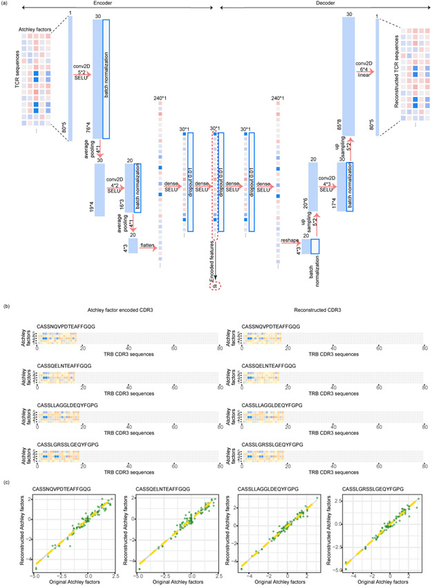

**Original caption:** Details of the stacked auto-encoder for TCR embedding. (a) The structure of the auto-encoder, with the configurations of each layer shown. (b) Typical examples of TCR CDR3b sequences, heatmaps of the initially embedded 'Atchley' matrices of TCRs, and heatmaps of the auto-encoder-reconstructed 'Atchley' matrices. The TCR sequence examples were not used in the training step of the auto-encoder. (c) Scatterplots showing the consistency between the 'Atchley factor' values of the original and re-constructed TCRs. Green points represent tiles in the heatmaps in (b).

**中文图注:** 用于TCR嵌入的堆叠自编码器详情。(a) 自编码器的结构，显示每层的配置。(b) TCR CDR3b序列的典型示例、TCR初始嵌入的"Atchley"矩阵热图以及自编码器重建的"Atchley"矩阵热图。TCR序列示例未用于自编码器的训练步骤。(c) 散点图显示原始和重建TCR的"Atchley因子"值之间的一致性。绿色点代表(b)中热图的方块。

---

### 扩展数据图2 | Extended Data Fig. 2. Scatterplots showing relationships between TCR distances and RNA expression level distances.

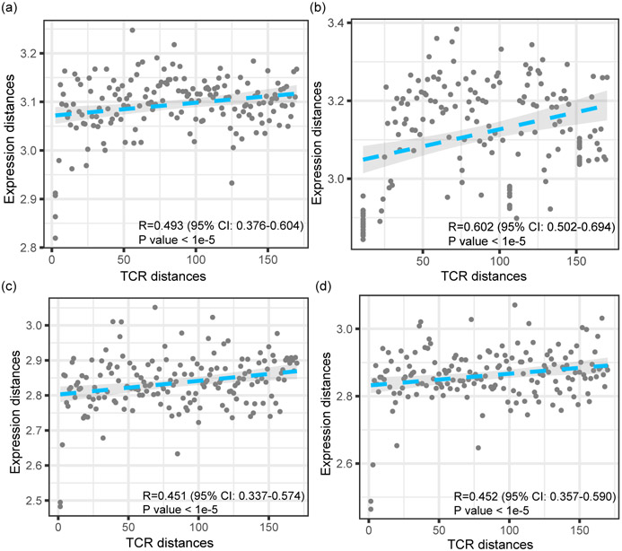

**Original caption:** Scatterplots showing the relationships between the distances of TCRs and the distances of RNA expression levels for several more datasets. Both distances are calculated in a pair-wise manner between all the T cell clonotypes of each dataset. Four example datasets are shown: Healthy-CD8-3 (a), Healthy-CD8-4 (b), Breast-1 (c), and Breast-2 (d) (Supplementary Table 1). The P values indicate the significance of the Pearson correlation coefficients. The shaded areas denote the 95% confidence intervals for linear regressions.

**中文图注:** 散点图显示多个数据集中TCR距离与RNA表达水平距离之间的关系。两种距离均以成对方式在每数据集的所有T细胞克隆型之间计算。显示了四个示例数据集：Healthy-CD8-3 (a)、Healthy-CD8-4 (b)、Breast-1 (c)和Breast-2 (d)（补充表1）。P值表示皮尔逊相关系数的显著性。阴影区域表示线性回归的95%置信区间。

---

### 扩展数据图3 | Extended Data Fig. 3. The weights of the TCR embeddings learned from tessa.

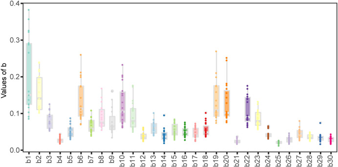

**Original caption:** The weights of the TCR embeddings learned from tessa. The X axis shows the digits of the 30-dimensional embeddings, and the Y axis shows the weights learned for all datasets. Each bar represents one digit of the weights and shows the values of that digit obtained from all the 19 scRNA datasets in the Supplementary Table 1.

**中文图注:** Tessa学习的TCR嵌入权重。X轴显示30维嵌入的位数，Y轴显示为所有数据集学习的权重。每个条形代表权重的一位数字，并显示从补充表1中所有19个scRNA数据集获得的该位数值。

---

### 扩展数据图4 | Extended Data Fig. 4. Benchmarking results using GLIPH.

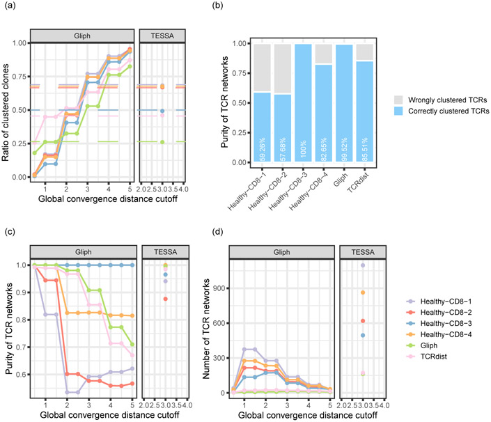

**Original caption:** Benchmarking results using GLIPH. (a) Clustering rates of the four Healthy-CD8 datasets from 10x Genomics, the Glanville dataset, and the Dash dataset under different global convergence distance cutoff ('gccutoff') values (Supplementary Table 1). The dashed lines represented the tessa clustering rates of the corresponding datasets. (b) Clustering purities of GLIPH when the 'gccutoff' equals to 3. The cutoff value was selected so that the GLIPH clusters achieved clustering rates that are most similar to the tessa networks. The clustering purities were calculated with the same method as in Fig. 2. (c, d) The GLIPH network purities (c) and number of networks (d) with different 'gccutoff' values, compared with the tessa network purities and the number of networks.

**中文图注:** 使用GLIPH的基准测试结果。(a) 四个10x Genomics Healthy-CD8数据集、Glanville数据集和Dash数据集在不同全局收敛距离阈值（'gccutoff'）值下的聚类率（补充表1）。虚线代表相应数据集的tessa聚类率。(b) 'gccutoff'等于3时GLIPH的聚类纯度。选择该阈值以使GLIPH簇的聚类率与tessa网络最相似。聚类纯度使用与图2相同的方法计算。(c, d) 不同'gccutoff'值下的GLIPH网络纯度(c)和网络数量(d)，与tessa网络纯度和网络数量进行比较。

---

### 扩展数据图5 | Extended Data Fig. 5. Antigen binding specificity clustering analysis.

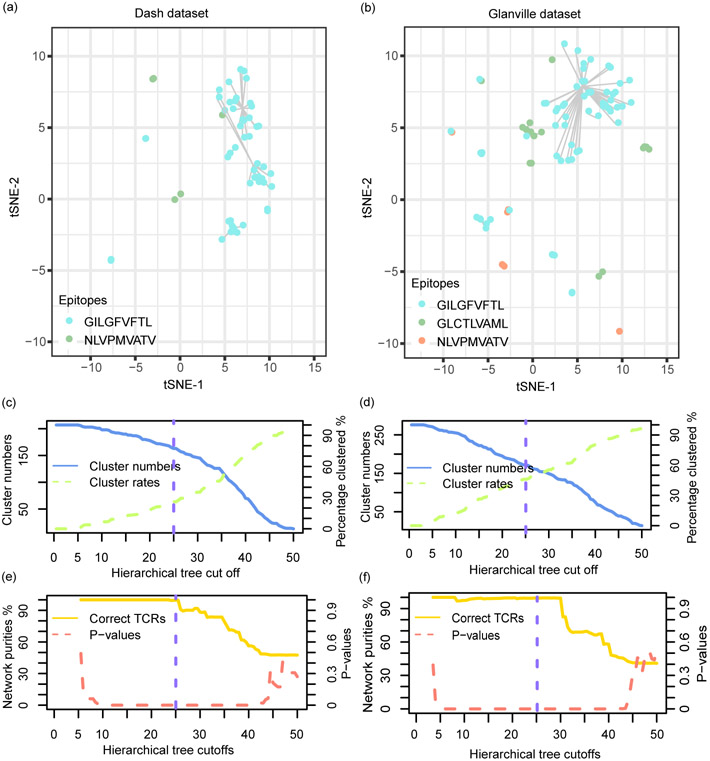

**Original caption:** The antigen binding specificity of 207 Human TCRβ chains from 704 T cells were profiled against two epitopes in the Dash dataset, and 276 TCRs from 415 T cells against three epitopes in the Glanville dataset. (a, b) T-SNE plots showing the TCR clonotypes in the space of the TCR embeddings, with the embeddings adjusted by the tessa-inferred weights. The hierarchical clustering tree cutoff used in the two plots was represented with green dashed lines in c-f. Each point in the plots represents one TCR clonotype, and the size of the point refers to the clone size. Points are colored by the true antigens that the corresponding TCRs target according to the original report. Points are connected if they are clustered into the same network based on hierarchical clustering of the TCR embeddings. T cell clones with only one cell were deemed as having low confidence and unclustered clones, which does not affect the calculation of the purities, were excluded from visualization. (c, d) The numbers of TCR networks and the clustering rates with different hierarchical tree cutoffs in the Dash dataset (c) and in the Glanville dataset (d). (e, f) The network purities and p-values testing the significance of the purities with different hierarchical tree cutoffs in the Dash dataset (c) and the Glanville dataset (d).

**中文图注:** 对来自704个T细胞的207个人TCRβ链（针对Dash数据集中的两个表位）和来自415个T细胞的276个TCR（针对Glanville数据集中的三个表位）进行了抗原结合特异性分析。(a, b) TCR嵌入空间中的TCR克隆型t-SNE图，嵌入由tessa推断的权重调整。两个图中使用的层次聚类树阈值在c-f中以绿色虚线表示。图中的每个点代表一个TCR克隆型，点的大小代表克隆大小。点的颜色根据原始报告中相应TCR靶向的真实抗原标记。如果基于TCR嵌入的层次聚类被聚类到同一网络，则点之间用线连接。仅有一个细胞的T细胞克隆被视为低置信度且未聚类的克隆，这些不影响纯度的计算，已从可视化中排除。(c, d) Dash数据集(c)和Glanville数据集(d)中不同层次树阈值下的TCR网络数量和聚类率。(e, f) Dash数据集(e)和Glanville数据集(f)中不同层次树阈值下的网络纯度和检验纯度显著性的P值。

---

### 扩展数据图6 | Extended Data Fig. 6. T cell pathway activity scores of different T cell subsets in the BCC dataset.

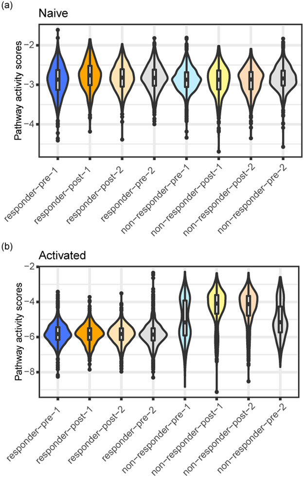

**Original caption:** T cell pathway activity scores of the different T cell subsets in the BCC dataset. The naive and activated pathways are shown, to be compared against the inhibition, memory and exhausted pathways shown in Fig. 3. The T cell subsets were the same as those in Fig. 3e - g.

**中文图注:** BCC数据集中不同T细胞亚群的T细胞通路活性评分。显示幼稚和激活通路，与图3中显示的抑制、记忆和耗竭通路进行比较。T细胞亚群与图3e-g中的相同。

---

### 扩展数据图7 | Extended Data Fig. 7. Pseudotime analysis of different T cell subsets in the BCC dataset.

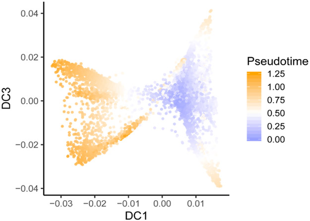

**Original caption:** Pseudotime analysis of the different T cell subsets in the BCC dataset. The T cell subsets were the same as those in Fig. 3e - g.

**中文图注:** BCC数据集中不同T细胞亚群的伪时间分析。T细胞亚群与图3e-g中的相同。

---

### 扩展数据图8 | Extended Data Fig. 8. Unexplained variance determination.

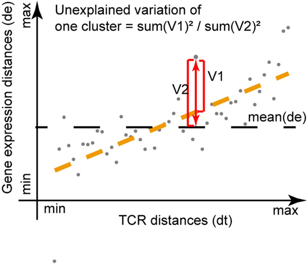

**Original caption:** A cartoon sketch shows how the unexplained variance in gene expression of the TCR networks were determined. Details were described in the Materials and Methods section.

**中文图注:** 示意图显示如何确定TCR网络基因表达中的未解释方差。详情在材料和方法部分描述。

---

## 补充材料 | Supplementary Material

1. **Supplementary Note 1** Detailed description of tessa, along with simulation and diagnostic analyses
2. **Supplementary Note 2** More bioinformatics analyses and discussion of tessa
   - [NIHMS1646561-supplement-1.pdf](https://pmc.ncbi.nlm.nih.gov/articles/instance/7799492/bin/NIHMS1646561-supplement-1.pdf) (1.7MB, pdf)

3. **Supplementary Table 1** Data cohorts and details.
   - [NIHMS1646561-supplement-2.docx](https://pmc.ncbi.nlm.nih.gov/articles/instance/7799492/bin/NIHMS1646561-supplement-2.docx) (10KB, docx)

4. **Supplementary Table 2** The genes in the T cell pathways used in this study.
   - [NIHMS1646561-supplement-3.xlsx](https://pmc.ncbi.nlm.nih.gov/articles/instance/7799492/bin/NIHMS1646561-supplement-3.xlsx) (24.4KB, xlsx)

---

## 术语表 | Terminology Table

| English | 中文 | Notes |
|---------|------|-------|
| TCR (T cell receptor) | T细胞受体 | |
| TCR repertoire | TCR库/TCR组库 | |
| scRNA-Seq | 单细胞RNA测序 | |
| clonotype | 克隆型 | 具有相同TCR序列的T细胞群体 |
| CDR3β | CDR3β链 | TCR的互补决定区3β链 |
| Atchley factors | Atchley因子 | 氨基酸的5个数值特征 |
| stacked auto-encoder | 堆叠自编码器 | 深度学习模型 |
| Dirichlet Process | 狄利克雷过程 | 贝叶斯非参数方法 |
| pMHC | 肽-MHC复合物 | |
| UMI (Unique Molecular Identifier) | 唯一分子标识符 | |
| t-SNE | t-SNE降维 | t分布随机邻域嵌入 |
| diffusion map | 扩散图 | 非线性降维方法 |
| pseudotime | 伪时间 | 单细胞轨迹分析 |
| BCC (basal cell carcinoma) | 基底细胞癌 | |
| CTCL (Cutaneous T-cell lymphoma) | 皮肤T细胞淋巴瘤 | |
| immune checkpoint inhibitor | 免疫检查点抑制剂 | |

---

## 阅读提示 | Critical Reading Notes

1. **核心贡献**: Tessa是首个将TCR序列与单细胞转录组学数据联合建模的贝叶斯工具，弥补了仅分析TCR序列的局限。

2. **方法创新**: 使用Atchley因子编码氨基酸 + 堆叠自编码器提取30维嵌入，再通过贝叶斯层次模型联合分析TCR与表达数据。

3. **关键发现**:
   - TCR相似性与T细胞表型相似性正相关（平均相关系数0.438）
   - 收敛性VDJ重排产生的TCR在抗原靶向效率上形成梯度
   - 免疫治疗后应答者的T细胞存在TCR依赖的"二分"现象
   - 肿瘤环境中TCR对T细胞功能的约束减弱

4. **局限性**:
   - 目前仅使用CDR3β链，未纳入CDR3α和V/J基因
   - 未考虑细胞因子/趋化因子等外部因素
   - 模型假设线性关系，可能简化了复杂的生物学过程

5. **数据**: 使用100,288个T细胞，覆盖19个数据集，7个健康样本和12个肿瘤样本，数据公开可用。

---

## 参考文献 | References

[^1]: Oettinger MA. V(D)J recombination: on the cutting edge. Curr. Opin. Cell Biol. 1999.
[^2]: Haskins K et al. The major histocompatibility complex-restricted antigen receptor on T cells. J. Exp. Med. 1983.
[^3]: Staveley-O'Carroll K et al. Induction of antigen-specific T cell anergy. Proc Natl Acad Sci USA. 1998.
[^4]: Skapenko A et al. The role of the T cell in autoimmune inflammation. Arthritis Res. Ther. 2005.
[^5]: Stubbington MJT et al. T cell fate and clonality inference from single-cell transcriptomes. Nat. Methods. 2016.
[^6]: Bolotin DA et al. Antigen receptor repertoire profiling from RNA-seq data. Nat. Biotechnol. 2017.
[^7]: Eltahla AA et al. Linking the T cell receptor to the single cell transcriptome. Immunol. Cell Biol. 2016.
[^8]: Glanville J et al. Identifying specificity groups in the T cell receptor repertoire. Nature. 2017.
[^9]: Dash P et al. Quantifiable predictive features define epitope-specific T cell receptor repertoires. Nature. 2017.
[^10]: Tubo NJ et al. Single naive CD4+ T cells from a diverse repertoire produce different effector cell types. Cell. 2013.
[^11]: Buchholz VR et al. Disparate individual fates compose robust CD8+ T cell immunity. Science. 2013.
[^12]: Picelli S et al. Full-length RNA-seq from single cells using Smart-seq2. Nat. Protoc. 2014.
[^13]: Sheng K et al. Effective detection of variation in single-cell transcriptomes using MATQ-seq. Nat. Methods. 2017.
[^14]: Mimitou EP et al. Multiplexed detection of proteins, transcriptomes, clonotypes and CRISPR perturbations. Nat. Methods. 2019.
[^15]: Atchley WR et al. Solving the protein sequence metric problem. Proc Natl Acad Sci USA. 2005.
[^16]: Modular learning in neural networks. Proc. AAAI. 1987.
[^17]: Ostmeyer J et al. Statistical classifiers for diagnosing disease from immune repertoires. BMC Bioinformatics. 2017.
[^18]: Zhang AW et al. Interfaces of malignant and immunologic clonal dynamics in ovarian cancer. Cell. 2018.
[^19]: Thorsson V et al. The immune landscape of cancer. Immunity. 2018.
[^20]: Wang T et al. An empirical approach leveraging tumorgrafts to dissect the tumor microenvironment in RCC. Cancer Discov. 2018.
[^21]: Tickotsky N et al. McPAS-TCR: a catalogue of pathology-associated TCR sequences. Bioinformatics. 2017.
[^22]: Guo X et al. Global characterization of T cells in NSCLC by single-cell sequencing. Nat. Med. 2018.
[^23]: Zhang L et al. Lineage tracking reveals dynamic relationships of T cells in colorectal cancer. Nature. 2018.
[^24]: Zheng C et al. Landscape of Infiltrating T Cells in Liver Cancer. Cell. 2017.
[^25]: Azizi E et al. Single-Cell Map of Diverse Immune Phenotypes in the Breast Tumor Microenvironment. Cell. 2018.
[^26]: Li H et al. Dysfunctional CD8 T Cells in Human Melanoma. Cell. 2019.
[^27]: Yost KE et al. Clonal replacement of tumor-specific T cells following PD-1 blockade. Nat. Med. 2019.
[^28]: Eduati F et al. Prediction of human population responses to toxic compounds. Nat. Biotechnol. 2015.
[^29]: Costello JC & Stolovitzky G. Seeking the wisdom of crowds. Clin. Pharmacol. Ther. 2013.
[^30]: Waugh KA et al. Molecular Profile of Tumor-Specific CD8+ T Cell Hypofunction. J. Immunol. 2016.
[^31]: Wu AA et al. Reprogramming the tumor microenvironment. Oncoimmunology. 2015.
[^32]: Burkholder B et al. Tumor-induced perturbations of cytokines. Biochim. Biophys. Acta. 2014.
[^33]: Conley JM et al. T Cells and Gene Regulation. Front. Immunol. 2016.
[^34]: Cho J-H et al. Unique features of naive CD8+ T cell activation by IL-2. J. Immunol. 2013.
[^35]: Iezzi G et al. The duration of antigenic stimulation determines T cell fate. Immunity. 1998.
[^36]: Moskophidis D et al. Virus persistence by exhaustion of antiviral cytotoxic effector T cells. Nature. 1993.
[^37]: Kalergis AM et al. Efficient T cell activation requires an optimal dwell-time. Nat. Immunol. 2001.
[^38]: Corse E et al. Attenuated T cell responses to a high-potency ligand in vivo. PLoS Biol. 2010.
[^39]: Mikolov T et al. Efficient Estimation of Word Representations in Vector Space. 2013.
[^40]: Zhang Z et al. SCINA: A Semi-Supervised Subtyping Algorithm. Genes. 2019.
[^41]: Zhang Z. jcao89757/TESSA. Zenodo. 2020. doi: 10.5281/zenodo.4161819
