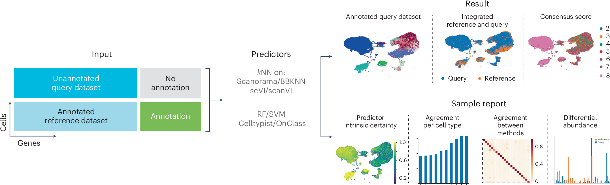
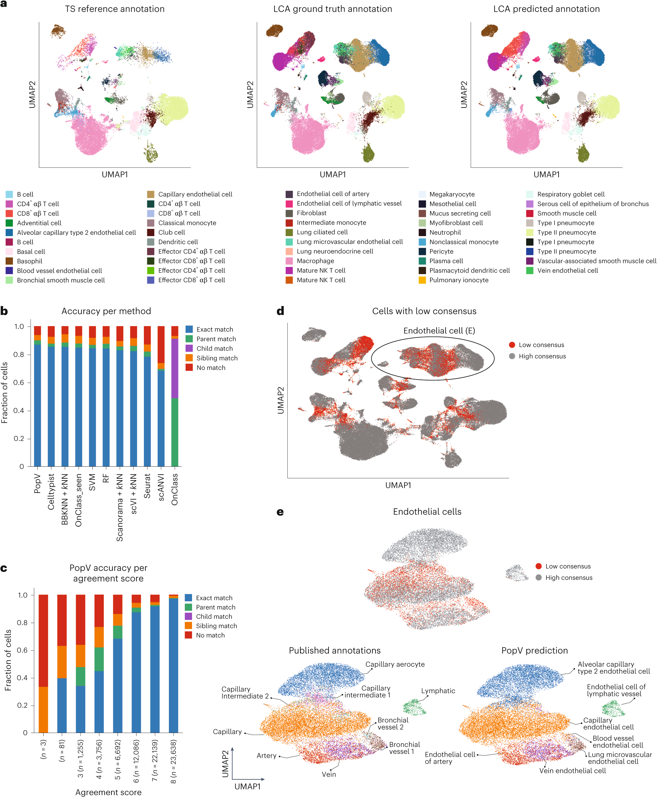
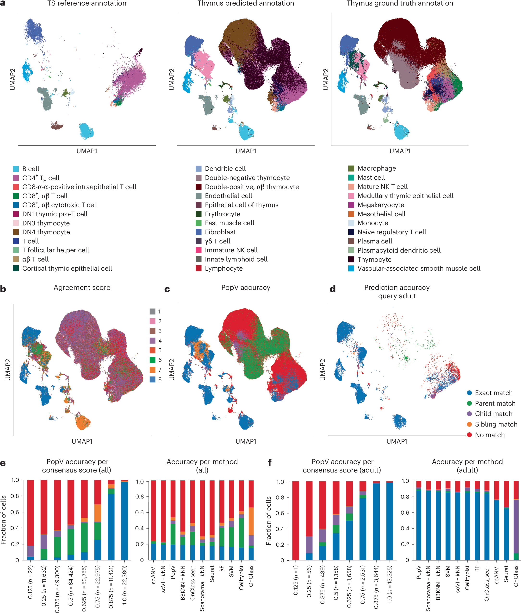

# popV: 单细胞数据中细胞类型标签的共识预测

## Consensus Prediction of Cell Type Labels in Single-Cell Data with popV

> Ergen C, Xing G, Jayasuriya M, Kim M, et al. *Nature Genetics* (2024)
> DOI: [10.1038/s41588-024-01993-3](https://doi.org/10.1038/s41588-024-01993-3)

---

## 📑 Section Index

| Section | Source Blocks |
|---------|--------------|
| [Abstract](#S001) | S001 |
| [Main (Introduction)](#S002) | S002–S005 |
| [Results: Overview of popV](#S006) | S006–S009, F001 |
| [Results: Prediction Score](#S010) | S010–S016, F002 |
| [Results: Drastic Composition Differences](#S017) | S017–S021, F003 |
| [Discussion](#S022) | S022–S024 |
| [Methods Highlights](#S025) | S025 |
| [Terminology](#terms) | — |
| [Reading Notes](#notes) | — |

---

## Abstract | 摘要

**Source:** p.1 S001

**Original:**

Cell-type classification is a crucial step in single-cell sequencing analysis. Various methods have been proposed for transferring a cell-type label from an annotated reference atlas to unannotated query datasets. Existing methods for transferring cell-type labels lack proper uncertainty estimation for the resulting annotations, limiting interpretability and usefulness. To address this, we propose popular Vote (popV), an ensemble of prediction models with an ontology-based voting scheme. PopV achieves accurate cell-type labeling and provides uncertainty scores. In multiple case studies, popV confidently annotates the majority of cells while highlighting cell populations that are challenging to annotate by label transfer. This additional step helps to reduce the load of manual inspection, which is often a necessary component of the annotation process, and enables one to focus on the most problematic parts of the annotation, streamlining the overall annotation process.

**中文:**

细胞类型分类是单细胞测序分析中的关键步骤。目前已有多类方法可以将细胞类型标签从已标注的参考图谱迁移到未标注的查询数据集。然而，现有的标签迁移方法缺乏对标注结果进行恰当的不确定性估计，这限制了其可解释性和实用性。为解决这一问题，我们提出了 popular Vote（popV）——一个基于本体论投票方案的集成预测模型。PopV 不仅能实现准确的细胞类型标注，还能提供不确定性评分。在多个案例研究中，popV 能够自信地标注大多数细胞，同时突出那些难以通过标签迁移进行标注的细胞群体。这一额外步骤有助于减少通常为标注流程必要组成部分的人工检查负担，使研究者能够聚焦于标注中最有问题的部分，从而简化整体标注流程。

---

## Main | 引言

**Source:** p.1 S002

**Original:**

Cell-type annotation is a crucial task in analyzing single-cell RNA sequencing (scRNA-seq) data. The quality of the annotations has a direct impact on downstream analyses such as the comparison of cell type composition as well as the analysis performed on a per-cell-type basis. Manual annotation is highly time-consuming and requires biological context-specific and sequencing technology-specific domain knowledge. Thus, as scRNA-seq becomes an increasingly standard lab technique, there is a growing need to generate automated annotations. We propose here the use of a collection of cell-type prediction models to provide not only automated annotations but also well-calibrated measures of uncertainty. This enables the user to streamline the annotation process.

**中文:**

细胞类型注释是分析单细胞 RNA 测序（scRNA-seq）数据中的关键任务。注释质量直接影响下游分析，如细胞类型组成的比较以及基于每种细胞类型的分析。人工注释非常耗时，且需要生物学背景特定和测序技术特定的领域知识。因此，随着 scRNA-seq 成为越来越标准的实验室技术，对自动化注释的需求日益增长。我们在此提出使用一组细胞类型预测模型，不仅提供自动化注释，还提供校准良好的不确定性度量。这使用户能够简化注释流程。

**Source:** p.1 S003

**Original:**

Automated cell type annotations encounter several challenges. There is no gold standard ground truth for cell type annotation within a specific dataset. Biology is complex, and when cell states vary continuously, delineations between cell types are imprecise, and even human experts may disagree on the exact phenotype of a specific cell. Therefore, it is essential that annotation methods highlight areas of uncertainty that require expert knowledge input. The continuous nature of cell states, along with stochasticity in the sequencing process, as well as the domain knowledge of the person manually annotating the dataset, can lead to cells being annotated at varying levels of specificity even within the same dataset. Across multiple datasets, factors, like identification of new cell subtypes or redefinition of marker genes, lead to discrepancies in cell type identification. There are a plethora of automated cell-type annotation methods. However, differences in cell type granularity, experiment-specific nuisance factors and technology-dependent sparsity of gene expression lead to no clear 'best method' for automatic annotation. Based on these factors, we propose that it is crucial for automatic cell-type annotation pipelines to highlight areas of uncertainty that may require manual scrutiny, balance the specificity of predictions with accuracy and be easily accessible and usable.

**中文:**

自动化细胞类型注释面临若干挑战。在特定数据集中，细胞类型注释没有金标准。生物学是复杂的，当细胞状态连续变化时，细胞类型之间的界限是不精确的，甚至人类专家也可能对特定细胞的确切表型存在分歧。因此，注释方法必须能够突出需要专家知识输入的不确定区域。细胞状态的连续性质，加上测序过程中的随机性，以及人工标注数据集的领域知识差异，可能导致即使在同一个数据集中，细胞也被以不同的特异性水平进行注释。跨多个数据集时，新细胞亚型的识别或标志基因的重新定义等因素会导致细胞类型鉴定存在差异。目前已有大量自动化细胞类型注释方法。然而，细胞类型粒度的差异、实验特定的 nuisance 因子以及技术依赖的基因表达稀疏性，导致没有明确的"最佳方法"用于自动注释。基于这些因素，我们认为自动细胞类型注释流程必须能够突出可能需要人工审查的不确定区域，平衡预测的特异性和准确性，并且易于访问和使用。

**Source:** p.2 S004

**Original:**

To address these challenges, we developed popular Vote (popV), a flexible and scalable automated cell-type annotation framework that takes in an unannotated query dataset from a scRNA-seq experiment, transfers labels from an annotated reference dataset and generates predictions with a predictability score indicating the confidence of the prediction. We pose here that various prediction methods will disagree in their prediction if an annotation is not accurate, whereas they will tend to agree if the predicted cell type is the correct one. We named our method popV because instead of relying on the predictions of a single classifier, popV takes a consensus approach and incorporates the predictions from eight automated annotation methods. PopV also takes into account annotations at different levels of granularity by aggregating results over the Cell Ontology, an expert-curated formalization of cell types in a hierarchical structure with a standardized vocabulary.

**中文:**

为应对这些挑战，我们开发了 popular Vote（popV），一个灵活且可扩展的自动化细胞类型注释框架。它接收来自 scRNA-seq 实验的未标注查询数据集，从已标注的参考数据集迁移标签，并生成带有可预测性评分（表示预测置信度）的预测结果。我们在此提出，当标注不准确时，不同的预测方法会在预测上产生分歧；而当预测的细胞类型正确时，它们往往会趋于一致。我们将方法命名为 popV，因为 popV 不是依赖单一分类器的预测，而是采用共识方法，整合了八种自动化注释方法的预测结果。PopV 还通过将结果在 Cell Ontology（细胞本体论）上聚合，考虑了不同粒度水平的注释。Cell Ontology 是专家策展的细胞类型形式化体系，具有层次化结构和标准化词汇。

**Source:** p.2 S005

**Original:**

PopV is available as an easy-to-install, open-source Python package and is designed to be a flexible framework for incorporating future cell-type classification methods. We provide a notebook that allows the prediction of new datasets and provides pretrained models for 20 different organs based on the Tabula Sapiens dataset.

**中文:**

PopV 以易于安装的开源 Python 包形式提供，并设计为灵活的框架，可整合未来的细胞类型分类方法。我们提供 Notebook 以支持对新数据集进行预测，并提供了基于 Tabula Sapiens 数据集的 20 种不同器官的预训练模型。

---

## Results | 结果

### Overview of popV | popV 概述

**Source:** p.2 S006

**Original:**

PopV takes a consensus of experts' approach to the task of automated cell type annotation. The input is an unannotated query dataset together with an annotated reference dataset (Fig. 1a). Both datasets are expected to contain raw count data and demonstrate that popV can be applied to unique molecular identifier as well as non-unique molecular identifier-based technologies. PopV then runs the following eight different annotation methods: random forest (RF), support vector machine (SVM), scANVI, OnClass, Celltypist and *k*-nearest neighbors (*k*NN) after batch correction with three single-cell harmonization methods—scVI, BBKNN and Scanorama (Fig. 1). The eight prediction algorithms were chosen because they were shown to have good prediction accuracy and/or good harmonization performances. These methods encompass supervised methods that are trained only on labeled data (RF, SVM, OnClass, Celltypist and *k*NN) after applying unsupervised harmonization methods that are agnostic to label information during training (BBKNN, Scanorama and scVI) and a semi-supervised method trained with both labeled and unlabeled data (scANVI). However, we emphasize that popV offers an intuitive application interface (API) for the rapid inclusion of additional annotation methods. We demonstrate this capability through a code snippet for adding a new classifier (*k*NN after batch correction with Harmony) in the Methods.

**中文:**

PopV 采用"专家共识"的方法来进行自动化细胞类型注释。输入为未标注的查询数据集和已标注的参考数据集（图 1a）。两个数据集都应包含原始计数数据，并且证明 popV 可应用于基于 UMI 和非 UMI 的技术。PopV 随后运行以下八种不同的注释方法：随机森林（RF）、支持向量机（SVM）、scANVI、OnClass、Celltypist，以及经三种单细胞整合方法（scVI、BBKNN 和 Scanorama）批次校正后的 *k* 近邻（*k*NN）分类器（图 1）。这八种预测算法的选择基于其良好的预测准确性和/或整合性能。这些方法涵盖：仅在标注数据上训练的监督方法（RF、SVM、OnClass、Celltypist 和 *k*NN，其中 *k*NN 基于无监督整合方法的嵌入）、训练时对标签信息无感知的无监督整合方法（BBKNN、Scanorama 和 scVI），以及使用标注和未标注数据共同训练的半监督方法（scANVI）。但我们强调 popV 提供了直观的 API 以快速添加新的注释方法。我们通过在 Methods 中提供添加新分类器（Harmony 批次校正后的 *k*NN）的代码片段来展示这一能力。

### Fig. 1: Framework of popV for automatic cell type annotation

**Placed near:** p.2 S006
**Source:** p.2 Fig. 1

**Original caption:** Fig. 1: Framework of popV for automatic cell type annotation.

**中文图注:** 图 1: popV 用于自动细胞类型注释的框架。

**Reading note:** The figure shows the popV pipeline: reference atlas + query dataset → 8 parallel annotation methods (RF, SVM, scANVI, OnClass, Celltypist, kNN+scVI, kNN+BBKNN, kNN+Scanorama) → Cell Ontology-based voting → consensus annotation + uncertainty score. The 8 methods span supervised, semi-supervised, and unsupervised integration-based approaches.

---

**Source:** p.3 S007

**Original:**

After applying each of these methods separately, popV proceeds to aggregate the resulting predictions for two purposes (Extended Data Fig. 1). The first is to designate a single 'consensus' annotation for every query cell. The second purpose is to quantify our certainty in this prediction. We estimate the consensus annotation using a simple majority vote procedure, counting for each annotation label the number of algorithms that support it. In this procedure, all algorithms get a single 'vote', except for OnClass, which received several votes. The reason for that is that OnClass is the only method in our collection of methods that is capable of predicting cell types that do not exist in the reference dataset. It does so through a two-step process—first selecting an annotation out of the collection of labels in the reference dataset and then propagating it to identify a potentially more refined label in the Cell Ontology (even if this label is absent from the reference). To account for these 'out of sample' cell type annotations, we consider every label that is on the path from the root of the ontology down to the OnClass-predicted label as a predicted label (Extended Data Fig. 1). We then perform majority voting with OnClass having multiple 'votes' at different levels of hierarchy. We have attempted using a simple majority vote with the 'within sample' annotation from the first stage of OnClass and with no propagation along the Cell Ontology. In most of our analyses, we found our first strategy to outperform the simple strategy (Supplementary Fig. 1).

**中文:**

在分别应用每种方法后，popV 为两个目的聚合所得的预测（扩展数据图 1）。第一是为每个查询细胞指定一个单一的"共识"注释；第二是量化我们对该预测的确定性。我们使用简单的多数投票程序来估计共识注释，统计每个注释标签获得多少种算法的支持。在此过程中，除 OnClass 外所有算法各获得一票。OnClass 获得多票的原因在于：它是我们方法集合中唯一能够预测参考数据集中不存在的细胞类型的工具。它通过两步过程实现——首先从参考数据集中的标签集合中选择一个注释，然后沿 Cell Ontology 传播，以识别可能在 Ontology 中更精细的标签（即使该标签在参考数据中不存在）。为处理这些"样本外"的细胞类型注释，我们将从 Ontology 根节点到 OnClass 预测标签路径上的每个标签都计为预测标签（扩展数据图 1）。然后我们进行多数投票，OnClass 在层次结构的不同层级上获得多个"投票"。我们还尝试了使用 OnClass 第一阶段（即仅限于参考数据集中存在的标签）的"样本内"注释进行简单多数投票，且不沿 Cell Ontology 传播。在大多数分析中，我们发现第一种策略优于简单策略（补充图 1）。

**Source:** p.3 S008

**Original:**

A potentially useful property of many of the algorithms included in popV is an 'algorithm-intrinsic' estimation of prediction certainty. This could, in principle, be leveraged to compute a weighted consensus. However, we found that the certainties are calibrated differently for the different methods, which makes this approach futile as it will weigh more on the predictions of classifiers with higher estimated certainties.

After calculating the consensus score, popV generates a sample report that includes prediction summaries as well as integrated views of the query and reference datasets. For the latter, it displays Uniform Manifold Approximation and Projections (UMAPs) for the joint visualization of the reference and query datasets for the four methods that perform data integration (Fig. 1), as well as a bar plot comparing cell type frequencies in the reference and query dataset to highlight the differential abundance of various cell types. One set of summaries in the report is confusion matrices between the consensus predictions and each individual method to indicate which cell types were confused with another cell type for any particular method. The report also includes a per-cell-type display of the consensus score (that is, the number of agreeing methods—between 1 and 8) to highlight which cell types are overall difficult to predict. Complementing this 'algorithm-extrinsic' estimation of certainty, we also output the intrinsic uncertainty (that is, classifier score) of each of the eight methods (these scores are defined in the Methods). We emphasize that intrinsic and extrinsic uncertainty are two complementary measurements essential to quantifying the performance of a set of cell annotation tools.

**中文:**

PopV 中包含的许多算法的一个潜在有用特性是"算法内在"的预测确定性估计。原则上，这可用于计算加权共识。然而，我们发现不同方法的确定性校准方式不同，使得这种方法徒劳无功——因为它会偏向于具有更高估计确定性的分类器的预测。

计算共识分数后，popV 生成样本报告，包括预测摘要以及查询和参考数据集的整合视图。对于后者，它展示四种执行数据整合的方法的 UMAP 可视化（图 1），以及比较参考和查询数据集中细胞类型频率的条形图，以突出各种细胞类型的差异丰度。报告中的一组摘要包含共识预测与各单独方法之间的混淆矩阵，以指示在特定方法下哪些细胞类型被混淆。报告还包括按细胞类型显示的共识分数（即一致同意的算法数量，范围 1-8），以突出哪些细胞类型整体难以预测。作为这种"算法外在"确定性估计的补充，我们还输出八种方法中每种方法的内在不确定性（即分类器分数，在 Methods 中定义）。我们强调内在和外在不确定性是量化学注释工具性能的两个互补度量。

**Source:** p.3 S009

**Original:**

To allow for fast annotation of new query datasets, we provide pretrained models for all 20 organs present in Tabula Sapiens. Pretraining is possible for all methods except Scanorama and BBKNN, which compute a joint embedding of reference and query datasets and make pretraining infeasible. For scVI and scANVI, we provide pretrained embeddings of the reference dataset and map the query dataset to this embedding using scArches. PopV has the following three different modes of cell type prediction: in retrain mode, all classifiers are trained from scratch, which requires an hour for 100k cells in a Google Colab session; in inference mode, models previously trained for the reference dataset are used where applicable, which requires 30 min for 100k cells; in fast mode, only pretrained models are used and only cell types in the query dataset are predicted, which requires 5 min for 100k query cells. PopV is available as an open-source Python project and includes an online Google Colab notebook with free computing resources. The codebase enables the addition of new reference datasets (in addition to Tabula Sapiens) through a simple API and can be invoked from the same notebook environment. We recommend that in any newly added reference datasets, the annotations should be consistent with Cell Ontology, either by matching terms in the ontology or by hierarchically assigning new terms to existing terms in the ontology. To this end, we provide scripts to add custom cell type labels to the Cell Ontology before processing by popV (where it is used for running OnClass and calculating our consensus scores).

**中文:**

为快速注释新的查询数据集，我们提供了 Tabula Sapiens 中所有 20 个器官的预训练模型。除 Scanorama 和 BBKNN 外，所有方法都可以预训练——这两种方法计算参考和查询数据集的联合嵌入，使预训练不可行。对于 scVI 和 scANVI，我们提供参考数据集的预训练嵌入，并使用 scArches 将查询数据集映射到该嵌入。PopV 具有以下三种不同的细胞类型预测模式：**retrain 模式**——所有分类器从头训练，处理 100k 细胞在 Google Colab session 中约需 1 小时；**inference 模式**——在适用情况下使用先前为参考数据集训练的模型，处理 100k 细胞约需 30 分钟；**fast 模式**——仅使用预训练模型，仅预测查询数据集中的细胞类型，处理 100k 查询细胞约需 5 分钟。PopV 以开源 Python 项目形式提供，并包含在线 Google Colab notebook（免费计算资源）。代码库支持通过简单的 API 添加新的参考数据集（除 Tabula Sapiens 外），并可在同一 notebook 环境中调用。我们建议在任何新添加的参考数据集中，注释应与 Cell Ontology 保持一致——通过匹配 ontology 中的术语，或通过将新术语层次化地分配到 ontology 中的现有术语。为此，我们提供脚本以在 popV 处理之前将自定义细胞类型标签添加到 Cell Ontology（用于运行 OnClass 和计算共识分数）。

---

### PopV prediction score discriminates high- and low-quality annotations | PopV 预测分数区分高质量和低质量注释

**Source:** p.4 S010

**Original:**

We evaluated the performance of cell-type annotation using popV with a Human Lung Cell Atlas as the query dataset and the lung tissue of Tabula Sapiens as a reference dataset. The Lung Cell Atlas is carefully annotated to a high level of granularity. It contains a wide variety of cell types across immune cells, epithelial cells, endothelial cells and stromal cells and is therefore well suited for studying tissues with diverse labels. To make the labels comparable across both datasets, we translated the Lung Cell Atlas labels to the corresponding terms in the Cell Ontology (Supplementary Fig. 2).

**中文:**

我们以人类肺细胞图谱（Human Lung Cell Atlas）为查询数据集、Tabula Sapiens 的肺组织为参考数据集，评估了 popV 的细胞类型注释性能。Lung Cell Atlas 经过精细注释，具有高粒度水平，包含免疫细胞、上皮细胞、内皮细胞和基质细胞等多种细胞类型，非常适合研究具有多样化标签的组织。为在两个数据集之间实现标签可比性，我们将 Lung Cell Atlas 的标签映射到 Cell Ontology 中的对应术语（补充图 2）。

**Source:** p.4 S011

**Original:**

PopV achieves high accuracy on the Lung Cell Atlas. We visualize the popV predictions against the manual annotations in the Lung Cell Atlas and see a strong agreement between the prediction and the original annotation, as well as a good integration between the query and the reference cells (Fig. 2a). We decided here to use scANVI integration as it showed the highest performance in scIB metrics, which measure data integration and biological conservation (Extended Data Fig. 2a). To evaluate the quality of our predictions, we compute accuracy terms based on the Cell Ontology tree (Methods). An exact match, as the name implies, means that the predicted cell type is exactly the same as the manual annotation. Furthermore, intuitively, a prediction algorithm that predicts one cell type as another similar cell type performs better than a prediction algorithm that predicts the cell is of an unrelated type. The parent match, child match and sibling match take this into account and measure if the predicted cell type is the parent, child or sibling in the Cell Ontology tree compared to the ground truth annotation. This measure is especially useful if a cell type label exists only in the query and not in the reference dataset. Every prediction that did not match any of these relationships was classified as no match. PopV overall achieves high accuracy for most cell types (Fig. 2b and Extended Data Fig. 2c). Except for scANVI and OnClass, all methods have comparable performance in this dataset. Furthermore, we compared the performance of popV with the label transfer provided in Seurat, which is another popular tool for cell type annotation transfer, and found that Seurat performs worse than most methods used in popV. We also included OnClass predictions after step one (OnClass_seen), where OnClass only predicts cell types that were present in the reference dataset, and found this to perform similarly to the good-performing annotation tools, so that the lower performance of OnClass here is solely due to the prediction of unseen cell types. Overall, popV performed best for the number of exact matches and was comparable in the number of cells with no match, highlighting that the popV prediction is more accurate than any of the single methods.

**中文:**

PopV 在 Lung Cell Atlas 上实现了高准确性。我们将 popV 预测结果与 Lung Cell Atlas 中的人工注释进行可视化比较，发现预测与原始注释之间有很强的一致性，查询细胞与参考细胞之间也有良好的整合（图 2a）。我们选择使用 scANVI 整合，因为它在 scIB 指标（衡量数据整合和生物学保守性）中表现最佳（扩展数据图 2a）。为评估预测质量，我们基于 Cell Ontology 树计算准确性术语（Methods）。**Exact match**（精确匹配）顾名思义，表示预测的细胞类型与人工注释完全相同。此外，直觉上，将一个细胞类型预测为另一个相似细胞类型的算法，优于将其预测为不相关类型的算法。**Parent match**（父匹配）、**child match**（子匹配）和 **sibling match**（兄弟匹配）考虑了这一点，衡量预测的细胞类型是与真实注释在 Cell Ontology 树中的父节点、子节点还是兄弟节点。这个度量在细胞类型标签仅存在于查询数据集而不在参考数据集中时特别有用。不满足任何这些关系的预测被归类为 **no match**（无匹配）。PopV 在大多数细胞类型上实现了高准确率（图 2b 和扩展数据图 2c）。除 scANVI 和 OnClass 外，所有方法在该数据集中表现相当。我们还将 popV 与 Seurat（另一种流行的细胞类型注释迁移工具）的标签迁移进行了比较，发现 Seurat 的性能低于 popV 中使用的大多数方法。我们还包含了 OnClass 第一阶段预测（OnClass_seen，仅预测参考数据集中存在的细胞类型），发现其性能与表现良好的注释工具相似，因此 OnClass 在这里较低的性能完全是由于其预测了未见过的细胞类型。总体而言，popV 在精确匹配数量上表现最佳，在无匹配细胞数量上与其他方法相当，突出表明 popV 预测比任何单一方法都更准确。

### Fig. 2: PopV prediction on LCA and TS lung as reference

**Placed near:** p.4 S012
**Source:** p.4 Fig. 2

**Original caption:** Fig. 2: PopV prediction on LCA and TS lung as reference is accurate and interpretable.

**中文图注:** 图 2: 以 LCA 为查询、TS 肺为参考的 popV 预测是准确且可解释的。

**Reading note:** Panel a shows UMAP integration; panel b shows accuracy per cell type; panel c shows the critical finding: consensus score ≥6 → >90% accuracy, score = 8 → 98% accuracy; panels d-e show three reasons for low consensus scores with endothelial cell example.

---

**Source:** p.4 S012

**Original:**

When checking the popV prediction scores, we found that the accuracy of the prediction is highly correlated with the prediction score (Fig. 2c). For scores of 6 and higher, we found that more than 90% of the annotations were exact matches with the ground truth. For scores of 8, which is a perfect agreement between all methods, 98% of the predictions were exact matches. For scores of 3 and lower, the prediction accuracy was lower than 50%, highlighting that the popV consensus score is a valuable metric to reflect the classification accuracy and points to groups of cells that should be further (and manually) scrutinized.

**中文:**

当检查 popV 预测分数时，我们发现预测准确性与预测分数高度相关（图 2c）。对于分数 ≥6，超过 90% 的注释与真实标签精确匹配；对于分数 = 8（所有方法完全一致），98% 的预测为精确匹配；对于分数 ≤3，预测准确率低于 50%。这强有力地表明 popV 共识分数是反映分类准确性的宝贵指标，并能指出需要进一步（人工）审查的细胞群体。

**Source:** p.5 S013

**Original:**

When considering cells that were assigned with a low consensus score, we found three possible reasons that may explain the disagreement between the different methods (Fig. 2d). The first is that the distinction between certain cell subsets with different labels is unclear. This often arises in cases of a continuum of cell states with no clear decision boundary in transcriptome space. In such cases, the boundaries determined by different algorithms may vary (because they depend on different objectives or techniques), leading to low consistency. It is, however, exactly those cases that merit closer (and often manual) inspection and—if needed—assignment of multiple optional labels. As an example, we found several areas of low consensus score in the various lung endothelial cells (Fig. 2e). Most endothelial cells with a low consensus score arise between capillary endothelial cells and alveolar capillary type 2 endothelial cells. In this region, the various algorithms disagree on the correct boundary, but all algorithms predict those cells with either of those labels. We found that alveolar capillary type 2 endothelial cells express *EDNRB* and *HPGD*, and capillary endothelial cells express *FCN3* and *IL7R*. Cells between both cell types are double positive in both markers, while they do not show any specific marker gene. Therefore, we conclude that neither the term capillary endothelial cell nor the term alveolar capillary type 2 endothelial cell is adequate to describe these cells, but their phenotype is between both cell types. Thus, it is a region that requires manual scrutiny to determine the correct label of those cells. In fact, such scrutiny was applied in the original annotation of the Lung Cell Atlas—annotations not provided to popV—which labeled these cells as capillary intermediates 1 and 2. Therefore, this example demonstrates that a low consensus score can help identify areas that require a refined label, possibly extending the vocabulary available in the reference atlas.

**中文:**

在分析被分配低共识分数的细胞时，我们发现三个可能的原因来解释不同方法之间的分歧（图 2d）。**第一个原因是特定细胞亚群之间的区分不明确。** 这通常出现在细胞状态连续、在转录组空间中没有明确决策边界的情况下。在这种情况下，不同算法确定的边界可能不同（因为它们依赖于不同的目标函数或技术），导致一致性低。然而，正是这些情况值得更仔细的（通常是人工的）检查，并在需要时分配多个可选标签。例如，我们在多种肺内皮细胞中发现了低共识分数的区域（图 2e）。大多数低共识分数的内皮细胞出现在毛细血管内皮细胞和肺泡毛细血管 2 型内皮细胞之间。在该区域，各种算法在正确边界上存在分歧，但所有算法都将这些细胞预测为这两种标签之一。我们发现肺泡毛细血管 2 型内皮细胞表达 *EDNRB* 和 *HPGD*，毛细血管内皮细胞表达 *FCN3* 和 *IL7R*。处于两种细胞类型之间的细胞在两种标志物上均呈双阳性，同时不显示任何特异性标志基因。因此，我们认为毛细血管内皮细胞和肺泡毛细血管 2 型内皮细胞这两个术语都不足以描述这些细胞，它们的表型介于两种细胞类型之间。这表明该区域需要人工审查以确定这些细胞的正确标签。事实上，Lung Cell Atlas 的原始注释（未提供给 popV）中确实进行了这种审查，将这些细胞标记为 capillary intermediates 1 和 2。因此，这个例子说明低共识分数可以帮助识别需要精细标签的区域，从而可能扩展参考图谱中的词汇范围。

**Source:** p.5 S014

**Original:**

The second reason for a low consensus score in this case study occurs when the query dataset contains subsets of cells that are absent from the reference atlas. As an example, while the Lung Cell Atlas (which we use as the query) includes a subset of endothelial cells that were originally labeled bronchial vessel 2, this subset (and its respective label) seems to be absent from our reference atlas. Indeed, when checking marker genes for these cells, their expression was high in *PLVAP* and low in the vein endothelial marker *ACKR1* (Supplementary Fig. 4), which can be interpreted as an intermediate stage between capillary endothelial cells (negative for both markers) and lung microvascular endothelial cells (positive for both markers). This combination of marker gene expression was not observed in Tabula Sapiens and therefore marks a cell type not present in the reference dataset.

**中文:**

**第二个原因是查询数据集中包含参考图谱中不存在的细胞亚群。** 例如，Lung Cell Atlas（用作查询）包含一个最初标记为 bronchial vessel 2 的内皮细胞亚群，该亚群（及其标签）似乎在参考图谱中不存在。检查这些细胞的标志基因表达发现，它们高表达 *PLVAP*，低表达静脉内皮标志物 *ACKR1*（补充图 4），这可以解释为毛细血管内皮细胞（两种标志物均阴性）和肺微血管内皮细胞（两种标志物均阳性）之间的中间状态。Tabula Sapiens 中未观察到这种标志物基因表达组合，因此标记了参考数据集中不存在的细胞类型。

**Source:** p.5 S015

**Original:**

The third possible reason we find for the low consensus is inaccuracy in the reference annotation. As an example, we found a subset of T cells with a low consensus score (Extended Data Fig. 3). All cells of this group in the query dataset were originally labeled (by the authors of the Lung Cell Atlas) as effector CD4⁺ αβ T cells, while similar cells originating from the Tabula Sapiens reference were labeled as a mixture of CD4 and CD8 T cells. Consequently, most algorithms in popV labeled this low consensus group as a mix of CD4 and CD8 T cells with different decision boundaries. Manually following up on this low-scoring group, we checked the marker gene *CD8A* and found a clear decision boundary that distinguishes the CD4⁺ (TH) and CD8⁺ (cytotoxic) subsets in a manner consistent with the (hidden) query annotation. Despite this clear delineation, we found that many CD8⁻ cells are labeled in the reference atlas as CD8⁺ T cells. A low consensus score in this group of cells helped to identify wrongly annotated cells in the reference dataset, and we highlight that manual scrutiny can clean up these wrong labels.

**中文:**

**第三个原因是参考标注的不准确性。** 例如，我们发现一个 T 细胞亚群具有低共识分数（扩展数据图 3）。查询数据集中的这一组细胞最初（由 Lung Cell Atlas 的作者）标注为 effector CD4⁺ αβ T 细胞，而 Tabula Sapiens 参考中相似的细胞则被标注为 CD4 和 CD8 T 细胞的混合。因此，popV 中的大多数算法将这个低共识组标注为 CD4 和 CD8 T 细胞的混合，具有不同的决策边界。人工跟进这个低分群体，我们检查了标志基因 *CD8A*，发现了一个清晰的决策边界来区分 CD4⁺（TH）和 CD8⁺（细胞毒性）亚群，与（隐藏的）查询标注一致。尽管有这种清晰的区分，我们发现参考图谱中许多 CD8⁻ 细胞被标注为 CD8⁺ T 细胞。这一组细胞的低共识分数帮助识别了参考数据集中错误标注的细胞，我们强调人工审查可以清理这些错误标签。

**Source:** p.6 S016

**Original:**

PopV uses a diverse set of underlying classifiers. The heuristic is that including methods with varying bias allows us to detect uncertain predictions. We studied whether distinct classifiers are essential by comparing popV against majority voting between eight different SVM algorithms with different kernels and cost parameters. We find the popV consensus score to better correlate with accuracy than this simplified algorithm (Extended Data Fig. 4a,b,d). Indeed, we find higher diversity in the predicted cell-type labels in the predictors underlying popV and find no pair of predictors with a Hamming similarity above 0.9 (Extended Data Fig. 4c). While popV highlighted problems with annotating different subsets of T cells, majority voting after SVM shows high uncertainty for cells predicted to be natural killer (NK) cells. However, for these cells, we found marker gene expression that aligns with those cells being NK cells highlighting an accurate prediction by popV. Taking together, using a diverse set of algorithms enables popV to highlight cell types with wrongly predicted labels, while a more simplified algorithm using only predictors based on SVM does not provide a calibrated classifier.

**中文:**

PopV 使用多样化的基础分类器。其启发式思想是：纳入具有不同偏差的方法使我们能够检测不确定的预测。我们通过将 popV 与八种不同 SVM 算法（不同的核函数和成本参数）之间的多数投票进行比较，研究了不同分类器是否必不可少。我们发现 popV 共识分数与准确性的相关性优于这种简化算法（扩展数据图 4a,b,d）。实际上，我们发现 popV 中各预测器之间的预测标签多样性更高，且没有一对预测器的 Hamming 相似度超过 0.9（扩展数据图 4c）。PopV 能突出标注不同 T 细胞亚群的问题，而 SVM 后的多数投票显示对预测为 NK 细胞的细胞具有高度不确定性。然而，对于这些细胞，我们发现标志基因表达与 NK 细胞身份一致，表明 popV 预测是准确的。总之，使用多样化的算法使 popV 能够突出具有错误预测标签的细胞类型，而仅使用基于 SVM 的预测器的简化算法则不能提供校准良好的分类器。

---

### PopV provides useful label transfer in case of drastic differences in cellular composition | PopV 在细胞组成巨大差异的情况下提供有用的标签迁移

**Source:** p.6 S017

**Original:**

After highlighting that popV is capable of detecting query-specific cells and that the consensus score is capable of highlighting these cells, we studied whether this can also be achieved when we have very different query and reference datasets. To this end, we studied the annotation of thymus cells using Tabula Sapiens as a reference dataset and a second study, which profiled thymi from different age groups (fetal, childhood, adolescence and adulthood) as query (Supplementary Fig. 5). In particular, the thymus undergoes involution with age, and the adult thymus, which we use here as reference, does not accurately represent the structure and function of the thymus in younger individuals. In particular, we anticipate that the reference sample will not provide ample representation of the developing T cell population, which is prevalent in our query data.

**中文:**

在证明了 popV 能够检测查询特异性细胞且共识分数能够突出这些细胞后，我们研究了当查询和参考数据集差异很大时是否也能实现这一点。为此，我们以 Tabula Sapiens 为参考数据集，以另一项研究（对不同年龄组——胎儿、儿童、青少年和成人的胸腺进行了分析）作为查询，研究了胸腺细胞的注释（补充图 5）。特别地，胸腺随年龄增长而退化（involution），我们用作参考的成人胸腺不能准确代表年轻个体的胸腺结构和功能。我们预期参考样本将不能充分代表发育中的 T 细胞群体，而这在查询数据中普遍存在。

### Fig. 3: PopV identifies thymocytes as query-specific cell types

**Placed near:** p.6 S018
**Source:** p.6 Fig. 3

**Original caption:** Fig. 3: PopV identifies thymocytes as query-specific cell types and yields highly interpretable consensus scores.

**中文图注:** 图 3: PopV 识别胸腺细胞为查询特异性细胞类型，并产生高度可解释的共识分数。

**Reading note:** Panel a shows UMAP integration highlighting query-specific thymocyte subsets; panels b-c show consensus score vs accuracy; panels d-f show that adult thymus cells (well-represented in reference) have high scores/accuracy while fetal thymocytes (absent from reference) have low scores.

---

**Source:** p.6 S018

**Original:**

UMAP embedding of the two harmonized datasets clearly highlights the subsets of query cells that are represented in the reference dataset, while as expected by the age of the donors in the Tabula Sapiens project, the compartments of thymocytes and developing T cells are almost absent from the reference dataset (Fig. 3a and Supplementary Fig. 6). Indeed, we find a high consensus score and accuracy in regions well represented in the reference dataset, while the consensus score for query-specific cell types is lower (Fig. 3b,c). We find a high prediction accuracy for query cells from the adult thymus that are similar to the cells from the reference dataset (Fig. 3d and Supplementary Fig. 7). Reassuringly, popV assigned low consensus scores to the majority of cells from compartments that are absent in adult humans, highlighting them for manual annotation (Fig. 3e and Extended Data Fig. 5), while for cells isolated from an adult thymus, we overall find very high accuracy across all algorithms and a high consensus score with popV outperforming the single methods in accuracy (Fig. 3f and Supplementary Fig. 8). We found for the underlying algorithms that their internal certainties do not correlate well with the accuracy and find a lower area under the precision–recall curve for these algorithms compared to popV (Extended Data Fig. 6 and Supplementary Fig. 9).

**中文:**

两个整合数据集的 UMAP 嵌入清晰地突出了在参考数据集中有代表的查询细胞亚群，而正如 Tabula Sapiens 项目捐赠者年龄所预期的，胸腺细胞（thymocytes）和发育中 T 细胞的 compartment 在参考数据集中几乎不存在（图 3a 和补充图 6）。确实，在参考数据集中有良好代表的区域，我们发现了高共识分数和准确性，而查询特异性细胞类型的共识分数较低（图 3b,c）。对于来自成人胸腺且与参考数据集细胞相似的查询细胞，我们发现预测准确性高（图 3d 和补充图 7）。令人欣慰的是，popV 对来自成人中不存在的细胞 compartment 的大部分细胞分配了低共识分数，将其标记出来以供人工注释（图 3e 和扩展数据图 5）；而对于从成人胸腺分离的细胞，我们总体发现所有算法都具有很高的准确性，且 popV 具有高共识分数，在准确性上优于单一方法（图 3f 和补充图 8）。我们发现基础算法的内部确定性与准确性的相关性不佳，并且与 popV 相比，这些算法的精确率-召回率曲线下面积更低（扩展数据图 6 和补充图 9）。

**Source:** p.7 S019

**Original:**

We identified two other cell populations that are underrepresented in Tabula Sapiens compared to the query dataset, which are cortical thymic epithelial cells (also associated with involution) and plasmacytoid dendritic cells. Similarly to our previous examples, we find that the consensus score associated with cortical epithelial cells is indeed low, with a variety of annotations assigned to these cells by the different algorithms, including fibroblasts and medullary epithelial cells (Supplementary Fig. 10). The low consensus score suggests that manual curation of this group of cells is needed. In this case, the manual assignment of the correct out-of-reference label is relatively straightforward using *PSMB11*, an established marker of cortical thymic epithelial cells that is not expressed in any cell-type in the Tabula Sapiens reference.

For plasmacytoid dendritic cells, all algorithms except Scanorama + *k*NN predicted that those cells are B cells or plasma cells. Scanorama + *k*NN predicted that those cells are dendritic cells. Even OnClass, which can predict cells not present in the reference dataset, predicted those cells as antibody-secreting cells or lymphocytes of B lineage, with not a single cell correctly predicted as a plasmacytoid dendritic cell. However, these query cells expressed high levels of *CLEC4C* and *IL3RA* and were therefore correctly labeled as plasmacytoid dendritic cells. As two-thirds of plasmacytoid dendritic cells have a score of 5 or lower, manual identification of these cells is possible, and the user can identify those confidently wrongly annotated cells using these marker genes.

**中文:**

我们识别了两个在 Tabula Sapiens 中相对于查询数据集代表性不足的细胞群体：**皮质胸腺上皮细胞**（cortical thymic epithelial cells，也与退化相关）和**浆细胞样树突状细胞**（plasmacytoid dendritic cells, pDC）。与之前的例子类似，我们发现皮质上皮细胞的共识分数确实很低，不同算法分配给这些细胞的注释多种多样，包括成纤维细胞和髓质上皮细胞（补充图 10）。低共识分数提示需要人工策展这一细胞群体。在这种情况下，使用 *PSMB11*（皮质胸腺上皮细胞的已确立标志物，在 Tabula Sapiens 参考中的任何细胞类型中均不表达）来手动分配正确的参考外标签相对直接。

对于浆细胞样树突状细胞，除 Scanorama + *k*NN 外的所有算法都预测这些细胞为 B 细胞或浆细胞。Scanorama + *k*NN 预测这些细胞为树突状细胞。即使是能够预测参考数据集中不存在的细胞类型的 OnClass，也将其预测为抗体分泌细胞或 B 系淋巴细胞，没有一个细胞被正确预测为 pDC。然而，这些查询细胞高表达 *CLEC4C* 和 *IL3RA*，因此应被正确标注为 pDC。由于三分之二的 pDC 得分为 5 或更低，人工识别这些细胞是可行的，用户可以使用这些标志基因来识别那些被自信地错误标注的细胞。

**Source:** p.7 S020

**Original:**

The only cell fraction that had a high consensus score but low accuracy is a group of cells labeled as endothelial cells by popV, while annotated as lymphocytes in the original (hidden) annotation of the query dataset. However, these cells express *CAVIN2*, *TFPI*, which fits well with an annotation as endothelial cells. We found that their gene expression aligns well with lymphatic endothelial cells. Therefore, it suggests a wrong annotation in the query dataset and a correct prediction by popV.

Creating consensus cell-type labels across different sequencing technologies is important with the advent of large integration efforts. We applied popV to this scenario by transferring labels from the Lung Cell Atlas (Fig. 2) to two lung datasets, one sequenced using Drop-seq technology and the other using nuclei sequencing. We find an accurate transfer of labels for both datasets (Extended Data Fig. 7). The popV consensus score again provides a metric that was better correlated with accuracy compared to the intrinsic certainty metrics of the underlying algorithms (Supplementary Figs. 11–14). Thus, it allows detecting cells that require manual scrutiny in these more challenging scenarios.

**中文:**

唯一具有高共识分数但准确性低的细胞群体是 popV 标注为内皮细胞的一组细胞，而查询数据集的原始（隐藏）标注将其注释为淋巴细胞。然而，这些细胞表达 *CAVIN2* 和 *TFPI*，这与内皮细胞的注释非常吻合。我们发现它们的基因表达与淋巴内皮细胞高度一致。因此，这提示查询数据集中存在错误标注，而 popV 的预测是正确的。

随着大规模整合工作的出现，跨不同测序技术创建共识细胞类型标签变得重要。我们将 popV 应用于这一场景，将 Lung Cell Atlas（图 2）的标签迁移到两个肺数据集——一个使用 Drop-seq 技术测序，另一个使用核测序（nuclei sequencing）。我们发现两个数据集的标签迁移都准确（扩展数据图 7）。与基础算法的内在确定性度量相比，popV 共识分数再次提供了与准确性相关性更好的度量（补充图 11-14）。因此，它使得在这些更具挑战性的场景中能够检测需要人工审查的细胞。

**Source:** p.7 S021

**Original:**

PopV relies on using a Cell Ontology to aggregate votes across the ontology. For some reference datasets, cells are not annotated according to an existing Cell Ontology. We therefore tested the impact when no matching ontology is provided. For this case, we disable the use of OnClass, which requires an ontology (Supplementary Note and Extended Data Fig. 8). We find popV to perform well in this scenario. Additionally, this dataset allowed us to study the effect of different cell-type granularities on cell-type prediction. The prediction score highlights high granularity annotations as less confidently transferred and thereby requiring more manual scrutiny to perform annotation at this very fine level.

Finally, we performed ablation studies to test whether algorithms can be removed from popV while maintaining accurate and well-interpretable results (Extended Data Fig. 9). After dropping three of the eight algorithms, we found that the accuracy remains stable in the tested cases. However, we find a decrease in the ability to distinguish predictions with low accuracy. We, therefore, conclude that the number of algorithms is essential to be able to highlight low-confidence predictions.

**中文:**

PopV 依赖 Cell Ontology 在 ontology 上聚合投票。对于一些参考数据集，细胞并非根据现有的 Cell Ontology 进行注释。因此，我们测试了在没有匹配 ontology 时的影响。在这种情况下，我们禁用了需要 ontology 的 OnClass（补充说明和扩展数据图 8）。我们发现 popV 在此场景下表现良好。此外，该数据集使我们能够研究不同细胞类型粒度对细胞类型预测的影响。预测分数表明，高粒度注释的信心较低，因此需要更多人工审查才能在这个精细水平上进行注释。

最后，我们进行了**消融研究**，测试在保持准确和可解释结果的前提下，是否可以从 popV 中移除部分算法（扩展数据图 9）。在移除八种算法中的三种后，我们发现准确性在测试案例中保持稳定。然而，区分低准确性预测的能力有所下降。因此，我们得出结论：算法的数量对于能够突出低置信度预测至关重要。

---

## Discussion | 讨论

**Source:** p.8 S022

**Original:**

We have developed popV, an ensemble method for cell type annotation, to yield an interpretable certainty quantification for the task of cell type annotation. We have demonstrated throughout this manuscript that in various scenarios with different sequencing technologies, various cell type resolutions and various overlaps of reference and query datasets, popV yields a confidence score that is well correlated with the actual accuracy of cell type transfer. We demonstrated that the prediction score can predict cell types that are specific to the query dataset (middle temporal gyrus (MTG)-specific neurons), incorrectly annotated in the reference (CD4 T cell subsets in Tabula Sapiens) or in the query dataset (lymphatic endothelial cells in the thymus) or cell types that are not annotated in the reference dataset while present in both datasets (lung intermediate capillary endothelial cells in Tabula Sapiens).

**中文:**

我们开发了 popV，一种用于细胞类型注释的集成方法，为细胞类型注释任务提供可解释的确定性量化。我们在整篇文章中证明了，在不同测序技术、不同细胞类型分辨率和不同参考-查询数据集重叠度的多种场景下，popV 产生的置信度分数与细胞类型迁移的实际准确性高度相关。我们证明预测分数能够识别：查询数据集特有的细胞类型（MTG 特异性神经元）、参考中错误标注的细胞类型（Tabula Sapiens 中的 CD4 T 细胞亚群）、查询数据集中错误标注的细胞类型（胸腺中的淋巴内皮细胞），以及虽在两个数据集中都存在但未在参考数据集中标注的细胞类型（Tabula Sapiens 中的肺中间毛细血管内皮细胞）。

**Source:** p.8 S023

**Original:**

PopV is implemented as an easy-to-install, open-source Python tool. The codebase is designed so that adding additional cell type classification algorithms is straightforward, thereby allowing researchers to mitigate the risk of choosing a single algorithm (that is, circumvent the no 'one size fits all' problem). We expect future annotation tools to be developed and popV to be used as a tool to handle various biases in these tools and to help quantify certainty in automatic prediction. As an example, upon user request, we included Harmony + *k*NN, which was not part of the initial release and therefore not used throughout the manuscript, as a classification model and found popV's flexible framework to be straightforward in implementing new predictors.

**中文:**

PopV 以易于安装的开源 Python 工具形式实现。代码库设计使得添加额外的细胞类型分类算法非常简单，从而使研究人员能够规避选择单一算法的风险（即避免"一刀切"的问题）。我们预计未来会有新的注释工具被开发出来，而 popV 将作为处理这些工具中各种偏差并帮助量化自动化预测确定性的工具。例如，应使用户要求，我们在初始版本发布后纳入了 Harmony + *k*NN（未在原稿中使用的版本）作为分类模型，发现 popV 的灵活框架使实现新预测器变得非常直接。

**Source:** p.8 S024

**Original:**

PopV's performance is limited by the performance of the underlying predictors. We showed throughout the manuscript that overall popV performed equally well as the single-best method in terms of accuracy. However, the aim of popV is not to improve the accuracy of cell-type annotation over the single predictors but to yield a metric of certainty that is easy to interpret and well-calibrated. In fact, we found that algorithm-intrinsic certainties tend to be poorly correlated with the accuracy of cell-type annotation. While single methods provide similar calibration as popV, no other method provides throughout all case studies similar performance. Other methods therefore provide no reliable calibration. This is also reflected in a recent study that highlights the low calibration of conventional tools for cell-type transfer. Conversely, we demonstrated that the popV consensus score is highly associated with accuracy and that it helps identify cases where manual involvement is required. A future focus in the development of cell-type annotation tools will be on providing better internal certainty measurements. Including these algorithms in popV will provide even more interpretable results for label transfer, as, for example, in the case of several algorithms having low internal certainty but agreeing on the most probable label. Label transfer enables harmonizing cell-type annotations across different datasets and streamlines data analysis. However, we recommend validating the transferred labels by checking the expression of canonical marker genes because cell-type label transfer can fail. For example, for plasmacytoid dendritic cells in the thymus dataset, for which the corresponding cell type was missing from the reference dataset, these cells were incorrectly annotated as B cells.

**中文:**

PopV 的性能受限于基础预测器的性能。我们在整篇文章中证明，popV 总体上的准确性与单一最佳方法相当。但 popV 的目标不是提高细胞类型注释的准确性使之超过单一预测器，而是提供一个易于解释且校准良好的确定性度量。事实上，我们发现算法内在的确定性与细胞类型注释的准确性往往相关性不佳。虽然单一方法可以提供与 popV 类似的校准，但没有任何其他方法能在所有案例研究中提供类似的性能。因此，其他方法不能提供可靠的校准。这也反映在最近一项强调传统细胞类型迁移工具校准不良的研究中。相比之下，我们证明 popV 共识分数与准确性高度相关，有助于识别需要人工介入的情况。细胞类型注释工具开发的未来重点将是提供更好的内部确定性测量。将这些算法纳入 popV 将为标签迁移提供更可解释的结果——例如，在多种算法内部确定性都低但对最可能标签意见一致的情况下。标签迁移可以协调不同数据集的细胞类型注释并简化数据分析。然而，我们建议通过检查经典标志基因的表达来验证迁移的标签，因为细胞类型标签迁移可能失败。例如，对于胸腺数据集中的浆细胞样树突状细胞（其对应的细胞类型在参考数据集中缺失），这些细胞被错误地标注为 B 细胞。

---

## Methods Highlights | 方法要点

**Source:** p.9–12 Methods

**Original:**

PopV is a Python package available via PyPI. Further details at [https://github.com/YosefLab/popV](https://github.com/YosefLab/popV).

**Key datasets:**
- **Tabula Sapiens** (reference): 483,152 cells, 20 organs, 58,559 genes — downloaded from CELLxGENE
- **Lung Cell Atlas** (query): 75,071 cells, 39 unique cell types
- **Thymus dataset** (query): 255,901 cells, from fetal to adult
- **Brain dataset**: MTG vs M1G cortical regions
- **Cross-technology**: Drop-seq (Schiller 2020) and nuclei-seq (Sun 2020)

**Eight methods with key parameters:**
1. **RF**: max_features=200, class_weight=balanced_subsample
2. **SVM**: LinearSVC, C=1, max_iter=5000, class_weight=balanced
3. **scANVI**: n_layers=3, dropout=0.1, batch_size=512, n_samples_per_label=20
4. **OnClass**: Cell Ontology OBO v2023-01-09, SentenceTransformer('all-mpnet-base-v2')
5. **Celltypist**: max_iter=500, majority_voting=True
6. **kNN + scVI**: scVI (dropout=0.05, n_layers=3, n_latent=20) + KNeighborsClassifier(n_neighbors=15)
7. **kNN + BBKNN**: 50 PCs, 8 neighbors_within_batch, angular metric
8. **kNN + Scanorama**: 50 PCs, mutual nearest neighbors

**Preprocessing**: Process_Query → subset to 300 labeled cells by default → intersect genes → remove batches <9 cells → HVG selection (seurat_v3, 4000 genes) → normalize to 10K → log1p → PCA for BBKNN/Scanorama

**Three modes**: retrain (1hr/100k), inference (30min/100k), fast (5min/100k)

**Consensus voting**: Majority vote + OnClass ontology propagation (path from root to predicted label)

**中文:**

PopV 是通过 PyPI 提供的 Python 包。详情见 [https://github.com/YosefLab/popV](https://github.com/YosefLab/popV)。

**关键数据集：**
- **Tabula Sapiens**（参考）：483,152 细胞，20 器官，58,559 基因——从 CELLxGENE 下载
- **Lung Cell Atlas**（查询）：75,071 细胞，39 种独特细胞类型
- **胸腺数据集**（查询）：255,901 细胞，从胎儿到成人
- **脑数据集**：MTG vs M1G 皮层区域
- **跨技术**：Drop-seq（Schiller 2020）和核测序（Sun 2020）

**八种方法及关键参数：**
1. **RF**：max_features=200, class_weight=balanced_subsample
2. **SVM**：LinearSVC, C=1, max_iter=5000, class_weight=balanced
3. **scANVI**：n_layers=3, dropout=0.1, batch_size=512, n_samples_per_label=20
4. **OnClass**：Cell Ontology OBO v2023-01-09, SentenceTransformer('all-mpnet-base-v2')
5. **Celltypist**：max_iter=500, majority_voting=True
6. **kNN + scVI**：scVI (dropout=0.05, n_layers=3, n_latent=20) + KNeighborsClassifier(n_neighbors=15)
7. **kNN + BBKNN**：50 PCs, 8 neighbors_within_batch, angular metric
8. **kNN + Scanorama**：50 PCs, mutual nearest neighbors

**预处理**：Process_Query → 默认下采样到 300 标记细胞 → 基因交集 → 移除 <9 细胞的批次 → HVG 选择（seurat_v3, 4000 基因）→ 归一化到 10K → log1p → PCA（用于 BBKNN/Scanorama）

**三种模式**：retrain（1hr/100k）、inference（30min/100k）、fast（5min/100k）

**共识投票**：多数投票 + OnClass ontology 传播（从根到预测标签的路径）

---

## Terminology | 术语表

| English | 中文 | Notes |
|---------|------|-------|
| cell-type annotation | 细胞类型注释 | 核心任务 |
| label transfer | 标签迁移 | 从参考到查询 |
| consensus score | 共识分数 | popV 核心指标 (1–8) |
| uncertainty estimation | 不确定性估计 | 关键贡献 |
| Cell Ontology | 细胞本体论 | 层次化细胞类型体系 |
| query dataset | 查询数据集 | 待标注数据 |
| reference atlas | 参考图谱 | 已标注数据 |
| majority voting | 多数投票 | 集成策略 |
| ablation study | 消融研究 | 方法学验证 |
| exact match | 精确匹配 | Cell Ontology 精度指标 |
| batch correction | 批次校正 | scRNA-seq 标准流程 |
| highly variable genes (HVGs) | 高变基因 | 特征选择 |
| precision–recall curve | 精确率-召回率曲线 | 校准评估 |
| scArches | scArches | 查询映射到参考嵌入工具 |

---

## 阅读提示 | Reading Notes

### 核心贡献

1. **集成方法（Ensemble）设计**：PopV 是首个将 8 种异质性细胞类型注释方法系统集成并输出不确定性度量的框架。关键洞察是——不同算法对同一细胞的一致性程度直接反映了注释置信度。

2. **Cell Ontology 投票机制**：通过 OnClass 沿 Cell Ontology 传播投票，使得 popV 能够：(a) 预测参考中不存在的细胞类型；(b) 在不同粒度水平上聚合共识；(c) 提供基于 ontology 的精确度指标（exact/parent/child/sibling match）。

3. **不确定性校准**：核心发现是算法内在确定性（intrinsic certainty）校准不良（不同方法尺度不同），但算法外在的 consensus score（1-8）与准确性高度相关：≥6 → >90%, =8 → 98%。

### 三种低共识原因（重要）

| 原因 | 实例 | 含义 |
|------|------|------|
| 连续细胞状态 | 肺毛细血管内皮细胞中间态 | 需要更精细的标签 |
| 查询特有细胞 | 胸腺中胎儿特有胸腺细胞 | 参考图谱需要扩展 |
| 参考标注错误 | Tabula Sapiens 中 CD8⁻标为 CD8⁺ | 参考图谱需要清洁 |

### 实用性

- **三种计算模式**：retrain (1hr) → inference (30min) → fast (5min)，适应不同场景
- **GPU 强烈推荐**：所有实验在 NVIDIA 3090 上完成
- **可扩展性**：简单 API 可添加新分类器（已示例 Harmony + kNN）
- **可用性**：Google Colab notebook + 预训练模型（20 器官）

### 与项目（TCRCellNet）的关联

PopV 与 UCell（Andreatta & Carmona 2021）同属 Yosef Lab 生态——UCell 提供基因签名评分，popV 提供细胞类型注释。两者都是 Scanpy 生态中的轻量级工具，可与 TCR 分析流程整合。

### 局限

- 性能受限于基础预测器
- OnClass 需要 Cell Ontology→无 ontology 时降级为简单多数投票
- Scanorama + kNN 在大数据集上扩展性不佳（>2M cells 需禁用）
- 核心目标是校准而非提高准确性

---

*Generated: 2026-05-18 | Paper DOI: [10.1038/s41588-024-01993-3](https://doi.org/10.1038/s41588-024-01993-3) | License: CC-BY-NC-ND 4.0*
