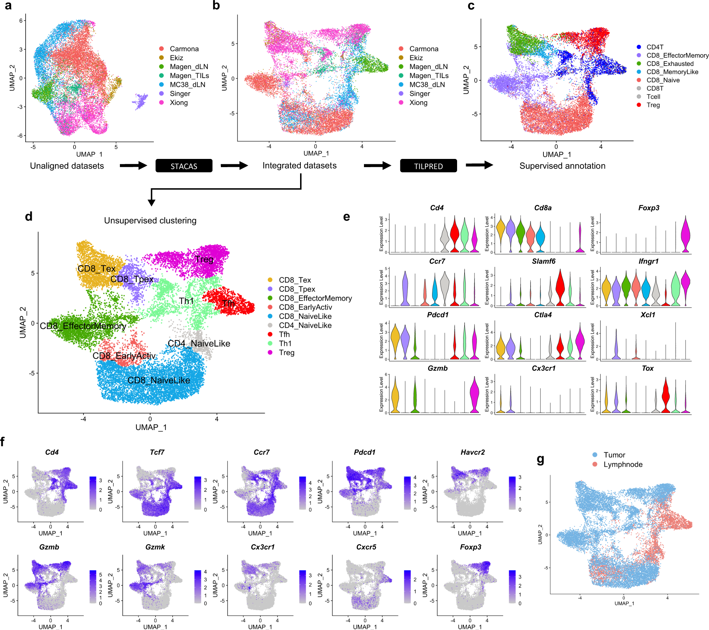
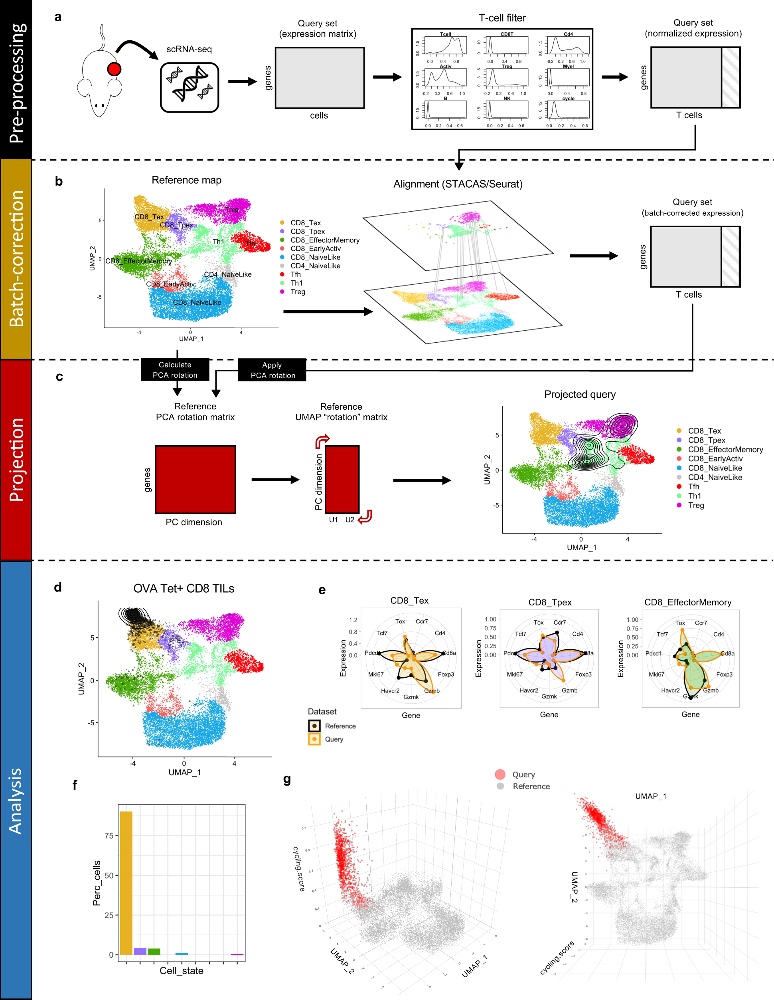
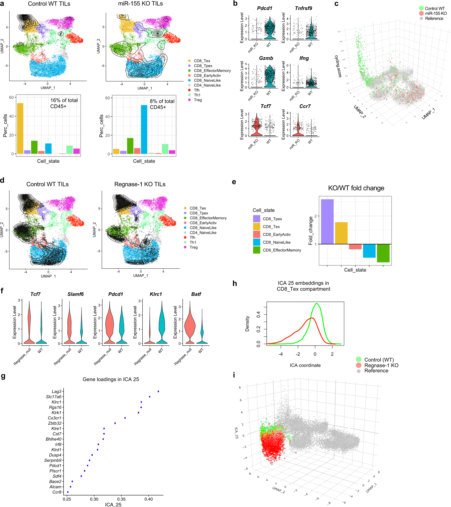
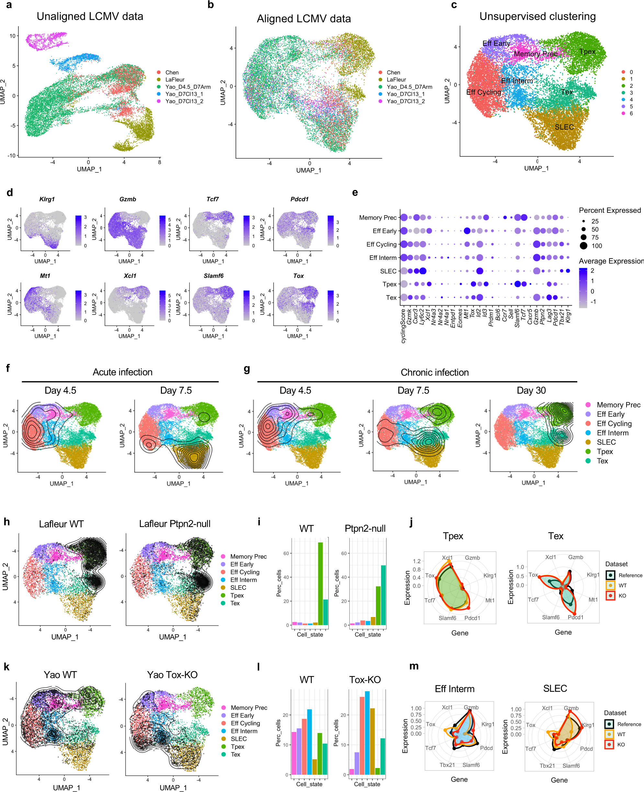
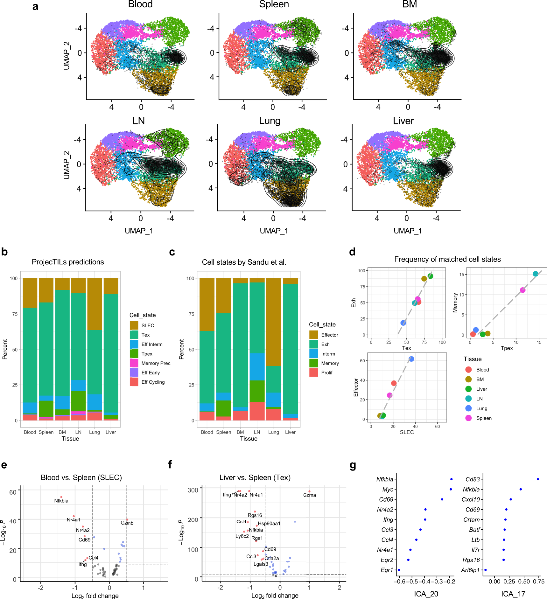
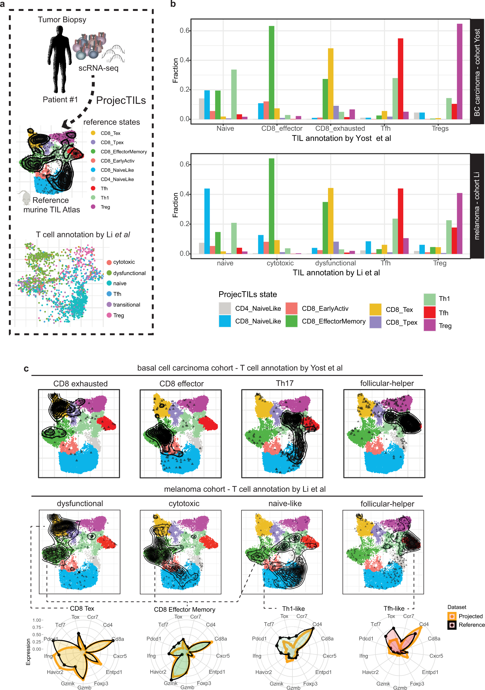
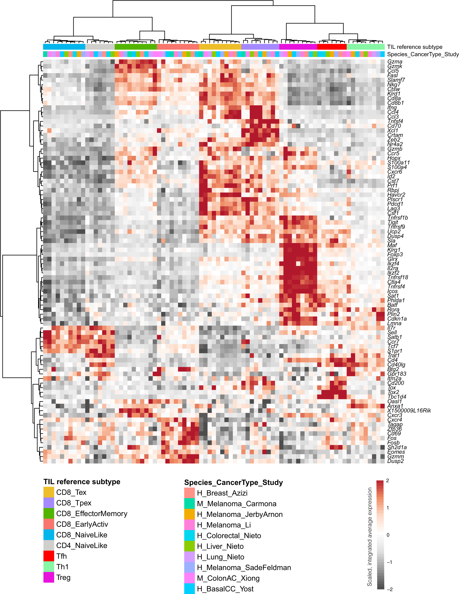
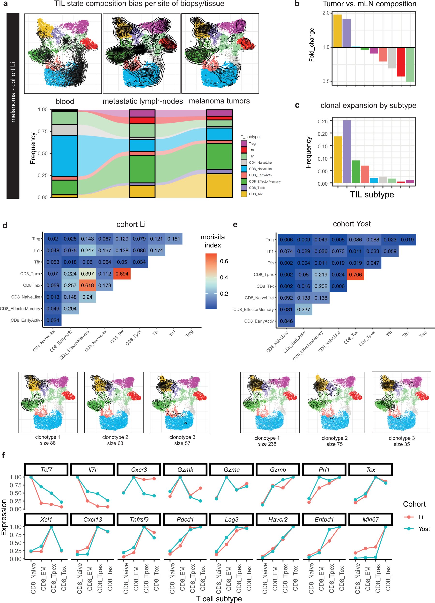
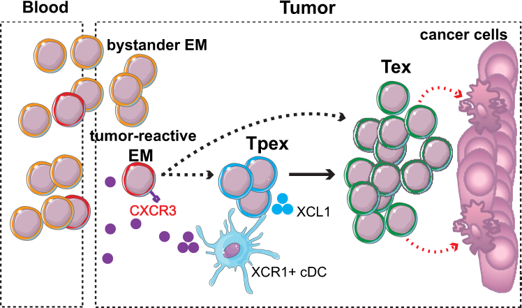

# 参考图谱解读单细胞转录组中的 T 细胞状态

> **Interpretation of T cell states from single-cell transcriptomics data using reference atlases**

---

## 阅读导航 (Reading Guide)

### 章节索引

| Section | Blocks | 
|---------|--------|
| Abstract | S001 |
| Introduction | S002–S005 |
| Results: TIL Reference Atlas | S006–S007 |
| Results: ProjecTILs Workflow | S008–S009 |
| Results: Perturbation Analysis | S010–S012 |
| Results: Infection Atlas | S013–S015 |
| Results: Tissue-specific | S016 |
| Results: Cross-species | S017–S019 |
| Results: Human TIL Differentiation | S020–S022 |
| Discussion | S023–S027 |

### 核心概念

| 概念 | 说明 |
|------|------|
| **ProjecTILs** | 将新 scRNA-seq 数据投影到参考图谱的算法 |
| **STACAS** | 亚型锚点校正的 scRNA-seq 整合算法 |
| **参考图谱投影** | 将 query 数据嵌入参考 UMAP/PCA 空间而不改变参考结构 |
| **ICA 判别分析** | 独立成分分析识别扰动下的差异基因程序 |
| **TIL 9 亚型** | naive-like (CD4/CD8), EM, early-activation, Tex, Tpex, Th1, Tfh, Treg |
| **跨物种保守性** | 小鼠→人直系同源基因投影揭示 TIL 亚型高度保守 |

---

**Source:** p.1 S001 — Abstract

**Original:**

Single-cell RNA sequencing (scRNA-seq) has revealed an unprecedented degree of immune cell diversity. However, consistent definition of cell subtypes and cell states across studies and diseases remains a major challenge. Here we generate reference T cell atlases for cancer and viral infection by multi-study integration, and develop ProjecTILs, an algorithm for reference atlas projection. In contrast to other methods, ProjecTILs allows not only accurate embedding of new scRNA-seq data into a reference without altering its structure, but also characterizing previously unknown cell states that "deviate" from the reference. ProjecTILs accurately predicts the effects of cell perturbations and identifies gene programs that are altered in different conditions and tissues. A meta-analysis of tumor-infiltrating T cells from several cohorts reveals a strong conservation of T cell subtypes between human and mouse, providing a consistent basis to describe T cell heterogeneity across studies, diseases, and species.

**中文：**

单细胞 RNA 测序（scRNA-seq）揭示了前所未有的免疫细胞多样性。然而，跨研究和疾病间一致定义细胞亚型和细胞状态仍是一个重大挑战。本文通过多研究整合生成了癌症和病毒感染的参考 T 细胞图谱，并开发了 ProjecTILs——一种参考图谱投影算法。与其他方法不同，ProjecTILs 不仅可以准确地将新 scRNA-seq 数据嵌入参考图谱而不改变其结构，还可以表征"偏离"参考的先前未知细胞状态。ProjecTILs 准确预测了细胞扰动的影响，并识别了在不同条件和组织中发生改变的基因程序。对多个队列肿瘤浸润 T 细胞的荟萃分析揭示了人与小鼠之间 T 细胞亚型的强保守性，为跨研究、疾病和物种描述 T 细胞异质性提供了基础。

---

## Introduction / 引言

**Source:** p.1 S002

**Original:**

In response to malignant cells and pathogens, mammals mount an adaptive immune response characterized by a finely-tuned balance of several specialized T cell subtypes with distinct migratory and functional properties and metabolic lifestyles. Occasionally, however, malignant cells and pathogens escape immune control, leading to cancer and chronic infections. Antigen persistence in cancer and chronic infections profoundly alters T cell differentiation and function, leading antigen-specific cells into a collection of transcriptional and epigenetic states commonly referred to as "exhausted". The complexity and plasticity of T cells make the study of adaptive immune responses in these contexts particularly challenging.

**中文：**

在应对恶性细胞和病原体时，哺乳动物产生适应性免疫应答，其特征是多种具有不同迁移和功能特性及代谢方式的特化 T 细胞亚型之间精细调控的平衡。然而，恶性细胞和病原体有时会逃避免疫控制，导致癌症和慢性感染。癌症和慢性感染中的抗原持续存在深刻改变 T 细胞分化和功能，将抗原特异性细胞引导至通常称为"耗竭"的转录和表观遗传状态集合。T 细胞的复杂性和可塑性使得在这些背景下研究适应性免疫应答尤为具有挑战性。

**Source:** p.1 S003

**Original:**

In recent years, single-cell RNA-sequencing enabled unbiased exploration of T cell diversity in health, disease and response to therapies at an unprecedented scale and resolution. However, a comprehensive definition of T cell "reference" subtypes remains elusive. Poor resolution of T cell heterogeneity remains a limiting factor towards understanding the effect of induced perturbations, such as therapeutic checkpoint blockade and genetic editing.

**中文：**

近年来，单细胞 RNA 测序以前所未有的规模和分辨率实现了对健康、疾病和治疗应答中 T 细胞多样性的无偏探索。然而，T 细胞"参考"亚型的全面定义仍然难以实现。T 细胞异质性的低分辨率仍然是理解诱导性扰动（如治疗性检查点阻断和基因编辑）效应的限制因素。

**Source:** p.1 S004

**Original:**

A major challenge towards the construction of reference single-cell atlases is the integration of gene expression datasets produced from heterogeneous samples. We previously developed STACAS, a bioinformatic tool for scRNA-seq data integration specifically designed for the challenges of integrating heterogeneous datasets characterized by limited overlap of cell subtypes. While whole-organism single-cell atlases are very powerful, only by constructing specialized atlases for individual cell types can one achieve the level of resolution required to discriminate the spectrum of transcriptional states that can be assumed by each cell type.

**中文：**

构建参考单细胞图谱的一个主要挑战是整合来自异质性样本的基因表达数据集。我们此前开发了 STACAS，一种专为整合具有有限细胞亚型重叠的异质性数据集而设计的 scRNA-seq 数据整合工具。虽然全生物体单细胞图谱非常强大，但只有为单个细胞类型构建专门图谱才能达到区分每种细胞类型可能呈现的转录状态谱所需的分辨率。

**Source:** p.1 S005

**Original:**

A second outstanding challenge is the mapping of single cells to a reference atlas. Existing methods define a new embedding space specific for the query, not preserving the integrity of the reference atlas space upon mapping. The ability to embed new data points into a stable reference map would enable robust, reproducible interpretation of new experiments. In contrast to other methods, ProjecTILs enables mapping of new data into a reference atlas without altering the reference space, as well as detecting and characterizing previously unknown cell states that "deviate" from the reference subtypes.

**中文：**

第二个突出挑战是将单细胞映射到参考图谱。现有方法定义了查询数据特有的新嵌入空间，不保留参考图谱空间的完整性。将新数据点嵌入到稳定参考图中的能力将实现对新实验的稳健、可重复的解读。与其他方法不同，ProjecTILs 可以将新数据映射到参考图谱而不改变参考空间，同时还能检测和表征"偏离"参考亚型的先前未知细胞状态。

---

## Results / 结果

### TIL 参考图谱的构建

**Source:** p.2 S006

**Original:**

With the goal to construct a comprehensive reference atlas of T cell states in murine tumors, we collected publicly available scRNA-seq data from 21 melanoma and colon adenocarcinoma tumors, and additionally generated scRNA-seq data from four tumor-draining lymph node samples. After data quality checks and filtering pure αβ T cells, our database comprised expression profiles of 16,803 high-quality single-cell transcriptomes from 25 samples from six different studies. Substantial batch effects were observed between studies (Fig. 1a). We applied STACAS to integrate the datasets over shared cell subtypes and combine them into a unified map (Fig. 1b). Unsupervised clustering and gene enrichment analysis, supported by T cell supervised classification by TILPRED, allowed annotating areas of the reference map into "functional clusters" (Fig. 1d). We observed a distinct separation between CD4+ and CD8+ T cells, which could be further divided into subgroups: CD8 naive-like, CD4 naive-like, CD8 effector-memory (EM), CD8 early-activation, CD8 terminally-exhausted (Tex), CD8 precursor-exhausted (Tpex), CD4 Th1-like, CD4 Tfh, and Treg (Fig. 1d–f). As expected, TIL samples were mostly enriched in Tex, Tpex, and Treg subtypes, while tumor-draining lymph nodes were enriched in naive-like and follicular helper cells (Fig. 1g).

**中文：**

为构建小鼠肿瘤中 T 细胞状态的综合参考图谱，我们收集了来自 21 个黑色素瘤和结肠腺癌肿瘤的公开 scRNA-seq 数据，并额外生成了四个肿瘤引流淋巴结样本的 scRNA-seq 数据。经过数据质量检查和纯 αβ T 细胞过滤，我们的数据库包含了来自 6 个不同研究、25 个样本的 16,803 个高质量单细胞转录组表达谱。研究之间观察到显著的批次效应（图 1a）。我们应用 STACAS 在共享细胞亚型上整合数据集并将它们合并为统一图谱（图 1b）。无监督聚类和基因富集分析，辅以 TILPRED 的 T 细胞监督分类，将参考图谱区域注释为"功能簇"（图 1d），分为九个主要亚型：CD8 naive-like、CD4 naive-like、CD8 效应记忆（EM）、CD8 早期活化、CD8 终末耗竭（Tex）、CD8 前体耗竭（Tpex）、CD4 Th1-like、CD4 Tfh 和 Treg（图 1d–f）。正如预期，TIL 样本主要富集 Tex、Tpex 和 Treg 亚型，而肿瘤引流淋巴结富集 naive-like 和滤泡辅助细胞（图 1g）。

---

### Fig. 1: Building a reference map of TIL transcriptomic states

**Source:** p.2 Fig. 1

**Original caption:** Building a reference map of TIL transcriptomic states. a UMAP representation of TIL scRNA-seq data before batch correction colored by study. b UMAP after STACAS integration. c TILPRED classification of CD8+ cells. d Functional annotation of clusters into T cell subtypes. e Expression of key marker genes for each subtype. f Feature plots of selected marker genes. g Distribution of subtypes in TIL vs. tumor-draining lymph node samples.

**中文图注：** 构建 TIL 转录组状态参考图谱。a 批次校正前按研究着色的 TIL scRNA-seq UMAP。b STACAS 整合后的 UMAP。c TILPRED 对 CD8+ 细胞的分类。d 功能注释为 T 细胞亚型。e 各亚型关键标志基因表达。f 选定标志基因的特征图。g TIL vs 肿瘤引流淋巴结中亚型的分布。

**Reading note:** 关注 STACAS 整合前后的对比——整合后细胞按生物亚型而非研究来源聚集，这是后续所有分析的基础。

---

### ProjecTILs 工作流程

**Source:** p.2 S008

**Original:**

In order to enable interpretation of new datasets, we developed ProjecTILs for projection of scRNA-seq data onto a reference atlas. The essential input is the single-cell expression matrix of the query dataset. The pipeline normalizes data using log-transformation, filters out non-T cells, uses STACAS/Seurat integration to align the query to the reference (Fig. 2b), then projects onto reduced-dimensionality representations (PCA, UMAP) of the reference (Fig. 2c). The PCA rotation matrix of the reference is applied to the query set; likewise the UMAP transformation is applied. The reference map remains unaltered. After projection, a nearest-neighbor classifier predicts the subtype of each query cell. Benchmarking showed >90% accuracy for projection and classification, significantly outperforming Azimuth/Seurat 4 and scmap.

**中文：**

为支持新数据集的解读，我们开发了用于将 scRNA-seq 数据投影到参考图谱的 ProjecTILs。基本输入是查询数据集的单细胞表达矩阵。流程使用 log 转换标准化数据、过滤非 T 细胞、使用 STACAS/Seurat 整合将查询对齐到参考（图 2b），然后投影到参考的降维表示（PCA、UMAP）上（图 2c）。参考的 PCA 旋转矩阵应用于查询集；UMAP 转换同样被应用。参考图谱保持不变。投影后，最近邻分类器预测每个查询细胞的亚型。基准测试显示投影和分类准确率 >90%，显著优于 Azimuth/Seurat 4 和 scmap。

---

### Fig. 2: The ProjecTILs analysis workflow

**Source:** p.2 Fig. 2

**Original caption:** The ProjecTILs analysis workflow. a Pre-processing of query scRNA-seq data. b Alignment of query to reference via STACAS. c Projection onto reference PCA/UMAP space and classification. d-f Application to OVA-specific CD8+ T cells from B16 melanoma. g z-axis visualization of a cycling signature.

**中文图注：** ProjecTILs 分析工作流程。a 查询 scRNA-seq 数据的预处理。b 通过 STACAS 将查询对齐到参考。c 投影到参考 PCA/UMAP 空间并分类。d-f 应用于 B16 黑色素瘤中 OVA 特异性 CD8+ T 细胞。g 细胞周期特征的 z 轴可视化。

**Reading note:** ProjecTILs 的核心创新在于保持参考空间不变——这使不同实验条件可在同一参考坐标系中直接比较。

---

### 扰动分析与 ICA 判别

**Source:** p.3 S010

**Original:**

To interpret the impact of miR-155 deficiency on the TIL landscape, we projected data from miR-155 KO mice onto the reference atlas. In WT mice, the majority of TILs corresponded to CD8_Tex. Conversely, miR-155 KO TILs were mostly projected to the naive-like compartment (Fig. 3a). T cells accounted for 16% of total immune infiltrate in WT mice but only 8% in KO. KO TILs also scored lower in terms of the cycling signature (Fig. 3c). These results are consistent with the critical role of miR-155 for T cell activation and differentiation. Additionally, we decomposed the reference atlas into 50 ICA dimensions to identify gene programs shared by multiple cell subtypes. ICA discriminant analysis of Regnase-1-null TILs revealed that the most significant deviation was in ICA 25, driven by *Lag3* and *Klrc1* (NKG2A) (Fig. 3g,h), suggesting a previously unreported inhibitory gene program uncoupled from PD-1/CTLA4.

**中文：**

为解读 miR-155 缺陷对 TIL 景观的影响，我们将 miR-155 KO 小鼠的数据投影到参考图谱上。在 WT 小鼠中，大多数 TIL 对应 CD8_Tex。相反，miR-155 KO TIL 主要投影到 naive-like 区室（图 3a）。T 细胞占 WT 小鼠总免疫浸润的 16%，但在 KO 中仅占 8%。KO TIL 的细胞周期信号也较低（图 3c）。这些结果与 miR-155 对 T 细胞活化和分化的关键作用一致。此外，我们将参考图谱分解为 50 个 ICA 维度以识别多个细胞亚型共享的基因程序。对 Regnase-1 缺失 TIL 的 ICA 判别分析显示最显著的偏差在 ICA 25，由 *Lag3* 和 *Klrc1*（NKG2A）驱动（图 3g,h），提示一个此前未报道的、与 PD-1/CTLA4 解偶联的抑制性基因程序。

---

### Fig. 3: Genetic perturbations — miR-155 and Regnase-1

**Source:** p.3 Fig. 3

**Original caption:** ProjecTILs reveals the effect of genetic perturbations on T cell transcriptomes and phenotypes. a-c miR-155 KO projection. d-i Regnase-1 KO projection and ICA discriminant analysis. g-h ICA 25 driven by Lag3 and Klrc1.

**中文图注：** ProjecTILs 揭示遗传扰动对 T 细胞转录组和表型的影响。a-c miR-155 KO 投影。d-i Regnase-1 KO 投影和 ICA 判别分析。g-h 由 Lag3 和 Klrc1 驱动的 ICA 25。

**Reading note:** ICA 判别分析是 ProjecTILs 的强大功能——在亚型频率变化之外检测基因程序的改变。Regnase-1 KO 下调 ICA 25（LAG3/NKG2A 程序）而不影响 PD-1，提示联合阻断 PD-1+LAG-3+NKG2A 的潜在获益。

---

### 病毒感染参考图谱

**Source:** p.3–4 S013

**Original:**

We constructed a reference atlas for viral infection models using LCMV-specific CD8+ T cell (P14) scRNA-seq data from three studies, spanning acute and chronic infection at different time points (Fig. 4a). Alignment by STACAS followed by unsupervised clustering annotated seven functional clusters: effector early, effector intermediate, effector cycling, memory precursor, SLEC, Tpex, and Tex (Fig. 4c). Cells from early acute infection (day 4.5) were mostly in effector areas; by day 7.5 they shifted towards SLEC. Early chronic infection (day 4.5) was nearly indistinguishable from acute, but as infection progressed (days 7.5–30), subtype distribution diverged towards Tpex and Tex (Fig. 4g). Projection of *Ptpn2*-KO cells revealed that Tex constituted >50% of KO cells vs. ~20% of WT (Fig. 4i). *Tox*-KO projection showed a dramatic increase in SLEC fraction at the expense of Tpex (Fig. 4l), consistent with TOX's role in exhaustion.

**中文：**

我们使用来自三项研究的 LCMV 特异性 CD8+ T 细胞（P14）scRNA-seq 数据构建了病毒感染模型的参考图谱，涵盖急性和慢性感染的不同时间点（图 4a）。STACAS 对齐后无监督聚类注释了七个功能簇：早期效应、中间效应、效应循环、记忆前体、SLEC、Tpex 和 Tex（图 4c）。早期急性感染细胞（第 4.5 天）主要位于效应区域；到第 7.5 天它们向 SLEC 转变。早期慢性感染（第 4.5 天）几乎与急性无法区分，但随着感染进展（第 7.5–30 天），亚型分布向 Tpex 和 Tex 分化（图 4g）。*Ptpn2*-KO 细胞的投影显示 Tex 占 KO 细胞的 >50%，而 WT 仅 ~20%（图 4i）。*Tox*-KO 投影显示 SLEC 分数急剧增加，Tpex 减少（图 4l），与 TOX 在耗竭程序中的作用一致。

---

### Fig. 4: Virus-specific CD8+ T cell atlas

**Source:** p.3–4 Fig. 4

**Original caption:** A reference atlas of virus-specific CD8+ T cells during acute and chronic infection. a Study design. b STACAS integration. c UMAP with 7 functional clusters. d Gene expression gradients. e Marker gene expression per cluster. f-g Subtype distributions in acute vs. chronic. h-j Ptpn2-KO projection. k-m Tox-KO projection.

**中文图注：** 急性和慢性感染期间病毒特异性 CD8+ T 细胞的参考图谱。a 研究设计。b STACAS 整合。c 7 个功能簇的 UMAP。d 基因表达梯度。e 每个簇的标志基因表达。f-g 急性 vs 慢性中的亚型分布。h-j Ptpn2-KO 投影。k-m Tox-KO 投影。

**Reading note:** 感染图谱验证了 ProjecTILs 的通用性——从肿瘤到感染，参考图谱可覆盖不同的生物学语境。Tox-KO 结果与 PRP 论文中的 Tox 功能一致。

---

### 跨组织与跨物种分析

**Source:** p.4–5 S016

**Original:**

Applying ProjecTILs to analyze CD8+ T cells across six tissues in chronic LCMV infection (Sandu et al.) revealed tissue-specific heterogeneity. Lung, blood, and spleen had the highest SLEC percentage, while lymph node and spleen had more Tpex. Differential expression between tissues within the same reference subtype was detectable: e.g., SLEC in spleen overexpressed activation markers *Nfkbia*, *Nr4a1*, *Cd69* compared to blood SLEC (Fig. 5e). ProjecTILs automated analysis produced results remarkably concordant with the original manually curated analysis. For cross-species analysis, we used orthologous genes to project human TIL data from 30 cancer patients onto the mouse reference atlas. ProjecTILs classification showed good correspondence with original annotations (Fig. 6b), and revealed that a significant fraction of cells annotated as "exhausted/dysfunctional" actually displayed EM profiles (high *GZMK*, *GZMA*, lacking *TOX*, *PDCD1*; Fig. 6c), indicating correct projection to EM rather than Tex. Analysis of 132 biopsies from 10 studies covering 7 cancer types showed that expression profiles clustered preferentially by TIL subtype rather than by study, cancer type, or species (Fig. 7), with human and mouse samples clustering together (*p* < 3×10⁻⁶).

**中文：**

应用 ProjecTILs 分析慢性 LCMV 感染中六个组织的 CD8+ T 细胞（Sandu 等）揭示了组织特异性异质性。肺、血液和脾脏的 SLEC 百分比最高，而淋巴结和脾脏有更多 Tpex。同一参考亚型内组织间的差异表达可检测到：例如，与血液 SLEC 相比，脾脏 SLEC 过表达活化标志物 *Nfkbia*、*Nr4a1*、*Cd69*（图 5e）。ProjecTILs 自动化分析产生的结果与原始人工分析显著一致。对于跨物种分析，我们使用直系同源基因将 30 名癌症患者的人 TIL 数据投影到小鼠参考图谱上。ProjecTILs 分类与原始注释有良好对应（图 6b），并揭示相当一部分被注释为"耗竭/功能异常"的细胞实际上显示 EM 谱（高 *GZMK*、*GZMA*，缺乏 *TOX*、*PDCD1*；图 6c），表明正确投影到 EM 而非 Tex。对来自 10 项研究覆盖 7 种癌症类型的 132 个活检组织的分析显示，表达谱优先按 TIL 亚型而非研究、癌症类型或物种聚类（图 7），人和小鼠样本聚类在一起（*p* < 3×10⁻⁶）。

---

### Fig. 5: Tissue-specific heterogeneity

**Source:** p.5 Fig. 5

---

### Fig. 6: Cross-species human-to-mouse projection

**Source:** p.5 Fig. 6

---

### Fig. 7: TIL subtype conservation across studies, cancer types, species

**Source:** p.5 Fig. 7

**Reading note (Figs 5–7):** 跨物种投影的核心发现：(1) 人 TIL 可在小鼠参考图谱上准确分类；(2) 许多被标注为"exhausted"的人 TIL 实际上是效应记忆（EM）而非耗竭；(3) 132 个活检样本的表达谱按 TIL 亚型聚类，证明 9 亚型框架跨物种、跨癌种保守。

---

### 人肿瘤特异性 CD8+ T 细胞分化模型

**Source:** p.5–6 S020

**Original:**

Using TCR clonal linkage, we analyzed TIL subtype composition across tissues in melanoma patients. The most abundant T cell subset in blood was naive-like, followed by EM (Fig. 8a). Tumor biopsies were strongly enriched in Tex and Tpex compared to lymph node and blood (Fig. 8b). Top expanded clonotypes mostly occupied Tex and Tpex subtypes (Fig. 8c). TCR repertoire overlap analysis revealed strong clonal relatedness between Tex/Tpex and EM (Fig. 8d,e), indicating that a fraction of EM TILs were also tumor-specific. Tumor-specific clonotypes (defined by ≥50% enrichment in Tex/Tpex) spanned all three subtypes: Tex, Tpex, and EM. Gene expression confirmed that *TOX* and *TNFRSF9* were higher in Tpex/Tex vs EM; *TCF7* and *IL7R* were higher in Tpex; and *XCL1* was specific to Tpex (Fig. 8f). These observations support a model (Fig. 9) in which CXCR3-high blood-circulating EM cells are recruited into the tumor; rare tumor-specific TOX-low EM TILs differentiate into TOX-high XCL1-high quiescent Tpex cells, which upon interaction with XCR1+ APCs give rise to highly proliferative terminally exhausted Tex cells.

**中文：**

利用 TCR 克隆关联，我们分析了黑色素瘤患者跨组织的 TIL 亚型组成。血液中最丰富的 T 细胞亚群是 naive-like，其次是 EM（图 8a）。与淋巴结和血液相比，肿瘤活检组织显著富集 Tex 和 Tpex（图 8b）。扩增最多的克隆型主要占据 Tex 和 Tpex 亚型（图 8c）。TCR 库重叠分析揭示了 Tex/Tpex 与 EM 之间的强克隆关联性（图 8d,e），表明一部分 EM TIL 也是肿瘤特异性的。肿瘤特异性克隆型（定义为在 Tex/Tpex 中富集 ≥50%）跨越所有三个亚型：Tex、Tpex 和 EM。基因表达证实 *TOX* 和 *TNFRSF9* 在 Tpex/Tex 中高于 EM；*TCF7* 和 *IL7R* 在 Tpex 中更高；*XCL1* 是 Tpex 特异性的（图 8f）。这些观察支持一个模型（图 9）：CXCR3-high 血液循环 EM 细胞被招募到肿瘤中；稀有的肿瘤特异性 TOX-low EM TIL 分化为 TOX-high XCL1-high 静息 Tpex 细胞，后者在与 XCR1+ APC 相互作用后产生高度增殖的终末耗竭 Tex 细胞。

---

### Fig. 8: Human TIL states across tissues and clonal relatedness

**Source:** p.6 Fig. 8

---

### Fig. 9: Intratumoral CD8+ T cell differentiation model

**Source:** p.6 Fig. 9

**Original caption (Fig. 9):** A model of intratumoral CD8+ T cell differentiation supported by meta-analysis of human scRNA-seq data using ProjecTILs.

**中文图注 (Fig. 9):** 使用 ProjecTILs 对人 scRNA-seq 数据进行荟萃分析支持的瘤内 CD8+ T 细胞分化模型。

**Reading note (Figs 8–9):** TCR 克隆关联表明 Tex/Tpex/EM 之间存在分化关系。关键结论：(1) 大多数 TIL 不是肿瘤特异性的；(2) 肿瘤特异性 CD8+ T 细胞存在于三种状态——EM（pre-exhausted, TOX-low）、Tpex（quiescent, TOX-high TCF7-high XCL1-high）和 Tex（terminally exhausted, 高增殖）；(3) XCL1-XCR1 轴提示 Tpex 与 cDC1 的相互作用。

---

## Discussion / 讨论

**Source:** p.6 S023

**Original:**

Reference atlases can serve as a reliable, stable baseline for the interpretation of new experiments. ProjecTILs has the advantage that its reference atlas remains unaltered upon projection of new datasets, allowing mapping into the same reference space T cell states defined across different studies, cohorts and cancer types. A key advantage of embedding new data into a reference atlas is that query cells can be interpreted in a continuous space of transcriptional states, capturing intermediate and transient cellular states.

**中文：**

参考图谱可作为解读新实验的可靠、稳定的基线。ProjecTILs 的优势在于其参考图谱在投影新数据集时保持不变，允许将跨不同研究、队列和癌症类型定义的 T 细胞状态映射到同一参考空间。将新数据嵌入参考图谱的一个关键优势是可以在连续的转录状态空间中解读查询细胞，捕获中间和瞬时的细胞状态。

**Source:** p.6 S024

**Original:**

Beyond interpretation in terms of known subtypes, ProjecTILs can aid the discovery of novel states that deviate from the reference. Analysis of Regnase-1 KO data revealed down-regulation of an inhibitory gene program (ICA 25: *Klrc1*/*Lag3*) uncoupled from PD-1/CTLA4, suggesting potential benefit of dual PD-1/LAG-3 and NKG2A blockade. As reference atlases become increasingly complete, the control group could be satisfactorily included in the reference atlas, bypassing the need for deeply re-sampling the transcriptional space of basal conditions.

**中文：**

除了通过已知亚型进行解读外，ProjecTILs 还能帮助发现偏离参考的新状态。对 Regnase-1 KO 数据的分析揭示了与 PD-1/CTLA4 解偶联的抑制性基因程序（ICA 25: *Klrc1*/*Lag3*）的下调，提示 PD-1/LAG-3 和 NKG2A 联合阻断的潜在获益。随着参考图谱日益完整，对照组可以充分包含在参考图谱中，绕过对基础条件转录空间进行深度重采样的需要。

**Source:** p.6 S025

**Original:**

By meta-analysis of 132 cancer patient biopsies, we have shown that ProjecTILs can accurately project human T cell transcriptomes onto a reference mouse atlas, and that human TIL heterogeneity can be largely explained in terms of robust T cell subtypes. Such level of conservation between human and mouse TIL states is encouraging for translational research. Our meta-analysis revealed that (i) the majority of human TILs do not display features of exhaustion or tumor-reactivity; (ii) tumor-specific exhausted/dysfunctional CD8+ TILs co-exist with two precursor subtypes: Tpex (TOX+ PD1+ TIM3− XCL1+) and EM (low TOX/inhibitory receptors, high CXCR3 and GZMK).

**中文：**

通过对 132 个癌症患者活检组织的荟萃分析，我们展示了 ProjecTILs 可以准确地将人 T 细胞转录组投影到小鼠参考图谱上，并且人 TIL 异质性可以主要通过稳健的 T 细胞亚型来解释。人和小鼠 TIL 状态之间的这种保守程度对转化研究来说是令人鼓舞的。我们的荟萃分析揭示：(i) 大多数人 TIL 不显示耗竭或肿瘤反应性特征；(ii) 肿瘤特异性耗竭/功能异常 CD8+ TIL 与两种前体亚型共存——Tpex（TOX+ PD1+ TIM3− XCL1+）和 EM（低 TOX/抑制性受体，高 CXCR3 和 GZMK）。

**Source:** p.6 S026

**Original:**

We have described the construction of reference single-cell atlases for murine T cells in pan-cancer and infection models. While we observed that the main, known T cell subtypes can be accurately recapitulated in these reference maps, they do not yet encompass the full diversity of T cell states, especially for CD4+ TILs and γδ T cells. Considering the pace at which new single-cell data are generated, we anticipate that reference maps will quickly grow in size and completeness.

**中文：**

我们描述了泛癌和感染模型中鼠 T 细胞参考单细胞图谱的构建。虽然我们观察到已知的主要 T 细胞亚型可以在这些参考图中准确复现，但它们尚未涵盖 T 细胞状态的全部多样性，尤其是 CD4+ TIL 和 γδ T 细胞。考虑到新单细胞数据生成的速度，我们预计参考图将迅速增长其规模和完整性。

**Source:** p.6 S027

**Original:**

We have implemented ProjecTILs as an R package integrated with Seurat, and we provide a Docker image. Because ProjecTILs is integrated with Seurat, it can be easily combined with other tools for up- and down-stream analyses. We believe our approach will have a great impact in revealing the mechanisms of action of experimental immunotherapies and to guide novel therapeutic interventions in cancer and beyond.

**中文：**

我们已将 ProjecTILs 实现为与 Seurat 集成的 R 包，并提供了 Docker 镜像。由于 ProjecTILs 与 Seurat 集成，它可以轻松地与其他工具组合进行上游和下游分析。我们相信，我们的方法将在揭示实验性免疫疗法的作用机制和指导癌症及其他领域的新型治疗干预方面产生重大影响。

---

## 术语表 (Terminology)

| 英文 | 中文 | 说明 |
|------|------|------|
| ProjecTILs | ProjecTILs | 参考图谱投影算法 |
| STACAS | STACAS | 亚型锚点校正的 scRNA-seq 整合 |
| reference atlas projection | 参考图谱投影 | 将 query 嵌入参考空间 |
| Tex | 终末耗竭 CD8+ T 细胞 | Terminally exhausted |
| Tpex | 前体耗竭 CD8+ T 细胞 | Precursor exhausted (Tcf7+ Pdcd1+) |
| EM | 效应记忆 CD8+ T 细胞 | Effector memory |
| SLEC | 短寿命效应细胞 | Short-lived effector cells |
| ICA | 独立成分分析 | Independent Component Analysis |
| TIL | 肿瘤浸润淋巴细胞 | Tumor-infiltrating lymphocyte |
| LCMV | 淋巴细胞脉络丛脑膜炎病毒 | 慢性感染模型 |
| ortholog mapping | 直系同源映射 | 跨物种基因映射 |
| Morisita similarity | Morisita 相似性指数 | TCR 库重叠度量 |

## 阅读提示 (Reading Notes)

1. **ProjecTILs 的核心创新**：与 Azimuth/scmap 等标签迁移方法不同，ProjecTILs 保持参考空间不变，使不同实验条件可在同一参考坐标系中直接比较。这是实现可重复性分析的关键设计。

2. **STACAS + ProjecTILs 工具链**：两者来自同一实验室（Carmona Lab），STACAS 负责整合构建参考图谱，ProjecTILs 负责将新数据投影到已有参考上。

3. **ICA 判别分析的价值**：在亚型频率变化之外，ICA 分析可检测亚型内部的基因程序改变。Regnase-1 KO 案例展示了如何发现与传统耗竭标志物（PD-1/CTLA4）解偶联的新型抑制程序（LAG3/NKG2A）。

4. **跨物种保守性的意义**：人 TIL 在小鼠参考图谱上的准确投影（直系同源基因）证实 TIL 亚型的深度保守性，为小鼠模型到人的转化研究提供了分子基础。

5. **与 CoNGA 的关系**：CoNGA 和 ProjecTILs 从不同角度研究 T 细胞异质性——CoNGA 结合 TCR 序列和 GEX 发现新群体，ProjecTILs 通过参考图谱投影实现跨研究可重复的亚型分类。两者可互补使用。

6. **人 CD8+ TIL 分化模型的启示**：EM→Tpex→Tex 的分化路径提示：(1) 增强 Tpex 干细胞性的策略可能改善免疫治疗持久性；(2) XCL1-XCR1 轴是 Tpex 与 cDC1 互作的关键；(3) 联合阻断 LAG-3/NKG2A + PD-1 可能同时靶向不同 TIL 亚型。
