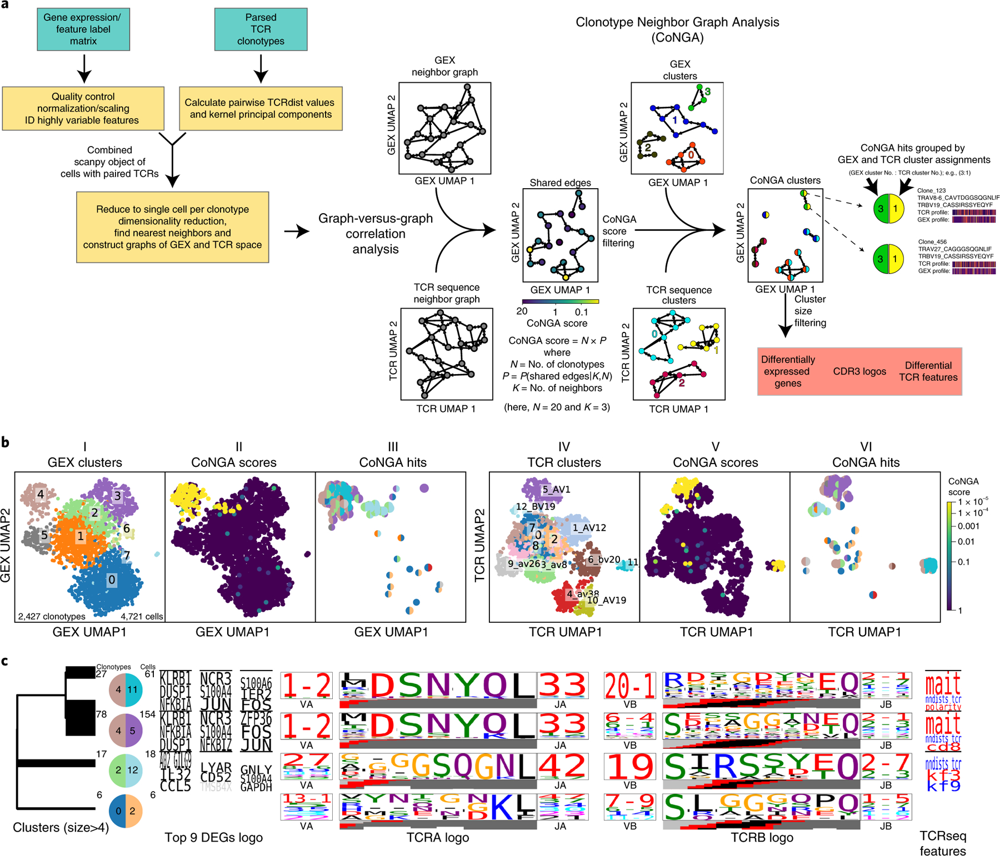
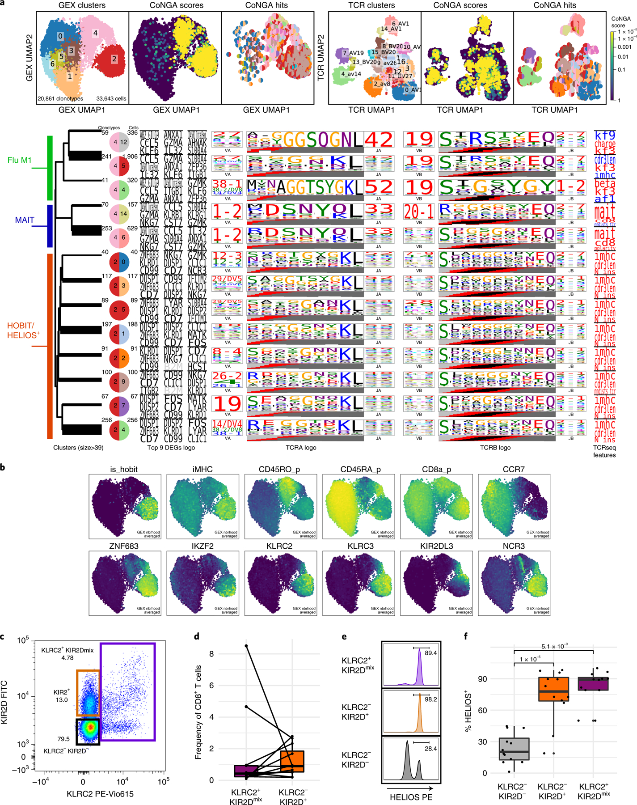
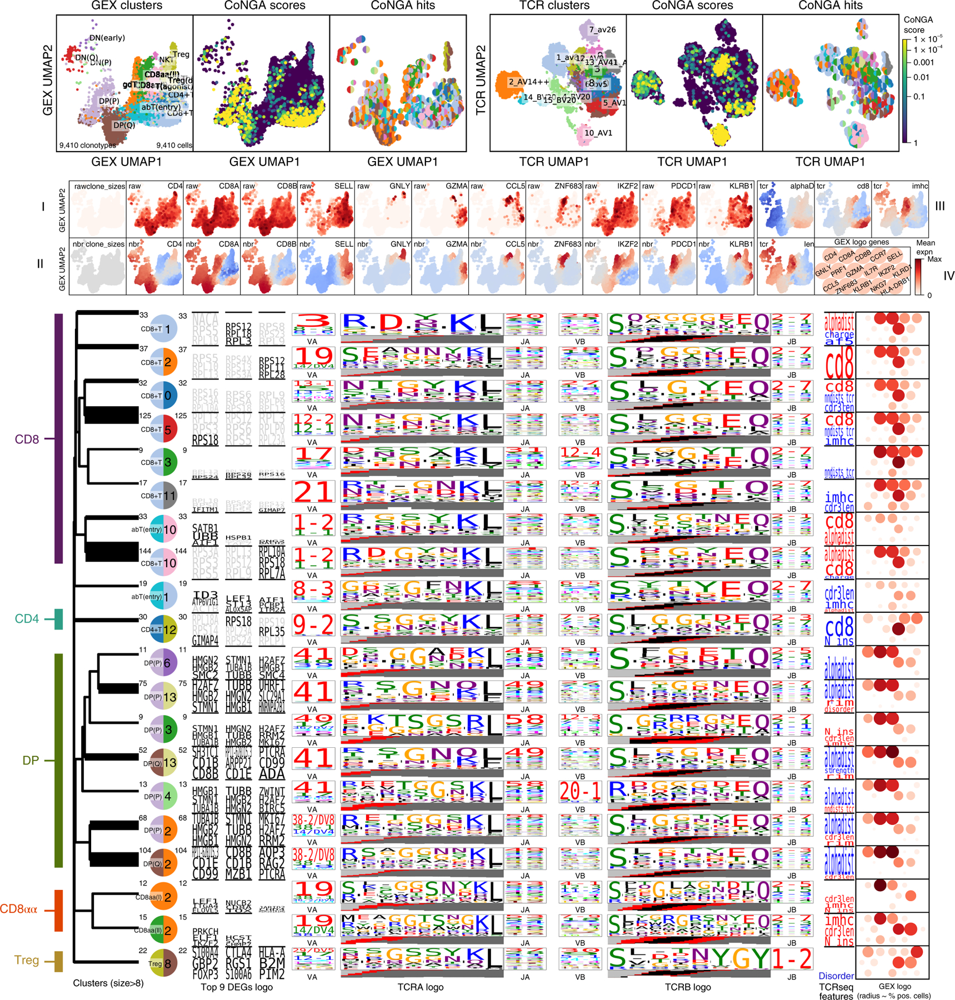
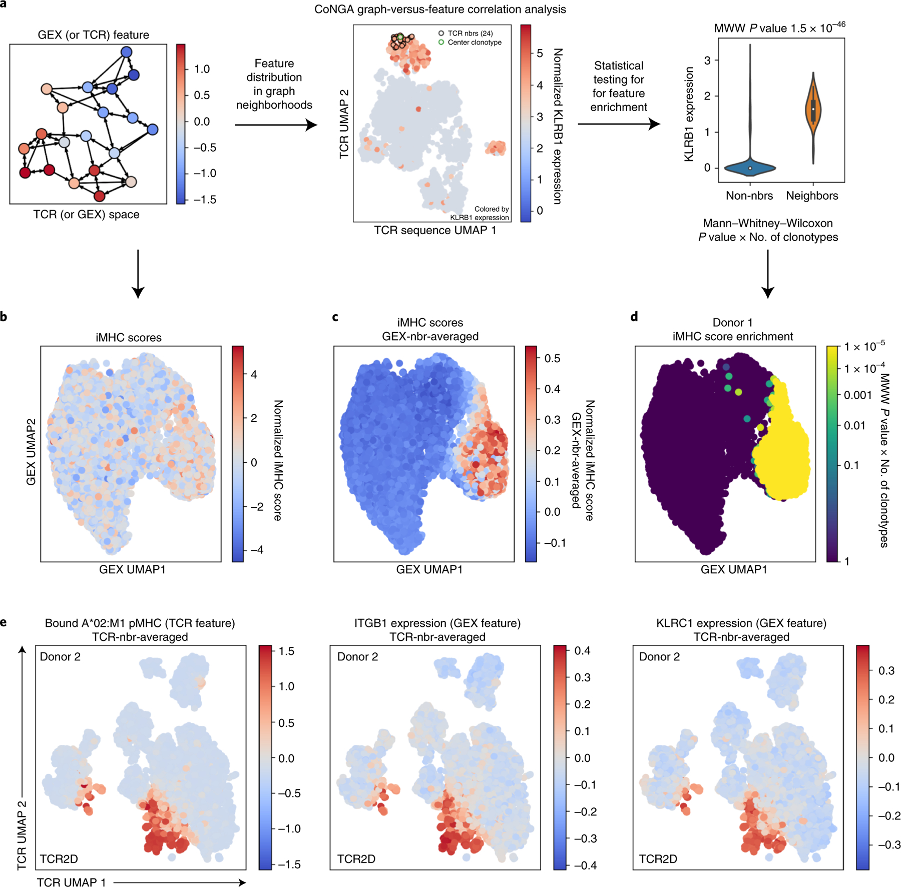
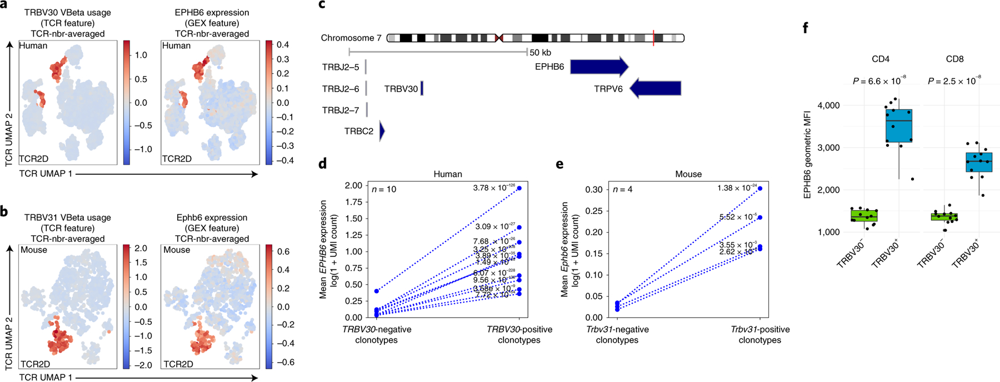
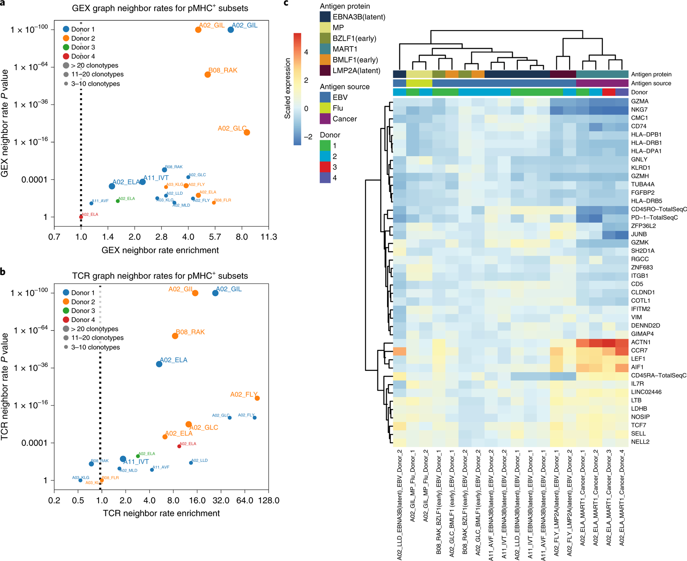

# 克隆型邻域图分析整合TCR序列与转录谱

> **Integrating T cell receptor sequences and transcriptional profiles by clonotype neighbor-graph analysis (CoNGA)**

---

## 阅读导航 (Reading Guide)

### 章节索引

| Section | Blocks | Pages |
|---------|--------|-------|
| Summary (Abstract) | S001 | p.1 |
| Main (Introduction) | S002–S004 | p.1 |
| Results: graph-vs-graph | S005–S008 | p.1–2 |
| Results: HOBIT+ Population | S009–S012 | p.2–3 |
| Results: Thymic T cells | S013–S014 | p.3 |
| Results: graph-vs-feature | S015–S019 | p.3–4 |
| Results: pMHC-specific | S020–S022 | p.4–5 |
| Discussion | S023–S027 | p.5 |

### 核心概念速览

| 概念 | 说明 |
|------|------|
| **CoNGA** | 图论方法，同时分析 GEX 相似图与 TCR 相似图的重叠 |
| **graph-vs-graph** | 寻找在 GEX 和 TCR 空间中邻居高度重叠的克隆型 |
| **graph-vs-feature** | 将特征映射到邻居图上，寻找分布偏斜的邻域 |
| **CoNGA score** | 超几何分布 P 值 × 克隆型总数（多重检验校正） |
| **iMHC score** | 基于 CDR3 序列特征预测 MHC 非依赖性 TCR 的分数 |
| **TCRdist** | TCR 序列相似性度量（CDR 环区域） |

---

**Source:** p.1 S001 — Summary

**Original:**

Links between T cell clonotypes, as defined by T cell receptor (TCR) sequences, and phenotype, as reflected in gene expression (GEX) profiles, surface protein expression and peptide:major histocompatibility complex binding, can reveal functional relationships beyond the features shared by clonally related cells. Here we present clonotype neighbor graph analysis (CoNGA), a graph theoretic approach that identifies correlations between GEX profile and TCR sequence through statistical analysis of GEX and TCR similarity graphs. Using CoNGA, we uncovered associations between TCR sequence and GEX profiles that include a previously undescribed 'natural lymphocyte' population of human circulating CD8+ T cells and a set of TCR sequence determinants of differentiation in thymocytes. These examples show that CoNGA might help elucidate complex relationships between TCR sequence and T cell phenotype in large, heterogeneous, single-cell datasets.

**中文：**

T 细胞克隆型（由 TCR 序列定义）与表型（反映在基因表达谱、表面蛋白表达和肽-MHC 结合中）之间的联系，可以揭示超越克隆相关细胞共享特征的 functional relationships。本文提出克隆型邻域图分析（CoNGA），一种基于图论的方法，通过统计分析和比较 GEX 相似图与 TCR 相似图，来识别 GEX 谱与 TCR 序列之间的相关性。应用 CoNGA，我们发现了 TCR 序列与 GEX 谱之间的多种关联，包括一个此前未被描述过的人循环 CD8+ T 细胞"天然淋巴细胞"群体，以及胸腺细胞分化过程中的一组 TCR 序列决定因素。这些实例表明，CoNGA 有助于阐明大规模异质性单细胞数据集中 TCR 序列与 T 细胞表型之间的复杂关系。

---

## Main / 引言

**Source:** p.1 S002

**Original:**

Previous studies pairing gene expression and TCR sequence have focused on the TCR sequence as a unique 'barcode' by which to identify clonally related cells. This approach produced insights into the development and interrelatedness of different T cell subsets within the context of cancer, infectious disease, and homeostasis. This body of work demonstrates that T cell clones derived from a common clonal ancestor tend to express similar transcriptional profiles. However, the availability of large single-cell sequencing datasets provides a rich pool of data to uncover relationships between TCR sequence *similarity* and cellular phenotype. Researchers have mapped the TCR sequence properties of previously identified T cell subsets, but systematic approaches that can identify previously unknown populations or subpopulations by correlating gene expression and TCR sequence have not been reported. Also lacking are methods for identifying correlations between TCR sequence and gene expression that do not extend to global similarity or associate with a defined cell population (e.g., correlations between specific TCR sequence properties and expressed genes that might span multiple cell subsets).

**中文：**

此前将基因表达与 TCR 序列配对的研究，主要将 TCR 序列视为识别克隆相关细胞的独特"条形码"。这一方法已在癌症、传染病和稳态等背景下，揭示了不同 T 细胞亚群的发育和相互关联性。这些工作表明，源自共同克隆祖先的 T 细胞克隆倾向于表达相似的转录谱。然而，大规模单细胞测序数据集的可用性为揭示 TCR 序列*相似性*与细胞表型之间的关系提供了丰富的数据资源。研究者已经绘制了此前已鉴定 T 细胞亚群的 TCR 序列特征图谱，但尚缺乏能够通过关联基因表达与 TCR 序列来系统鉴定未知群体或亚群的系统性方法。同样缺少的是识别那些不延伸至全局相似性或与特定细胞群体相关联的 TCR 序列-基因表达相关性（例如，可能跨越多个细胞亚群的特定 TCR 序列特性与表达基因之间的关联）。

**Source:** p.1 S003

**Original:**

In parallel to the developments in single-cell profiling, methods for quantifying TCR repertoire features and identifying patterns within them have matured, helping extend our understanding of T cell biology. Previously, we introduced TCRdist, a measure for assessing inter-TCR similarity capable of identifying closely related clonotypes based on shared sequence features. Based on this work and others, it is clear that T cells targeting the same pathogen-derived epitope utilize T cell receptors that share consistent, definable amino acid motifs. In addition to these conventional T cell responses, certain unconventional T cell populations, such as mucosal-associated invariant T (MAIT) cells and invariant natural killer T (iNKT) cells, are characterized by conserved TCR sequence features and gene expression profiles. Although the repertoires for a number of distinct T cell subsets with suitable markers for their enrichment have been described, it is likely that other subsets linked by TCR and GEX remain undiscovered. We hypothesized that by identifying correlations between 'TCR neighborhoods', defined by shared sequence features, and gene expression, we could move beyond simply measuring gene expression variation within individual clonal families and potentially identify associations between T cell antigen-specificities and phenotypes.

**中文：**

与单细胞分析技术发展并行，量化 TCR 库特征并识别其中模式的方法也已成熟，进一步拓展了我们对 T 细胞生物学的理解。此前我们引入了 TCRdist，一种通过共享序列特征识别密切相关的克隆型的 TCR 间相似性度量方法。基于这项工作及其他研究，可以确定靶向同一病原体衍生表位的 T 细胞使用具有一致、可定义氨基酸基序的 TCR。除了这些常规 T 细胞反应外，某些非常规 T 细胞群体，如黏膜相关恒定 T（MAIT）细胞和恒定自然杀伤 T（iNKT）细胞，其特征是保守的 TCR 序列特征和基因表达谱。尽管已有许多具有合适富集标志物的 T 细胞亚群的库特征被描述，但仍可能存在其他由 TCR 和 GEX 关联的尚未发现的亚群。我们假设，通过识别由共享序列特征定义的"TCR 邻域"与基因表达之间的相关性，我们可以超越单纯测量单个克隆家族内基因表达变异的局限，识别 T 细胞抗原特异性与表型之间的关联。

**Source:** p.1 S004

**Original:**

To this end, we developed a graph theoretic approach for clonotype neighbor-graph analysis, CoNGA, that identifies correlations between gene expression profile and TCR sequence features through analysis of similarity graphs defined on the set of T cell clonotypes. Application of CoNGA to publicly available T cell datasets identified multiple examples of GEX/TCR correlation including MAIT, iNKT, and epitope-specific T cell populations; TCR sequence determinants of T cell fate during thymic development; a previously undescribed *ZNF683+/IKZF2+* (aka *HOBIT+/HELIOS+*) population of CD8+ T cells with long and biased CDR3 regions; and a striking correlation between expression of the gene *EPHB6* and usage of a specific human TCR V gene segment, *TRBV30*. Applying CoNGA to four datasets that included pMHC binding profiles derived from sequencing of cell-surface bound, DNA-barcoded pMHC multimers revealed strong correlations between pMHC binding and both TCR sequence and gene expression. Systematic approaches such as CoNGA will play a key role in deconvoluting multi-modal single-cell datasets as they continue to grow in size and complexity.

**中文：**

为此，我们开发了一种基于图论的克隆型邻域图分析方法——CoNGA，通过在 T 细胞克隆型集合上定义的相似性图来分析基因表达谱与 TCR 序列特征之间的相关性。将 CoNGA 应用于公开可用的 T 细胞数据集，识别了多个 GEX/TCR 相关的实例，包括 MAIT、iNKT 和表位特异性 T 细胞群体；胸腺发育过程中 T 细胞命运的 TCR 序列决定因素；一个此前未被描述的具有长且偏倚 CDR3 区的 *ZNF683+/IKZF2+*（即 *HOBIT+/HELIOS+*）CD8+ T 细胞群体；以及 *EPHB6* 基因表达与特定人 TCR V 基因片段 *TRBV30* 使用之间的显著相关性。将 CoNGA 应用于四个包含 pMHC 结合谱的数据集（这些结合谱来源于对细胞表面结合的 DNA 条形码化 pMHC 多聚体进行测序），揭示了 pMHC 结合与 TCR 序列以及基因表达之间的强相关性。随着多模态单细胞数据集规模和复杂性的不断增长，CoNGA 这样的系统性方法将在解构这些数据中发挥关键作用。

---

## Results / 结果

### CoNGA graph-vs-graph analysis / 图-图分析

**Source:** p.1 S005

**Original:**

In *graph-vs-graph* correlation analysis (Fig. 1a), CoNGA identifies statistically significant overlap between a gene expression similarity graph and a TCR sequence similarity graph. CoNGA similarity graphs are defined at the level of *clonotypes* rather than individual *cells*, since cells within the same clonotype (cells inferred to be descended from a common clonal ancestor) will all share the same TCR sequence and tend to have similar gene expression profiles. The goal is to identify T cell clonotypes whose neighbors in gene expression space overlap significantly with their neighbors in TCR sequence space. Here, we model the concept of a clonotype's neighbors in gene expression or TCR space using the mathematical concept of a *graph neighborhood*, defined as the set of vertices directly connected to that clonotype's vertex in the corresponding similarity graph. Briefly, CoNGA considers each clonotype in turn, counts how many other clonotypes are connected to it by both a TCR-similarity edge and a gene expression-similarity edge, and assigns a significance score (the *CoNGA score*). The CoNGA score is the probability of observing an equal or larger overlap by chance, multiplied by the total number of clonotypes to limit the false discovery rate from multiple comparisons. CoNGA scores range from 0 to the number of clonotypes; scores close to 0 are significant, scores around 1 are borderline, and scores above 1 are expected to occur by chance. T cell clonotypes with CoNGA scores below a significance threshold (henceforth referred to as "CoNGA hits") are grouped into "CoNGA clusters" defined by shared gene expression and TCR cluster assignments.

**中文：**

在*图-图*相关分析中（图 1a），CoNGA 识别基因表达相似图与 TCR 序列相似图之间统计显著的重叠。CoNGA 相似图定义在*克隆型*水平而非单个*细胞*水平，**因为同一克隆型内的细胞（推断源自共同克隆祖先的细胞）共享相同的 TCR 序列并倾向于具有相似的基因表达谱**。目标是识别那些在基因表达空间中的邻居与 TCR 序列空间中的邻居显著重叠的 T 细胞克隆型。此处，我们使用*图邻域*的数学概念来建模克隆型在基因表达或 TCR 空间中的邻居概念，即在相应相似图中直接连接到该克隆型顶点的顶点集合。简言之，CoNGA 依次考虑每个克隆型，统计有多少其他克隆型同时通过 TCR 相似边和基因表达相似边连接到它，并分配一个显著性分数（*CoNGA 分数*）。CoNGA 分数是通过随机观察到相等或更大重叠的概率乘以克隆型总数（以控制多重比较的假发现率）计算得出。CoNGA 分数范围从 0 到克隆型数量；接近 0 的分数为显著，接近 1 的分数为临界，高于 1 的分数预期为随机发生。CoNGA 分数低于显著性阈值的 T 细胞克隆型（以下称为"CoNGA 命中"）被分组为"CoNGA 簇"，由共享的基因表达和 TCR 簇分配共同定义。

---

### Fig. 1: CoNGA graph-vs-graph analysis workflow

**Source:** p.1 Fig. 1

**Original caption:** (a) CoNGA identifies correlation between T cell gene expression (GEX) and TCR sequence by constructing a gene expression similarity graph and a TCR sequence similarity graph and looking for statistically significant overlap between them. Overlap is assessed on a per-clonotype basis by counting the number of edges that originate at each clonotype and are shared between the two graphs. Clonotypes with CoNGA scores below a threshold are grouped based on shared GEX and TCR cluster assignments into CoNGA clusters. (b-c) Application of CoNGA on a dataset of human CD8+ T cells (10x_200k_donor2a). (b) 2D UMAP projections based on GEX similarity (left three panels) and TCR similarity (right three panels). (c) GEX and TCR sequence features of CoNGA hits in clusters with 5 or more hits.

**中文图注：** (a) CoNGA 通过构建基因表达相似图和 TCR 序列相似图并寻找两者之间统计显著的重叠来识别 T 细胞基因表达与 TCR 序列之间的相关性。在每个克隆型基础上评估重叠程度，统计从每个克隆型出发并在两个图之间共享的边的数量。CoNGA 分数低于阈值的克隆型根据共享的 GEX 和 TCR 簇分配分组为 CoNGA 簇。(b-c) CoNGA 应用于人 CD8+ T 细胞数据集 (10x_200k_donor2a)。(b) 基于 GEX 相似性（左三图）和 TCR 相似性（右三图）的 2D UMAP 投影。(c) 5 个及以上命中的 CoNGA 簇的 GEX 和 TCR 序列特征。

**Reading note:** 注意 GEX 和 TCR 两个 UMAP 空间的结构差异——CoNGA 寻找的是在两个空间中同时具有相似邻居的克隆型，而非两个空间的全局对应。

---

**Source:** p.1–2 S007

**Original:**

We applied CoNGA to a collection of publicly available T cell datasets with single-cell gene expression profile and paired TCRαβ sequencing in an unbiased search for T cell populations defined by covariation between TCR sequence and gene expression profile. Figure 1b–c illustrates the CoNGA graph-vs-graph analysis workflow applied to a dataset of human CD8+ T cells sorted from peripheral blood (*10x_200k_donor2a*). First, the UMAP algorithm is applied to the gene expression and TCR distance matrices to generate two dimensional projections of the gene expression and TCR landscapes. Next, a graph-based clustering algorithm is applied to the gene expression matrix to partition the dataset into clusters of clonotypes with similar transcriptional profiles and to the TCR distance matrix to produce clusters of clonotypes with similar TCR sequences. Lastly, the gene expression and TCR cluster assignments of CoNGA hits are shown in the 2D projections using bicolored disks whose left and right halves correspond to the gene expression and TCR cluster assignments, respectively. For example, at the top of the gene expression landscape is a group of CoNGA hits that all belong to GEX cluster 4 and TCR cluster 5, or equivalently (GEX:TCR) cluster pair *(4:5)*; based on consistent GEX:TCR disk coloring, we can see that these correspond to the group of clonotypes in the TCR landscape also located near the top of the plot and that they are likely TRAV1.

**中文：**

我们将 CoNGA 应用于一系列公开可用的 T 细胞单细胞数据集（含基因表达谱和配对 TCRαβ 测序），进行 unbiased 搜索以寻找由 TCR 序列与基因表达谱共变定义的 T 细胞群体。图 1b–c 展示了 CoNGA 图-图分析工作流程应用于从外周血分选的人 CD8+ T 细胞数据集 (*10x_200k_donor2a*) 的结果。首先，对基因表达和 TCR 距离矩阵应用 UMAP 算法，生成基因表达和 TCR 景观的二维投影。接着，对基因表达矩阵应用基于图的聚类算法，将数据集划分为具有相似转录谱的克隆型簇；对 TCR 距离矩阵进行同样操作。最后，CoNGA 命中的基因表达和 TCR 簇分配用双色圆盘显示在二维投影中，左右半圆分别对应基因表达和 TCR 簇分配。例如，在基因表达景观顶部，一组 CoNGA 命中全部属于 GEX 簇 4 和 TCR 簇 5，即 (GEX:TCR) 簇对 *(4:5)*；通过一致的 GEX:TCR 圆盘着色，我们可以看出它们对应 TCR 景观中也位于顶部的克隆型组，且很可能是 TRAV1。

**Source:** p.2 S008

**Original:**

Four CoNGA clusters of ≥5 clonotypes were identified in this dataset of human CD8 T cells (see Supplementary Data 1 for TCR sequence information on all CoNGA clusters). The two largest (GEX:TCR) clusters—*(4:11)* and *(4:5)* —show the invariant TCR chains and distinctive gene expression profiles of MAIT cells. Cluster *(2:12)* is characterized by a strong TCRβ sequence motif and high expression of cytotoxicity/activation markers including *GNLY* and *CCL5*. The TCR sequence motif for this cluster matches the consensus for the response to the immunodominant A*02:01-restricted Influenza M1₅₈ epitope (GILGFVFTL). Further confirming this, the top DEG for this cluster ('A02_GILG9') is actually the read count for a DNA-barcoded A*02:01-M1₅₈ multimer that was included in the experiment. Application of CoNGA to three additional human and mouse PBMC datasets identified MAIT and iNKT cell clusters as well as CD8+ T cell clusters with a naive phenotype and TCR sequence features that appear to bias thymic development toward the CD8 compartment.

**中文：**

在该人 CD8 T 细胞数据集中识别出 4 个 ≥5 个克隆型的 CoNGA 簇。两个最大的 (GEX:TCR) 簇——*(4:11)* 和 *(4:5)*——显示出 MAIT 细胞的恒定 TCR 链和独特的基因表达谱。簇 *(2:12)* 的特征是强 TCRβ 序列基序以及高表达细胞毒性/活化标志物，包括 *GNLY* 和 *CCL5*。该簇的 TCR 序列基序与免疫优势 A*02:01 限制性流感 M1₅₈ 表位（GILGFVFTL）的共有序列一致。进一步确认的是，该簇最显著的差异表达基因（'A02_GILG9'）实际上是实验中包含的 DNA 条形码化 A*02:01-M1₅₈ 多聚体的读数计数。将 CoNGA 应用于另外三个人类和小鼠 PBMC 数据集，识别了 MAIT 和 iNKT 细胞簇，以及具有 naive 表型和似乎偏向 CD8 区室胸腺发育的 TCR 序列特征的 CD8+ T 细胞簇。

---

### CoNGA defines a HOBIT+/HELIOS+ T cell population / CoNGA 定义 HOBIT+/HELIOS+ T 细胞群体

**Source:** p.2 S009

**Original:**

We next applied CoNGA to four large datasets of peripheral blood CD8+ T cells that were sorted for positive binding to at least one of 50 DNA-barcoded pMHC multimers (*10x_200k_donor1–4*). Our analysis of TCR:pMHC binding described below identifies a number of strong epitope-specific responses for many of the pMHC multimers in the panel. However, for several of the multimers we observed significant levels of non-specific binding, for example to MAIT cells; as a result, these datasets also include diverse T cells whose specificity extends beyond the pMHC multimer panel. CoNGA detected a large number of significant GEX/TCR correlations across these datasets, identifying 62 CoNGA clusters containing ≥5 clonotypes and 42 clusters using the more stringent size threshold of 0.1% of the dataset. Figure 2a provides an overview of the largest CoNGA clusters in the *10x_200k_donor1* dataset. Further examination allowed categorization of the CoNGA clusters into three groups: (1) Flu M1₅₈-responding clonotypes; (2) MAIT cells; and (3) a population of clonotypes with a shared gene expression profile (GEX cluster 2), diverse TCR gene usage, and rather long CDR3 regions. These CoNGA clusters in GEX cluster 2 showed high expression of the transcription factors *ZNF683* (aka *HOBIT*) and *IKZF2* (aka *HELIOS*), along with a number of other NK cell-associated receptors including *KLRC2*, *KLRC3*, several *KIR* genes (e.g., *KIR2DL3*), and Natural Cytotoxicity Triggering Receptor 3 (*NCR3*). Notably, several of their DEGs matched those in the HLA interactor gene set, suggesting that the clonotypes contained in these CoNGA clusters were enriched through non-specific pMHC binding.

**中文：**

接下来，我们将 CoNGA 应用于四个大规模外周血 CD8+ T 细胞数据集，这些细胞基于与 50 种 DNA 条形码化 pMHC 多聚体中至少一种的阳性结合进行分选 (*10x_200k_donor1–4*)。我们下文描述的 TCR:pMHC 结合分析识别了许多 pMHC 多聚体的强表位特异性应答。然而，对于几种多聚体，我们观察到显著水平的非特异性结合，例如与 MAIT 细胞的结合；因此，这些数据集也包含特异性超出 pMHC 多聚体 panel 的多种 T 细胞。CoNGA 在这些数据集中检测到大量显著的 GEX/TCR 相关性，识别了 62 个包含 ≥5 个克隆型的 CoNGA 簇，以及使用更严格的大小阈值（数据集的 0.1%）时的 42 个簇。图 2a 概述了 *10x_200k_donor1* 数据集中最大的 CoNGA 簇。进一步检查可将 CoNGA 簇分为三组：(1) Flu M1₅₈ 应答克隆型；(2) MAIT 细胞；(3) 具有共享基因表达谱（GEX 簇 2）、多样化 TCR 基因使用和较长 CDR3 区的克隆型群体。GEX 簇 2 中的这些 CoNGA 簇高表达转录因子 *ZNF683*（即 *HOBIT*）和 *IKZF2*（即 *HELIOS*），以及多种其他 NK 细胞相关受体，包括 *KLRC2*、*KLRC3*、数个 *KIR* 基因（如 *KIR2DL3*）和自然细胞毒性触发受体 3（*NCR3*）。值得注意的是，它们的部分差异表达基因与 HLA 相互作用基因集中的基因匹配，提示这些 CoNGA 簇中包含的克隆型是通过非特异性 pMHC 结合富集的。

---

### Fig. 2: HOBIT+/HELIOS+ CD8+ T cell population

**Source:** p.2 Fig. 2

**Original caption:** (a) CoNGA analysis of 10x_200k_donor1. Only CoNGA clusters containing at least 40 hits are shown. (b) 2D GEX projection colored by 'is_hobit', iMHC score, CD45RA, CD45RO, CD8α surface protein, CCR7, ZNF683, IKZF2, KLRC2, KLRC3, KIR2DL3, and NCR3 expression. (c) Detection of KLRC2+KIR2D^mix and KLRC2−KIR2D+ CD8 T cells in human PBMCs by flow cytometry. (d-f) Quantification of population frequencies and HELIOS expression.

**中文图注：** (a) 10x_200k_donor1 的 CoNGA 分析。仅显示包含至少 40 个命中的 CoNGA 簇。(b) 按 is_hobit、iMHC 分数、CD45RA、CD45RO、CD8α 表面蛋白、CCR7、ZNF683、IKZF2、KLRC2、KLRC3、KIR2DL3 和 NCR3 着色的二维 GEX 投影。(c) 流式细胞术检测人 PBMC 中的 KLRC2+KIR2D^mix 和 KLRC2−KIR2D+ CD8 T 细胞。(d-f) 群体频率和 HELIOS 表达的定量分析。

**Reading note:** HOBIT+/HELIOS+ 群体具有独特的 NK 细胞相关受体表达谱，其 CDR3 序列显著偏长且富含疏水和芳香族残基（尤其是色氨酸），与 MHC 敲除小鼠中发现的 MHC 非依赖性 TCR 特征高度相似。

---

**Source:** p.2–3 S011

**Original:**

Analysis of the features distinguishing the HOBIT+ population in *10x_200k_donor1* suggested that they were likely CD8+ CD45RA+ CD45RO^dim/− based on surface protein labeling, negative for CCR7 expression, and positive for KLRC2 and a number of KIR2 genes. Using flow cytometry, we were able to confirm the presence of CD8+ CD45RA+ CD45RO− CCR7− T cells expressing different combinations of KIR2 and KLRC2 in human PBMC samples (0.1–8.5% of CD8 T cells, n = 12 donors), and found the KLRC2+ KIR2D^mix and KLRC2− KIR2D+ subsets had a higher frequency of HELIOS+ cells compared to KLRC2− KIR2D− CD8 T cells.

**中文：**

对 *10x_200k_donor1* 中 HOBIT+ 群体特征的分析表明，根据表面蛋白标记，它们很可能是 CD8+ CD45RA+ CD45RO^dim/−、CCR7 表达阴性、KLRC2 和多个 KIR2 基因阳性。通过流式细胞术，我们确认了人 PBMC 样本中存在表达不同 KIR2 和 KLRC2 组合的 CD8+ CD45RA+ CD45RO− CCR7− T 细胞（占 CD8 T 细胞的 0.1–8.5%，n = 12 供体），并发现 KLRC2+ KIR2D^mix 和 KLRC2− KIR2D+ 亚群中 HELIOS+ 细胞的频率高于 KLRC2− KIR2D− CD8 T 细胞。

**Source:** p.3 S012

**Original:**

We identified significant sequence biases in the CDR3 loops of these *HOBIT*-expressing clonotypes. Compared to the remainder of the dataset, they are significantly longer (*P* < 10⁻³⁰⁰), more positively charged (*P* < 10⁻⁴⁰), higher in aromatic, hydrophobic, and bulky residues, particularly tryptophan (*P* < 10⁻⁶⁰), and higher in cysteine (>100-fold enriched in the CDR3β, *P* < 10⁻⁵⁰). These sequence characteristics are strikingly similar to features identified in a comparison of MHC-independent versus MHC-restricted TCR sequences from an experimental study of TCR repertoires in MHC-knockout mice. Similar trends were also seen in comparisons of simulated and observed TCR sequences from pre- versus post-selection repertoires, and in CD8αα+ intraepithelial lymphocytes and their thymic precursors. Based on these trends, we hypothesize that this CoNGA-identified population represents a noncanonical, self-specific or MHC-independent T cell population. We developed a numerical score, the *iMHC score* (for 'independent of pMHC'), that captures the defining CDR3 sequence features of this putative MHC-independent T cell repertoire.

**中文：**

我们在这些 *HOBIT* 表达的克隆型的 CDR3 环中发现了显著的序列偏倚。与数据集其余部分相比，它们显著更长（*P* < 10⁻³⁰⁰）、更正电荷（*P* < 10⁻⁴⁰）、含更多芳香族、疏水和 bulky 残基（尤其是色氨酸，*P* < 10⁻⁶⁰），以及更高水平的半胱氨酸（CDR3β 中富集 >100 倍，*P* < 10⁻⁵⁰）。这些序列特征与 MHC 敲除小鼠 TCR 库实验研究中 MHC 非依赖性 versus MHC 限制性 TCR 比较中鉴定的特征惊人地相似。在模拟与观察到的 TCR 序列的前选择 versus 后选择库比较中，以及在 CD8αα+ 上皮内淋巴细胞及其胸腺前体中，也观察到类似趋势。基于这些趋势，我们假设 CoNGA 识别的这个群体代表了一种非经典的、自身特异性或 MHC 非依赖性的 T 细胞群体。我们开发了一个数值评分——*iMHC 分数*（代表"独立于 pMHC"），用于捕捉这一假定 MHC 非依赖性 TCR 库的定义性 CDR3 序列特征。

---

### CoNGA identifies GEX/TCR correlation in thymic T cells / CoNGA 识别胸腺 T 细胞中的 GEX/TCR 相关性

**Source:** p.3 S013

**Original:**

We next applied CoNGA to a recently published single-cell atlas of human thymic T cells. This dataset combines thymic tissue from embryonic and fetal stages and postnatal thymi from children and adults, totaling over 9,400 clonotypes with paired TCRα and TCRβ sequences. CoNGA identified a large number of significant hits in this dataset, primarily within the DP (double-positive), CD8 single positive (SP), CD4 SP, Treg, and CD8αα+ thymic populations. In TCR sequence space, we see a concentration of hits in the TRAV41 cluster (this TRAV gene is enriched in DP cells), the TRAV1 and TRAV12 clusters (enriched in CD8 cells), and in the TRAV14 cluster (enriched in CD8αα cells). The CD8+ clusters identified by CoNGA also showed high CD8 sequence scores and high scores for a measure ('alphadist') of the genomic distance between the TRAV and TRAJ gene segments incorporated in a clonotype's TCRα chain. The DP CoNGA clusters show low alphadist scores, preference for *TRAV41* and other TRAV genes at the 3' end of the locus, longer CDR3 loops, and higher scores for the 'rim' and 'disorder' amino acid properties (and lower scores for 'strength'), which may suggest more polar, less bulky, and less strongly interacting CDR3 regions with lower overall affinity for pMHC. Interestingly, the CD8αα(II) cluster expressed both *ZNF683* and *IKZF2*, which together with TCR features similar to those of the *HOBIT+* T cells in the blood identified above suggests a possible precursor relationship between these two populations that warrants further investigation.

**中文：**

接下来，我们将 CoNGA 应用于最近发表的人胸腺 T 细胞单细胞图谱。该数据集结合了胚胎期和胎儿期的胸腺组织以及儿童和成人的出生后胸腺，总计超过 9,400 个具有配对 TCRα 和 TCRβ 序列的克隆型。CoNGA 在该数据集中识别了大量显著的命中，主要分布在 DP（双阳性）、CD8 SP（单阳性）、CD4 SP、Treg 和 CD8αα+ 胸腺群体中。在 TCR 序列空间中，我们看到命中集中在 TRAV41 簇（该 TRAV 基因在 DP 细胞中富集）、TRAV1 和 TRAV12 簇（在 CD8 细胞中富集），以及 TRAV14 簇（在 CD8αα 细胞中富集）。CoNGA 识别的 CD8+ 簇还显示出高 CD8 序列分数和高"alphadist"分数（衡量克隆型 TCRα 链中 TRAV 和 TRAJ 基因片段之间的基因组距离）。DP CoNGA 簇显示出低 alphadist 分数、偏好 *TRAV41* 和基因座 3' 端的其他 TRAV 基因、更长的 CDR3 环，以及更高的"rim"和"disorder"氨基酸属性分数（更低的"strength"分数），这可能表明更极性、更小、相互作用更弱的 CDR3 区域，对 pMHC 的总体亲和力较低。有趣的是，CD8αα(II) 簇同时表达 *ZNF683* 和 *IKZF2*，加上与上述血液中 *HOBIT+* T 细胞相似的 TCR 特征，提示这两个群体之间可能存在前体关系，值得进一步研究。

---

### Fig. 3: CoNGA analysis of thymic T cells

**Source:** p.3 Fig. 3

**Original caption:** Same arrangement of plots as in Figure 1, with additional GEX landscape plots colored by expression of selected marker genes, Z-score normalized expression, and TCR sequence features. Only CoNGA clusters containing at least 9 CoNGA hits (0.1% of the dataset) are shown. Five colored lines/labels group related CoNGA clusters as annotated by the text labels.

**中文图注：** 与图 1 相同的排列，额外增加了按选定标志基因表达、Z 分数标准化表达和 TCR 序列特征着色的 GEX 景观图。仅显示包含至少 9 个 CoNGA 命中（数据集的 0.1%）的 CoNGA 簇。五条彩色线/标签将相关 CoNGA 簇分组。

**Reading note:** 胸腺数据集中 CD8αα(II) 簇同时表达 ZNF683/IKZF2，其 TCR 特征与血液中的 HOBIT+ 细胞相似，提示可能存在胸腺前体→外周 HOBIT+ 细胞的分化路径。

---

### CoNGA graph-vs-feature analysis / 图-特征分析

**Source:** p.3–4 S015

**Original:**

In CoNGA graph-vs-feature analysis (Fig. 4a), numerical features calculated on the basis of one cellular property, GEX or TCR sequence, are mapped onto a similarity graph defined by the other property, and the feature score distributions for each of the neighborhoods in the graph are compared to their background distributions to identify neighborhoods with skewed scores. As GEX features, we consider the expression levels of individual genes, and for TCR sequence features, we use a set of CDR3 amino acid property values as well as a handful of additional, sequence-based scores. We first used graph-vs-feature analysis to identify additional members of the *HOBIT+/HELIOS+* unconventional T cell subset by looking for GEX graph neighborhoods with elevated iMHC scores. Although per-clonotype iMHC scores are highly variable, by computing averages over GEX graph neighborhoods we can identify a subregion of GEX space with enhanced scores, whose significance can be assessed using standard statistical tests. Three of the four *10x_200k* donors show populations of clonotypes with significantly enhanced iMHC scores whose DEGs correlate well with one another and with the key marker genes (*ZNF683, CD7, CD99, DUSP1/2*) for the original *HOBIT+* CoNGA clusters.

**中文：**

在 CoNGA 图-特征分析中（图 4a），基于一种细胞属性（GEX 或 TCR 序列）计算的数值特征被映射到由另一种属性定义的相似图上，图中每个邻域的特征分数分布与其背景分布进行比较，以识别分数偏斜的邻域。作为 GEX 特征，我们考虑单个基因的表达水平；对于 TCR 序列特征，我们使用一组 CDR3 氨基酸属性值以及若干额外的基于序列的分数。我们首先使用图-特征分析，通过寻找具有升高 iMHC 分数的 GEX 图邻域来识别 *HOBIT+/HELIOS+* 非常规 T 细胞亚群的额外成员。尽管每个克隆型的 iMHC 分数高度可变，但通过计算 GEX 图邻域上的平均值，我们可以识别 GEX 空间中具有增强分数的子区域，其显著性可以使用标准统计检验评估。四个 *10x_200k* 供体中的三个显示具有显著增强 iMHC 分数的克隆型群体，其差异表达基因与原始 *HOBIT+* CoNGA 簇的关键标志基因（*ZNF683, CD7, CD99, DUSP1/2*）高度相关。

---

### Fig. 4: Graph-vs-feature analysis

**Source:** p.3–4 Fig. 4

**Original caption:** (a) In graph-vs-feature analysis, a numerical feature defined by one property is mapped onto a similarity graph defined by the other property, and graph neighborhoods with skewed score distributions are identified using statistical tests. (b) 2D GEX projection colored by iMHC score. (c) Same projection colored by average iMHC score in GEX graph neighborhoods. (d) Same projection colored by iMHC enrichment P values. (e) Graph-vs-feature correlation in Flu-specific T cells.

**中文图注：** (a) 在图-特征分析中，由一种属性定义的数值特征被映射到由另一种属性定义的相似图上，使用统计检验识别具有偏斜分数分布的图邻域。(b) 按 iMHC 分数着色的 2D GEX 投影。(c) 按 GEX 图邻域平均 iMHC 分数着色的相同投影。(d) 按 iMHC 富集 P 值着色的相同投影。(e) Flu 特异性 T 细胞中的图-特征相关性。

**Reading note:** 图-特征分析的核心优势在于其不对称性——只需要一侧具有全局相似性（图侧），另一侧可以是任意特征。这使得能够发现"图-图"分析可能遗漏的局部特征关联。

---

**Source:** p.4 S017

**Original:**

We next applied graph-vs-feature analysis in the reverse direction to identify genes that are differentially expressed in specific TCR graph neighborhoods. Notable features include MAIT-associated genes such as *KLRB1* (Fig. 4a, middle panel) and *SLC4A10*; genes associated with the *HOBIT+* population such as *ZNF683* and *KLRC3*; and genes upregulated in the Flu M1₅₈ response including *ITGB1* and *KLRC1* (in donor 2; Fig. 4e). We also observed TCR neighborhoods with elevated levels of *CD8A* and *CD8B*, which appear to overlap with the populations identified in the earlier graph-vs-graph correlation analysis and suggest the presence of TCR sequence features that bias toward the CD8+ compartment.

**中文：**

接下来，我们反向应用图-特征分析，以识别在特定 TCR 图邻域中差异表达的基因。显著特征包括 MAIT 相关基因如 *KLRB1*（图 4a，中图）和 *SLC4A10*；与 *HOBIT+* 群体相关的基因如 *ZNF683* 和 *KLRC3*；以及在 Flu M1₅₈ 应答中上调的基因，包括 *ITGB1* 和 *KLRC1*（供体 2；图 4e）。我们还观察到 *CD8A* 和 *CD8B* 水平升高的 TCR 邻域，这些邻域似乎与早期图-图相关分析中识别的群体重叠，提示存在偏向 CD8+ 区室的 TCR 序列特征。

**Source:** p.4 S018

**Original:**

A recurring feature identified by CoNGA graph-vs-feature analysis was a positive correlation between expression of the gene *EPHB6* and usage of the *TRBV30* gene segment in humans (Fig. 5a), and analogously *Ephb6* and *Trbv31* in mouse (Fig. 5b). The *TRBV30* segment is unique among TRBV genes in being located alone downstream of the TRBJ and TRBC genes at the end of the TRB locus. Providing a potential clue into the mechanism underlying this covariation, *EPHB6* is located adjacent to *TRBV30* on Chromosome 7, ~40kb downstream from the TRB locus (Fig. 5c). A focused search for covariation between TCR gene segment usage and DEGs on ten separate datasets confirmed higher *EPHB6* expression in clonotypes that incorporate the *TRBV30* gene segment (Fig. 5d), or *TRBV31* in mouse (Fig. 5e, n=4). Flow cytometric analysis confirmed that these trends extend to cell-surface levels of EPHB6 protein (Fig. 5f). Given that EPHB6 has been shown to play a role in T cell activation, *TRBV30+* clonotypes may have distinctive functional properties due to their elevated EPHB6 surface expression.

**中文：**

CoNGA 图-特征分析识别的一个反复出现的特征是人中 *EPHB6* 基因表达与 *TRBV30* 基因片段使用之间的正相关性（图 5a），以及小鼠中 *Ephb6* 与 *Trbv31* 的类似相关性（图 5b）。*TRBV30* 片段在 TRBV 基因中是独特的，因为它单独位于 TRB 基因座末端 TRBJ 和 TRBC 基因的下游。*EPHB6* 位于 7 号染色体上 *TRBV30* 的相邻位置，距 TRB 基因座下游约 40kb，这为理解这种共变的机制提供了潜在线索（图 5c）。在十个独立数据集上对 TCR 基因片段使用与差异表达基因之间的共变进行集中搜索，确认了使用 *TRBV30* 基因片段的克隆型中 *EPHB6* 表达更高（图 5d），小鼠中 *TRBV31* 同理（图 5e，n=4）。流式细胞术分析证实这些趋势延伸至 EPHB6 蛋白的细胞表面水平（图 5f）。鉴于 EPHB6 已被证明在 T 细胞活化中发挥作用，*TRBV30+* 克隆型可能因其升高的 EPHB6 表面表达而具有独特的功能特性。

---

### Fig. 5: EPHB6/TRBV30 covariation

**Source:** p.4 Fig. 5

**Original caption:** (a) 2D projections based on TCR sequence of a human dataset colored by TCR neighborhood-averaged TRBV30 (left) and EPHB6 (right) expression. (b) Mouse dataset colored by Trbv31 and Ephb6. (c) Locus view of human TRBV30 and EPHB6. (d-e) Average expression for TRBV30+ vs TRBV30− clonotypes in 10 human (d) and 4 mouse (e) datasets. (f) Comparison of cell surface EPHB6 protein levels between TRBV30+ and TRBV30− human T cells (n=12).

**中文图注：** (a) 基于 TCR 序列的人数据集二维投影，按 TCR 邻域平均 TRBV30（左）和 EPHB6（右）表达着色。(b) 小鼠数据集的 Trbv31 和 Ephb6 着色。(c) 人 TRBV30 和 EPHB6 的基因座视图。(d-e) 10 个人类 (d) 和 4 个小鼠 (e) 数据集中 TRBV30+ 与 TRBV30− 克隆型的平均表达。(f) TRBV30+ 与 TRBV30− 人 T 细胞之间细胞表面 EPHB6 蛋白水平的比较（n=12）。

**Reading note:** 这是一个 cis-调控的典型案例——EPHB6 与 TRBV30 在基因组上相邻（7 号染色体，~40kb 间距），TRBV30 重排可能通过染色质环或启动子干扰机制影响 EPHB6 表达。

---

### TCR and GEX similarity among epitope-specific clonotypes / 表位特异性克隆型中的 TCR 和 GEX 相似性

**Source:** p.4–5 S020

**Original:**

The use of pMHC-multimers conjugated to DNA barcodes as cell labeling reagents enables high-throughput interrogation of pMHC binding in parallel with other single-cell analyses. We applied CoNGA to investigate correlation between gene expression profiles, TCR sequences, and pMHC:TCR interactions in a large dataset of human T cells sorted for pMHC-multimer binding (*10x_200k_donor1–4*). To do this, we used the pMHC-binding information, stringently filtered and condensed to the level of clonotypes, to define a neighbor graph structure in which edges connect clonotypes that bind to the same pMHC. We then applied CoNGA graph-vs-graph analysis to look for statistically significant overlap between this pMHC-binding graph and the GEX and TCR similarity graphs defined above. We measured graph overlap, on a per-pMHC basis, as the enrichment of GEX (or TCR) similarity graph edges within the pMHC positive clonotypes. From this analysis we can see, as expected, that nearly all the pMHC-positive clonotype subsets show greater than expected TCR sequence similarity. Interestingly, we also see that all pMHC-positive populations show greater than expected GEX similarity, with highly significant *P* values and large fold-enrichments for most pMHCs with a sufficient number of analyzed clonotypes. These results suggest that clonotypes positive for the same pMHC have more similar gene expression profiles than would be expected by chance.

**中文：**

使用 DNA 条形码偶联的 pMHC 多聚体作为细胞标记试剂，可以在单细胞分析的同时高通量检测 pMHC 结合。我们应用 CoNGA 研究了一个大规模人 T 细胞数据集（根据 pMHC 多聚体结合分选，*10x_200k_donor1–4*）中基因表达谱、TCR 序列和 pMHC:TCR 相互作用之间的相关性。为此，我们使用经过严格过滤并浓缩到克隆型水平的 pMHC 结合信息，定义了一个邻域图结构，其中边连接结合相同 pMHC 的克隆型。然后，我们应用 CoNGA 图-图分析来寻找该 pMHC 结合图与上述 GEX 和 TCR 相似图之间统计显著的重叠。我们在每个 pMHC 基础上测量图重叠，即 pMHC 阳性克隆型内 GEX（或 TCR）相似图边的富集程度。从这一分析可以看出，正如预期，几乎所有 pMHC 阳性克隆型亚群都显示出高于预期的 TCR 序列相似性。有趣的是，我们还看到所有 pMHC 阳性群体都显示出高于预期的 GEX 相似性，对于大多数具有足够分析克隆型数量的 pMHC，具有高度显著的 *P* 值和大的倍数富集。这些结果表明，结合相同 pMHC 的克隆型具有比随机预期更相似的基因表达谱。

---

### Fig. 6: pMHC-specific clonotype GEX/TCR similarity

**Source:** p.5 Fig. 6

**Original caption:** (a-b) Each marker represents a population of pMHC-positive clonotypes in one of the four 10x_200k donors. Markers are labeled with the two-digit HLA allele and the first three amino acids of the peptide. Markers are positioned based on the rate of intra-subset GEX (a) or TCR (b) graph edges relative to random expectation (x-axis; >1 indicates enrichment) and corresponding 2-sided P value (y-axis). (c) Heatmap of scaled DEGs and surface-protein features across different pMHC-positive populations.

**中文图注：** (a-b) 每个标记代表四个 10x_200k 供体之一的 pMHC 阳性克隆型群体。标记标注了两位 HLA 等位基因和肽的前三个氨基酸。标记的位置基于子集内 GEX (a) 或 TCR (b) 图边相对于随机期望的比率（x 轴；>1 表示富集）和相应的双尾 P 值（y 轴）。(c) 不同 pMHC 阳性群体间标准化 DEG 和表面蛋白特征的热图。

**Reading note:** 所有 pMHC 阳性群体同时显示 GEX 和 TCR 相似性富集，表明表位特异性 T 细胞不仅共享 TCR 序列特征，还共享独特的转录程序——这意味着 GEX 谱可能帮助预测 TCR 特异性。

---

**Source:** p.5 S022

**Original:**

We performed all-against-all differential expression analyses to identify upregulated genes within each pMHC-positive subset. Examination of the expression patterns in Figure 6c reveals a number of trends: the naive MART1 responses cluster together at the right and show higher levels of CD45RA and lower levels of PD-1 and CD45RO; Flu M1₅₈ (A02_GIL_MP) responses cluster together based on shared expression of specific markers including *GNLY, ITGB1*, and *IFITM2*; EBV-specific responses show what may be a partitioning based on whether the antigens are 'early' or 'latent' genes, with the latent-gene responses showing higher *GZMK, JUNB,* CD45RO, and lower CD45RA compared to the 'early'-gene responses. Application of gene set variation analysis (GSVA) to better characterize the pMHC phenotypes showed an enrichment of genes associated with naive T cells for some epitopes (e.g., MART1 and B08_RAK in the B*08-negative donor 1) while others (e.g., BMLF1 and BZLF1 in Donor 2) had clear signatures of activation/memory.

**中文：**

我们进行了全面差异表达分析，以识别每个 pMHC 阳性亚群中上调的基因。检查图 6c 中的表达模式揭示了若干趋势：naive MART1 应答在右侧聚集在一起，显示出更高水平的 CD45RA 和更低水平的 PD-1 和 CD45RO；Flu M1₅₈ (A02_GIL_MP) 应答基于共享的特定标志物（包括 *GNLY, ITGB1* 和 *IFITM2*）的表达聚集在一起；EBV 特异性应答显示出可能基于抗原是"早期"还是"潜伏"基因的分区，潜伏基因应答显示出更高的 *GZMK, JUNB,* CD45RO 和更低的 CD45RA，与早期基因应答相比。应用基因集变异分析（GSVA）进一步表征 pMHC 表型，结果显示某些表位（例如 B*08 阴性供体 1 中的 MART1 和 B08_RAK）富集与 naive T 细胞相关的基因，而其他表位（例如供体 2 中的 BMLF1 和 BZLF1）具有明显的活化/记忆特征。

---

## Discussion / 讨论

**Source:** p.5 S023

**Original:**

In this study, we have introduced and applied an analytical tool, clonotype neighbor graph analysis or "CoNGA", which we demonstrate to be capable of uncovering T cell populations defined by shared TCR sequence and gene expression features within large single-cell datasets. Application of CoNGA's graph-vs-graph analysis on a diverse collection of datasets identified distinct GEX profiles of epitope-specific T cells; bias in the repertoire selection of naive CD8+ and CD4+ T cell populations; multiple populations of thymic T cells with biased TCR repertoires; and a putative MHC-independent, *HOBIT/HELIOS*-expressing CD8+ T cell subset detected both in the thymus and peripheral blood with distinctive CDR3 sequence features. CoNGA analysis applied to a graph defined by single-cell pMHC-binding data determined that T cell populations specific for different pMHCs show distinctive GEX profiles.

**中文：**

在本研究中，我们引入并应用了一种分析工具——克隆型邻域图分析（CoNGA），我们证明了它能够在大规模单细胞数据集中发现由共享 TCR 序列和基因表达特征定义的 T 细胞群体。将 CoNGA 的图-图分析应用于多样化数据集集合，识别了表位特异性 T 细胞的独特 GEX 谱；naive CD8+ 和 CD4+ T 细胞群体库选择的偏倚；多个具有偏倚 TCR 库的胸腺 T 细胞群体；以及一个在胸腺和外周血中均检测到的、具有独特 CDR3 序列特征的假定 MHC 非依赖性 *HOBIT/HELIOS* 表达 CD8+ T 细胞亚群。将 CoNGA 应用于由单细胞 pMHC 结合数据定义的图，确定了不同 pMHC 特异性的 T 细胞群体显示独特的 GEX 谱。

**Source:** p.5 S024

**Original:**

Further, while the identification of marker genes associated with cells clustered in GEX space is a routine part of single-cell analysis, there are currently no available methods for systematically identifying genes associated with TCR clusters or TCR sequence biases that define GEX clusters. CoNGA addresses this gap with its graph-vs-feature analysis, in which TCR-derived properties such as CDR3 amino acid composition or V gene usage are mapped onto the GEX landscape to detect neighborhoods with biased feature distributions; GEX-derived properties such as the expression levels of individual genes are similarly analyzed to detect biased regions of the TCR landscape. Applying this analysis revealed the long CDR3s of the *HOBIT+* population enriched for hydrophobic residues, and a previously uncharacterized and highly significant correlation between expression of the *EPHB6* gene and usage of the *TRBV30* gene segment. This analysis mode is not limited solely to TCR features but can also leverage any other labelled feature (e.g., pMHC, cell surface markers) that has been linked, quantified, and integrated into the dataset.

**中文：**

此外，虽然识别在 GEX 空间中聚类的细胞相关标志基因是单细胞分析的常规部分，但目前尚无系统的方法来识别与 TCR 簇相关的基因或定义 GEX 簇的 TCR 序列偏倚。CoNGA 通过其图-特征分析填补了这一空白——将 TCR 衍生属性（如 CDR3 氨基酸组成或 V 基因使用）映射到 GEX 景观上，以检测具有偏倚特征分布的邻域；同样地分析 GEX 衍生属性（如单个基因的表达水平），以检测 TCR 景观的偏倚区域。应用这一分析揭示了 *HOBIT+* 群体富含疏水残基的长 CDR3，以及此前未被表征的、高度显著的 *EPHB6* 基因表达与 *TRBV30* 基因片段使用之间的相关性。这种分析模式不仅限于 TCR 特征，还可以利用任何其他已标记、量化和整合到数据集中的特征（如 pMHC、细胞表面标志物）。

**Source:** p.5 S025

**Original:**

Our analyses have a number of limitations that could be addressed in future work. First, a consequence of operating at the level of clonotypes rather than individual cells is that variation among the cells belonging to expanded clonotypes becomes obscured. It is also important to keep in mind that the results from CoNGA will depend critically on the distance measures used to define clonotype similarity and the frameworks chosen for detecting GEX/TCR correlation. In our experience, successful application of CoNGA requires a relatively large number of unique clonotypes (at least several hundred), which, depending on the degree of clonal expansion, may require a substantially larger number of individual cells. Lastly, the generality of the biological observations we report here should be weighed against the small number of donors examined. Future studies on larger cohorts will be necessary to definitively assess some of our observations.

**中文：**

我们的分析存在一些局限性，可以在未来的工作中解决。首先，在克隆型水平而非单个细胞水平操作的一个后果是，属于扩增克隆型的细胞之间的变异变得模糊。同样重要的是要记住，CoNGA 的结果关键取决于用于定义克隆型相似性的距离度量和检测 GEX/TCR 相关性所选用的框架。根据我们的经验，成功应用 CoNGA 需要相对大量的独特克隆型（至少数百个），根据克隆扩增的程度，这可能需要远多于该数量的单个细胞。最后，我们在此报告的生物学观察的普遍性应谨慎看待，因为检查的供体数量有限。未来在更大队列中的研究将有必要对部分观察结果进行确定性评估。

**Source:** p.5 S026

**Original:**

To our knowledge, no previous algorithm enables systematic detection of GEX:TCR correlation. There are many possible extensions of CoNGA to explore in future work. CoNGA is agnostic to the source of the clonotype graphs, and hence could be applied to graphs defined by new similarity measures (based on surface protein expression, for example), new T cell clustering approaches, epigenetic rather than gene expression profiles, or new immunological and clinical phenotypes. CoNGA could also be applied to B cell clonotypes by incorporating a BCR sequence similarity score analogous to TCRdist. It may also be worthwhile to explore the use of more sophisticated graph-correlation algorithms developed in the computer science and machine learning communities as alternatives to the neighborhood-overlap and neighborhood-score enrichment that we have applied here.

**中文：**

据我们所知，此前没有任何算法能够实现 GEX:TCR 相关性的系统检测。CoNGA 有许多可能的扩展方向。CoNGA 对克隆型图的来源没有限制，因此可以应用于由新相似性度量（例如基于表面蛋白表达）、新 T 细胞聚类方法、表观遗传学而非基因表达谱、或新的免疫学和临床表型定义的图。CoNGA 还可通过纳入类似于 TCRdist 的 BCR 序列相似性评分应用于 B 细胞克隆型。探索使用计算机科学和机器学习社区开发的更复杂的图相关算法作为我们在此应用的邻域重叠和邻域分数富集的替代方案，也值得考虑。

**Source:** p.5 S027

**Original:**

Our analyses have a number of broader biological implications that warrant further consideration. First, the observation of a diversity of gene expression profiles across the different epitope-specific T cell populations argues for a broad continuum of memory T cell phenotypes rather than a small number of discrete subsets. Indeed, the definition of memory phenotypes would seem to be significantly determined by the eliciting pathogen. This diversity also suggests that improved prediction of target pMHC epitopes for T cells might be possible by combining TCR sequence with information on GEX profile. The putative MHC-independent and naive T cell populations identified by CoNGA hint at developmental influences of TCR sequence on T cell fate that go beyond the well-characterized role of invariant and semi-invariant TCRs. We are optimistic that analytical approaches combined with high-throughput single-cell experiments will continue to illuminate aspects of adaptive immunology for years to come.

**中文：**

我们的分析具有若干更广泛的生物学意义，值得进一步思考。首先，在不同表位特异性 T 细胞群体中观察到的基因表达谱多样性，支持记忆 T 细胞表型是一个广泛的连续体而非少量离散亚群的观点。确实，记忆表型的定义似乎很大程度上取决于诱发病原体。这种多样性还表明，通过将 TCR 序列与 GEX 谱信息相结合，可能改进对 T 细胞靶标 pMHC 表位的预测。CoNGA 识别的假定 MHC 非依赖性和 naive T 细胞群体提示，TCR 序列对 T 细胞命运的影响超出了恒定和半恒定 TCR 已明确的作用。我们乐观地认为，分析方法与高通量单细胞实验的结合将持续照亮适应性免疫学的诸多方面，在未来许多年都将继续。

---

## 术语表 (Terminology)

| 英文 | 中文 | 说明 |
|------|------|------|
| CoNGA | 克隆型邻域图分析 | Clonotype Neighbor-Graph Analysis |
| graph-vs-graph | 图-图分析 | 比较两个相似图的重叠 |
| graph-vs-feature | 图-特征分析 | 在图邻域中检测偏斜特征分布 |
| TCR neighborhood | TCR 邻域 | TCR 空间中一组相似克隆型 |
| CoNGA score | CoNGA 分数 | 超几何 P 值 × 克隆型数 |
| iMHC score | iMHC 分数 | MHC 非依赖性 TCR 的序列特征评分 |
| TCRdist | TCRdist | TCR 序列距离度量 |
| HOBIT (ZNF683) | HOBIT (ZNF683) | 转录因子，霍比特/锌指蛋白 |
| HELIOS (IKZF2) | HELIOS (IKZF2) | 转录因子，IKAROS 家族 |
| EPHB6 | EPHB6 | Ephrin B 型受体 6 |
| MAIT | MAIT | 黏膜相关恒定 T 细胞 |
| iNKT | iNKT | 恒定自然杀伤 T 细胞 |
| pMHC multimer | pMHC 多聚体 | 肽-MHC 四聚体/多聚体 |
| KNN graph | K 近邻图 | K-Nearest Neighbor 图 |
| Morisita-Horn | Morisita-Horn 重叠 | 经 TCR 相似性修正的重叠指数 |
| GSVA | GSVA | 基因集变异分析 |

## 阅读提示 (Reading Notes)

1. **CoNGA 的独特贡献**：此前的研究主要利用 TCR 作为克隆追踪的"条形码"来研究克隆扩增和分化。CoNGA 的创新在于利用 TCR **序列相似性**（而非同一性）来寻找与基因表达谱相关的模式，从而发现新的 T 细胞亚群。

2. **两种分析模式的区别**：graph-vs-graph 寻找"在 GEX 和 TCR 空间中同时具有相似邻居"的克隆型；graph-vs-feature 则只要求一侧具有图结构，另一侧可以是任意数值特征，因此能发现更局部的关联（如 EPHB6-TRBV30）。

3. **HOBIT+ 群体的生物学意义**：该群体具有极长的 CDR3（含富集色氨酸和半胱氨酸），与 MHC 敲除小鼠中发现的 MHC 非依赖性 TCR 特征一致。iMHC 分数可用于在其他数据集中识别此类细胞。

4. **EPHB6-TRBV30 的基因组邻接关系**：这是顺式调控的典型案例——TRBV30 重排可能通过改变局部染色质环境来影响相邻 EPHB6 基因的表达。这种"V 基因使用→邻近基因表达"的模式可能比目前认识的更为普遍。

5. **pMHC 特异性 GEX 谱**：不同表位特异性的 T 细胞具有不同的基因表达谱，表明结合 GEX 信息可能提高 TCR 特异性预测的准确性——这一理念后来在 PRP (Wang et al. 2026) 等方法中得到了进一步发展。

6. **与后续工作的关联**：CoNGA 与 TCRdist 来自同一实验室（Bradley & Thomas），为 TCR 序列分析提供了从距离度量到相关性发现的完整工具链。其"TCR 邻域"概念也影响了后来的 TCR 功能聚类方法。
