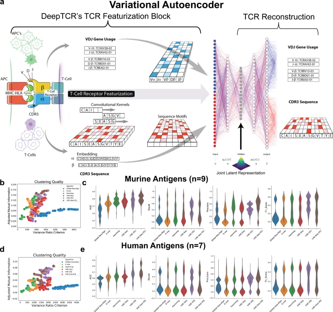
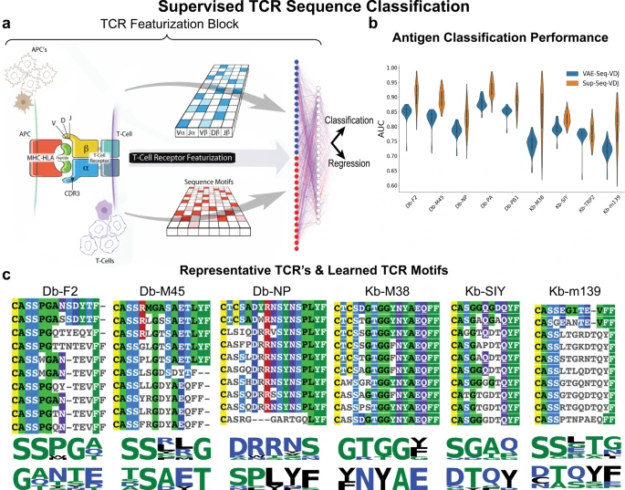
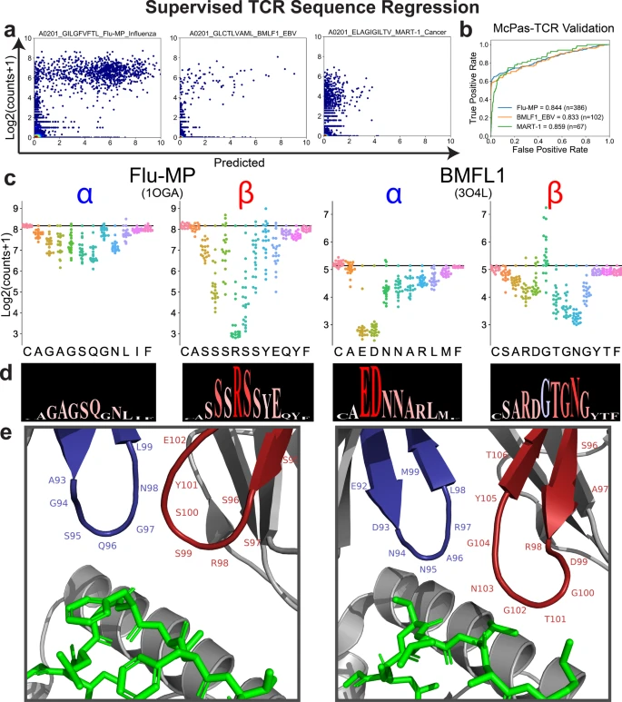
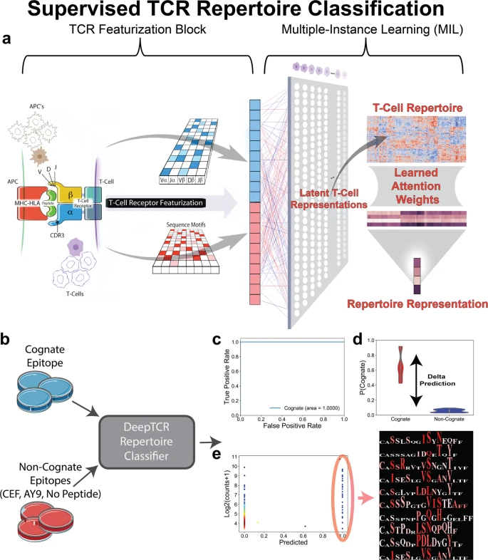
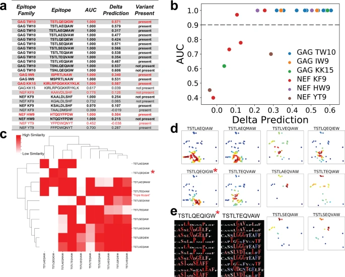

# DeepTCR: a suite of unsupervised and supervised deep learning methods to model T cell receptor sequences

## DeepTCR：用于建模 T 细胞受体序列的监督与无监督深度学习方法套件

---

## 阅读索引

| Section | 内容 | 锚点 |
|---------|------|------|
| Abstract | 摘要 | S001 |
| Introduction | 引言 | S002 |
| TCR Featurization | TCR 特征化架构 | S005 |
| VAE / Unsupervised | VAE 无监督聚类 (Fig. 1) | S008 |
| Supervised Classification | 监督分类 (Fig. 2) | S011 |
| Regression on scRNA-seq | 回归分析 (Fig. 3) | S014 |
| Perturbation Analysis | 扰动分析与 RSL (Fig. 3) | S017 |
| Repertoire Classification | 库级分类 — HIV (Fig. 4, 5) | S020 |
| Discussion | 讨论 | S025 |

---

## Abstract / 摘要

**Original:** Deep learning algorithms have been utilized to achieve enhanced performance in pattern-recognition tasks. The ability to learn complex patterns in data has tremendous implications in immunogenomics. T-cell receptor (TCR) sequencing assesses the diversity of the adaptive immune system and allows for modeling its sequence determinants of antigenicity. We present **DeepTCR**, a suite of unsupervised and supervised deep learning methods able to model highly complex TCR sequencing data by learning a joint representation of a TCR by its CDR3 sequences and V/D/J gene usage. We demonstrate the utility of deep learning to provide an improved 'featurization' of the TCR across multiple human and murine datasets, including improved classification of antigen-specific TCRs and extraction of antigen-specific TCRs from noisy single-cell RNA-Seq and T-cell culture-based assays. Our results highlight the flexibility and capacity for deep neural networks to extract meaningful information from complex immunogenomic data for both descriptive and predictive purposes.

**中文:** 深度学习算法已被用于在模式识别任务中实现增强的性能。学习数据中复杂模式的能力在免疫基因组学中具有巨大潜力。T 细胞受体（TCR）测序评估适应性免疫系统的多样性，并允许对其抗原性的序列决定因素进行建模。我们提出了 **DeepTCR**——一套监督和无监督深度学习方法，通过学习 TCR 的**联合表征**（整合 CDR3 序列和 V/D/J 基因使用信息），能够对高度复杂的 TCR 测序数据进行建模。我们在多个人类和小鼠数据集中展示了深度学习提供的改进的 TCR 特征化能力，包括改进的抗原特异性 TCR 分类，以及从嘈杂的单细胞 RNA-Seq 和 T 细胞培养实验中提取抗原特异性 TCR 的能力。我们的结果突显了深度神经网络从复杂免疫基因组数据中提取有意义信息以用于描述性和预测性目的的灵活性和能力。

---

## Introduction / 引言

**Original:** Next-generation sequencing (NGS) has allowed a comprehensive description of the complexity encoded at the genomic level. T cell receptor sequencing (TCR-Seq) is an application of NGS that has allowed scientists to characterize the diversity of the adaptive immune response. By selectively amplifying the highly diverse antigen-specific CDR3 region of the β-chain of the TCR, scientists have been able to study clonal expansion as a probe for responses to both foreign and native potential antigens. With this new sequencing technology, there has arisen a need to develop analytical tools to parse and draw meaningful concepts from the data, since antigen-specific T cells exist within a sea of T cells with specificities irrelevant to the microbe or tumor cell being assessed.

**中文:** 下一代测序（NGS）已经能够全面描述基因组水平的编码复杂性。T 细胞受体测序（TCR-Seq）是 NGS 的一项应用，使科学家能够表征适应性免疫应答的多样性。通过选择性扩增 TCR β 链高度多样化的抗原特异性 CDR3 区域，科学家能够研究克隆扩增——作为对外源和自身潜在抗原应答的探针。伴随这一新测序技术，亟需开发分析工具来解析数据并从中提取有意义的概念——因为抗原特异性 T 细胞存在于大量特异性与研究对象的微生物或肿瘤细胞无关的 T 细胞之"海"中。

**Original:** In recent work, investigators have applied conventional sequence analytics, where either targeted motif searches or sequence alignment algorithms have been used to begin parsing the data within TCR-Seq. However, identifying signal over noise is particularly challenging in studying in vivo T cell responses such as tumor-specific T cell responses, which are mediated by a small proportion of the overall pool of tumor-infiltrating lymphocytes and peripheral blood lymphocytes.

**中文:** 在近期工作中，研究者使用了传统的序列分析方法——通过靶向基序搜索或序列比对算法来解析 TCR-Seq 数据。然而，在体内 T 细胞应答（如肿瘤特异性 T 细胞应答）的研究中，从噪声中识别信号尤其具有挑战性，因为这些应答仅由肿瘤浸润淋巴细胞和外周血淋巴细胞总体中的一小部分介导。

**Original:** In light of this need to better featurize TCR sequences, we turned to deep learning primarily through the use of convolutional neural networks (CNNs) as a powerful means to extract important features from sequencing data for both descriptive and predictive purposes. The main advantage of CNNs in this application is the ability to learn sequence motifs (kernels) through some objective function given to the network. These learned motifs can then be used as part of a complex deep learning model to either describe the data in a new latent space or be used for a classification task.

**中文:** 鉴于这种需要更好地对 TCR 序列进行特征化的需求，我们转向了深度学习——主要通过使用卷积神经网络（CNN）作为从测序数据中提取重要特征以用于描述性和预测性目的的强有力手段。CNN 在此应用中的主要优势在于能够通过网络给定的目标函数**学习序列基序（核/kernels）**。这些学习到的基序可以用作复杂深度学习模型的一部分，用于在新的潜在空间中描述数据或用于分类任务。

---

## Results — TCR Featurization / TCR 特征化架构

### Fig. 1. 无监督 TCR 序列表示（VAE）

**Placed near:** S008

**Original caption:** Unsupervised TCR sequence representation. **a** Architecture of the VAE for TCR featurization. **b** Variance Ratio Criterion (upper panels) and Adjusted Mutual Information (lower panels) for clustering solutions for murine (left) and human (right) antigens. **c** AUC of KNN classifier across varying K values for murine (left) and human (right) antigens. **d-e** Comparison across featurization methods.

**中文图注:** 无监督 TCR 序列表示。**a** TCR 特征化的 VAE 架构。**b** 小鼠（左）和人类（右）抗原聚类解的方差比准则（上）和调整互信息（下）。**c** 不同 K 值下 KNN 分类器的 AUC，针对小鼠（左）和人类（右）抗原。**d-e** 不同特征化方法的比较。

---

**🔬 图表解读**

| 面板 | 内容 | 关键发现 |
|------|------|----------|
| A | VAE 架构：CDR3 序列 → Embedding → 3层CNN → 潜变量空间（高斯分布）→ 解码重建 + V/D/J 基因嵌入后拼接 | 联合表征 CDR3 序列与 V/D/J 基因使用 |
| B | 方差比准则（聚类的紧致度）和调整互信息（对真实标签的匹配度） | VAE-Seq-VDJ 方法在两项指标上均最高 |
| C | KNN 分类器 AUC（K 值从 1 到 500） | VAE 方法持续优于 Hamming/K-mer/序列比对基线 |
| D-E | 多指标综合比较 | VAE-Seq-VDJ 获得最高 AUC |

**📊 统计注释：** 变异聚类数从 5 到 100 进行测试；5 折交叉验证 KNN；数据集包括 9 个小鼠抗原和 7 个人类抗原

**🎯 核心结论：** VAE 通过同时利用 CDR3 序列和 V/D/J 基因信息，生成比传统方法（Hamming距离、K-mer、全局比对）更优的 TCR 特征化。

---

**Original:** The main building block of all architectures in DeepTCR utilizes a common method of TCR featurization. First, any of the available α- or β-chain CDR3 variable length sequences are provided to the network and are embedded via a trainable embedding layer to learn properties of the amino acids and transform sequences from discrete to continuous numerical space. Subsequently, a three-layer CNN is used to extract sequence-based features. Additionally, V/D/J gene usage is provided as a categorical variable in a "one-hot" representation. A trainable embedding layer again learns features of the V/D/J gene segments. These features are then concatenated to provide a **joint representation** of the TCR through its CDR3 sequences and V/D/J gene usage.

**中文:** DeepTCR 中所有架构的主要构建模块采用共同的 TCR 特征化方法。首先，α 链或 β 链的 CDR3 可变长度序列被输入网络，通过可训练的嵌入层学习氨基酸的属性，将序列从离散空间转换为连续数值空间。随后使用三层 CNN 提取基于序列的特征。此外，V/D/J 基因使用以独热编码（one-hot）的类别变量形式输入，可训练的嵌入层再次学习 V/D/J 基因节段特征。这些特征随后被拼接，形成 TCR 的**联合表征**——整合 CDR3 序列与 V/D/J 基因使用信息。

**Original:** For the supervised sequence classifier or repertoire classifier, the global max pooling operation is applied across the length of the sequence after the CNN, providing **length-invariant** motif detection.

**中文:** 对于监督序列分类器或库级分类器，在 CNN 之后对序列的整个长度应用全局最大池化（global max pooling），实现**长度不变的**基序检测。

---

## Unsupervised VAE / 无监督变分自编码器

**Original:** We first implemented this method of TCR featurization within the unsupervised learning setting in order to learn the underlying distribution of the sequence data in high-dimensional space for the purpose of clustering TCR sequences that likely recognize the same antigen. We implemented a **variational autoencoder (VAE)** that transforms TCR CDR3 sequences and V/D/J gene usage into a latent space parametrized by a multidimensional unit Gaussian distribution.

**中文:** 我们首先在无监督学习环境中实现这种 TCR 特征化方法，以学习高维空间中序列数据的潜在分布，从而对可能识别相同抗原的 TCR 序列进行聚类。我们实现了**变分自编码器（VAE）**，将 TCR CDR3 序列和 V/D/J 基因使用转化为由多维标准高斯分布参数化的潜在空间。

**Original:** We benchmarked the VAE against featurizations of TCRs based on Hamming distances, K-mer representation, and global sequence alignment. We noted that the VAE methods maintained the highest variance ratio criterion while also maintaining a high adjusted mutual information to the ground truth labels for both murine and human datasets (Fig. 1b, d), suggesting VAE-based methods form high-quality clusters that correspond to the true antigen-specific labels.

**中文:** 我们将 VAE 与基于 Hamming 距离、K-mer 表示和全局序列比对的 TCR 特征化方法进行了基准比较。VAE 方法保持了最高的方差比准则，同时维持了与真实标签的高调整互信息（图 1b, d），表明基于 VAE 的方法形成了对应真实抗原特异性标签的高质量聚类。

**Original:** Using both sequence and V/D/J gene usage resulted in the highest AUC performance (VAE-Seq-VDJ), suggesting both types of inputs provide distinct and contributary information to antigen specificity assignment.

**中文:** 同时使用序列和 V/D/J 基因使用获得了最高的 AUC 性能（VAE-Seq-VDJ），表明两种类型的输入都为抗原特异性分配提供了不同且有贡献的信息。

---

## Supervised Classification / 监督分类

### Fig. 2. 监督 TCR 序列分类

**Placed near:** S011

**Original caption:** Supervised TCR sequence classification. **a** Architecture for supervised sequence classifier. **b** Performance comparison: supervised vs unsupervised VAE. **c** Motif identification method.

**中文图注:** 监督 TCR 序列分类。**a** 监督序列分类器的架构。**b** 性能比较：监督方法与无监督 VAE 的对比。**c** 基序识别方法。

---

**🔬 图表解读**

| 面板 | 内容 | 关键发现 |
|------|------|----------|
| A | 监督分类架构：TCR特征化 → 分类层（softmax） | 利用标签信息直接优化分类 |
| B | 监督 vs VAE 性能对比 | 监督方法进一步提升了分类性能 |
| C | 基序提取：按预测值排序序列 → 回归关联 → Logomaker 可视化 | 可从网络中提取抗原特异性基序/序列模式 |

**🎯 核心结论：** 监督学习相比无监督 VAE 进一步提升了抗原特异性分类性能，且网络学习到的基序可被提取和可视化。

---

**Original:** We developed a fully supervised model that learns sequence-specific motifs to correctly classify sequences by their antigen-specific labels (Fig. 2a), in which we observed that our supervised approach improved performance over the unsupervised VAE approach and more conventional Random Forest (RF) & Support Vector Machine (SVM).

**中文:** 我们开发了一个**全监督模型**，学习序列特异性基序以按抗原特异性标签对序列进行分类（图 2a）。我们观察到监督方法的性能优于无监督 VAE 方法以及传统的随机森林（RF）和支持向量机（SVM）。

**Original:** Being able to extract knowledge from the network can inform relevant motifs for antigen-specific recognition. We established a method by which we could identify the most predictive sequences for a given class and query the associated learned kernels/motifs (Fig. 2c). Following training, we sorted sequences by predicted values, and identified motifs associated with antigen-specific predictions via multinomial linear regression.

**中文:** 从网络中提取知识的能力可以揭示与抗原特异性识别相关的基序。我们建立了一种方法：识别给定类别中**最具预测性的序列**，然后查询相关的学习到的核/基序（图 2c）。训练后，我们按预测值对序列排序，并通过多项线性回归识别与抗原特异性预测相关的基序。

---

## Supervised Regression & Perturbation / 监督回归与扰动分析

### Fig. 3. 监督 TCR 序列回归与扰动分析

**Placed near:** S014

**Original caption:** Supervised TCR sequence regression. **a** Regression on UMI counts from 10x Genomics multi-chain dataset. **b** Independent validation on McPAS-TCR database. **c** In silico perturbation analysis revealing important residues. **d** Residue Sensitivity Logos (RSLs). **e** Correlation with crystal structure contacts.

**中文图注:** 监督 TCR 序列回归。**a** 对 10x Genomics 多链数据的 UMI 计数回归。**b** 在 McPAS-TCR 数据库上的独立验证。**c** 计算扰动分析揭示重要残基。**d** 残基敏感度标志（RSL）。**e** 与晶体结构接触残基的关联。

---

**🔬 图表解读**

| 面板 | 内容 | 关键发现 |
|------|------|----------|
| A | UMI 计数回归：从 10x 数据识别抗原特异性 TCR | 模型能识别高 UMI 且有预测信号特征的 TCR |
| B | McPAS-TCR 独立验证：Flu-MP, BMLF1, MART1 | 独立验证集上的高预测准确性 |
| C | 原位扰动：每个位置逐一替换为其他 19 种氨基酸，观察预测变化 | 某些位置（如 β-6）对任何突变都极其敏感 |
| D | 残基敏感度标志（RSL）：Logo 图形式显示位置敏感度 | 大小=敏感度，红色=降低亲和力，蓝色=增加亲和力 |
| E | RSL 与晶体结构的关联 | AUC: 0.824 (1OGA), 0.907 (3O4L) — 与已知接触残基高度一致 |

**📊 统计注释：** AUC 用于评估预测残基与真实接触残基的一致性；排除训练数据中已有的 TCR 序列进行独立验证

**🎯 核心结论：** 监督回归模型能从嘈杂的 10x 数据中提取抗原特异性信号，计算的扰动分析与晶体结构一致，且提示可用于 TCR 工程改造。

---

**Original:** We proposed to use DeepTCR to regress UMI (unique molecular identifier) counts as a proxy for binding affinity. DeepTCR was able to identify TCRs that have both high observed UMI counts and a predictive signature, providing a tool to better isolate antigen-specific TCRs (Fig. 3a). We collected experimentally validated CDR3 β sequences from the McPAS-TCR database for Flu-MP, BMLF1, and MART1 epitopes and observed that these models were able to predict with a high level of accuracy (Fig. 3b).

**中文:** 我们提出使用 DeepTCR 将 UMI 计数作为结合亲和力的代理变量进行回归。DeepTCR 能够识别既具有高观察 UMI 计数又具有预测信号的 TCR（图 3a），提供了一种更好地分离抗原特异性 TCR 的工具。我们从 McPAS-TCR 数据库中收集了 Flu-MP、BMLF1 和 MART1 表位的实验验证 CDR3 β 序列，观察到这些模型能够以高准确率进行预测（图 3b）。

**Original:** One of the advantages of training a predictive model is the ability to perturb its inputs and measure the change in the output — a sensitivity analysis. Assuming the model has correctly learned the rules of antigen specificity, one can identify residues in a TCR sequence that are highly sensitive to change. We collected crystallography data from the Protein Data Bank for Flu-MP (1OGA) and BMLF1 (3O4L) and permuted each position with all other 19 amino acids. We found that certain positions were highly sensitive to any change (e.g. R at β-6 in Flu-MP). We also created **Residue Sensitivity Logos (RSLs)** to visualize these results. We demonstrated that RSL sensitivity correlated with contact residues in the crystal structures (AUC: 1OGA = 0.824, 3O4L = 0.907).

**中文:** 训练预测模型的一个优势在于能够扰动其输入并测量输出的变化——即**敏感性分析**。假设模型正确学习了抗原特异性的规则，就可以识别出 TCR 序列中对变化高度敏感的残基。我们从蛋白质数据库（PDB）收集了 Flu-MP (1OGA) 和 BMLF1 (3O4L) 的晶体学数据，将每个位置的氨基酸逐一替换为其他 19 种氨基酸。我们发现某些位置对任何变化都高度敏感（如 Flu-MP 中 β 链第 6 位的精氨酸）。我们还创建了**残基敏感度标志（RSL）**来可视化这些结果。RSL 敏感度与晶体结构中的接触残基具有相关性（AUC: 1OGA = 0.824, 3O4L = 0.907）。

---

## Repertoire Classification — HIV Elite Suppressor / 库级分类 — HIV 精英抑制者

### Fig. 4. 监督 TCR 库级分类

**Placed near:** S020

**Original caption:** Supervised TCR repertoire classification. **a** Architecture with multi-head attention. **b** Training strategy: cognate epitope wells vs controls. **c** AUC for representative epitope. **d** Delta Prediction metric. **e** Predictive sequences are minority of the repertoire.

**中文图注:** 监督 TCR 库级分类。**a** 带多头注意力的架构。**b** 训练策略：同源表位孔 vs 对照。**c** 代表性表位的 AUC。**d** Delta 预测指标。**e** 预测性序列仅为库中的少数。

---

**🔬 图表解读**

| 面板 | 内容 | 关键发现 |
|------|------|----------|
| A | 多实例学习架构：TCR特征化 → 多头注意力 → 序列级分配 → 库级平均 → 分类 | 可对整个库的标签进行弱监督学习 |
| B | 训练策略：从共培养孔数据区分同源表位 vs 对照（CEF, AY9, 无肽） | 即使大部分 T 细胞不具特异性也能检测 |
| C | 代表性表位的 AUC = 1.0 | 该表位的免疫库与对照完全可分 |
| D | Delta Prediction = 库平均预测值的差值 | 效应量指标，衡量抗原特异性的强度 |
| E | 高预测性序列仅占库中独特序列的少数，且不一定具有最高 read count | 序列信息比丰度更重要 |

**🎯 核心结论：** Weakly supervised 库级分类器能够从体外共培养实验中检测抗原特异性免疫应答，并利用序列信息而非仅依赖克隆扩增丰度，从而减少假阳性。

---

### Fig. 5. HIV 表位免疫库特征

**Placed near:** S024

**Original caption:** Characterization of TCR repertoire to HIV-specific epitopes. **a** Summary across 25 epitopes. **b** Heatmap of AUC values. **c** Clustered heatmap of pairwise repertoire similarity (1-Delta Prediction) for GAG TW10 variants. **d** UMAP of TCR sequences colored by variant. **e** RSLs comparing consensus vs triple-mutant.

**中文图注:** HIV 特异性表位的 TCR 库特征分析。**a** 25 个表位的总体结果。**b** AUC 热图。**c** GAG TW10 变异体的两两库相似度聚类热图。**d** UMAP 显示 TCR 序列按变异体着色。**e** 共识表位与三重突变体的 RSL 对比。

---

**🔬 图表解读**

| 面板 | 内容 | 关键发现 |
|------|------|----------|
| A | 25 个表位中 19 个（76%）通过 AUC > 0.90 阈值 | 模型成功检测到多数 HIV 抗原特异性应答 |
| B | AUC 热图 | 5/6 表位家族有可检测免疫应答 |
| C | GAG TW10 逃逸变异体的库相似度聚类 | 共识表位（*）与大多数逃逸变异体可区分，表明免疫应答发生位移 |
| D | UMAP 显示各变异体的 TCR 序列 | 共识表位产生集中应答，逃逸变异体的 TCR 多样性更高（更异质） |
| E | 共识 vs 三重突变体的 RSL 对比 | 可视化两种免疫应答的序列决定因子差异 |

**📊 统计注释：** Fisher 精确检验用于与原始实验验证数据比较（p < 1e-10）；AUC > 0.90 作为统计阈值

**🎯 核心结论：** DeepTCR 揭示了 HIV GAG TW10 表位家族的免疫库在逃逸突变后发生显著变化——逃逸变异体诱导了更异质的 TCR 应答，提示免疫压力在 HIV 进化中发挥重要作用。

---

**Original:** We designed a **supervised multi-instance learning algorithm** that is able to extract meaningful concepts that may lie within large repertoires of many sequences (Fig. 4a). This scenario is akin to many use-cases of TCR-Seq where ground truth labels apply to an entire repertoire of TCR sequences and not to any individual sequence.

**中文:** 我们设计了一种**监督多实例学习算法**，能够从包含大量序列的库中提取有意义的概念（图 4a）。这种情景类似于许多 TCR-Seq 的应用场景：真实标签适用于整个 TCR 序列库，而非任何单个序列。

**Original:** We hypothesized that if a well had an antigen-specific response, its T cell repertoire should be distinguishable via its sequence concepts from those not specific for the stimulating peptide(s). We trained a repertoire classifier to predict if the well had been treated by the cognate epitope, or non-cognate conditions given its T cell repertoire (Fig. 4b).

**中文:** 我们假设，如果一个孔存在抗原特异性应答，其 T 细胞库应能通过其序列概念与那些对刺激肽非特异性的孔区分开来。我们训练了一个**库级分类器**，根据 T 细胞库预测该孔是否用同源表位或非同源条件处理过（图 4b）。

**Original:** When we ran this pipeline across the 25 tested epitopes, our model predicted that 19 of these epitopes (covering 5 out of the 6 epitope families) elicited highly distinguishable sequence features (AUC > 0.90) (Fig. 5a, b). Furthermore, 17/18 (Fisher's exact test: p < 1e-10) of the originally reported experimentally validated TCR-peptide pairs were correctly predicted to be cognate binders.

**中文:** 当我们在 25 个测试表位上运行此流程时，模型预测其中 **19 个表位**（覆盖 6 个表位家族中的 5 个）引发了高度可区分的序列特征（AUC > 0.90）（图 5a, b）。此外，最初报道的经实验验证的 TCR-肽配对中，**17/18**（Fisher 精确检验：p < 1e-10）被正确预测为同源结合对。

**Original:** When comparing the immune repertoires of the escape variants to the consensus epitope, we noted that while the consensus epitope elicited a relatively focused repertoire, many of the escape variants elicited rather heterogeneous responses. These findings suggest the GAG TW10 epitope is under considerable immune pressure where escape variants often create TCR repertoires that are not only distinguishable from the repertoire against the consensus epitope but also are far more heterogeneous.

**中文:** 在比较逃逸变异体与共识表位的免疫库时，我们注意到共识表位引发了相对集中的 TCR 库，而许多逃逸变异体引发了相当异质的应答。这些发现表明 **GAG TW10 表位处于显著的免疫压力下**——逃逸变异体产生的 TCR 库不仅与共识表位的库可区分，而且异质性更高。

---

## Discussion / 讨论

**Original:** NGS has become one of the largest sources of big data in the biological sciences, and deep learning is a promising modality for analyzing this kind of big data. In this work, we present DeepTCR, a collection of unsupervised and supervised deep learning approaches to characterize TCR-Seq data.

**中文:** NGS 已成为生物科学中大数据最大的来源之一，深度学习是分析此类大数据的一种有前景的范式。在本工作中，我们介绍了 DeepTCR——一套用于表征 TCR-Seq 数据的监督和无监督深度学习方法。

**Original:** We believe that the real novelty of this approach is to allow for joint representations of data inputs of different types (i.e. sequence vs categorical data). While previous methods including GLIPH have used V/D/J information, the initial clustering algorithm does not take into account the V/D/J gene information. TCRdist includes sequence information from CDR1 and CDR2 regions, but this information is most often not collected by current commercial TCR-Seq platforms that only report the CDR3 sequence and respective V/D/J gene usage.

**中文:** 我们认为该方法真正的创新在于允许**不同类型数据输入（序列 vs 类别数据）的联合表征**。虽然包括 GLIPH 在内的先前方法也使用了 V/D/J 信息，但初始聚类算法并未考虑 V/D/J 基因信息。TCRdist 包含了来自 CDR1 和 CDR2 区域的序列信息，但这些信息目前大多数商业 TCR-Seq 平台并未收集（它们通常只报告 CDR3 序列和相应的 V/D/J 基因使用）。

**Original:** Significant limitations still exist. The first being the few and minimally curated datasets that exist at this time. For example, Glanville et al. and Dash et al., while publishing high-quality datasets that link TCR to epitope, only assayed a handful of antigens while the immune repertoire has the potential to recognize thousands of antigens. Furthermore, datasets to train and test repertoire classifiers are even more lacking.

**中文:** 仍然存在显著的局限性。首先是目前可用的数据集数量少且整理有限。例如，Glanville et al. 和 Dash et al. 虽然发表了连接 TCR 和表位的高质量数据集，但只检测了少数抗原，而免疫库具有识别成千上万种抗原的潜力。此外，用于训练和测试库级分类器的数据集更加缺乏。

**Original:** As sequencing-based technologies only become more ubiquitous, algorithms such as the one presented in this work will find further utility in identifying and characterizing relevant biological signal, yielding new understandings of complex genomic concepts hidden within this vast amount of data.

**中文:** 随着基于测序的技术日益普及，类似本工作所提出的算法将在识别和表征相关生物信号方面发挥更大作用，从而产生对隐藏在海量数据中的复杂基因组概念的新理解。

---

## Code & Data Availability

**Original:**
- **Code:** https://github.com/sidhomj/DeepTCR (Python package, also on PyPI)
- **Data:** All data available at the GitHub repository and original publications
- **10x Dataset:** https://www.10xgenomics.com/resources/application-notes/a-new-way-of-exploring-immunity

**中文:**
- **代码：** https://github.com/sidhomj/DeepTCR（Python 包，也可从 PyPI 安装）
- **数据：** 所有数据可在 GitHub 仓库和原始出版物中获取
- **10x 数据集：** 链接见正文

---

## Key Terminology / 关键术语

| 英文 | 中文 | 说明 |
|------|------|------|
| DeepTCR | DeepTCR | 本文提出的深度学习方法套件 |
| Variational Autoencoder (VAE) | 变分自编码器 | 无监督学习潜变量表示的神经网络 |
| Convolutional Neural Network (CNN) | 卷积神经网络 | 用于序列基序检测的深度学习架构 |
| Joint representation | 联合表征 | 整合 CDR3 序列和 V/D/J 基因使用的特征空间 |
| Featurization | 特征化 | 将原始序列和类别数据转换为数值特征 |
| Multi-instance learning | 多实例学习 | 标签作用于实例集合（库）而非单个实例 |
| Attention mechanism | 注意力机制 | 自适应将库中序列分配到学习到的概念 |
| Perturbation analysis | 扰动分析 | 逐残基计算氨基酸替换对预测的影响 |
| Residue Sensitivity Logo (RSL) | 残基敏感度标志 | 可视化显示重要残基位置和替换效应的 Logo 图 |
| Global max pooling | 全局最大池化 | 实现基序位置不变性的操作 |
| pMHC | 肽-MHC 复合物 | TCR 识别的分子靶标 |
| Elite suppressor | 精英抑制者 | 无需药物控制 HIV 复制的个体 |

---

## 架构总结

DeepTCR 的四个核心模块：

1. **TCR 特征化模块**（通用基石）
   - CDR3 α/β → 嵌入层（64维）→ 3层 CNN → 特征向量
   - V/D/J → 嵌入层（48维）
   - 拼接形成**联合表征**

2. **无监督 VAE**（聚类）
   - 编码器 → 潜变量（单位高斯分布）→ 解码器重建
   - 潜空间 Euclidean 距离用于聚类

3. **监督序列分类/回归**（预测）
   - 特征化 + 全局最大池化 → 分类/回归层
   - 可提取学习的基序 + 扰动分析（RSL）

4. **监督库级分类**（多实例学习）
   - 特征化 → 多头注意力（自适应 ISRU 激活）→ 库平均 → 分类
   - 弱监督：标签作用于整个库

---

*Generated on 2026-05-16. Bilingual reading artifact for Sidhom et al., Nature Communications 2021.*
