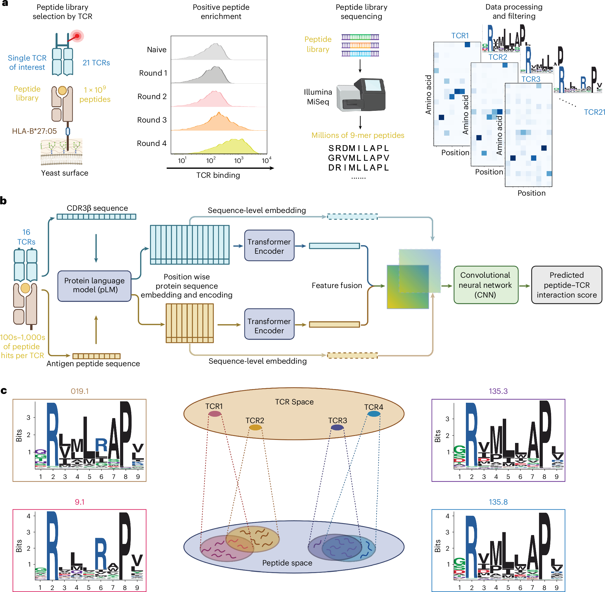
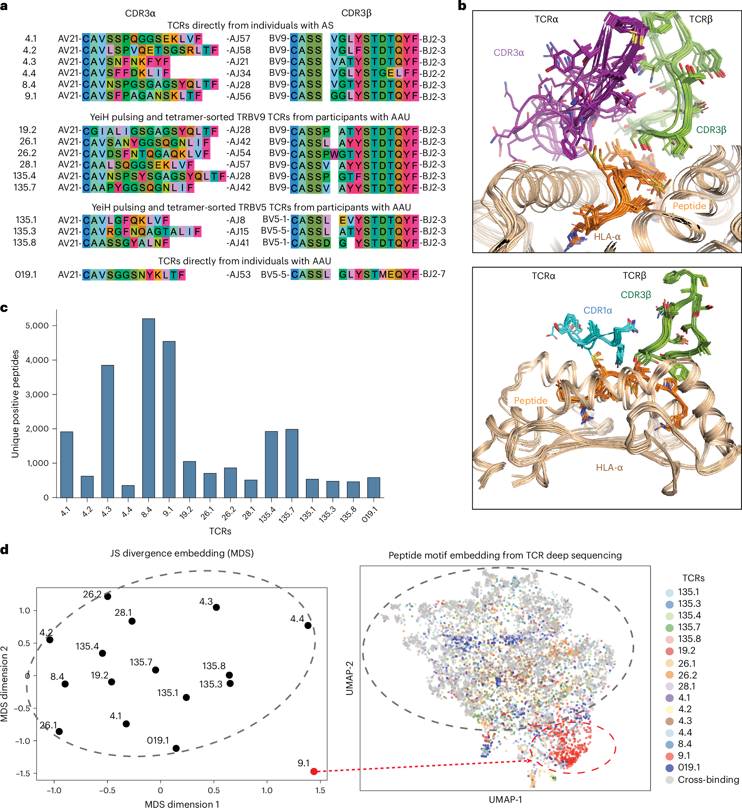
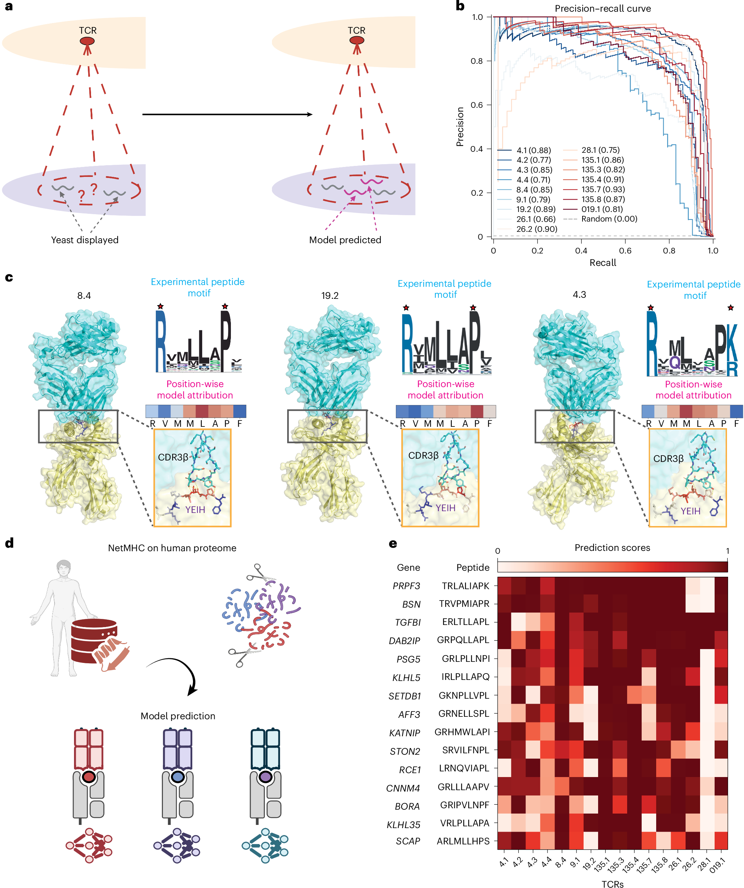
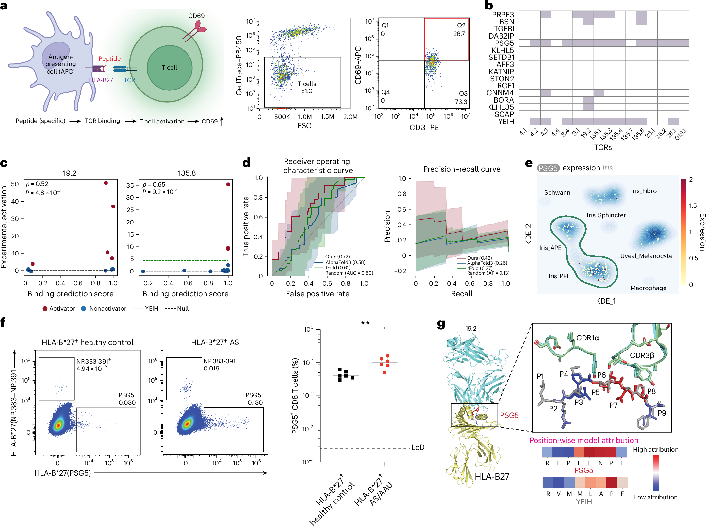
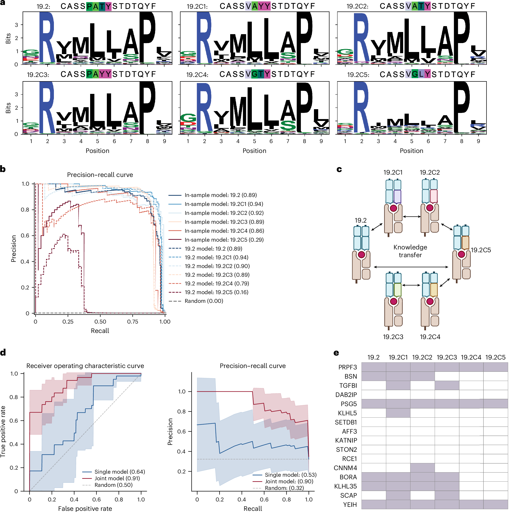
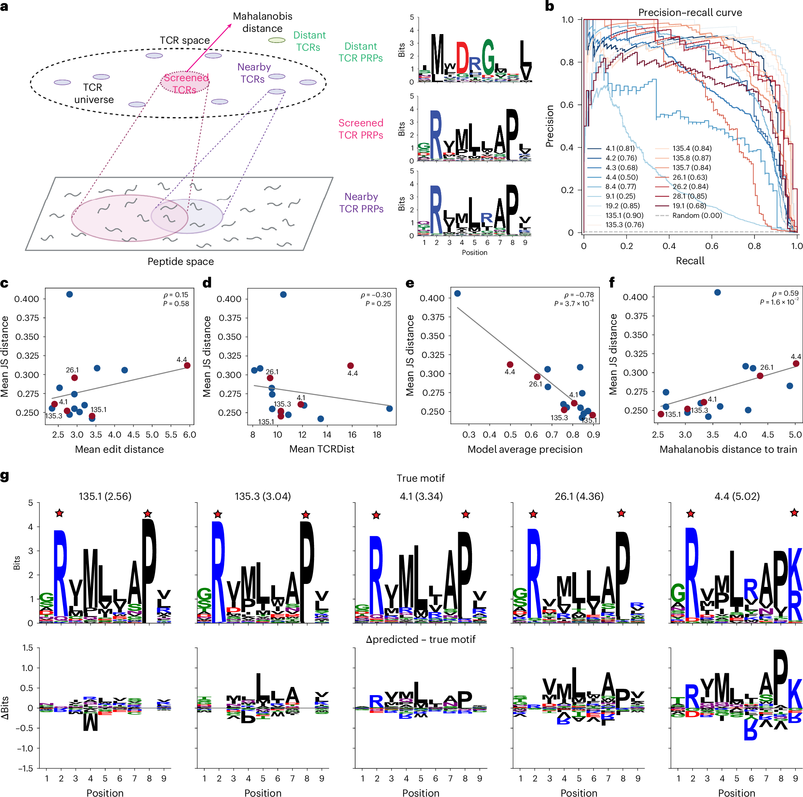

# Deep Peptide Recognition Profiling Decodes TCR Specificity — 深度肽识别图谱解码 TCR 特异性

> Wang N, Yeh H, Lai B, et al. *Nature Biotechnology* (2026)
> DOI: [10.1038/s41587-026-03128-x](https://doi.org/10.1038/s41587-026-03128-x)

---

## 📑 Section Index

| Section | Source |
|---------|--------|
| [Abstract](#S001) | S001 |
| [Main (Introduction)](#S002) | S002–S005 |
| [Results: Integrated Platform](#S006) | S006–S009, F001 |
| [Results: Functional Clustering](#S010) | S010–S014, F002 |
| [Results: pLM Prediction](#S015) | S015–S019, F003 |
| [Results: Activation Validation](#S020) | S020–S024, F004 |
| [Results: TCR Neighborhood](#S025) | S025–S028, F005 |
| [Results: Generalization Principles](#S029) | S029–S032, F006 |
| [Discussion](#S033) | S033–S038 |
| [Terminology](#terms) | — |
| [Reading Notes](#notes) | — |

---

## Abstract | 摘要

**Source:** p.1 S001

**Original:**

Predicting T cell receptor (TCR) specificity on the basis of sequence is challenging because TCRs of similar sequence can recognize entirely different antigens, whereas TCRs of different sequence can recognize the same antigens. Here we present a system that integrates high-throughput yeast display with fine-tuned protein language models (pLMs) to generate deep peptide recognition profiles (PRPs) for individual TCRs, each detailing binding against millions of peptides. We provide detailed PRPs for a panel of HLA-B\*27:05-restricted TCRs from persons with ankylosing spondylitis and acute anterior uveitis that almost exclusively recognize peptides through CDR3β. pLMs trained on these PRPs outperform AlphaFold3 and tFold-TCR in predicting T cell activation. We discover and validate novel candidate autoantigens, demonstrate that model generalization to new TCRs correlates with functional distance (PRP divergence) rather than sequence similarity and introduce a model-intrinsic uncertainty metric to quantify prediction confidence. This system and its associated PRP datasets offer a scalable approach to mapping TCR recognition, accelerating antigen discovery and guiding TCR engineering.

**中文:**

基于序列预测 T 细胞受体（TCR）特异性极具挑战性，因为序列相似的 TCR 可能识别完全不同的抗原，而序列不同的 TCR 却可能识别相同的抗原。本文提出一个整合系统——将高通量酵母展示与微调蛋白语言模型（pLM）相结合，为单个 TCR 生成深度肽识别图谱（PRP），每个图谱详述了 TCR 对数百万种肽的结合情况。我们为来自强直性脊柱炎（AS）和急性前葡萄膜炎（AAU）患者的 HLA-B\*27:05 限制性 TCR 提供了详细的 PRP，这些 TCR 几乎完全通过 CDR3β 识别肽。基于 PRP 训练的 pLM 在预测 T 细胞激活方面优于 AlphaFold3 和 tFold-TCR。我们发现并验证了新型候选自身抗原，证明模型对新 TCR 的泛化能力与功能距离（PRP 散度）而非序列相似性相关，并引入了一种模型内在的不确定性度量来量化预测置信度。该系统及其相关的 PRP 数据集提供了一种可扩展的 TCR 识别图谱绘制方法，可加速抗原发现并指导 TCR 工程。

---

## Main | 引言

**Source:** p.1 S002

**Original:**

T cell receptors (TCRs) recognize a composite surface composed of antigenic peptide and major histocompatibility complex (pMHC) molecules. Interrogation of pMHC complexes by the TCR underpins adaptive immunity, orchestrating responses to pathogens, cancer and autoimmunity. However, the structural complexity of the TCR–pMHC interface presents both challenges and opportunities for biotechnological intervention. A fundamental paradox of TCR recognition is that TCRs with little to no sequence similarity can bind the same pMHC, while nearly identical TCRs can exhibit distinct specificities. Consequently, sequence-based clustering methods such as GLIPH and TCRdist capture broad statistical trends in epitope specificity. However, they are limited in resolving fine-grained specificity among closely related TCRs.

**中文:**

T 细胞受体（TCR）识别由抗原肽和主要组织相容性复合物（pMHC）分子组成的复合表面。TCR 对 pMHC 复合物的探查是适应性免疫的基础，协调对病原体、癌症和自身免疫的应答。然而，TCR-pMHC 界面的结构复杂性为生物技术干预带来了挑战和机遇。TCR 识别的一个基本悖论是：序列几乎没有相似性的 TCR 可以结合相同的 pMHC，而几乎相同的 TCR 却可能表现出不同的特异性。因此，基于序列的聚类方法（如 GLIPH 和 TCRdist）能够捕捉表位特异性的总体统计趋势，但它们解析密切相关 TCR 之间精细特异性的能力有限。

**Source:** p.1 S003

**Original:**

Current approaches to bridge this sequence–function gap face notable limitations. While high-throughput experimental techniques such as yeast or mammalian display can map peptide interactions at scale, leveraging these large datasets effectively to build predictive models remains challenging. For example, computational approaches, whether based on TCR sequence similarity heuristics or structural modeling as exemplified by AlphaFold3, a general structure-prediction model, and tFold-TCR, a specific TCR–pMHC structure-prediction model, both of which use the interface predicted template modeling score (ipTM) to rank interactions, often struggle to reliably predict de novo TCR binding with high accuracy, particularly when confronted with unseen epitopes and diverse TCR backgrounds. Furthermore, synthetic peptide libraries used in display platforms frequently lack direct relevance to the native proteome of interest. This predictive shortfall hinders progress in critical areas, such as the efficient identification of elusive autoantigens driving HLA-associated autoimmune diseases, such as ankylosing spondylitis (AS) and acute anterior uveitis (AAU), two overlapping syndromes linked to HLA-B\*27.

**中文:**

当前弥合序列-功能差距的方法面临显著局限。虽然高通量实验技术（如酵母或哺乳动物展示）可以大规模绘制肽相互作用图谱，但如何有效利用这些大型数据集构建预测模型仍然具有挑战性。例如，计算方法——无论基于 TCR 序列相似性启发式方法，还是基于结构建模（如通用结构预测模型 AlphaFold3 和专用 TCR-pMHC 结构预测模型 tFold-TCR，两者都使用界面预测模板建模评分 ipTM 对相互作用进行排序）——通常难以可靠地高精度预测从头 TCR 结合，特别是在面对未见过的表位和多样化的 TCR 背景时。此外，展示平台中使用的合成肽库通常缺乏与目标天然蛋白质组的直接相关性。这种预测不足阻碍了关键领域的进展，例如有效识别驱动 HLA 相关自身免疫疾病的难以捉摸的自身抗原——如强直性脊柱炎（AS）和急性前葡萄膜炎（AAU），这两种重叠的综合征与 HLA-B\*27 相关联。

**Source:** p.2 S004

**Original:**

Here, we address these challenges with an integrated experimental–computational platform that generates deep peptide recognition profiles (PRPs) for TCRs whose recognition of pMHC has been visualized at high resolution. Our approach couples high-throughput yeast display, screening individual TCRs against millions of peptides, with protein language models (pLMs) fine-tuned on the resulting empirical binding data. The extreme focus of CDR3β on peptide recognition in this TCR family, as determined from high resolution crystal structures, enables us to map and rationalize structure–activity relationships with an unusual degree of granularity. This PRP data resource reveals that disease-associated TCRs cluster by shared ligand recognition, complementing but extending beyond sequence-based grouping approaches. Critically, pLMs trained on these PRPs predict functional T cell activation with much greater accuracy than existing structural modeling approaches. This predictive power directly enabled the identification of novel candidate autoantigens for AS and AAU, including a peptide derived from PSG5, which we validated in individual-specific T cells. Lastly, we establish the principles governing model generalization, demonstrating that predictive accuracy for a new TCR is determined by its functional distance, not sequence similarity, to the training set and we introduce a model-intrinsic metric to quantify this confidence.

**中文:**

本文通过一个整合的实验-计算平台来应对这些挑战——该平台为那些已通过高分辨率结构解析了 pMHC 识别方式的 TCR 生成深度肽识别图谱（PRP）。我们的方法将高通量酵母展示（用数百万种肽筛选单个 TCR）与在所得经验结合数据上微调的蛋白语言模型（pLM）相结合。该 TCR 家族中 CDR3β 对肽识别的极端聚焦——由高分辨率晶体结构确定——使我们能够以异常的精细程度绘制和合理化结构-活性关系。这一 PRP 数据资源揭示了疾病相关 TCR 按共享的配体识别模式聚类，补充并超越了基于序列的分组方法。关键的是，在这些 PRP 上训练的 pLM 在预测功能性 T 细胞激活方面的准确性远超现有结构建模方法。这种预测能力直接使新型 AS 和 AAU 候选自身抗原的鉴定成为可能，包括一种来源于 PSG5 的肽，我们在个体特异性 T 细胞中进行了验证。最后，我们建立了模型泛化的原则，证明对新 TCR 的预测准确性由其与训练集的功能距离（而非序列相似性）决定，并引入了模型内在的度量来量化这种置信度。

**Source:** p.2 S005

**Original:**

Together, this work highlights how integrating deep profiling with machine learning can 'zoom in' on narrow, disease-associated TCR families, revealing specificity rules not accessible by sequence-based methods alone. This platform and its associated resources provide a complementary path toward antigen discovery, deepen our understanding of immune specificity and guide the development of next-generation engineered immunotherapies.

**中文:**

总之，这项工作突出了深度图谱绘制与机器学习的整合如何能够"聚焦"狭窄的疾病相关 TCR 家族，揭示仅靠基于序列的方法无法触及的特异性规则。该平台及其相关资源为抗原发现提供了补充路径，加深了我们对免疫特异性的理解，并指导下一代工程化免疫疗法的发展。

---

## Results | 结果

### An integrated platform maps TCR–peptide recognition landscapes | 整合平台绘制 TCR-肽识别景观

**Source:** p.2 S006

**Original:**

To resolve the complex relationship between TCR sequence and peptide antigen specificity, we developed an integrated experimental–computational platform that empirically maps the peptide recognition landscape of individual TCRs (Fig. 1). The experimental framework uses high-throughput yeast surface display coupled with next-generation deep sequencing to quantitatively measure the binding interactions between a specific TCR and vast, randomized peptide libraries presented on the MHC (Extended Data Fig. 1). To generate high-resolution data for machine learning, we designed the peptide libraries to maximize informative diversity within the canonical binding space of our target system, HLA-B\*27:05. Building on prior observations that disease-associated TCRs strictly prefer proline at position 8 (P8), we fixed the anchor residues (arginine at P2, proline at P8) while leaving the central positions and P9 unconstrained. This design trade-off ensured library stability and deep coverage of the variable contact residues most critical for fine specificity.

**中文:**

为解决 TCR 序列与肽抗原特异性之间的复杂关系，我们开发了一个整合实验-计算平台，以经验方式绘制单个 TCR 的肽识别景观（图 1）。该实验框架使用高通量酵母表面展示结合下一代深度测序，定量测量特定 TCR 与 MHC 上呈现的巨大随机肽库之间的结合相互作用（扩展数据图 1）。为生成用于机器学习的高分辨率数据，我们设计了肽库以在目标系统 HLA-B\*27:05 的规范结合空间内最大化信息多样性。基于先前的观察——疾病相关 TCR 严格偏好 8 位（P8）为脯氨酸——我们固定了锚定残基（P2 为精氨酸，P8 为脯氨酸），同时保持中心位置和 P9 不受约束。这种设计权衡确保了文库的稳定性和对精细特异性最关键的变异接触残基的深度覆盖。

### Fig. 1: Integrated experimental and computational framework

**Source:** p.2 Fig. 1

**Original caption:** Fig. 1: Integrated experimental and computational framework for modeling TCR–peptide binding specificity.

**中文图注:** 图 1: 用于建模 TCR-肽结合特异性的整合实验与计算框架。

**Reading note:** Panel a shows yeast display workflow: peptide-MHC library → TCR selection → NGS → PRP. Panel b shows pLM fine-tuning on PRP data. Panel c illustrates the concept of clustering TCRs by shared ligand recognition rather than sequence similarity.

---

**Source:** p.3 S008

**Original:**

We applied this framework to a panel of 16 HLA-B\*27:05-restricted TCRs implicated in AS and AAU, using this defined cohort as a reductionist model system for high-resolution mapping. This approach generated deep peptide recognition datasets, counting specific interactions for thousands of unique peptide ligands (~10⁹ peptides screened per TCR; Fig. 1a and Extended Data Fig. 2). These dense, quantitative PRPs provide a detailed view of each TCR's intrinsic peptide recognition preferences.

We reasoned that these rich interaction data could enable pLMs to learn generalizable rules of recognition. Accordingly, we developed a computational framework centered on pLMs, fine-tuned on these interaction datasets, to learn the complex sequence-dependent relationships governing TCR–pMHC binding (Fig. 1b). For the HLA-B\*27:05 system studied here, we focused the models on the CDR3β loop, which prior structural analyses identified as the dominant mediator of peptide contact in this system. This integrated platform enables the direct modeling of TCR specificity based on empirical peptide binding, allowing exploration of TCR relationships defined by shared ligand recognition patterns rather than TCR sequence similarity alone (Fig. 1c).

**中文:**

我们将此框架应用于 16 个与 AS 和 AAU 相关的 HLA-B\*27:05 限制性 TCR，使用这个明确的队列作为高分辨率绘制的简化模型系统。该方法生成了深度肽识别数据集，计数了数千种独特肽配体的特异性相互作用（每个 TCR 筛选约 10⁹ 种肽；图 1a 和扩展数据图 2）。这些密集的定量 PRP 提供了每个 TCR 内在肽识别偏好的详细视图。

我们推测，这些丰富的相互作用数据可以使 pLM 学习可泛化的识别规则。因此，我们开发了一个以 pLM 为中心的计算框架，在这些相互作用数据集上进行微调，以学习控制 TCR-pMHC 结合的复杂序列依赖关系（图 1b）。对于本文研究的 HLA-B\*27:05 系统，我们将模型聚焦于 CDR3β 环——先前的结构分析已确定其为该系统中肽接触的主要介导者。这个整合平台使得能够基于经验肽结合直接建模 TCR 特异性，从而允许探索由共享配体识别模式（而非仅 TCR 序列相似性）定义的 TCR 关系（图 1c）。

---

### PRPs reveal functional clustering distinct from TCR sequence similarity | PRP 揭示不同于 TCR 序列相似性的功能聚类

**Source:** p.3 S010

**Original:**

The 16 disease-derived TCRs encompassed the major disease-associated clonotypes previously described in synovial, blood and ocular compartments, including the dominant public TRAV21–TRBV9 family with the Y/FSTDTQ-BJ2.3 motif, a non-BV9 clonotype (019.1) isolated from AAU aqueous humor that pairs TRAV21 with an alternative β germline, and additional clonotypes identified by YeiH tetramer sorting from blood from an individual with AAU that include both TRBV9 and TRBV5 usage. Alignment of these receptors reveals discrete CDR3 sequence variation within a clonotypically constrained family (Fig. 2a).

**中文:**

这 16 个疾病来源的 TCR 涵盖了先前在滑膜、血液和眼房室中描述的主要疾病相关克隆型，包括：显性公共 TRAV21-TRBV9 家族（具有 Y/FSTDTQ-BJ2.3 基序）、从 AAU 房水中分离的非 BV9 克隆型 019.1（TRAV21 配对一个替代 β 胚系基因），以及通过 YeiH 四聚体从 AAU 患者血液中分选得到的额外克隆型（包括 TRBV9 和 TRBV5 使用）。这些受体的比对显示，在一个克隆型受限的家族内存在离散的 CDR3 序列变异（图 2a）。

### Fig. 2: Functional diversity of HLA-B*27:05-associated TCRs

**Source:** p.3 Fig. 2

**Original caption:** Fig. 2: Functional diversity of HLA-B\*27:05-associated TCRs in AS and AAU.

**中文图注:** 图 2: AS 和 AAU 中 HLA-B\*27:05 相关 TCR 的功能多样性。

**Reading note:** Panel a shows CDR3 sequence alignment; panel b shows β-centric docking geometry; panel c shows PRP breadth variation; panel d's MDS plot is critical — it shows TCRs cluster by shared peptide recognition, not by CDR3β sequence similarity.

---

**Source:** p.3 S012

**Original:**

Structurally, available crystal complexes of representative HLA-B27:05-restricted AS and AAU TCRs reveal a recurring β-centric docking geometry. In all complexes, the CDR3β loop arches over the center of the HLA-B27:05-bound peptide and accounts for most peptide backbone and side-chain contacts, whereas CDR3α is positioned more peripherally. CDR1α does contact the peptide but adopts a highly conserved configuration across TCRs (Fig. 2b). In this architecture, variability in CDR3α is, therefore, most consistent with neutral drift around a fixed germline scaffold, while sequence differences in CDR3β are directly translated into altered peptide contacts. This β-dominated binding geometry provides the mechanistic rationale for focusing our modeling on CDR3β in this disease-linked TCR family.

**中文:**

在结构上，代表性的 HLA-B27:05 限制性 AS 和 AAU TCR 的可用晶体复合物揭示了反复出现的 β 中心对接几何构型。在所有复合物中，CDR3β 环拱起于 HLA-B27:05 结合肽的中心上方，负责大多数肽骨架和侧链接触，而 CDR3α 位于更外围的位置。CDR1α 确实接触肽，但跨 TCR 采用高度保守的构型（图 2b）。在这种结构中，CDR3α 的变异最一致地符合围绕固定胚系支架的中性漂移，而 CDR3β 的序列差异直接转化为改变的肽接触。这种 β 主导的结合几何学为此疾病相关 TCR 家族中聚焦 CDR3β 建模提供了机制上的依据。

**Source:** p.4 S013

**Original:**

Analysis of the experimental binding landscapes for this panel revealed substantial differences in the breadth of peptide recognition, with the number of unique peptide ligands identified per TCR ranging from hundreds to over 6,000 (Fig. 2c). To systematically compare TCRs on the basis of their recognition patterns, we calculated the pairwise Jensen–Shannon (JS) divergence between the peptide enrichment probability distributions derived from the yeast display data (Extended Data Fig. 3a). This functional distance metric (reflecting PRP divergence) revealed distinct clusters of TCRs sharing similar ligand preferences. Indeed, this clustering based on peptide recognition was largely independent of sequence similarity, as measured by CDR3β edit distance (Extended Data Fig. 3b).

**中文:**

对该 panel 的实验结合景观分析显示，肽识别广度存在显著差异——每个 TCR 鉴定的独特肽配体数量从数百到超过 6,000 不等（图 2c）。为系统比较基于识别模式的 TCR，我们计算了源自酵母展示数据的肽富集概率分布之间的成对 Jensen-Shannon（JS）散度（扩展数据图 3a）。这种功能距离度量（反映 PRP 散度）揭示了共享相似配体偏好的不同 TCR 簇。事实上，这种基于肽识别的聚类在很大程度上独立于以 CDR3β 编辑距离衡量的序列相似性（扩展数据图 3b）。

**Source:** p.4 S014

**Original:**

Visualization using multidimensional scaling (MDS) projected the TCRs into a peptide recognition space where proximity directly reflects shared peptide specificity, clearly delineating these recognition-based clusters and outliers (Fig. 2d, left). For instance, TCRs 135.1, 135.3 and 135.8 formed a tight peptide recognition cluster despite sequence differences, while sequence-similar TCRs sometimes exhibited disparate binding profiles. Correspondingly, sequence logo analysis of enriched peptides for each TCR identified distinct binding motifs (Extended Data Fig. 2). While some TCRs shared related motifs (for example, 28.1 and 135.4 both strongly favoring a central MLL motif at positions 4–6), others displayed unique preferences (for example, 9.1 with a unique preference for arginine at P6), consistent with their positions in the MDS map of peptide recognition space (Fig. 2d, right). Across dimensionality reduction methods (UMAP, t-SNE and PCA), the same subsets of TCRs consistently clustered together, mirroring their JS distance relationships and underscoring the robustness of the recognition space representation (Extended Data Fig. 3c,d). These results empirically demonstrate that comprehensive PRPs provide a more robust and biologically relevant measure of TCR relatedness than CDR3β sequence similarity alone, directly revealing convergent recognition patterns among sequence-dissimilar receptors.

**中文:**

使用多维尺度分析（MDS）的可视化将 TCR 投影到一个肽识别空间中，其中邻近度直接反映共享的肽特异性，清晰地描绘了这些基于识别的簇和异常值（图 2d 左）。例如，TCR 135.1、135.3 和 135.8 尽管序列不同，却形成了一个紧密的肽识别簇；而序列相似的 TCR 有时表现出不同的结合谱。相应地，每种 TCR 富集肽的序列标志分析鉴定了不同的结合基序（扩展数据图 2）。虽然一些 TCR 共享相关基序（例如，28.1 和 135.4 都强烈偏好 4-6 位的中央 MLL 基序），但其他 TCR 显示出独特的偏好（例如，9.1 对 P6 位精氨酸有独特偏好），与其在肽识别空间 MDS 图中的位置一致（图 2d 右）。跨降维方法（UMAP、t-SNE 和 PCA）进行验证，相同的 TCR 子集始终聚类在一起，反映了它们的 JS 距离关系，强调了识别空间表示的稳健性（扩展数据图 3c,d）。这些结果经验性地证明，全面的 PRP 提供了比单独的 CDR3β 序列相似性更稳健和生物学相关的 TCR 相关性度量，直接揭示了序列不同受体之间的趋同识别模式。

---

### PRP-informed pLM accurately predict peptide-binding specificity | PRP 指导的 pLM 准确预测肽结合特异性

**Source:** p.4 S015

**Original:**

To translate the rich PRP datasets into a predictive tool, we fine-tuned pLMs for each TCR to learn its specific sequence–function map (Fig. 3a). These models accurately discriminated binding from nonbinding peptides in held-out test sets from the yeast display experiments, achieving high performance across the diverse TCR panel (AUROC > 0.95, AUPRC > 0.66; Fig. 3b and Supplementary Fig. 1a). This confirms that fine-tuned pLMs effectively capture the complex specificity rules encoded within the PRPs (Extended Data Fig. 4).

**中文:**

为将丰富的 PRP 数据集转化为预测工具，我们为每个 TCR 微调了 pLM，以学习其特定的序列-功能图谱（图 3a）。这些模型在酵母展示实验的留出测试集中准确地区分了结合肽和非结合肽，跨多样化 TCR panel 实现了高性能（AUROC > 0.95, AUPRC > 0.66；图 3b 和补充图 1a）。这确认了微调后的 pLM 有效捕获了 PRP 中编码的复杂特异性规则（扩展数据图 4）。

### Fig. 3: pLM predict TCR–peptide interactions and enable proteome-wide antigen discovery

**Source:** p.4 Fig. 3

**Original caption:** Fig. 3: Interpretable machine learning models predict TCR–peptide interactions and enable proteome-wide antigen discovery.

**中文图注:** 图 3: 可解释的机器学习模型预测 TCR-肽相互作用并实现全蛋白质组抗原发现。

**Reading note:** Panel a shows pLM fine-tuning on PRP. Panel b shows ROC/PR curves. Panel c shows saliency maps aligning with experimental motifs. Panel d shows proteome scanning workflow. Panel e shows cross-reactive peptide ranking.

---

**Source:** p.5 S017

**Original:**

To assess whether incorporating α-chain information could improve performance, we trained paired α+β models and compared them with β-only counterparts across the full TCR panel. Inclusion of α-chain sequences did not significantly enhance predictive accuracy (median AUPRC, 0.85 versus 0.86; P = 0.39, Wilcoxon test; Extended Data Fig. 5a,b), indicating that α-derived features provided minimal additional predictive value in this β-dominated system. Consistent with these computational findings, α-chain swap activation assays showed that substituting α-chains (8.4a, 19.2a and 135.4a, all sharing AJ28) onto a common β-chain (19.2b) led to only minor quantitative differences in CD69 induction, with overall activation patterns closely tracking the β identity (Extended Data Fig. 5c,d). Together, these results confirm that, within this clonotypically constrained HLA-B\*27:05-restricted family, conditional on a compatible α-chain, β-chain-encoded determinants are sufficient to capture the dominant features of peptide specificity, while α-chain variation primarily fine-tunes recognition rather than redefining it.

**中文:**

为评估加入 α 链信息是否能提高性能，我们训练了配对的 α+β 模型，并与仅 β 链的模型在整个 TCR panel 上进行了比较。加入 α 链序列并未显著提高预测准确性（中位 AUPRC 0.85 vs 0.86；P = 0.39，Wilcoxon 检验；扩展数据图 5a,b），表明在该 β 主导的系统中，α 衍生的特征提供了极少的额外预测价值。与这些计算结果一致，α 链交换激活实验显示，将 α 链（8.4a、19.2a 和 135.4a，均共享 AJ28）替换到共同 β 链（19.2b）上，仅导致 CD69 诱导的微小定量差异，总体激活模式密切追踪 β 链身份（扩展数据图 5c,d）。这些结果共同确认，在这个克隆型受限的 HLA-B\*27:05 限制性家族中，在兼容的 α 链存在条件下，β 链编码的决定因素足以捕获肽特异性的主导特征，而 α 链的变异主要微调识别而非重新定义识别。

**Source:** p.5 S018

**Original:**

To probe the models' learned representations, gradient-based saliency methods identified peptide residues most influential for binding in TCRs 8.4, 19.2 and 4.3 (Fig. 3c). Similarly, the shuffling of amino acids at each position confirmed the critical hotspots necessary for accurate binding prediction (Supplementary Fig. 2). These in silico interaction hotspots faithfully recapitulated experimentally derived binding motifs and aligned with known structurally important contact residues (for example, P4, P5 and P8) across a range of different TCRs. This alignment with experimental data demonstrates that the pLMs accurately infer key determinants of TCR–pMHC interactions, including the influence of sequence position and amino acid variation on binding specificity.

**中文:**

为探究模型学习到的表示，基于梯度的显著性方法鉴定了 TCR 8.4、19.2 和 4.3 中对结合最有影响的肽残基（图 3c）。同样，对每个位置的氨基酸进行打乱确认了准确结合预测所需的关键热点（补充图 2）。这些计算机预测的相互作用热点忠实地重现了实验得出的结合基序，并与已知的结构上重要的接触残基（例如 P4、P5 和 P8）一致，且跨越多个不同的 TCR。这种与实验数据的一致性证明，pLM 准确推断出 TCR-pMHC 相互作用的关键决定因素，包括序列位置和氨基酸变异对结合特异性的影响。

**Source:** p.5 S019

**Original:**

To assess whether our models could generalize beyond the random synthetic peptide library and identify potential autoantigens in AS and AAU, we predicted the binding of >200,000 HLA-B\*27:05-restricted 9-mer peptides from the human proteome (Fig. 3d and Methods). Our PRP-informed pLMs estimated peptide-binding probabilities for each TCR in the panel, identifying a subset of human peptides predicted to be highly cross-reactive, eliciting strong binding predictions for multiple TCRs. Ranking peptides by predicted cross-reactivity (Fig. 3e) revealed 15 candidates with considerable sequence diversity predicted to bind >33% of the TCRs. These findings indicate that our PRP-informed pLMs can identify potential immunodominant autoantigens and predict self-antigen cross-reactivity with the human proteome, warranting direct experimental validation of their capacity to induce T cell activation.

**中文:**

为评估模型是否能泛化到随机合成肽库之外并鉴定 AS 和 AAU 中的潜在自身抗原，我们预测了人类蛋白质组中超过 200,000 种 HLA-B\*27:05 限制性 9 肽的结合能力（图 3d 和 Methods）。PRP 指导的 pLM 估算了 panel 中每个 TCR 的肽结合概率，鉴定了一个预测为高度交叉反应性的人源肽子集——这些肽对多种 TCR 产生强结合预测。按预测的交叉反应性排序（图 3e），揭示了 15 个具有相当序列多样性的候选肽，预测可结合 >33% 的 TCR。这些结果表明，PRP 指导的 pLM 能够鉴定潜在免疫显性自身抗原，并预测与人类蛋白质组的自身抗原交叉反应性，值得对其诱导 T 细胞激活的能力进行直接实验验证。

---

### PRP-informed models predict T cell activation by human proteome peptides | PRP 指导的模型预测人蛋白质组肽的 T 细胞激活

**Source:** p.5 S020

**Original:**

While binding is a prerequisite, T cell activation is the physiologically critical readout for TCR–pMHC interactions. Therefore, we tested whether our pLM binding predictions could identify activating human peptides. Using the top 15 cross-reactive human peptides predicted by our models, we performed T cell activation assays (CD69 upregulation) with TCR-transduced SKW-3 cells (Fig. 4a, Supplementary Fig. 3 and Supplementary Table 1). Notably, despite being trained solely on peptide-binding data (the PRPs), our pLMs effectively discriminated between activating and nonactivating peptides (Fig. 4b,c and Supplementary Fig. 4). Our PRP-informed models significantly outperformed existing structural modeling metrics (that is, AlphaFold3 and tFold-TCR ipTM) in predicting activation (Fig. 4d and Supplementary Fig. 5; AUROC P = 0.029, AUPRC P = 0.005, Wilcoxon signed-rank test). We posit that pLMs (and likely other sequence-based methods) that leverage PRPs may implicitly capture context-dependent patterns, including peptide conformational dynamics, which are often lost in static structural predictions, providing a more nuanced understanding of peptide binding and TCR engagement.

**中文:**

虽然结合是先决条件，但 T 细胞激活是 TCR-pMHC 相互作用的生理学关键读。因此，我们测试了 pLM 结合预测是否能识别出激活性的人源肽。使用模型预测的前 15 个高交叉反应性人源肽，我们在 TCR 转导的 SKW-3 细胞中进行了 T 细胞激活实验（CD69 上调，图 4a、补充图 3 和补充表 1）。值得注意的是，尽管仅在肽结合数据（PRP）上训练，我们的 pLM 仍能有效区分激活性和非激活性肽（图 4b,c 和补充图 4）。PRP 指导的模型在预测激活方面显著优于现有的结构建模指标（即 AlphaFold3 和 tFold-TCR 的 ipTM）（图 4d 和补充图 5；AUROC P = 0.029, AUPRC P = 0.005, Wilcoxon 符号秩检验）。我们推测，利用 PRP 的 pLM（以及其他基于序列的方法）可能隐式捕获了上下文依赖的模式，包括肽构象动力学——这些通常在静态结构预测中丢失——从而提供对肽结合和 TCR 接合的更精细理解。

### Fig. 4: Experimental validation confirms model-predicted activating peptides

**Source:** p.5 Fig. 4

**Original caption:** Fig. 4: Experimental validation confirms model-predicted activating peptides.

**中文图注:** 图 4: 实验验证确认模型预测的激活性肽。

**Reading note:** Panel a shows activation assay workflow. Panel b shows cross-reactive peptide activation across TCRs (PSG5 and PRPF3 prominent). Panel c shows correlation of predicted binding with activation. Panel d shows PRP model outperforming AF3/tFold. Panel e shows PSG5 expression in iris (scRNA-seq). Panel f shows PSG5 tetramer staining in patients vs controls. Panel g shows PSG5-HLA-B27:05-TCR crystal structure.

---

**Source:** p.6 S022

**Original:**

Across multiple TCRs, predicted binding scores correlated significantly with experimental T cell activation (Fig. 4c and Supplementary Fig. 6; Spearman ρ > 0.5, P < 0.05), including several novel candidate autoantigens. Notably, several peptides elicited stronger activation than a known HLA-B\*27:05-restricted bacterial epitope (YEIH). A small subset of peptides, such as those derived from pregnancy-specific glycoprotein 5 (PSG5) and pre-mRNA processing factor 3 (PRPF3), activated the majority of tested TCRs (Fig. 4b), supporting the hypothesis of immunodominant, highly cross-reactive autoantigens in AS and AAU.

To further assess physiological relevance, we benchmarked our models against an independent set of human peptides selected solely on the basis of predicted HLA-B\*27:05 binding. Specifically, we selected the top 20 strongest HLA-B\*27:05-binding peptides predicted by NetMHCpan and experimentally tested their ability to activate the full panel of disease-related TCRs. None of these high-affinity self-peptides elicited measurable CD69 upregulation in any of the TCRs (Supplementary Fig. 7), confirming that strong MHC binding alone does not equate to TCR activation and highlighting the added value of PRP-informed models for capturing functionally relevant cross-reactivity.

**中文:**

跨多个 TCR，预测的结合得分与实验的 T 细胞激活显著相关（图 4c 和补充图 6；Spearman ρ > 0.5, P < 0.05），包括几个新型候选自身抗原。值得注意的是，多个肽引起比已知 HLA-B\*27:05 限制性细菌表位（YEIH）更强的激活。一小部分肽——如来源于妊娠特异性糖蛋白 5（PSG5）和 pre-mRNA 加工因子 3（PRPF3）的肽——激活了大多数测试的 TCR（图 4b），支持了 AS 和 AAU 中存在免疫显性、高度交叉反应性自身抗原的假说。

为进一步评估生理相关性，我们将模型与一组仅基于预测的 HLA-B\*27:05 结合所选的人源肽进行基准比较。具体来说，我们选择了 NetMHCpan 预测的前 20 个最强 HLA-B\*27:05 结合肽，并实验测试了它们激活全部疾病相关 TCR panel 的能力。这些高亲和力自身肽中没有一个能在任何 TCR 中引起可测量的 CD69 上调（补充图 7），这确认了强 MHC 结合本身并不等同于 TCR 激活，并强调了 PRP 指导的模型在捕获功能性相关交叉反应性方面的附加值。

**Source:** p.6 S023

**Original:**

Among the novel activating peptides, one derived from PSG5 was notable because of its anatomic expression. Single-cell RNA-seq data revealed that PSG5 is expressed in human iris pigment epithelial cells (Fig. 4e). This expression pattern corresponds with the region of inflammation in AAU, the iris, which implicates PSG5 as a novel candidate autoantigen in AAU and potentially AS pathogenesis.

Direct ex vivo staining with PSG5–HLA-B27:05 tetramers demonstrated a statistically significant increase in PSG5-specific CD8⁺ T cell frequencies in individuals with HLA-B27⁺ axSpA/AAU compared to HLA-B\*27⁺ healthy controls (Fig. 4f). As an internal control, SRY (HLA-B27-restricted flu peptide) tetramer staining revealed no significant difference in flu-specific CD8⁺ T cell frequencies between individuals with HLA-B27⁺ axSpA/AAU and controls, supporting the disease specificity of the PSG5 response. Furthermore, no sex-based differences were observed in PSG5-specific T cell frequencies, excluding the possibility that the response simply reflects physiological PSG5 exposure in female individuals (Extended Data Fig. 6).

**中文:**

在新型激活性肽中，来源于 PSG5 的肽因其解剖学表达模式而引人注目。单细胞 RNA-seq 数据显示 PSG5 在人虹膜色素上皮细胞中表达（图 4e）。这种表达模式与 AAU 的炎症区域——虹膜——一致，提示 PSG5 是 AAU（以及可能的 AS 发病机制）中的新型候选自身抗原。

使用 PSG5-HLA-B27:05 四聚体进行的直接离体染色显示，HLA-B27⁺ axSpA/AAU 个体中 PSG5 特异性 CD8⁺ T 细胞频率相比 HLA-B\*27⁺ 健康对照显著升高（图 4f）。作为内部对照，SRY（HLA-B27 限制性流感肽）四聚体染色显示，HLA-B27⁺ axSpA/AAU 个体和对照之间的流感特异性 CD8⁺ T 细胞频率无显著差异，支持了 PSG5 反应的疾病特异性。此外，PSG5 特异性 T 细胞频率未观察到性别差异，排除了该反应仅反映女性个体生理性 PSG5 暴露的可能性（扩展数据图 6）。

**Source:** p.6 S024

**Original:**

A crystal structure of the PSG5–HLA-B27:05–TCR 19.2 complex (Fig. 4g and Supplementary Fig. 8) revealed that PSG5 and YEIH peptides engage the TCR using highly similar binding patterns, with conserved docking geometry and contact residues. This structural similarity aligns with our machine learning models, which identified PSG5 as a highly cross-reactive peptide capable of activating multiple disease-associated TCRs.

**中文:**

PSG5-HLA-B27:05-TCR 19.2 复合物的晶体结构（图 4g 和补充图 8）揭示，PSG5 和 YEIH 肽使用高度相似的结合模式与 TCR 接合，具有保守的对接几何形状和接触残基。这种结构相似性与我们的机器学习模型一致——模型将 PSG5 鉴定为能够激活多种疾病相关 TCR 的高度交叉反应性肽。

---

### Predictive generalization within a TCR neighborhood is enhanced by joint modeling | TCR 邻域内的预测泛化通过联合建模增强

**Source:** p.7 S025

**Original:**

The identification of compelling candidate autoantigens such as PSG5, predicted by individual models trained on broad PRPs, and their recognition by multiple TCRs suggests that these TCRs may leverage shared or similar underlying principles for peptide interaction, which our models implicitly capture. To further understand the robustness of these predictions and delineate how our models might generalize TCR specificity, we next sought to systematically investigate the impact of TCR sequence variation on peptide recognition and model performance.

**中文:**

令人信服的候选自身抗原（如 PSG5）的鉴定——由在广泛 PRP 上训练的单个模型预测，并被多种 TCR 识别——表明这些 TCR 可能利用共享或相似的肽相互作用原理，而我们的模型隐含地捕获了这些原理。为进一步理解这些预测的稳健性并刻画模型如何泛化 TCR 特异性，我们接下来系统性地研究了 TCR 序列变异对肽识别和模型性能的影响。

**Source:** p.7 S025b

**Original:**

To dissect how TCR β-chain diversity influences knowledge transfer to new TCRs, we first constructed a 'TCR neighborhood' by engineering the 19.2 TCR with 1–3 amino acid substitutions in its CDR3β region, while maintaining the original α-chain (Supplementary Fig. 9). Peptide-binding profiling revealed that these engineered TCRs exhibited highly similar binding specificities, confirming their status as a functional neighborhood (Fig. 5a). Consequently, a pLM trained solely on wild-type (WT) 19.2 PRP data generalized effectively to the individual 19.2 mutants, with performance metrics for binding prediction differing by ~0.05 on average (AUPRC) when evaluated on their respective recognized peptides (Fig. 5b and Supplementary Fig. 1b). This generalizability indicates that these related TCRs indeed share core interaction principles.

**中文:**

为解析 TCR β 链多样性如何影响向新 TCR 的知识迁移，我们首先通过引入 1-3 个氨基酸替换到 19.2 TCR 的 CDR3β 区域（保持原始 α 链不变）构建了一个"TCR 邻域"（补充图 9）。肽结合谱分析揭示，这些工程化 TCR 表现出高度相似的结合特异性，确认了它们作为功能邻域的地位（图 5a）。因此，仅在野生型 19.2 PRP 数据上训练的 pLM 有效泛化到各个 19.2 突变体，在其各自识别的肽上评估时，结合预测的性能指标平均差异约 0.05 AUPRC（图 5b 和补充图 1b）。这种可泛化性表明，这些相关 TCR 确实共享核心相互作用原理。

### Fig. 5: TCR models generalize to sequence variants and benefit from neighborhood-based joint training

**Source:** p.7 Fig. 5

**Original caption:** Fig. 5: TCR models generalize to sequence variants and benefit from neighborhood-based joint training.

**中文图注:** 图 5: TCR 模型泛化到序列变体并从基于邻域的联合训练中受益。

**Reading note:** Panel a shows PRP similarity among 19.2 mutants. Panel b shows WT-model generalization to mutants. Panel c shows joint training concept. Panel d shows joint model improving activation prediction. Panel e shows immunodominant peptides consistently activating neighborhood TCRs.

---

**Source:** p.7 S027

**Original:**

However, despite this high accuracy in predicting peptide binding, the models trained on individual TCRs showed limited ability to predict T cell activation on our cross-reactive peptide panel (average AUROC = 0.64, average AUPRC = 0.53). This prompted us to test whether integrating data from the entire neighborhood could yield a more robust model. We hypothesized that jointly training a single pLM on the combined PRPs of the 19.2 neighborhood would enhance predictive power for activation by capturing shared recognition principles (Fig. 5c). Notably, we found that a model jointly trained on all 19.2 variants demonstrated significantly improved performance (AUROC: P = 0.03125; and AUPRC: P = 0.015625) in predicting peptide-induced T cell activation for TCRs within this neighborhood, compared to models trained on individual TCRs (Fig. 5d and Supplementary Fig. 10). This joint model yielded refined binding prediction scores for the tested human peptides, indicating that integrating peptide recognition data from closely related receptors enhances the identification of activating ligands by improving the resolution of fine-specificity determinants or providing a more robust consensus binding profile for the TCR neighborhood.

**中文:**

然而，尽管在预测肽结合方面具有高准确性，但基于单个 TCR 训练的模型在预测交叉反应性肽 panel 上的 T 细胞激活方面能力有限（平均 AUROC = 0.64，平均 AUPRC = 0.53）。这促使我们测试整合来自整个邻域的数据是否能产生更稳健的模型。我们假设，在 19.2 邻域的合并 PRP 上联合训练单个 pLM，可以通过捕获共享的识别原理来增强对激活的预测能力（图 5c）。值得注意的是，我们发现，在所有 19.2 变体上联合训练的模型在预测该邻域内 TCR 的肽诱导 T 细胞激活方面表现出显著提升的性能（AUROC: P = 0.03125；AUPRC: P = 0.015625），优于基于单个 TCR 训练的模型（图 5d 和补充图 10）。该联合模型为测试的人源肽生成了更精细的结合预测分数，表明整合密切相关受体的肽识别数据通过提高精细特异性决定因素的分辨率或为 TCR 邻域提供更稳健的共识结合谱，增强了对激活性配体的识别。

**Source:** p.7 S028

**Original:**

Notably, several immunodominant human peptides previously identified (for example, derived from PRPF3, PSG5 and the YEIH epitope) consistently activated these 19.2 CDR3β mutants, despite the engineered perturbations (Fig. 5e and Supplementary Fig. 11). This persistent recognition across related TCR variants further supports their potential pathological significance in AS.

**中文:**

值得注意的是，先前鉴定的几个免疫显性人源肽（例如来源于 PRPF3、PSG5 和 YEIH 表位的肽）持续激活这些 19.2 CDR3β 突变体，尽管有工程化扰动（图 5e 和补充图 11）。这种跨相关 TCR 变体的持续识别进一步支持了它们在 AS 中的潜在病理学意义。

---

### Generalizing across TCRs: performance limits and the utility of model-intrinsic uncertainty | 跨 TCR 泛化：性能限制与模型内在不确定性的效用

**Source:** p.8 S029

**Original:**

Building on these findings, we next addressed the fundamental challenge of generalizing predictions to entirely novel TCRs not encountered during training. We hypothesized that the 'functional distance' between a new TCR and the existing training data, quantified by the divergence of their PRPs, would be the key determinant of predictive success, rather than simple sequence similarity (Fig. 6a). To test this, we used a rigorous leave-one-out (LOO) TCR cross-validation strategy across our full TCR panel (training on n−1 TCRs, testing on the held-out TCR; Fig. 6b, Supplementary Fig. 1c and Methods).

**中文:**

基于这些发现，我们接下来解决了将预测泛化到训练中完全未见过的新 TCR 这一根本挑战。我们假设，新 TCR 与现有训练数据之间的"功能距离"——通过它们的 PRP 散度量化——将是预测成功的关键决定因素，而非简单的序列相似性（图 6a）。为验证这一点，我们使用了一个严格的留一法（LOO）TCR 交叉验证策略，遍历整个 TCR panel（在 n−1 个 TCR 上训练，在留出的 TCR 上测试；图 6b、补充图 1c 和 Methods）。

### Fig. 6: Predicting model generalization using functional distance

**Source:** p.8 Fig. 6

**Original caption:** Fig. 6: Predicting model generalization to novel TCRs using peptide recognition fingerprints and embedding distance.

**中文图注:** 图 6: 使用肽识别指纹和嵌入距离预测模型对新型 TCR 的泛化能力。

**Reading note:** Panel a shows the hypothesis: functional distance > sequence distance for generalization. Panel b shows LOO CV strategy. Panels c-d show sequence metrics (edit distance, TCRdist) fail to predict functional divergence. Panel e shows the key result: AUPRC vs PRP divergence, ρ≈-0.78. Panel f shows Mahalanobis distance correlation with PRP divergence. Panel g shows motif prediction quality at different Mahalanobis distances.

---

**Source:** p.8 S031

**Original:**

We found that standard TCR sequence similarity metrics (for example, CDR3 edit distance and TCRDist) failed to predict functional divergence (mean JS distance of PRPs to training set) (Fig. 6c,d). Conversely, AUPRC strongly anticorrelated with the actual functional distance (PRP divergence) between the held-out TCR and the training set (Spearman ρ ≈ −0.78, P < 0.001; Fig. 6e). This establishes that relatedness in peptide recognition patterns, not sequence similarity, is the primary determinant of predictive transferability to new TCRs.

**中文:**

我们发现，标准的 TCR 序列相似性度量（例如 CDR3 编辑距离和 TCRDist）无法预测功能散度（PRP 与训练集的平均 JS 距离）（图 6c,d）。相反，AUPRC 与留出 TCR 和训练集之间的实际功能距离（PRP 散度）呈强负相关（Spearman ρ ≈ −0.78, P < 0.001；图 6e）。这确立了肽识别模式的相关性，而非序列相似性，是向新 TCR 进行预测迁移的主要决定因素。

**Source:** p.8 S032

**Original:**

We then asked whether the model itself could provide an intrinsic estimate of its reliability for unseen TCRs. To this end, we used the Mahalanobis distance as a multivariate measure of how far a new TCR lies from the cloud of training TCRs in the learned joint TCR–peptide embedding space. This metric, which we interpret as a model-estimated degree of out-of-distribution behavior, correlated significantly with experimentally measured functional distance (PRP divergence) (Spearman ρ ≈ 0.59, P ≈ 0.02; Fig. 6f). Thus, unlike sequence-based heuristics, our model provides a quantitative, peptide-recognition-aware measure of its own reliability for novel TCRs. This intrinsic uncertainty offers a principled framework to assess prediction reliability and strategically guide experimental profiling of peptide recognition toward functionally distinct TCRs where model confidence is low.

The utility of this metric is demonstrated by the model's motif predictions (Fig. 6g and Extended Data Fig. 7). For held-out TCRs with high Mahalanobis distance, predicted motifs deviate noticeably from the true motifs, whereas, for TCRs with low Mahalanobis distance, the model generates motifs nearly identical to the true motif. In other words, when the embedding places a new TCR close to familiar training receptors, motif and activation predictions are more accurate. This demonstrates that our model's confidence score is directly linked to its capacity for biologically meaningful generalization, making it a reliable tool to guide future TCR profiling.

**中文:**

我们接着问，模型本身是否能为其对未见 TCR 的可靠性提供内在估计。为此，我们使用马氏距离（Mahalanobis distance）作为多变量度量，衡量新 TCR 在学习到的联合 TCR-肽嵌入空间中距离训练 TCR 集群的远近。这一度量——我们将其解释为模型估计的分布外行为程度——与实验测量的功能距离（PRP 散度）显著相关（Spearman ρ ≈ 0.59, P ≈ 0.02；图 6f）。因此，与基于序列的启发式方法不同，我们的模型提供了对新型 TCR 的定量、肽识别感知的自身可靠性度量。这种内在不确定性提供了一个原则性框架来评估预测可靠性，并战略性地将肽识别的实验分析引导至模型置信度低的功能上独特的 TCR。

该度量的效用通过模型的基序预测得到展示（图 6g 和扩展数据图 7）。对于高马氏距离的留出 TCR，预测的基序明显偏离真实基序；而对于低马氏距离的 TCR，模型生成的基序几乎与真实基序相同。换句话说，当嵌入将新 TCR 放置在接近熟悉的训练受体时，基序和激活预测更准确。这表明模型的置信度分数与其生物学上有意义的泛化能力直接相关，使其成为指导未来 TCR 图谱绘制的可靠工具。

---

## Discussion | 讨论

**Source:** p.9 S033

**Original:**

This work presents an integrated experimental–computational platform for profiling and predicting TCR recognition, centered on empirically determined PRPs. By combining high-throughput peptide-MHC yeast display with fine-tuned pLMs, we link sequence to function at high resolution. The resulting PRP data resource and predictive models provide a functionally grounded approach for mapping TCR specificity, discovering disease-associated antigens and defining the principles that govern predictive generalization within a constrained TCR family.

**中文:**

本工作提出了一个以经验确定的 PRP 为核心的整合实验-计算平台，用于分析和预测 TCR 识别。通过将高通量肽-MHC 酵母展示与微调 pLM 相结合，我们以高分辨率将序列与功能联系起来。由此产生的 PRP 数据资源和预测模型提供了一种基于功能的方法，用于绘制 TCR 特异性图谱、发现疾病相关抗原，以及定义在受限 TCR 家族内控制预测泛化的原则。

**Source:** p.9 S034

**Original:**

A cornerstone of our findings is the high-resolution, empirical demonstration that TCRs can be organized into clusters based on their PRPs. While convergent evolution of TCR specificity is a known phenomenon, our platform provides quantitative detail, revealing distinct peptide recognition neighborhoods even among TCRs restricted by a single MHC allele (HLA-B\*27:05). Our framework shares conceptual parallels with prior models describing how TCR motifs vary systematically across epitope space, reinforcing the broader machine learning intuition that TCR–peptide relationships can be productively viewed through mapping of recognition landscapes. In parallel, our paired α+β modeling and α-chain swap experiments show that, within this TCR family, CDR3α primarily fine-tunes recognition and modulates response magnitude rather than redefining core peptide specificity, which is dominated by the β-chain. However, these findings should not be interpreted to mean that α-chains are dispensable for TCR specificity more broadly. Our β-chain-based predictions hold only conditional on the presence of a structurally compatible α-chain that permits productive pMHC engagement. Together, these observations provide a framework for extending PRP-based profiling to more diverse α–β combinations in future work. The resulting PRP-defined classification offers a biologically meaningful complement to sequence-based grouping methods such as GLIPH and TCRdist and highlights the value of applying advanced machine learning to dense peptide-binding data to capture the nuanced grammar of TCR–pMHC interactions.

**中文:**

我们发现的一个基石是，以高分辨率经验性地证明了 TCR 可以基于其 PRP 组织成簇。虽然 TCR 特异性的趋同进化是已知现象，但我们的平台提供了定量细节，揭示了即使在被单个 MHC 等位基因（HLA-B\*27:05）限制的 TCR 中也存在不同的肽识别邻域。我们的框架与先前描述 TCR 基序如何跨表位空间系统性变化的模型具有概念上的平行性，强化了更广泛的机器学习直觉——TCR-肽关系可以通过识别景观的映射来富有成效地理解。同时，我们的配对 α+β 建模和 α 链交换实验表明，在此 TCR 家族内，CDR3α 主要微调识别并调节反应幅度，而非重新定义由 β 链主导的核心肽特异性。然而，这些发现不应被解释为 α 链在更广泛的 TCR 特异性中是可有可无的。我们基于 β 链的预测仅在有结构兼容的 α 链存在（允许生产性 pMHC 接合）时成立。总之，这些观察为在未来工作中将 PRP 分析扩展到更多样化的 α-β 组合提供了框架。由此产生的 PRP 定义分类为基于序列的分组方法（如 GLIPH 和 TCRdist）提供了生物学上有意义的补充，强调了将高级机器学习应用于密集肽结合数据以捕获 TCR-pMHC 相互作用精细语法的重要价值。

**Source:** p.10 S035

**Original:**

Importantly, this framework extends beyond binding to predict functional T cell activation by peptides from the human proteome, even though the models were trained on binding-enriched yeast display data rather than direct functional measurements. We then validated predictions against T cell activation readouts, thereby beginning to bridge the gap between binding and function. In this setting, PRP-informed pLMs demonstrated strong performance in discriminating activating from nonactivating peptides, notably surpassing metrics from existing structural modeling approaches (for example, AlphaFold3 and tFold-TCR's ipTM) in this specific predictive task. This finding does not diminish the fundamental importance of structure in molecular recognition. Rather, it suggests that our pLMs, by learning from vast peptide-binding datasets, implicitly capture complex features, potentially reflecting subtle energetic contributions, conformational dynamics or kinetic parameters not fully encapsulated by static structural compatibility metrics alone, which are essential determinants of cellular activation thresholds. The successful identification of novel candidate autoantigens for AS, most notably PSG5 expressed in iris tissue, highlights the immediate translational power of this approach for uncovering disease-associated ligands. This specific finding provides a compelling, testable hypothesis for a molecular link between HLA-B\*27 and a key extraarticular manifestation of AS.

**中文:**

重要的是，该框架超越了结合层面，能预测人类蛋白质组肽对功能性 T 细胞的激活——尽管模型是在结合富集的酵母展示数据而非直接的功能测量上训练的。然后我们通过 T 细胞激活读出验证了预测，从而开始弥合结合与功能之间的鸿沟。在此设定下，PRP 指导的 pLM 在区分激活性与非激活性肽方面表现出强劲性能，在此特定预测任务中显著超越了现有结构建模方法（例如 AlphaFold3 和 tFold-TCR 的 ipTM）的指标。这一发现并不削弱结构在分子识别中的根本重要性。相反，它表明我们的 pLM 通过从大量肽结合数据中学习，隐含地捕获了复杂特征——可能反映了微妙的能量贡献、构象动力学或动力学参数——这些无法被静态结构兼容性指标完全概括，却是细胞激活阈值的关键决定因素。成功鉴定 AS 的新型候选自身抗原，最值得注意的是在虹膜组织中表达的 PSG5，突显了该方法在发现疾病相关配体方面的直接转化能力。这一特定发现为 HLA-B\*27 与 AS 的关键关节外表现之间的分子联系提供了一个令人信服的、可检验的假说。

**Source:** p.10 S036

**Original:**

Our study also clarifies how predictions generalize to novel TCRs within this disease-associated restricted system. We find that predictive accuracy is better explained by functional distance (PRP divergence) to the training set rather than by sequence similarity alone. This shifts the emphasis, in this context, from sequence proximity to functional relatedness when assessing where models are likely to perform well. To this end, we introduce a model-intrinsic uncertainty metric, the Mahalanobis distance within the learned TCR–peptide embedding space, as a quantitative, peptide-recognition-aware estimate of prediction reliability for novel TCRs. This metric substantially outperformed sequence similarity in forecasting generalization difficulty (correlation with PRP divergence). It provides a principled strategy to gauge confidence in predictions for unseen receptors, thereby enabling the efficient prioritization of experimental efforts toward TCRs with distinct peptide recognition patterns and informative regions of the vast TCR universe. The ability to further refine predictions through joint modeling within peptide-recognition-defined TCR neighborhoods, as shown with the 19.2 variants, suggests an iterative path toward resolving even fine-specificity differences, guided by this understanding of relatedness in peptide binding.

**中文:**

我们的研究还阐明了在此疾病相关的受限系统中，预测如何泛化到新型 TCR。我们发现，预测准确性更好地由与训练集的功能距离（PRP 散度）来解释，而非仅由序列相似性。这在此背景下将关注点从序列邻近性转向功能相关性——当评估模型可能在何处表现良好时。为此，我们引入了一个模型内在的不确定性度量——学习到的 TCR-肽嵌入空间中的马氏距离——作为对新型 TCR 的预测可靠性的定量、肽识别感知估计。该度量在预测泛化难度（与 PRP 散度的相关性）方面显著优于序列相似性。它为评估对未见受体的预测置信度提供了一个原则性策略，从而能够将实验工作高效地优先安排到具有不同肽识别模式的 TCR 和广阔 TCR 宇宙中有信息量的区域。通过肽识别定义的 TCR 邻域内的联合建模进一步优化预测的能力——如 19.2 变体所示——表明了一条迭代路径，可以在对肽结合相关性的理解指导下，解决甚至精细特异性的差异。

**Source:** p.10 S037

**Original:**

Our results should not be interpreted as contradicting sequence-based molecular mimicry at the peptide level, which has been convincingly demonstrated in prior work. Instead, they extend this framework by showing that even highly similar TCRs can diverge in their PRPs, underscoring that mimicry and cross-reactivity cannot always be inferred from TCR sequence similarity alone, particularly within dense, disease-associated clonotype families.

We also recognize important limitations of our current implementation. This study focuses on a highly related family of HLA-B\*27:05-restricted, disease-associated TCRs. While repertoire-scale sequence-based clustering methods such as GLIPH or TCRdist excel at global repertoire organization, they are inherently limited in resolution within dense, high-similarity clonotype families. In this context, PRPs provide fine-grained functional distinctions that sequence alone cannot resolve. Additionally, our β-centric modeling applies specifically to this clonotypically constrained family in which α–β pairing has already been subject to strong biological selection; generalization to diverse α–β pairings will require expanded profiling. From a technical perspective, the yeast display peptide libraries used here incorporated fixed anchor residues (arginine at P2 and proline at P8) to balance diversity with biological relevance and relied on standard stabilizing substitutions in HLA-B27:05 (Y84A, L5M, H114Y, A153D and C67S) to enhance folding and surface display. These design choices improve selection efficiency and data quality but restrict the accessible peptide space and may subtly influence peptide binding and orientation. All candidate antigens identified in this setting were, therefore, validated in the context of WT HLA-B27:05 using independent biochemical, structural and cellular assays.

**中文:**

我们的结果不应被解读为对肽水平上基于序列的分子模拟的否定——这已经在先前工作中被令人信服地证明。相反，它们扩展了这一框架，表明即使高度相似的 TCR 也可能在其 PRP 上出现分歧，强调了模拟和交叉反应性不能总是仅从 TCR 序列相似性推断，特别是在密集的疾病相关克隆型家族中。

我们也认识到当前实现的重要局限性。本研究聚焦于一个高度相关的 HLA-B\*27:05 限制性、疾病相关 TCR 家族。虽然大规模库规模的基于序列的聚类方法（如 GLIPH 或 TCRdist）擅长全局库组织，但它们在密集、高相似度的克隆型家族中分辨率固有地受限。在此背景下，PRP 提供了仅靠序列无法分辨的细粒度功能区分。此外，我们的以 β 链为中心的建模特异地适用于这个克隆型受限的家族——其中 α-β 配对已经经历了强烈的生物学选择；泛化到多样化的 α-β 配对需要扩展的分析。从技术角度来看，这里使用的酵母展示肽库采用了固定的锚定残基（P2 为精氨酸，P8 为脯氨酸）以平衡多样性和生物学相关性，并依赖于 HLA-B27:05 的标准稳定化替换（Y84A、L5M、H114Y、A153D 和 C67S）以增强折叠和表面展示。这些设计选择提高了选择效率和数据质量，但限制了可及的肽空间，并可能微妙地影响肽结合和取向。因此，在此设定中鉴定的所有候选抗原都在野生型 HLA-B27:05 的背景下使用独立的生化、结构和细胞实验进行了验证。

**Source:** p.11 S038

**Original:**

Despite these constraints, the integrated platform presented here represents a generalizable engine for discovery. The principles of defining specificity through deep PRPs and leveraging these data with advanced machine learning can be applied to diverse MHC alleles, to the study of immune repertoires in cancer and infectious disease and to other immune receptor systems. The ability of our models to predict activating peptides while providing an intrinsic confidence score can guide the rational design of TCR-based immunotherapies, helping to engineer receptors with tailored specificities and enhanced safety profiles.

In conclusion, we establish a peptide-recognition-centric framework for defining and predicting TCR specificity. This integrated platform and its associated data resources are poised to accelerate our fundamental understanding of adaptive immunity and serve as a resource for the broader immunology and biotechnology communities.

**中文:**

尽管存在这些约束，本文提出的整合平台代表了一种可泛化的发现引擎。通过深度 PRP 定义特异性并利用高级机器学习利用这些数据的原则，可以应用于多样化的 MHC 等位基因、癌症和感染性疾病中的免疫库研究，以及其他免疫受体系统。我们的模型在提供内在置信度分数的同时预测激活性肽的能力，可以指导基于 TCR 的免疫疗法的合理设计，帮助工程化具有定制特异性和增强安全性的受体。

总之，我们建立了一个以肽识别为中心的框架来定义和预测 TCR 特异性。该整合平台及其相关数据资源有望加速我们对适应性免疫的基本理解，并服务于更广泛的免疫学和生物技术社区。

---

## Terminology | 术语表

| English | 中文 | Notes |
|---------|------|-------|
| deep peptide recognition profiling (PRP) | 深度肽识别图谱 | 核心创新概念 |
| protein language model (pLM) | 蛋白语言模型 | 如 ESM-2 等 |
| yeast surface display | 酵母表面展示 | 高通量实验技术 |
| functional distance | 功能距离 | 基于 PRP JS 散度 |
| Mahalanobis distance | 马氏距离 | OOD 不确定性度量 |
| TCR neighborhood | TCR 邻域 | 功能相似的 TCR 群 |
| ankylosing spondylitis (AS) | 强直性脊柱炎 | HLA-B27 相关疾病 |
| acute anterior uveitis (AAU) | 急性前葡萄膜炎 | HLA-B27 相关疾病 |
| Jensen-Shannon divergence | JS 散度 | 概率分布距离 |
| leave-one-out (LOO) CV | 留一法交叉验证 | 模型评估策略 |
| ipTM | ipTM | 界面预测 TM 评分 |
| cross-reactivity | 交叉反应性 | 关键免疫学概念 |
| candidate autoantigen | 候选自身抗原 | PSG5, PRPF3 等 |

---

## 阅读提示 | Reading Notes

### 核心贡献

1. **PRP 实验-计算整合平台**：首次将高通量酵母展示（>10⁹ 肽/TCR）与微调蛋白语言模型（pLM）系统性结合，形成一个从实验数据到预测模型的闭环平台。

2. **TCR 序列 ≠ 功能的实验证明**：通过 PRP 定义的功能距离与序列距离脱钩，提供了定量证据：
   - 序列相似的 TCR（如 135.1/135.3/135.8）可共享 PRP 且功能聚类
   - 序列不同的 TCR 也可能具有趋同的肽识别模式
   - AUPRC vs PRP 散度 ρ ≈ −0.78（p < 0.001）

3. **超越结构模型的激活预测**：PRP-pLM 在预测 T 细胞激活方面优于 AlphaFold3 和 tFold-TCR 的 ipTM 指标（AUROC P = 0.029, AUPRC P = 0.005）

4. **PSG5 候选自身抗原发现**：多层证据——虹膜表达（scRNA-seq）、患者特异性 CD8⁺ T 细胞升高、晶体结构确认

### 与项目的关联

| 项目主题 | 关联 |
|---------|------|
| TCR 表位预测 | PRP 方法直接相关于 [[wiki/concepts/tcr-epitope-prediction]] |
| HLA-B27 自身免疫 | 强直性脊柱炎和急性前葡萄膜炎的抗原发现 |
| TCR 工程 | 功能邻域联合建模为 TCR 工程提供新思路 |
| 语言模型 | 与 [[wiki/entities/deeptcr]] 的 VAE 方法互补——PRP 使用 pLM 而非 VAE |

### 与 DeepTCR 的对比

| 维度 | DeepTCR (Sidhom 2021) | PRP (Wang 2026) |
|------|----------------------|-----------------|
| 数据来源 | 已有 TCR 序列数据 | 实验生成的 PRP（酵母展示） |
| 模型架构 | VAE + CNN | 蛋白语言模型（pLM）微调 |
| 输入 | CDR3 序列 + V/J 基因 | CDR3β 序列 + 肽序列 |
| 输出 | 抗原特异性聚类/分类 | 结合预测 + 激活预测 + 不确定性 |
| 核心优势 | 无监督学习 | 实验指导的高精度预测 |

### 局限（原文明确提及）

- 聚焦 HLA-B\*27:05 家族，需扩展到其他 MHC 等位基因
- β 链中心建模仅在兼容 α 链存在时有效
- 酵母展示肽库使用固定锚残基（P2=R, P8=P），限制可及肽空间
- HLA-B27:05 使用了稳定化突变（Y84A, L5M, H114Y, A153D, C67S）

### 关键数字

| 数字 | 含义 |
|------|------|
| 16 | 分析的 TCR 数量 |
| ~10⁹ | 每个 TCR 筛选的肽数量 |
| >200,000 | 扫描的人类蛋白质组 9 肽 |
| 15 | 高交叉反应性候选抗原 |
| >0.95 | PRP-pLM 的 AUROC |
| ~−0.78 | AUPRC 与 PRP 散度的 Spearman 相关系数 |
| 23 | PDF 页数 |

---

*Generated: 2026-05-19 | Paper DOI: [10.1038/s41587-026-03128-x](https://doi.org/10.1038/s41587-026-03128-x) | PDF: 23 pages (17.4MB)*
