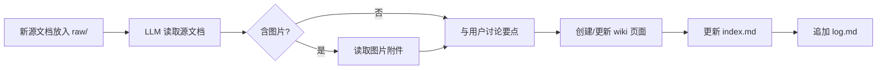

# Knowledge Ingest Workflow

> 导入是将新知识整合到 Wiki 的核心操作。一个源文档可能触及 10–15 个页面。

## 完整流程



## 步骤详解

### 1. 归档源文档

将源文档放入 `raw/` 目录，命名格式：`作者-主题-日期.md`

```yaml
# raw/ 目录的文件属性
- 不可变：LLM 只读不写
- 是真理之源（source of truth）
- 可含图片附件（raw/assets/）
```

### 2. 读取分析

LLM 读取源文档的全部内容。如果文档包含嵌入图片（如截图、图表），还应单独读取这些图片以获取完整上下文。

### 3. 讨论（可选但有价值）

与用户讨论关键要点，用户指导 LLM 关注什么、强调什么。这一步让人保持"在回路中"（human-in-the-loop）。

### 4. 更新 Wiki（核心步骤）

根据源文档内容，创建或更新以下类型的页面：

| 页面类型 | 目录 | 做什么 |
|----------|------|--------|
| 来源摘要 | `wiki/sources/` | 创建源文档摘要页 |
| 概念 | `wiki/concepts/` | 创建新概念或更新已有概念 |
| 实体 | `wiki/entities/` | 创建/更新人物/工具/项目页 |
| 综合 | `wiki/syntheses/` | 如有跨源综合，创建或更新 |
| 对比 | (可选) | 比较不同来源的观点 |

### 5. 更新 Index

在 `wiki/index.md` 中添加新的页面链接和简介，确保索引全面。

### 6. 记录日志

在 `wiki/log.md` 追加一条记录，格式：

```
## [YYYY-MM-DD] ingest | 源文档标题
```

## 导入模式

| 模式 | 描述 | 适合场景 |
|------|------|----------|
| **逐个导入** | 一次一个源，用户参与讨论 | 深度阅读、学习 |
| **批量导入** | 一次多个源，较少监督 | 资料整理、归档 |

Karpathy 推荐逐个导入 + 保持参与。

## 相关页面

- [[llm-wiki-pattern]] — LLM Wiki 模式总览
- [[wiki-schema]] — Schema 文件设计
- [[wiki/log]] — 操作日志
