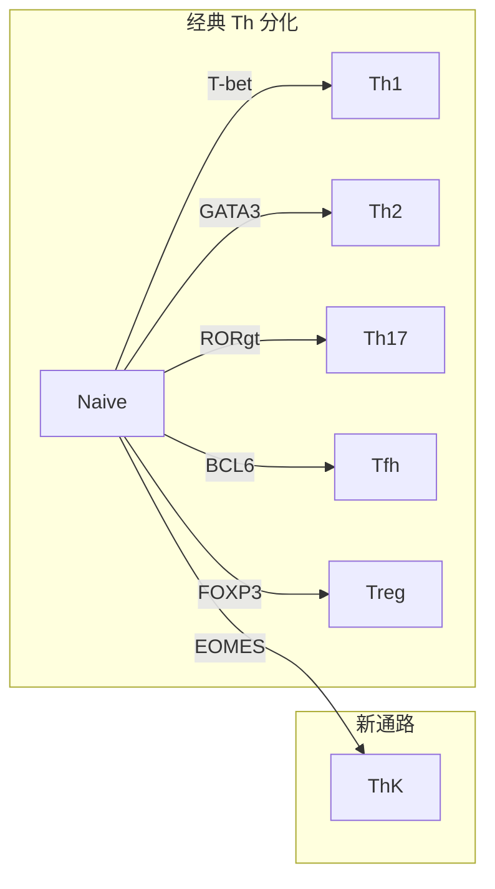

# ThK 细胞

> **定义**: A unique CD4⁺ helper T cell subset characterized by high expression of granzyme K (GZMK) and regulated by the transcription factor EOMES.  
> **提出**: Xie et al., *Nature Immunology*, 2026 (董晨团队)

---

## 发现背景

传统 CD4⁺ T 细胞分类包括 Th1（T-bet）、Th2（GATA3）、Th17（RORγt）、Tfh（BCL6）和 Treg（FOXP3）。近年来单细胞转录组学分析提示可能存在新的亚群。Xie 等人通过分析 IBD 患者 scRNA-seq 数据，发现了一群高表达 GZMK 但不表达经典谱系标志物的 CD4⁺ T 细胞。

---

## 核心特征

### 表面标志
| 标志 | 表达 | 意义 |
|------|------|------|
| **GZMK (Granzyme K)** | **高**（定义性标志） | 区别于其他 Th 亚群 |
| EOMES | **高**（主控转录因子） | 驱动 ThK 分化 |
| Perforin | 部分表达 | 细胞毒性功能 |
| GZMB | 低 | 区别于经典 CTL |
| T-bet | **低/无** | 区别于 Th1 |
| GATA3 | **低/无** | 区别于 Th2 |
| RORγt | **低/无** | 区别于 Th17 |
| BCL6 | **低/无** | 区别于 Tfh |
| FOXP3 | **低/无** | 区别于 Treg |
| CD8 | 不表达 | 区别于 CD4⁺CD8⁺ CTL |

### 转录特征
- **高表达**: *Gzmk, Eomes, Prf1, Ccl5, Ccr5, Nkg7, Slamf7, Il10ra, Cd27, Klrg1*
- **低表达**: *Tbx21 (T-bet), Gata3, Rorc, Bcl6, Foxp3, Il12rb2, Il18r1*
- 与经典 Th 亚群的转录谱 **完全不重叠**

---

## 分化调控

### 独立分化路径

- **不依赖** T-bet（Th1）、STAT6（Th2）、RORγt（Th17）
- RORγt 缺失 **增强** ThK 分化（负调控）
- BCL6 可能参与 ThK 前体产生（Bcl6 缺失 → Gzmk 和 Eomes 降低）
- 不是 CD4⁺CD8⁺ 细胞毒性 T 细胞（Runx3 不参与）

### EOMES 是核心调控因子

- **必要且充分**：敲除 Eomes 消除 ThK；过表达 EOMES 即可诱导 ThK
- CUT&Tag 证实 EOMES 直接结合 *Gzmk, Prf1* 及 *Nkg7, Tox, Ccl3/4/5, Ifng, Il10* 等基因
- EOMES 结合 T-box 和 ETS 家族基序
- EOMES 在其他 Th 分化条件下抑制 T-bet、GATA3、RORγt、FOXP3

---

## 功能

### 效应功能
- 表达 **perforin**（颗粒酶孔道形成蛋白）
- 体外具有细胞毒性活性（但非 ThK 特有）
- GZMK 的主要功能可能是 **细胞外蛋白水解 → 促炎**
  - 裂解 **PAR-1**（蛋白酶激活受体 1）→ 激活炎症细胞因子
  - 激活 **补体级联反应**（Donado et al., *Nature* 2025）

### 在肠道炎症中的作用
- EOMES 敲除 → 结肠炎显著减轻（体重、结肠长度、组织学评分）
- **Gzmk 单基因敲除不保护** → 致病性依赖 EOMES 驱动的多效应程序
- 病理机制涉及 ThK 在肠道中积累并产生促炎效应分子

---

## 保守性

- **跨物种保守**：小鼠和人类 ThK 转录程序高度一致
- **跨疾病存在**：

| 疾病模型 | 组织 | 数据集 |
|----------|------|--------|
| 结肠炎 (colitis) | 肠道 LP | CRA016814, GSE235664 |
| 肿瘤 (Hepa1-6) | 肿瘤浸润 | GSE285225 |
| EAE | 中枢神经系统 | GSE156196 |
| LCMV cl13 感染 | 脾脏 | GSE201730 |
| 人类 IBD | 肠道 | scIBD meta-analysis |
| 人类泛癌 | 多组织 | Zheng et al. *Science* 2021 |

核心保守基因：*EOMES, GZMK, PRF1, CCR5, NKG7, SLAMF7*

---

## 临床意义

1. **IBD 治疗新靶点**：EOMES-ThK 轴 → 阻断 ThK 分化或效应功能
2. **比单靶点更优**：靶向 EOMES 转录网络比抑制单个效应分子（如 GZMK）更有效
3. **其他炎症疾病**：可能涉及 EAE、慢性感染、肿瘤免疫

---

## 待解决问题

- ThK 分化的 **上游信号**（何种细胞因子/抗原呈递/组织微环境？）
- GZMK 的 **精确底物和功能机制**
- ThK 的 **功能异质性和可塑性**（促炎 vs 调节？）
- ThK 特异的 **遗传工具验证**（目前依赖 EOMES 全局敲除 CD4⁺ T 细胞）
- EOMES 与 T-bet 在 ThK 中的 **功能冗余与分工**

---

## 实验方法速览

实验中使用的详细操作方法（小鼠模型、结肠炎诱导、淋巴细胞分离、细胞分化培养、流式细胞术抗体方案、ATAC-seq/CUT&Tag 参数等）请见：

→ [[wiki/sources/xie-et-al-2026-thk-cells#实验方法详解|Xie et al. 2026 来源摘要 — 实验方法详解]]

关键方法概览：

| 方法 | 用途 |
|------|------|
| Gzmk-tdTomato 报告小鼠 | 体内追踪 Gzmk 表达细胞 |
| 共转移结肠炎模型 | 竞争性比较 WT vs KO 的细胞内在表型 |
| Eomes OE 逆转录病毒 | 验证 EOMES 充分性（体外） |
| Cd4cre Eomes^fl/fl | 验证 EOMES 必要性（体内） |
| CUT&Tag (anti-HA) | 鉴定 EOMES 直接靶基因 |
| ATAC-seq | 分析 ThK 表观遗传景观 |

---

## 相关页面

| 类型 | 页面 |
|------|------|
| 概念 | [[wiki/concepts/eomes-transcription-factor\|EOMES 转录因子]] |
| 来源 | [[wiki/sources/xie-et-al-2026-thk-cells\|Xie et al. 2026 来源摘要]] |
| 实体 | [[wiki/entities/chen-dong\|Chen Dong（董晨）]] |
| 概念 | [[wiki/concepts/rag-vs-llm-wiki\|RAG vs LLM Wiki]] |
