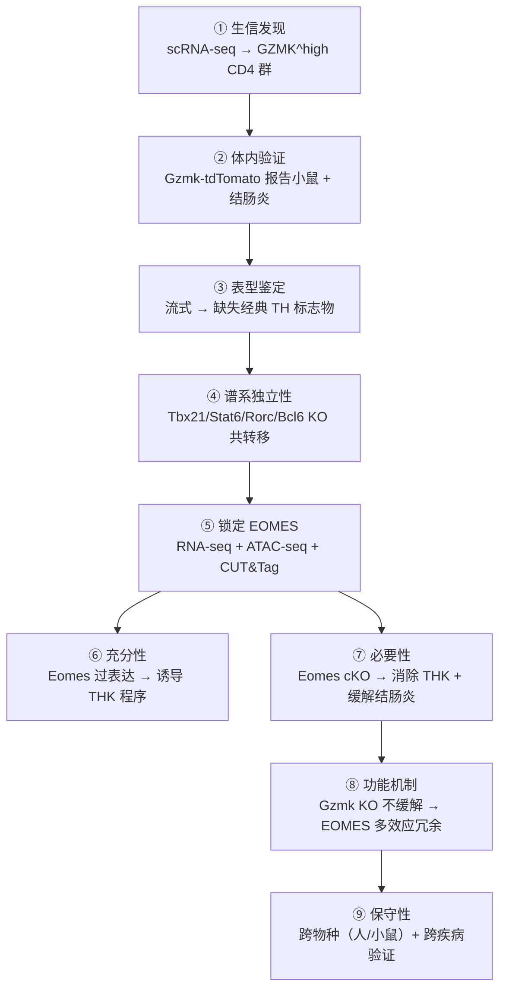

# Xie et al. 2026 — A unique CD4⁺ T cell subset expressing granzyme K regulated by EOMES

> **原文**: Tian Xie, Yizhou Du, Qihan Wang, Hao Zhang, Kun Wei, Xinxin Chi, Xue Bai, Yujie Fu, Zhilin Peng, Yicheng Zhu, Qiuyan Lan & Chen Dong
> **期刊**: *Nature Immunology* (2026)
> **DOI**: 10.1038/s41590-026-02479-6
> **PMID**: 41927834
> **接收**: 2026-02-25 | **在线发表**: 2026-04-02

---

## 核心发现

本研究鉴定了一种全新的 CD4⁺ T 细胞亚群——**ThK 细胞**（T helper cells expressing Granzyme K），由转录因子 **EOMES** 驱动，在 **肠道炎症** 中发挥关键效应功能。

---

## 关键要点

### 1. ThK 细胞的发现

- 通过 scRNA-seq 分析 IBD 患者的肠道 CD4⁺ T 细胞，发现一群高表达 **GZMK（granzyme K）** 但不表达经典谱系标志物的细胞群
- 这群细胞不表达 T-bet（Th1）、GATA3（Th2）、RORγt（Th17）、BCL6（Tfh）、FOXP3（Treg）
- 也不表达 GZMB（granzyme B），与经典细胞毒性 CD8⁺ T 细胞不同
- 命名：**ThK = CD4⁺ T helper cells expressing Granzyme K**

### 2. 独立分化的新亚群

- ThK 分化 **不依赖** Th1（T-bet）、Th2（STAT6）、Th17（RORγt）通路
- RORγt 缺失反而增强 ThK 分化，说明 Th17 程序可能抑制 ThK
- ThK 细胞不是 CD4⁺CD8⁺ 双阳性细胞毒性 T 细胞（与 Runx3 无关）

### 3. EOMES 是核心转录调控因子

- EOMES 在 ThK 细胞中高表达，与 GZMK 呈强正相关（Pearson R²=0.953）
- **必要性**：Cd4-cre Eomes 条件性敲除几乎完全消除 Gzmk-tdTomato 表达
- **充分性**：逆转录病毒过表达 EOMES 即可诱导 CD4⁺ T 细胞表达 GZMK 和 perforin
- CUT&Tag 证实 EOMES 直接结合 **Gzmk** 和 **Prf1** 的调控区域
- EOMES 还结合 Tox, Nkg7, Klrg1, Ccl3/4/5, Ifng, Il10 等效应基因

### 4. 功能与疾病相关性

- EOMES 缺失 → 显著减轻 T 细胞诱导的结肠炎（体重减轻 ↓、结肠缩短 ↓、组织学评分 ↓）
- 但 **Gzmk 单基因敲除不能减轻疾病**，说明 ThK 的致病性依赖于 EOMES 驱动的多效应程序冗余
- ThK 细胞在体外具有细胞毒性（perforin 依赖），但细胞毒性不是 ThK 特有

### 5. 跨物种、跨疾病保守性

- 小鼠和人类的 ThK 转录程序高度保守
- 在结肠炎、肿瘤、EAE（实验性自身免疫性脑脊髓炎）、LCMV cl13 慢性感染等多种疾病模型中均存在
- 核心保守基因：*Eomes, Gzmk, Prf1, Ccl5, Ccr5, Nkg7, Il10ra, Slamf7*

---

## 重要意义

1. 这是董晨团队继 **Th17**（2005）和 **Tfh**（2008-2009）之后发现的又一个新的 CD4⁺ T 细胞亚群
2. EOMES-ThK 轴可能是 **炎症性肠病（IBD）** 的潜在治疗靶点
3. 拓展了 CD4⁺ T 细胞功能分类的版图

## 待解决问题

- ThK 分化的上游信号（何种细胞因子/抗原/组织线索？）
- GZMK 的精确功能（细胞外蛋白水解 → 补体激活 + PAR-1 裂解 → 促炎）
- ThK 在不同微环境中是否存在促炎/调节功能的双重性
- ThK 特异的致病性验证（目前数据依赖 EOMES 全局敲除）

---

## 实验方法详解

### 1. 小鼠模型

| 品系 | 来源 | 用途 |
|------|------|------|
| C57BL/6J, CD45.1, Rag1⁻/⁻, Tbx21⁻/⁻, Stat6⁻/⁻, Cd4cre, Vav1cre, BLIMP1-EYFP, OT-II | The Jackson Laboratory | 基础/对照品系 |
| Gzmk⁻/⁻ | GemPharmatech | 验证 GZMK 的致病性 |
| Gzmk-P2A-CreERT2-T2A-tdTomato (Gzmk-tdTomato) | 上海模式动物中心 | 报告小鼠，追踪 Gzmk 表达细胞 |
| Eomes^fl/fl, Rorc^fl/fl, Bcl6^fl/fl | 本室构建 + Cd4cre 杂交 | T 细胞特异性条件性 KO |
| Runx3^fl/fl | 中科院孙毅教授馈赠 + Vav1cre 杂交 | 区分 CD4CD8 CTL |

**饲养条件**：SPF 级，22°C，湿度 40-70%，12h 光暗循环，西湖大学 IACUC 批准。

### 2. T 细胞诱导性结肠炎模型（核心体内实验）

**流程图**：
1. 从供体小鼠脾脏和淋巴结分离 CD4⁺ T 细胞
2. FACSAria 分选 **CD4⁺CD25⁻CD44⁻CD62L⁺** naive T 细胞（纯度 >98%）
3. 将 **1.5-2 × 10⁶** 细胞经 **尾静脉注射** 到 8-12 周龄雄性 Rag1⁻/⁻ 受体
4. 约 4 周（或 7/14/21/28/35 天）后处死取样
5. **每周监测体重**

**共转移竞争实验**：WT (CD45.1⁺) + KO (CD45.2⁺) naive T 细胞混合后转移到同一 Rag1⁻/⁻ 受体，4 周后直接比较两种基因型的细胞表型差异。

### 3. 结肠淋巴细胞分离（详细步骤）

1. 结肠组织纵向剪开，清除粪便
2. 含 **5 mM EDTA + 1 mM DTT** 的 RPMI 1640 中 37°C 震荡 30 min（去除上皮）
3. 含 2 mM EDTA 的 RPMI 洗涤 2 次
4. 组织剪碎至 ~2mm 小块
5. **酶消化液**：0.5 mg/mL 胶原酶 D + 1 mg/mL dispase + 4 μg/mL DNase I，37°C 轻摇 30 min
6. 100 μm 尼龙筛过滤
7. **Percoll 梯度离心**：37% Percoll 铺于 70% Percoll 之上，离心后收集界面层淋巴细胞

### 4. 体外 T 细胞分化与培养

**激活**：plate-bound anti-CD3 (5 μg/mL) + anti-CD28 (5 μg/mL)

| 条件 | 细胞因子/抗体添加 |
|------|------------------|
| **非极化** | 无添加 |
| **TH0** | anti-IFNγ (10 μg/mL) + anti-IL-4 (10 μg/mL) |
| **TH1** | anti-IL-4 (10 μg/mL) + mIL-12 (10 ng/mL) |
| **TH2** | anti-IFNγ (10 μg/mL) + IL-4 (20 ng/mL) + mIL-2 (10 U/mL) |
| **TH17** | hTGF-β (1 ng/mL) + mIL-6 (20 ng/mL) + mIL-1β (10 ng/mL) + IL-23 (25 ng/mL) + anti-IFNγ + anti-IL-4 |
| **Treg** | mIL-2 (10 U/mL) + hTGF-β (2 ng/mL) + anti-IFNγ + anti-IL-4 |

**病毒感染实验**：TH0 激活 24h → 逆转录病毒感染 → 24h 后换液 → 继续培养 4 天 → 分析或转移至受体

### 5. 逆转录病毒过表达（Eomes OE）

- **载体**：RVKM（含 IRES-BFP 报告基因），C 端 HA tag
- **标签序列**：`GGAGGAGGCGGATCAGGAGGAGGCGGATCATACCCATACGACGTACCAGATTACGCT`
- **包装**：与 pCL-ECO 共转染 293T 细胞（磷酸钙法），48h 收上清
- **感染**：naive T 细胞激活 24h 后加病毒 → 再培养 5 天

### 6. OVA 免疫模型

- OT-II T 细胞（OVA 特异性 TCR）过继转移到 WT 受体
- 次日皮下注射 OVA (3 mg/mL)/CFA 乳化液 1:1
- 免疫后第 **7 天** 分析

### 7. 体外细胞毒性实验

- **效应细胞**：结肠炎小鼠 LP 来源的 CD4 T 细胞
- **靶细胞**：P815（CFSE 标记）
- **条件**：加可溶性 anti-CD3 (0 或 1 μg/mL)
- **检测**：19h 共培养后 Fixable Viability Dye eF506 流式检测

### 8. 流式细胞术

**流程**：Fixable Viability Dye eF506 染色 → CD16/CD32 Fc 受体阻断 → 表面标志染色 → 固定/破膜（FOXP3/Transcription Factor Staining Buffer Set）→ 胞内染色

**重要细节**：
- 检测荧光蛋白（如 tdTomato）时：先用 **2% PFA 固定 20 min** 再破膜，以保护荧光
- 胞内细胞因子检测：**PMA (50 ng/mL) + Ionomycin (500 ng/mL) + GolgiStop，4.5h**
- **仪器**：BD LSRFortessa | **软件**：FlowJo v10.9.0

**关键抗体**（1:400 稀释，除非注明）：

| 靶标 | 荧光 | 克隆号 | 供应商 |
|------|------|--------|--------|
| CD4 | BUV395 | GK1.5 | BD |
| CD4 | BV785 | RM4-5 | BioLegend |
| CD45.2 | BV421 | 104 | BioLegend |
| CD8a | BV605 | 53-6.7 | BioLegend |
| TCRβ | Spark PLUS UV395 | H57-597 | BioLegend |
| **EOMES** | **eFluor 450** | **Dan11mag** | **eBioscience** |
| T-bet | PE-Cy7 / RB705 | eBio4B10 / O4-46 | eBioscience / BD |
| GATA3 | PerCP-eFluor 710 | TWAJ | eBioscience |
| RORγt | RB705 | Q31-378 | BD |
| BCL6 | PE-CF594 | K112-91 | BD (1:200) |
| FOXP3 | FITC / PerCP-eFluor 710 | FJK-16s | eBioscience |
| Perforin | APC | S16009A | BioLegend |
| GZMB | BV785 / PE/Dazzle 594 | QA18A02 / QA16A02 | BioLegend |
| IFNγ | AF700 | XMG1.2 | BD |
| CXCR5 | Biotin→PE-Cy7 SA | 2G8 | BD (1:50) |

### 9. 组织学分析

- 远端结肠：**4% PFA** 固定 → 石蜡包埋 → 5 μm 切片 → H&E 染色
- 病理评分（**盲法**，0-4 分）：炎症细胞浸润 + 肠壁增厚 + 隐窝/杯状细胞丢失

### 10. RNA 提取与定量

- **再刺激**：PMA (50 ng/mL) + Ionomycin (500 ng/mL)，2h
- **提取**：TRIzol 法
- **反转录**：HiScript III All-in-one RT SuperMix
- **RT-qPCR**：SYBR Green，Actb 内参

| 基因 | 正向引物 (5'→3') | 反向引物 (5'→3') |
|------|-----------------|-----------------|
| Gzmk | TGGCTGGCGTTTATATGTCTTC | GCTGCGGTACTGGATGGAC |
| Prf1 | AGCACAAGTTCGTGCCAGG | GCGTCTCTCATTAGGGAGTTTTT |
| Gzmb | TGTGAAGCCAGGAGATGTGT | TCAGCTCAACCTCTTGTAGC |
| Actb | TGGAATCCTGTGGCATCCATGAAAC | TAAAACGCAGCTCAGTAACAGTCCG |

### 11. Bulk RNA-seq

- **建库**：VAHTS Universal V10 RNA-seq Library Prep kit (Vazyme)
- **测序**：DNBSEQ-T7 平台，150bp PE，~20M 原始 reads/样本
- **比对**：HISAT2 v2.2.1 → featureCounts → DESeq2 v1.46.0 差异分析
- **GSEA**：clusterProfiler v4.12.0
- **参考基因组**：mm39 (GRCm39)

### 12. scRNA-seq 数据重分析

**人类数据**：
- IBD 数据集（scIBD meta-analysis, Nie et al. 2023）：GZMK^high 细胞来源于原始 `CD4 Temra` 簇的再分群
- 泛癌数据集（Zheng et al. *Science* 2021）：直接使用原始 `CD4.c12(GZMK+ TEM)` 簇

**小鼠数据**：
- Seurat v5.2.1 整合两个数据集（CRA016814 和 GSE235664），仅保留 WT 细胞
- Harmony v1.2.3 去除批次效应
- 基因集评分：AddModuleScore 函数

**其他验证数据集**：
- 肿瘤浸润 CD4 T：Hepa1-6 荷瘤小鼠（GSE285225）
- EAE：CNS 浸润 CD4 T（GSE156196）
- LCMV cl13：GP66 特异性脾脏 CD4 T（GSE201730）

### 13. ATAC-seq

- **细胞量**：~100,000 细胞/样本
- **建库**：Hyperactive ATAC-Seq Library Prep kit (Vazyme) → Illumina NovaSeq X Plus，150bp PE，~40M reads/样本
- **比对**：Bowtie2（--very-sensitive, -X 2000, --no-mixed, --no-discordant）
- **去重复**：Picard MarkDuplicates
- **过滤**：去除线粒体 reads + ENCODE blacklist 区域
- **Peak calling**：MACS2（-f BAMPE, -q 0.01, --nomodel, --shift -100, --extsize 200）
- **差异分析**：DiffBind v3.16.0
- **Motif 富集**：HOMER v5.1

### 14. CUT&Tag（EOMES 靶基因鉴定）

- **细胞**：HA-tag EOMES 过表达 CD4 T 细胞 vs 空载体对照（3 生物学重复）
- **建库**：Hyperactive Universal CUT&Tag Assay kit (Vazyme)
- **抗体**：anti-HA Tag (CST #3724)
- **测序**：NovaSeq X Plus，150bp PE，~20M reads/样本
- **分析**：同 ATAC-seq pipeline
- **Consensus peaks**：3 个重复共有的 peak
- **注释**：ChIPseeker v1.42.1（TSS ±3kb = promoter）
- **分布**：37.38% intron, 28.04% distal intergenic, 27.15% promoter

### 15. 基因-峰整合分析

- DEG (adj.P<0.05, |log2FC|>1) + DAR (adj.P<0.05, |log2FC|>1)
- 在 TSS **±100kb** 范围内寻找 concordant 基因-峰对
- 仅保留方向一致的配对，取最靠近 TSS 的 DAR

### 16. 统计方法

- **软件**：GraphPad Prism v10.1.2, R v4.4.3
- **检验**：
  - 两组比较：双尾 paired/unpaired Student's t-test
  - 多组比较：one-way ANOVA + Tukey post-hoc
  - 体重曲线：two-way ANOVA + Bonferroni post-hoc
- **表达**：均数 ± SEM
- **随机化**：动物随机分组，实验和数据收集顺序随机化
- **盲法**：组织学评分盲法（数据收集/分析非盲法）

---

## 实验设计逻辑链

---

## 相关页面

| 类型 | 页面 |
|------|------|
| 概念 | [[wiki/concepts/thk-cells\|ThK 细胞]] |
| 概念 | [[wiki/concepts/eomes-transcription-factor\|EOMES 转录因子]] |
| 实体 | [[wiki/entities/chen-dong\|Chen Dong（董晨）]] |
| 实体 | [[wiki/entities/tian-xie\|Tian Xie（谢天）]] |
| 概念 | [[wiki/concepts/rag-vs-llm-wiki\|RAG vs LLM Wiki]] |
